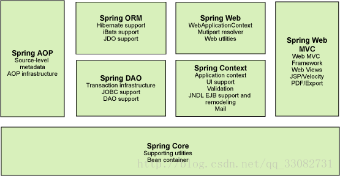
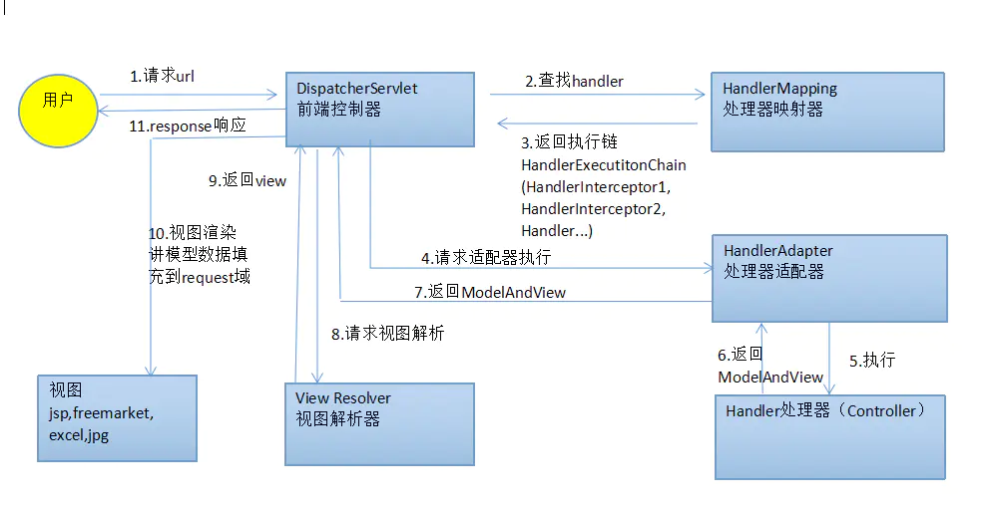
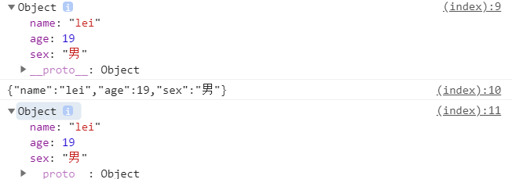

# Spring

## 简介

- Spring：春天---->给软件行业带来了春天

- 2002，首次推出 Spring 框架雏形：interface 21 框架

- Spring 框架即以 interface 21框架为基础，经过重新设计，并不断丰富其内涵，于2004/3/24 发布了 Srping 1.0正式版

- Rod Johnson，Spring Framework创始人，他是悉尼博士，专业确实音乐

- Spring 理念：是现有技术更加容易使用，是一个大杂烩，整合现有技术框架

- SSH：Struct2 + Spring + Hibernate

- SSM：SpringMVC + Spring +Mybatis

- 官方下载地址： https://repo.spring.io/release/org/springframework/spring

- github地址： https://github.com/spring-projects/spring-framework 

- maven导入

  ```xml
  <!-- https://mvnrepository.com/artifact/org.springframework/spring-webmvc -->
  <dependency>
      <groupId>org.springframework</groupId>
      <artifactId>spring-webmvc</artifactId>
      <version>5.2.14.RELEASE</version>
  </dependency>
  <!-- https://mvnrepository.com/artifact/org.springframework/spring-jdbc -->
  <dependency>
      <groupId>org.springframework</groupId>
      <artifactId>spring-jdbc</artifactId>
      <version>5.2.14.RELEASE</version>
  </dependency>
  ```

### 优点

- Spring 是一个开源的免费框架（容器）
- Spring 是一个轻量级的，非侵入式的框架
- 控制反转（IOC）、面向切面编程（AOP）
- 支持事务的处理，对框架整合的支持

**总结**：Spring 是一个轻量级的控制反转（IOC）与面向切面编程（AOP）的框架

### 组成

  

### 扩展

- Spring boot
  - 一个快速开发的脚手架
  - 基于 SpringBoot 可以快速开发单个微服务
  - 约定大于配置
- Spring Cloud
  - SpringCloud 是基于 SpringBoot 实现的

因为现在大多公司都在使用 SpringBoot 进行快速开发，学习 SpringBoot的前提是掌握 Spring 和SrpingMVC，承上启下的作用

**Spring 弊端**：发展太久，违背了原来的理念，配置十分繁琐，“配置地狱”

## IOC

### 理论推导

以前的业务中

```java
UserDao
    UserMysqlDaoImpl    
    UserOrcleDaoImpl
    
UserService
    UserServiceImpl		#保留一个dao的变量，并实例化
    
#当dao新增时，需要修改UserviceImpl中代码，现在采用一个 setter 设置dao变量值，由调用者判断使用哪一个 dao，当dao新增时不需要修改UserServiceImpl中代码，实现控制反转
```

### HelloSpring

**编写HelloService类**

```java
public class HelloService {
    private String name;

    public void say() {
        System.out.println("我的名字是：" + name);
    }

    public String getName() {
        return name;
    }

    public void setName(String name) {
        this.name = name;
    }
}
```

**在 classpath 下编写 bean 配置文件  spring-beans.xml **

```xml
<?xml version="1.0" encoding="UTF-8"?>
<beans xmlns="http://www.springframework.org/schema/beans"
       xmlns:xsi="http://www.w3.org/2001/XMLSchema-instance"
       xsi:schemaLocation="http://www.springframework.org/schema/beans
        https://www.springframework.org/schema/beans/spring-beans.xsd">

    <!--  声明 bean，默认 scope 为 singleton 单例 -->
    <bean id="helloService" class="org.lei.ch01.service.HelloService">
        <!--   通过 set 方法设置属性值   -->
        <property name="name" value="小唐"/>
    </bean>

</beans>
```

**Main 方法**

```java
public class Main {
    public static void main(String[] args) {
        // 在 classpath 下加载 spring-beans.xml bean 配置文件
        ApplicationContext context = new ClassPathXmlApplicationContext("spring-beans.xml");
        // 通过 class 获取实例（也可通过名字获取实例）
        HelloService helloService = context.getBean(HelloService.class);
        // 调用实例方法
        helloService.say();
    }
}
```

> Hello对象由Spring创建，开发者不创建，这个叫做控制反转
>
> IOC 即 对象由spring创建、管理、装配

### IOC创建对象的方法

1. 默认调用无参构造

   ```java
    <bean id="hello" class="com.lei.Hello">
        <property name="name" value="小唐"></property>
   </bean>
   ```

2. 有参构造

   1. 通过下标

      ```xml
      <bean id="hello" class="com.lei.Hello">
          <constructor-arg index="0" value="小唐"/>
          <constructor-arg index="1" value="21"/>
      </bean>
      ```

      

   2. 通过参数类型

      ```xml
      <bean id="hello" class="com.lei.Hello">
          <constructor-arg type="java.lang.String" value="小唐"/>
          <constructor-arg type="int" value="21"/>
      </bean>
      ```

      

   3. 通过参数名字

      ```xml
      <bean id="hello" class="com.lei.Hello">
          <constructor-arg name="name" value="小唐" />
          <constructor-arg name="age" value="18" />
      </bean>
      ```

      

在`bean`配置文件加载时，容器管理的对象就已经初始化了

### 依赖注入

>构造器注入

```xml
<bean id="hello" class="com.lei.Hello">
    <constructor-arg name="name" value="小唐" />
    <constructor-arg name="student" ref="student" />
</bean>
```


>Set方式注入

- 依赖注入，本质是`Set`注入
  - 依赖：bean 对象的创建依赖于容器
  - 注入：bean 对象中的所有属性，由容器注入

```xml
<!-- 以下为一个bean中的属性常用的注入方式 -->
<bean id="user" class="com.lei.beans.User">
    <!-- 普通注入 -->
    <property name="name" value="小唐"/>
    <property name="age" value="23"/>
    <!-- bean 注入 -->
    <property name="address" ref="address"/>
    <!-- list 注入 -->
    <property name="books">
        <list>
            <value>三国演义</value>
            <value>水浒传</value>
        </list>
    </property>
    <!-- set注入 -->
    <property name="hobbies">
        <set>
            <value>打游戏</value>
            <value>打羽毛球</value>
        </set>
    </property>
    <!-- properties 注入 -->
    <property name="config" >
        <props>
            <prop key="user">lei</prop>
            <prop key="password">123456</prop>
        </props>
    </property>
    <!-- map 注入-->
    <property name="people">
        <map>
            <entry key="name" value="小明" />
            <entry key="age" value="二十九"/>
        </map>
    </property>
</bean>
```


>扩展方式注入

可以使用 `cnamespace` 和 `pnamespace` 进行注入

1. 导入 c/p 命名空间约束

   ```xml
   <beans ...
       xmlns:p="http://www.springframework.org/schema/p"
       xmlns:c="http://www.springframework.org/schema/c">
       
   </beans>
   ```

2. 注入方式

   ```xml
   	<!--  p 命名空间，属性注入-->
       <bean id="student" class="com.lei.beans.Student" p:name="小唐" p:age="18"/>
   	<!--  c 命名空间，构造器注入-->
       <bean id="student1" class="com.lei.beans.Student" c:name="小明" c:age="21"/>
   ```

### Bean的作用域

| Scope       | Description                                                  |
| :---------- | :----------------------------------------------------------- |
| singleton   | 单例模式，从容器中取得的是唯一对象，Spring默认机制           |
| prototype   | 原型模式，每次从容器中取得都会产生一个新对象                 |
| request     | web 开发中使用                                               |
| session     | web 开发中使用                                               |
| application | web 开发中使用                                               |
| websocket   | Scopes a single bean definition to the lifecycle of a `WebSocket`. Only valid in the context of a web-aware Spring `ApplicationContext`. |

> 有关作用域配置

```xml
<!-- 单例模式，默认机制 -->
<bean id="student" class="com.lei.beans.Student" p:name="小唐" scope="singleton"/>

<!-- 原型模式 -->
<bean id="student" class="com.lei.beans.Student" p:name="小唐" scope="prototype"/>
```

### Bean的自动装配

- 自动装配是 Spring 满足 bean 依赖的一种方式
- Spring 会在上下文自动寻找，并自动给 bean 装配

> Spring中有三种装配方式

1. 在xml中显示的配置
2. 在java中显示的配置，autowire
3. 隐式的自动装配 bean，注解开发（重点）

> **autowire**

```xml
<!-- 自动在beans配置文件的上下文找到需要装配的 bean进行装配 -->

<!-- byName，配置的beans上下文中，需要装配的bean名字唯一 -->
<bean id="student" class="com.lei.beans.Student" autowire="byName"/>

<!-- byType，配置的beans上下文中，需要装配的 bean 类型唯一-->
<bean id="student" class="com.lei.beans.Student" autowire="byType"/>
```

> **注解实现装配**

1. 导入注解注入依赖，并开启配置

   ```xml
   <?xml version="1.0" encoding="UTF-8"?>
   <beans xmlns="http://www.springframework.org/schema/beans"
          xmlns:xsi="http://www.w3.org/2001/XMLSchema-instance"
          xmlns:context="http://www.springframework.org/schema/context"
          xsi:schemaLocation="http://www.springframework.org/schema/beans
           https://www.springframework.org/schema/beans/spring-beans.xsd
           http://www.springframework.org/schema/context
           https://www.springframework.org/schema/context/spring-context.xsd">
       
   	<!-- 开启上下文通过注解装配beans -->
       <context:annotation-config/>
   
   </beans>
   ```

2. @Autowired 默认按照 byNmae 注入

   ```java
   /*
   * @Autowired 自动从beans中找到对应的bean并装配
   * 可用在set方法上，也可以用在字段上，用在字段上时可以省略set方法，通过byName匹配
   * @Autowired注解，有一个属性 required，默认为true，如果为 false，当 beans 中没有找到指定的 bean 也不会报错
   * 可以与@Qualifier注解联合使用，通过该注解的 value 属性指定需要匹配bean的id名
   */
   public class User {
       private String name;
       @Autowired(required = false)
       @Qualifier(value = "dog1")
       private Dog dog;
       @Autowired
       private Cat cat;
   }
   ```
   
3. @Resource  默认按照 byType注入

   需要导入反射依赖

   ```xml
   <dependency>
       <groupId>javax.annotation</groupId>
       <artifactId>javax.annotation-api</artifactId>
       <version>1.3.2</version>
   </dependency>
   ```

   使用方法如下

   ```java
   /*
   * @Resource 是可以给其 name 属性指定需要注解 bean 的id
   * @Resource 是通过 byType 进行匹配的
   */
   public class User {
       private String name;
       @Resource(name = "dog")
       private Dog dog;
       @Resource(name = "cat")
       private Cat cat;
   }
   ```

### 注解开发

> Spring4后，使用注解开发必须导入spring-aop包

> xml与注解

- xml更加万能，适用于任何注解，维护方便简单
- 注解 不是自己的类是用不了，维护相对麻烦

> xml与注解最佳实战

- xml 用来管理bean

- 注解负责完成属性的注入

- 使用过程中需要注意让注解生效：必须开启注解功能支持

  ```xml
  <!-- 开启上下文通过注解装配beans -->
  <context:annotation-config/>
  
  <!-- 开启自动扫描使用注解的包,并装配beans，比 annotation-config 多个指定扫描包的功能 -->
  <context:component-scan base-package="com.lei.beans"/>
  ```


### JavaConfig实现配置

- 使用 JavaConfig 进行配置，完全脱离 xml 文件配置
- 和 xml 文件配置类似，可以定义需要扫描的包，配置类的引入以及Bean的定义及命名等

```java
@Configuration  //代表该类为配置类
@Import(Config2.class)  //导入另一个配置类
@ComponentScan("com.lei.dao")   //自动扫描某个包
public class AppConfig {
    @Bean   // Bean，方法名为 bean的 id，也可以通过 @Bean(value="oname")定义名字
    @Scope("prototype")  //bean 作用域（单例、原型）
    User geer(){
        return new User();
    }

    public static void main(String[] args) {
        // 通过配置文件上下文获取容器中组件
        ApplicationContext context=new AnnotationConfigApplicationContext(AppConfig.class);
        User user=context.getBean("geer",User.class);
        System.out.println(user);
    }
}
```


## AOP

### 代理模式

> 代理模式

- 代理模式分类
  - 静态代理
  - 动态代理
- 代理模式的好处
  - 可以使真实角色的操作更加纯粹，不需要关注一些公共业务
  - 公共业务可以交给代理角色，实现业务分工
  - 公共业务发生扩展时，容易管理

> 静态代理

- 抽象角色：一般使用接口或者抽象类
- 真实角色：被代理的角色
- 代理角色：代理真实角色，代理后，一般需要做附属操作
- 客户：访问代理对象的人

> 动态代理

- 动态代理底层都是通过反射来实现
- 动态代理与静态代理角色一样
- 动态代理的代理类是动态生成的
- 动态代理分为两类
  - 基于接口：JDK 动态代理
  - 基于类：cglib
  - java字节码实现：javasist
- JDK动态代理与cglib区别
  - java动态代理--利用反射机制生成一个实现代理接口的匿名类，在调用具体方法前调用InvokeHandler来处理。（基于接口）
  - cglib动态代理--利用asm开源包，对代理对象类的class文件加载进来，通过修改其字节码生成子类来处理。（基于继承）
  - 对比：cglib代理比jdk代理快

**jdk实现动态代理**

```java
/*
* 代理对象执行方法 实现 InvocationHandler这个接口，并重写invoke(Object proxy, Method method, Object[] args)方法
* proxy：代理对象
* method：代理对象执行的方法
* args：代理对象执行的方法参数
*/
public class MiddleManInvocationHandler implements InvocationHandler {
    Object target;		//target为被代理的对象
    public MiddleMan(Object target) {
        this.target = target;
    }
    public Object getProxy(){
        return Proxy.newProxyInstance(target.getClass().getClassLoader(), target.getClass().getInterfaces(),this);
    }
    @Override
    public Object invoke(Object proxy, Method method, Object[] args) throws Throwable {
        System.out.println(proxy.getClass().getName());
        method.invoke(target,args);
        return null;
    }
}

/*
* 通过 newProxyInstance(ClassLoader loader,Class<?>[] interfaces,InvocationHandler h) 可以获取代理对象
* loader：被代理对象类加载器
* interfaces：被代理对象实现接口
* h：代理对象方法执行
*/
Business proxy= (Business) Proxy.newProxyInstance(Business.class.getClassLoader(), Business.class.getInterfaces(),handler);
```

### AOP简介

- 意为面向切面编程，OOP 把系统看作多个对象的交互，AOP把系统分解为不同的关注点，或者称之为切面（Aspect），本质上为动态代理
- 切面（ASPECT）：横切关注点 被模块化 的特殊对象。即，他是一个类
- 通知（Advice）：切面必须要完成的工作。即，他是类中的一个方法
- 目标（Target）：被通知对象
- 代理（Proxy）：向目标对象应用通知之后创建的对象
- 切入点（PointCut）：切面通知 执行的“地点”的定义
- 连接点（JointPoint）：与切入点匹配的执行点

在Java平台上，对于AOP的织入，有3种方式：

1. 编译期：在编译时，由编译器把切面调用编译进字节码，这种方式需要定义新的关键字并扩展编译器，AspectJ就扩展了Java编译器，使用关键字aspect来实现织入；
2. 类加载器：在目标类被装载到JVM时，通过一个特殊的类加载器，对目标类的字节码重新“增强”；
3. 运行期：目标对象和切面都是普通Java类，通过JVM的动态代理功能或者第三方库实现运行期动态织入。

### AOP装配

> 引入依赖，spring对 aop的支持

```xml
<dependency>
    <groupId>org.springframework</groupId>
    <artifactId>spring-aspects</artifactId>
    <version>5.2.14.RELEASE</version>
</dependency>
```

> 使用xml配置文件进行aop装配（两种方式）

1. 方法一：Spring原生接口，切面实现某个类

   - 创建接口 People

   - 创建接口实现类 Student

   - 创建切面，并实现对应接口

     - `MethodBeforeAdvice`  在目标方法执行前执行
     - `AfterReturningAdvice`  在目标方法执行后执行

     ```java
     public class LogAop implements MethodBeforeAdvice {
     /**
      * @param method 要执行的目标对象方法
      * @param objects 参数列表
      * @param o      目标对象，即我们原本需要从容器中取得的对象，现在从容器中取得的对象是动态代理生成的
      * */
     @Override
         public void before(Method method, Object[] objects, Object o) throws Throwable {
             System.out.println("日志打印"+method.getName());
         }
     }
     ```

   - 配置beans

     ```xml
     <?xml version="1.0" encoding="UTF-8"?>
     <beans xmlns="http://www.springframework.org/schema/beans"
            xmlns:xsi="http://www.w3.org/2001/XMLSchema-instance"
            xmlns:aop="http://www.springframework.org/schema/aop"
            xsi:schemaLocation="http://www.springframework.org/schema/beans
             https://www.springframework.org/schema/beans/spring-beans.xsd 				http://www.springframework.org/schema/aop https://www.springframework.org/schema/aop/spring-aop.xsd">
     
         <bean id="user" class="com.lei.beans.Student"/>
         <bean id="log" class="com.lei.beans.LogAop"/>
         
     <!--方式一：使用 spring 原生接口；配置aop需要导入aop约束-->
         <aop:config>
     <!--        切入点，execution：表达式，execution(要执行的位置***)-->
             <aop:pointcut id="pointcut" expression="execution(* com.lei.beans.Student.*(..))" />
     <!--        执行环绕增加-->
             <aop:advisor advice-ref="log" pointcut-ref="pointcut" />
         </aop:config>
     </beans>
     ```

   - 此时创建切面（aop）已经装配成功，调用Student的方法，会自动在相应时机执行通知（自定义方法）

   - 注意：从容器中取得的 Student对象必须使用接口 People 进行引用，因为现在从容器取得的为动态代理为spring通过 JDK 原生接口生成的；JDK 动态代理基于接口

2. 方法二：自定义切面

   - 同样创建，接口 People，实现类 Student

   - 创建自定义切面 MyAop，不需要实现某个接口，然后在 beans.xml 配置文件进行配置

     ```java
     public class MyAop {
         public void before(){
             System.out.println("方法执行前");
         }
         public void after(){
             System.out.println("方法执行后");
         }
     }
     ```

   - beans 配置

     ```xml
     <?xml version="1.0" encoding="UTF-8"?>
     <beans xmlns="http://www.springframework.org/schema/beans"
            xmlns:xsi="http://www.w3.org/2001/XMLSchema-instance"
            xmlns:aop="http://www.springframework.org/schema/aop"
            xsi:schemaLocation="http://www.springframework.org/schema/beans
             https://www.springframework.org/schema/beans/spring-beans.xsd http://www.springframework.org/schema/aop https://www.springframework.org/schema/aop/spring-aop.xsd">
     
         <bean id="user" class="com.lei.beans.User" />
         <bean id="myaop" class="com.lei.beans.MyAop"/>
     <!--
         使用 自定义切面
         配置aop需要导入aop约束
     -->
         <aop:config>
     <!--        自定义切面-->
             <aop:aspect ref="myaop">
     <!--            自定义切入点-->
                 <aop:pointcut id="point" expression="execution(* com.lei.beans.*.*(..))"/>
     <!--            自定义通知-->
                 <aop:before method="before" pointcut-ref="point"/>
                 <aop:after method="after" pointcut-ref="point"/>
             </aop:aspect>
         </aop:config>
     </beans>
     ```

3. 自定义切面 与 使用spring原生api 区别：自定义切面相对简单，但是功能没有 spring原生 api多，不能获取执行的方法名以及需被 切入 的对象

### 使用注解装配AOP

- 自定义切面类并添加相关注解

  ```java
  @Aspect			/*代表该类为一个切面*/
  public class MyAop {
      @Before("execution(* com.lei.beans.*.*(..))")	/*指定通知、切入点*/
      public void before(){
          System.out.println("方法执行前");
      }
      @After("execution(* com.lei.beans.*.*(..))")	
      public void after(){
          System.out.println("方法执行后");
      }
      @Around("execution(* com.lei.beans.*.*(..))")
      public void around(ProceedingJoinPoint pjp) throws Throwable{
          System.out.println("环绕在前");
          //方法执行，可以通过pjp参数获取方法执的信息
          pjp.proceed();
          System.out.println("环绕在后");
      }
  }
  ```

- 在beans.xml中配置自动识别切面

  ```xml
  <!-- 开启注解支持，proxy-target-class目标执行的class，默认为false 表示JDK的Annotation，true 表示 cglib -->
  <aop:aspectj-autoproxy proxy-target-class="true" />
  ```

- > 拦截器类型（通知）

  - @Before：这种拦截器先执行拦截代码，再执行目标代码。如果拦截器抛异常，那么目标代码就不执行了；
  - @After：这种拦截器先执行目标代码，再执行拦截器代码。无论目标代码是否抛异常，拦截器代码都会执行；
  - @AfterReturning：和@After不同的是，只有当目标代码正常返回时，才执行拦截器代码；
  - @AfterThrowing：和@After不同的是，只有当目标代码抛出了异常时，才执行拦截器代码；
  - @Around：能完全控制目标代码是否执行，并可以在执行前后、抛异常后执行任意拦截代码，可以说是包含了上面所有功能

- 使用AOP非常简单，一共需要三步：

  1. 定义执行方法，并在方法上通过AspectJ的注解告诉Spring应该在何处调用此方法；
  2. 标记`@Component`和`@Aspect`；
  3. 在`@Configuration`类上标注`@EnableAspectJAutoProxy`。

### AOP实例

> 使用AOP统一处理controller异常和进入控制器之前设置当前请求上下文

```java
@Aspect
@Component
public class AopException {
    // value和pointcut都是定义切入位置，定义了pointcut，value属性失效
    //throwing 指定方法接收异常的形参名
    @AfterThrowing(value = "execution(* com.lei.controller.*.*(..))",throwing="th")
    public void chuliException(Throwable th) throws IOException {
        // RequestContextHolder 通过 ThreadLocal 实现的上下文 request 对象
        RequestAttributes requestAttributes = RequestContextHolder.currentRequestAttributes();
        HttpServletRequest request = ((ServletRequestAttributes)requestAttributes).getRequest();
        HttpServletResponse response = ((ServletRequestAttributes)requestAttributes).getResponse();
        response.reset();
        response.setCharacterEncoding("UTF-8");
        response.setHeader("Content-Type", "text/json;charset=UTF-8");
        String json=JSON.toJSONString(WrapperResponse.fail(th.getMessage()));
        PrintWriter writer=null;
        try {
            writer=response.getWriter();
            writer.println(json);
        }catch (Exception e){
            chuliException(e);
        }finally {
            writer.flush();
            writer.close();
        }
    }
    @Before("execution(public * com.lei.controller.*.*(..))")
    public void setContext(JoinPoint joinPoint){
        Object[] args=joinPoint.getArgs();
        for (Object o:args){
            if (o instanceof HttpServletRequest){
                HttpServletRequest request= (HttpServletRequest) o;
                MyContextHolder.getContext().setProperties("sessionId",request.getSession().getId());
            }
        }
    }
    @After("execution(public * com.lei.bo.*.*(..))")
    public void clearContext(){
        MyContextHolder.clear();
    }
}
```

> 使用注解实现AOP基本使用

```java
@Component //这个组件一定得加入到容器才行
@Aspect
public class SpringLogAspect {

    //定义一个切入点：指定哪些方法可以被切入（如果是别的类需要使用 请用该方法的全类名）
    @Pointcut("execution(* com.fsx.run.service..*.*(..))")
    public void pointCut() {
    }

    @Before("pointCut()")
    public void doBefore(JoinPoint joinPoint) {
        System.out.println("AOP Before Advice...");
    }

    @After("pointCut()")
    public void doAfter(JoinPoint joinPoint) {
        System.out.println("AOP After Advice...");
    }

    @AfterReturning(pointcut = "pointCut()", returning = "returnVal")
    public void afterReturn(JoinPoint joinPoint, Object returnVal) {
        System.out.println("AOP AfterReturning Advice:" + returnVal);
    }

    @AfterThrowing(pointcut = "pointCut()", throwing = "error")
    public void afterThrowing(JoinPoint joinPoint, Throwable error) {
        System.out.println("AOP AfterThrowing Advice..." + error);
        System.out.println("AfterThrowing...");
    }

    // 环绕通知：此处有一个坑，当AfterReturning和Around共存时，AfterReturning是获取不到返回值的
    //@Around("pointCut()")
    //public void around(ProceedingJoinPoint pjp) {
    //    System.out.println("AOP Aronud before...");
    //    try {
    //        pjp.proceed();
    //    } catch (Throwable e) {
    //        e.printStackTrace();
    //    }
    //    System.out.println("AOP Aronud after...");
    //}

}
```


## 整合mybatis

> 步骤

1. 导入相关 jar包
   - junit
   - mybatis
   - mysql 数据库
   - spring 相关
   - aop 织入
   - mybatis-spring【new】
2. 编写配置文件
3. 测试

```xml
<dependencies>
    <dependency>
      <groupId>org.springframework</groupId>
      <artifactId>spring-webmvc</artifactId>
      <version>5.2.14.RELEASE</version>
    </dependency>
    <dependency>
      <groupId>org.springframework</groupId>
      <artifactId>spring-aspects</artifactId>
      <version>5.2.14.RELEASE</version>
    </dependency>
    <dependency>
      <groupId>org.mybatis</groupId>
      <artifactId>mybatis</artifactId>
      <version>3.5.7</version>
    </dependency>
    <dependency>
      <groupId>org.mybatis</groupId>
      <artifactId>mybatis-spring</artifactId>
      <version>2.0.6</version>
    </dependency>
    <dependency>
      <groupId>mysql</groupId>
      <artifactId>mysql-connector-java</artifactId>
      <version>5.1.49</version>
    </dependency>
    <dependency>
      <groupId>org.springframework</groupId>
      <artifactId>spring-jdbc</artifactId>
      <version>5.2.14.RELEASE</version>
    </dependency>
</dependencies>
```


### mybatis回顾

> 导入mybatis依赖和mysql驱动

```xml
<dependency>
    <groupId>org.mybatis</groupId>
    <artifactId>mybatis</artifactId>
    <version>3.5.7</version>
</dependency>
<dependency>
    <groupId>mysql</groupId>
    <artifactId>mysql-connector-java</artifactId>
    <version>5.1.49</version>
</dependency>
```

> 创建dao接口、mapper、model类一一对应数据库表

- mapper，一个dao接口对应一个mapper

  ```xml
  <?xml version="1.0" encoding="UTF-8" ?>
  <!DOCTYPE mapper
          PUBLIC "-//mybatis.org//DTD Mapper 3.0//EN"
          "http://mybatis.org/dtd/mybatis-3-mapper.dtd">
  <!-- namespace叫做命名空间，唯一值的，要求使用dao接口的全限定名称 -->
  <mapper namespace="com.lei.dao.UserDao">
      <select id="selectAll" resultType="com.lei.model.User">
          select * from user
      </select>
      <select id="selectById" resultType="com.lei.model.User">
          select * from user where class_id=#{id} and gender=#{gender}
      </select>
      <insert id="insertOne" >
          insert into user (class_id,name,gender,score) values (#{class_id},#{name},#{gender},#{score})
      </insert>
      <select id="selectByArr" resultType="com.lei.model.User">
          select * from user where class_id in
          <foreach collection="array" item="item" open="(" close=")" separator=",">
              #{item}
          </foreach>
      </select>
  <!--
  paramterType
     使用简单类型的参数，在 #{} 中的名字可以随便写，parameterType 一般不写，mybatis会自动识别
     传递多个参数
         1.使用在方法处使用：@Param命名参数
         	List<Student> selectStuds(@Param("id") String id,@Param("age") Integer age);
         2.传递对象
         	#{} 中必须为对象的属性
         3.传递map
          #{} 中必须为map的key
  
  ## 和 $
    #{}：占位符，可以防止sql注入
    ${}：字符串拼接
  
  模糊查询
     方式1：使用 ${} ，拼接sql（了解，不常用）
         select * from t_student where name like '%${value}%'
     方式2：使用 #{} ,占位符，直接传入拼接好的条件字符串
         String value="%z%";
         select * from t_student where name like #{value}
     方式3：使用 #{} ,占位符，传入条件字符串，在sql中拼接，sql中空格相当于拼接
         select * from t_student where name like % #{value} %
  
  resultType与resultMap
    resultType 可以为domain类型（常用），也可以是map；在domain类型封装不了结果类型时，使用map;例如：根据姓名分组，并返回每一个姓名对应的数量，使用map进行封装；查询字段与doamin属性不一致时 都使用map
    resultMap domain中类型属性名与数据库表字段名一一对应
       <resultMap id="唯一名称" type="domain类型">
          <id property="domain中属性名" column="主键字段" />
          <result property="domain中属性名" column="非主键字段" />
       </resultMap>
       <select id="" resultMap="resultMap的唯一id" />
  
  动态sql：有什么查询条件，在sql语句where后添加什么条件
     <where>标签里面必有<if>标签，如果有条件，则展现where关键字，如果没有条件则不展现where关键字;并且<where>标签会自动屏蔽掉第一个连接符 and/or
     <if test=" 属性名1!=null and 属性名1!='' " > </if>
     <foreach>标签用来遍历传过来的数组，常用在sql语句的in关键字后
     <where>
         <if test="条件"> name like '%'#{name}'%' </if>
     </where>
     <foreach collection="array/list" item="" open="循环开始符号" close="循环结束符号" separator="元素之间分隔符" />
  
  sql片段：常用在重复率高且复杂的子查询，大量的sql片段会降低代码的可读性
       定义：<sql id="sql片段的唯一标识">重复的sql代码</sql>
       引用：<include refid="sql片段id" />
  -->
  </mapper>
  ```

- dao接口

  ```java
  public interface UserDao {
      List<User> selectAll();
      List<User> selectById(@Param("id") int class_id,@Param("gender") String gender);
      int insertOne(User user);
      List<User> selectByArr(int[] class_id);
  }
  ```

- mybatis主配置文件

  ```xml
  <?xml version="1.0" encoding="UTF-8" ?>
  <!DOCTYPE configuration
          PUBLIC "-//mybatis.org//DTD Config 3.0//EN"
          "http://mybatis.org/dtd/mybatis-3-config.dtd">
  <configuration>
      <!--mybatis设置，控制其全局行为-->
      <settings>
          <!--设置mybatis输出日志-->
          <setting name="logImpl" value="STDOUT_LOGGING"/>
      </settings>
      <!-- 和spring整合后 environments配置将废除-->
      <environments default="development">
          <environment id="development">
              <!-- type="JDBC" 代表使用JDBC的提交和回滚来管理事务 -->
              <transactionManager type="JDBC" />
              <!-- mybatis提供了3种数据源类型，分别是：POOLED,UNPOOLED,JNDI -->
              <!-- POOLED 表示支持JDBC数据源连接池 -->
              <!-- UNPOOLED 表示不支持数据源连接池 -->
              <!-- JNDI 表示支持外部数据源连接池 -->
              <dataSource type="POOLED">
                  <property name="driver" value="com.mysql.jdbc.Driver"/>
                  <property name="url" value="jdbc:mysql://139.186.140.120:3312/learn?characterEncoding=utf8"/>
                  <property name="username" value="root"/>
                  <property name="password" value="123456"/>
              </dataSource>
  
          </environment>
      </environments>
      <mappers>
          <mapper resource="com\lei\dao\UserDao.xml"/>
      </mappers>
  </configuration>
  ```

  

> mybatis配置文件

```xml
<?xml version="1.0" encoding="UTF-8" ?>
<!DOCTYPE configuration
        PUBLIC "-//mybatis.org//DTD Config 3.0//EN"
        "http://mybatis.org/dtd/mybatis-3-config.dtd">
<configuration>
    <!--mybatis设置，控制其全局行为-->
    <settings>
        <!--设置mybatis输出日志-->
        <setting name="logImpl" value="STDOUT_LOGGING"/>
    </settings>
    <!-- 和spring整合后 environments配置将废除-->
    <environments default="development">
        <environment id="development">
            <!-- type="JDBC" 代表使用JDBC的提交和回滚来管理事务 -->
            <transactionManager type="JDBC" />
            <!-- mybatis提供了3种数据源类型，分别是：POOLED,UNPOOLED,JNDI -->
            <!-- POOLED 表示支持JDBC数据源连接池 -->
            <!-- UNPOOLED 表示不支持数据源连接池 -->
            <!-- JNDI 表示支持外部数据源连接池 -->
            <dataSource type="POOLED">
                <property name="driver" value="com.mysql.jdbc.Driver"/>
                <property name="url" value="jdbc:mysql://139.186.140.120:3312/learn?characterEncoding=utf8"/>
                <property name="username" value="root"/>
                <property name="password" value="123456"/>
            </dataSource>

        </environment>
    </environments>
    <mappers>
        <mapper resource="com\lei\dao\UserDao.xml"/>
    </mappers>
</configuration>
```

>配置maven过滤，使mapper能被编译到war包中

```xml
<build>
    <resources>
        <resource>
            <directory>src/main/java</directory>
            <includes>
                <include>**/*.xml</include>
            </includes>
            <filtering>false</filtering>
        </resource>
    </resources>
</build>
```

> 通过主配置文件构建sqlsession工厂，通过工厂获取`SqlSession`对象，并执行对应的 sql 语句

```java
String resource="mybatis_config.xml";
try(InputStream in= Resources.getResourceAsStream(resource)){

    SqlSessionFactoryBuilder factoryBuilder=new SqlSessionFactoryBuilder();
    SqlSessionFactory factory=factoryBuilder.build(in);
    SqlSession session=factory.openSession();
    /*     通过定位到对应sql语句的id，然后执行     
			String sqlId="com.lei.dao.UserDao"+"."+"selectAll";
          	List<User> studs=session.selectList(sqlId);
*/
    /*	通过反射，获取对应的sql语句执行，注意：id和接口方法名一致	*/
    UserDao userDao=session.getMapper(UserDao.class);
    List<User> studs=userDao.selectAll();
    for(User s:studs){
        System.out.println(s);
    }

    session.close();
}catch (Exception e){
    e.printStackTrace();
}
```

> 需要注意的点

- mapper映射文件的domain起别名  \<typeAliases\>  标签中
  -  \<typeAlias type="com.lei.domain.Student" alias="Student"/\> 
  -  \<package name="com,lei,domain" /\> ；name：表示在该包下，别名就是类名
-  指定mapper映射文件位置，\<mappers\>  标签中
  -  \<mapper resource="com\lei\dao\StudentDao.xml"/\> 
  -  \<mapper class="com.lei.dao.StudentDao"/\> ；找到Dao接口的全限定路径，因为dao接口与mapper进行了绑定，也能被识别
  -  \<package name="com.lei.dao" /\>； name：指向dao层包，表示该包下所有mapper映射文件加载 

- mybatis传参方式
  -  prameterType：写在mapper文件中的一个属性，表示dao接口中方法的参数的数据类型 
  -  简单类型参数：mybatis把java的基本数据类型和string都看作简单类型 在mapper中获取一个简单类型参数的值，使用`#{任意字符}`
  -  多个参数，使用@Param命名参数（推荐使用）
  -   多个参数，使用对象方式#{属性名，javaType=类型名称，jdbcType=数据类型} ，可以直接使用 #{属性名} 来传入
  -  多个参数，按位置顺序传参（了解）；mybatis3.4版本后#{arg0},#{arg1}等，获取参数 
  -  map传参，通过key获取value值（了解）；#{key1},#{key2} 
- ​    \##  和 $ 区别
  -  \#：可以防止sql注入，占位符，使用预编译对象PrepareStatement执行sql，安全 
  -  $：字符串的连接与替换，直接拼接到sql语句中，使用对象Statement执行sql，可以被sql注入，效率低 
- mybatis 查询结果返回
  -  mybatis执行sql语句，得到java对象 
  - resultType结果类型，指sql语句执行结束后，数据转化为java对象，这个java类型是任意的
    1. mybatis执行sql语句，然后mybatis调用类的无参构造，创建对象
    2. mybatis把resultSet指定列的值赋值给对象同名属性
    3. resultType值有两种：mybatis规定的别名、全限定名称
  - resultType 返回map
    1. 列值是map的value
    2. 且只能查询一条记录返回，多行记录返回会报错
  - 列名与属性名不一致的第二种解决办法（第一种是定义resultMap）
    1. resultType默认原则，同名的列值赋给同名的属性
    2. 可以使用别名方式查询，别名应该是java类型的属性名
- 动态sql

### Mybatis-Spring（xml）

- spring配置文件中配置 mybatis 相关配置，一般新建一个配置文件，后续在spring主配置文件中导入该文件即可；DataSource、SqlsessionFactory、SqlSessionTemplate

  ```xml
  <?xml version="1.0" encoding="UTF-8"?>
  <beans xmlns="http://www.springframework.org/schema/beans"
         xmlns:xsi="http://www.w3.org/2001/XMLSchema-instance"
         xsi:schemaLocation="http://www.springframework.org/schema/beans
         https://www.springframework.org/schema/beans/spring-beans.xsd">
  
  <!--    DataSource -->
      <bean id="dataSource" class="org.springframework.jdbc.datasource.DriverManagerDataSource">
          <property name="url" value="jdbc:mysql://139.186.140.120:3312/learn?characterEncoding=utf8"/>
          <property name="username" value="root"/>
          <property name="password" value="123456"/>
      </bean>
  <!--    SqlSessionFactory -->
      <bean id="sqlSessionFactory" class="org.mybatis.spring.SqlSessionFactoryBean">
          <property name="dataSource" ref="dataSource"/>
  <!--        绑定 mybatis 配置文件，也可以完全取代不绑定 -->
          <property name="configLocation" value="classpath:mybatis-config.xml"/>
          <property name="mapperLocations" value="classpath:com/lei/dao/*.xml" />
      </bean>
  <!--    sqlSessionTemplate -->
      <bean id="sqlSession" class="org.mybatis.spring.SqlSessionTemplate">
  <!--        只能使用构造方法注入，因为该类没有 set 方法-->
          <constructor-arg index="0" ref="sqlSessionFactory"/>
      </bean>
  </beans>
  ```

- mybatis 原配置文件，一般只保留 设置 和别名，可以直接省略

  ```xml
  <?xml version="1.0" encoding="UTF-8" ?>
  <!DOCTYPE configuration
          PUBLIC "-//mybatis.org//DTD Config 3.0//EN"
          "http://mybatis.org/dtd/mybatis-3-config.dtd">
  <configuration>
      <!--mybatis设置，控制其全局行为-->
      <settings>
          <!--设置mybatis输出日志-->
          <setting name="logImpl" value="STDOUT_LOGGING"/>
      </settings>
      <!-- 别名配置 -->
      <typeAliases>
          <package name="com/lei/pojo"/>
      </typeAliases>
  </configuration>
  ```

- spring主配置文件

  ```xml
  <?xml version="1.0" encoding="UTF-8"?>
  <beans xmlns="http://www.springframework.org/schema/beans"
         xmlns:xsi="http://www.w3.org/2001/XMLSchema-instance"
         xmlns:context="http://www.springframework.org/schema/context"
         xsi:schemaLocation="http://www.springframework.org/schema/beans
          https://www.springframework.org/schema/beans/spring-beans.xsd
          http://www.springframework.org/schema/context
          https://www.springframework.org/schema/context/spring-context.xsd">
  <!--  导入spring 配置的 mybatis-->    
      <import resource="spring-mybatis.xml"/>
  <!-- 下面的方式一 -->    
      <bean id="userMapper" class="com.lei.dao.UserMapperImpl">
          <property name="sqlSession" ref="sqlSession"/>
      </bean>
  <!-- 下面的方式二 -->  
      <bean id="userMappert" class="com.lei.dao.UserMappert">
          <property name="sqlSessionFactory" ref="sqlSessionFactory"/>
      </bean>
  </beans>
  ```

- 编写dao接口的实现类并注册到容器中（两种方式）

  - 通过注入一个 `SqlSessionTemplate` 对象，获取`SqlSessionTemplate`对象
  - 通过实现一个抽象类`SqlSessionDaoSupport`，并注入 `sqlSessionFactory` 对象 ，然后通过调用 `getSqlSession()` 方法你会得到一个 `SqlSessionTemplate` 

- 通过 SqlSessionTemplate 对象调用 mapper 中对应的 sql 语句

### Mybatis-Spring（appConfig）

```java
@Configuration
@EnableAspectJAutoProxy
@ComponentScan("com.lei.*")
public class AppConfig {
    @Bean("dataSource")
    DataSource dataSource(){
        return new DriverManagerDataSource("jdbc:mysql://139.186.140.120:3312/learn?characterEncoding=utf8","root","123456");
    }
    @Bean("sqlSessionFactory")
    SqlSessionFactory sqlSessionFactory() {
        SqlSessionFactoryBean factoryBean=new SqlSessionFactoryBean();
        factoryBean.setDataSource(dataSource());
/*  绑定mybatis配置文件，其中须指定mapper所在位置  */        
        Resource resource=new ClassPathResource("mybatis-config.xml");
        factoryBean.setConfigLocation(resource);
        try {
            return factoryBean.getObject();
        } catch (Exception e) {
            e.printStackTrace();
            return null;
        }
    }
    @Bean("sqlSession")
    SqlSessionTemplate sessionTemplate(){
        return new SqlSessionTemplate(sqlSessionFactory());
    }
}
```

## spring事务管理

### 事务回顾

- 确定数据的一致性和完整性
- 一组业务当成一个业务来做，要么都成功，要么都失败
- ACID：原子性、一致性、隔离性、持久性
- 事务隔离
  - 读未提交
  - 读已提交（默认）
  - 可重复读
  - 序列化读

### 传播行为和隔离级别

参考`TransactionDefinition`类

```java
public interface TransactionDefinition {
    
    /*--------------传播行为--------------------*/
    
    //支持当前事务；如果不存在，则创建一个新的
	int PROPAGATION_REQUIRED = 0;

    //支持当前事务；如果不存在，则以非事务方式执行
	int PROPAGATION_SUPPORTS = 1;

    //支持当前事务；如果当前不存在事务，则抛出异常
	int PROPAGATION_MANDATORY = 2;

    //创建一个新事务，如果已存在则暂停当前事务
	int PROPAGATION_REQUIRES_NEW = 3;

    //不支持当前事务；总是以非事务方式执行
	int PROPAGATION_NOT_SUPPORTED = 4;

    //不支持当前事务；如果当前事务存在则抛出异常
	int PROPAGATION_NEVER = 5;

    //如果当前事务存在，则在嵌套事务中执行，否则行为类似于 PROPAGATION_REQUIRED
	int PROPAGATION_NESTED = 6;
    
    /*--------------隔离级别--------------------*/    
    
    //使用底层数据存储的默认隔离级别
    int ISOLATION_DEFAULT = -1;

    //读未提交；可能发生脏读、不可重复读和幻读
	int ISOLATION_READ_UNCOMMITTED = 1;  // same as java.sql.Connection.TRANSACTION_READ_UNCOMMITTED;

    //读已提交；可能发生不可重复读取和幻读
	int ISOLATION_READ_COMMITTED = 2;  // same as java.sql.Connection.TRANSACTION_READ_COMMITTED;

    //可重复读；可能发生幻读
	int ISOLATION_REPEATABLE_READ = 4;  // same as java.sql.Connection.TRANSACTION_REPEATABLE_READ;

    //序列化读；
	int ISOLATION_SERIALIZABLE = 8;  // same as java.sql.Connection.TRANSACTION_SERIALIZABLE;
}
```

脏读：所谓脏读是指一个事务中访问到了另外一个事务未提交的数据；事务A读取事务B修改了数据，然后事务B回滚了事务，事务A读取的就为脏数据

幻读：一个事务读取2次，得到的记录条数不一致；事务A多次读取时，事务B插入了数据，事务A两次读取记录数不一样

不可重复读：一个事务读取同一条记录2次，得到的结果不一致；事务A两次读取期间，事务B修改了数据并进行了提交，事务A两次读取数据不一致

### 声明式事务

除了声明式事务，还有编程式事务

声明式事务配置

- 注册一个  `DataSourceTransactionManager` 对象 ，声明式事务对象

  ```xml
  <bean id="transactionManager" class="org.springframework.jdbc.datasource.DataSourceTransactionManager">
    <constructor-arg ref="dataSource" />
  </bean>
  
  <!--开启事务支持注解，和下面的aop织入存在一个即可
  
  1）、事务的传播性：@Transactional(propagation=Propagation.REQUIRED) 
        如果有事务, 那么加入事务, 没有的话新建一个(默认情况下)
  （2）、事务的超时性：@Transactional(timeout=30) //默认是30秒 
        注意这里说的是事务的超时性而不是Connection的超时性，这两个是有区别的
  （3）、事务的隔离级别：@Transactional(isolation = Isolation.READ_UNCOMMITTED)
        读取未提交数据(会出现脏读, 不可重复读) 基本不使用
  （4）、回滚：
      指定单一异常类：@Transactional(rollbackFor=RuntimeException.class)
      指定多个异常类：@Transactional(rollbackFor={RuntimeException.class, Exception.class})
      该属性用于设置需要进行回滚的异常类数组，当方法中抛出指定异常数组中的异常时，则进行事务回滚。
  （5）、只读：@Transactional(readOnly=true)
      该属性用于设置当前事务是否为只读事务，设置为true表示只读，false则表示可读写，默认值为false。
      ok 这种注解方式实现事务的配置以及一些属性的定义，其实事务的东西还有很多要注意的事项，如果要深入学习的话要学习的东西还很多，这里只是简单记录一下
  -->
  <tx:annotation-driven transaction-manager="transactionManagerger" />
  ```

- 结合AOP实现事务的织入，配置事务通知，需要导入 tx 约束

  - advice（建议）的命名：由于每个模块都会有自己的Advice，所以在命名上需要作出规范，初步的构想就是模块名+Advice（只是一种命名规范）
  -  tx:attribute标签所配置的是作为事务的方法的命名类型。 如\<tx:method name="save*" propagation="REQUIRED"/\>； 其中\*为通配符，即代表以save为开头的所有方法，即表示符合此命名规则的方法作为一个事务。propagation="REQUIRED"代表支持当前事务，如果当前没有事务，就新建一个事务。这是最常见的选择
  - aop:pointcut标签配置参与事务的类，由于是在Service中进行数据库业务操作，配的应该是包含那些作为事务的方法的Service类。首先应该特别注意的是id的命名，同样由于每个模块都有自己事务切面，所以我觉得初步的命名规则因为 all+模块名+ServiceMethod。而且每个模块之间不同之处还在于以下一句：expression="execution(* com.test.testAda.test.model.service.*.*(..))"其中第一个*代表返回值，第二*代表service下子包，第三个*代表方法名，“（..）”代表方法参数
  -  aop:advisor标签就是把上面我们所配置的事务管理两部分属性整合起来作为整个事务管理

  ```xml
  <!--    通过spring的aop织入事务-->
  <!--    配置事务通知-->
  <tx:advice id="txAdvice" transaction-manager="transactionManagerger">
      <!--        给哪些方法配置事务-->
      <tx:attributes>
          <!--       propagation配置事务的传播特性，默认为：REQUIRED    -->
          <tx:method name="*" propagation="REQUIRED"/>
          <!--       运行时异常 回滚-->
          <tx:method name="*" rollback-for="Exception" />
      </tx:attributes>
  </tx:advice>
  <!--    配置事务切入-->
  <aop:config>
      <aop:pointcut id="txPrintcut" expression="execution(* com.lei.service.*.*(..))"/>
      <aop:advisor advice-ref="txAdvice" pointcut-ref="txPrintcut"/>
  </aop:config>
  ```

- 完整的 mybatis-spring 配置文件

  ```xml
  <?xml version="1.0" encoding="UTF-8"?>
  <beans xmlns="http://www.springframework.org/schema/beans"
         xmlns:xsi="http://www.w3.org/2001/XMLSchema-instance" xmlns:aop="http://www.springframework.org/schema/aop"
         xmlns:tx="http://www.springframework.org/schema/tx"
         xsi:schemaLocation="http://www.springframework.org/schema/beans https://www.springframework.org/schema/beans/spring-beans.xsd
          http://www.springframework.org/schema/aop http://www.springframework.org/schema/aop/spring-aop.xsd
          http://www.springframework.org/schema/tx http://www.springframework.org/schema/tx/spring-tx.xsd">
  
  <!--    DataSource -->
      <bean id="dataSource" class="org.springframework.jdbc.datasource.DriverManagerDataSource">
          <property name="url" value="jdbc:mysql://139.186.140.120:3312/learn?characterEncoding=utf8"/>
          <property name="username" value="root"/>
          <property name="password" value="123456"/>
      </bean>
  <!--    SqlSessionFactory -->
      <bean id="sqlSesFactory" class="org.mybatis.spring.SqlSessionFactoryBean">
          <property name="dataSource" ref="dataSource"/>
  <!--        绑定 mybatis 配置文件，也可以完全取代不绑定 -->
          <property name="configLocation" value="classpath:mybatis-config.xml"/>
          <property name="mapperLocations" value="classpath:com/lei/dao/*.xml" />
      </bean>
  <!--    sqlSessionTemplate -->
      <bean id="sqlSession" class="org.mybatis.spring.SqlSessionTemplate">
  <!--        只能使用构造方法注入，因为该类没有 set 方法-->
          <constructor-arg index="0" ref="sqlSesFactory"/>
      </bean>
  <!--    配置声明式事务-->
      <bean id="transactionManagerger" class="org.springframework.jdbc.datasource.DataSourceTransactionManager">
          <property name="dataSource" ref="dataSource"/>
      </bean>
  <!--    通过spring的aop织入事务-->
  <!--    配置事务通知-->
      <tx:advice id="txAdvice" transaction-manager="transactionManagerger">
  <!--        给哪些方法配置事务-->
          <tx:attributes>
  <!--       propagation配置事务的传播特性，默认为：REQUIRED    -->
              <tx:method name="*" propagation="REQUIRED"/>
          </tx:attributes>
      </tx:advice>
  <!--    配置事务切入-->
      <aop:config>
          <aop:pointcut id="txPrintcut" expression="execution(* com.lei.dao.*.*(..))"/>
          <aop:advisor advice-ref="txAdvice" pointcut-ref="txPrintcut"/>
      </aop:config>
  </beans>
  ```

- 通过 Appconfig 配置

  - 声明一个事务管理器，并添加事务支持注解

    ```java
    @Configuration
    @EnableAspectJAutoProxy
    @ComponentScan("com.lei.*")
    @EnableTransactionManagement
    public class AppConfig {
        @Bean("dataSource")
        DataSource dataSource(){
            return new DriverManagerDataSource("jdbc:mysql://139.186.140.120:3312/learn?characterEncoding=utf8","root","123456");
        }
        @Bean("sqlSessionFactory")
        SqlSessionFactory sqlSessionFactory(){
            SqlSessionFactoryBean factoryBean=new SqlSessionFactoryBean();
            factoryBean.setDataSource(dataSource());
            Resource resource=new ClassPathResource("mybatis-config.xml");
            factoryBean.setConfigLocation(resource);
            try {
                return factoryBean.getObject();
            } catch (Exception e) {
                e.printStackTrace();
                return null;
            }
        }
        @Bean("sqlSession")
        SqlSessionTemplate sessionTemplate(){
            return new SqlSessionTemplate(sqlSessionFactory());
        }
    /* 声明事务管理器 */
        @Bean("transactionManager")
        DataSourceTransactionManager transactionManager() {
            return new DataSourceTransactionManager(dataSource());
        }
    }
    ```

  - 需要事务的类或方法前面添加注解 @Transactional("transactionManager") 

## SpringMVC

  

### 执行流程

1. 用户发送请求至前端控制器DispatcherServlet
2. DispatcherServlet收到请求调用处理器映射器HandlerMapping。
3. 处理器映射器根据请求url找到具体的处理器，生成处理器执行链HandlerExecutionChain(包括处理器对象和处理器拦截器)一并返回给DispatcherServlet。
4. DispatcherServlet根据处理器Handler获取处理器适配器HandlerAdapter执行HandlerAdapter处理一系列的操作，如：参数封装，数据格式转换，数据验证等操作
5. 执行处理器Handler(Controller，也叫页面控制器)。
6. Handler执行完成返回ModelAndView
7. HandlerAdapter将Handler执行结果ModelAndView返回到DispatcherServlet
8. DispatcherServlet将ModelAndView传给ViewReslover视图解析器
9. ViewReslover解析后返回具体View
10. DispatcherServlet对View进行渲染视图（即将模型数据model填充至视图中）。
11. DispatcherServlet响应用户。

### 组件说明

1. DispatcherServlet：前端控制器。用户请求到达前端控制器，它就相当于mvc模式中的c，dispatcherServlet是整个流程控制的中心，由它调用其它组件处理用户的请求，dispatcherServlet的存在降低了组件之间的耦合性,系统扩展性提高。由框架实现
2. HandlerMapping：处理器映射器。HandlerMapping负责根据用户请求的url找到Handler即处理器，springmvc提供了不同的映射器实现不同的映射方式，根据一定的规则去查找,例如：xml配置方式，实现接口方式，注解方式等。由框架实现
3. Handler：处理器。Handler 是继DispatcherServlet前端控制器的后端控制器，在DispatcherServlet的控制下Handler对具体的用户请求进行处理。由于Handler涉及到具体的用户业务请求，所以一般情况需要程序员根据业务需求开发Handler
4. HandlAdapter：处理器适配器。通过HandlerAdapter对处理器进行执行，这是适配器模式的应用，通过扩展适配器可以对更多类型的处理器进行执行。由框架实现
5. ModelAndView是springmvc的封装对象，将model和view封装在一起
6. ViewResolver：视图解析器。ViewResolver负责将处理结果生成View视图，ViewResolver首先根据逻辑视图名解析成物理视图名即具体的页面地址，再生成View视图对象，最后对View进行渲染将处理结果通过页面展示给用户
7. View:是springmvc的封装对象，是一个接口, springmvc框架提供了很多的View视图类型，包括：jspview，pdfview,jstlView、freemarkerView、pdfView等。一般情况下需要通过页面标签或页面模版技术将模型数据通过页面展示给用户，需要由程序员根据业务需求开发具体的页面。

### xml 配置 Hello

- 导入依赖

  ```xml
  <dependency>
      <groupId>org.springframework</groupId>
      <artifactId>spring-webmvc</artifactId>
      <version>5.2.14.RELEASE</version>
  </dependency>
  <dependency>
      <groupId>javax.servlet</groupId>
      <artifactId>servlet-api</artifactId>
      <version>2.5</version>
      <scope>provided</scope>
  </dependency>
  ```

- 在 web.xml 中配置 `DispatcherServlet`

  ```xml
  <?xml version="1.0" encoding="UTF-8"?>
  <web-app xmlns="http://xmlns.jcp.org/xml/ns/javaee"
           xmlns:xsi="http://www.w3.org/2001/XMLSchema-instance"
           xsi:schemaLocation="http://xmlns.jcp.org/xml/ns/javaee http://xmlns.jcp.org/xml/ns/javaee/web-app_4_0.xsd"
           version="4.0">
      <servlet>
          <servlet-name>dispatherServlet</servlet-name>
          <servlet-class>org.springframework.web.servlet.DispatcherServlet</servlet-class>
  <!--        关联一个srpingmvc 配置文件 -->
          <init-param>
              <param-name>contextConfigLocation</param-name>
              <param-value>classpath:springmvc-servlet.xml</param-value>
          </init-param>
  <!--        表示启动时立即加载servlet -->
          <load-on-startup>1</load-on-startup>
      </servlet>
      <servlet-mapping>
          <servlet-name>dispatherServlet</servlet-name>
          <url-pattern>/</url-pattern>
      </servlet-mapping>
  </web-app>
  ```

- 编写 控制器 Hello 实现 Controller

  ```java
  //这里是实现了 Controller 接口
  public class Hello implements Controller {
      @Override
      public ModelAndView handleRequest(HttpServletRequest httpServletRequest, HttpServletResponse httpServletResponse) throws Exception {
  //    ModelAndView    视图和模型
          ModelAndView mv = new ModelAndView();
  //        封装对象
          mv.addObject("msg","hello SpringMVC");
  //      资源路径 需要跳转的视图,会拼接 springmvc-servlet 配置文件中配置的前缀后缀
          mv.setViewName("hello");	/WEB-INF/jsp/hello.jsp
          return mv;
      }
  }
  ```

- 配置 springmvc-servlet

  ```xml
  <?xml version="1.0" encoding="UTF-8"?>
  <beans xmlns="http://www.springframework.org/schema/beans"
         xmlns:xsi="http://www.w3.org/2001/XMLSchema-instance"
         xsi:schemaLocation="http://www.springframework.org/schema/beans
         https://www.springframework.org/schema/beans/spring-beans.xsd">
      <!--    处理映射器 -->
      <bean class="org.springframework.web.servlet.handler.BeanNameUrlHandlerMapping"/>
      <!--    处理适配器 -->
      <bean class="org.springframework.web.servlet.mvc.SimpleControllerHandlerAdapter"/>
      <!--    视图解析器， dispatherServlet 给他的 ModelAndView -->
      <!--
  			1.获取ModelAndView中数据
  			2.解析视图名字，并拼接	/WEB-INF/jsp/hello.jsp
  			3.将数据渲染到视图
  	-->
      <bean class="org.springframework.web.servlet.view.InternalResourceViewResolver" id="InternalResourceViewResolver">
          <!--  前缀 -->
          <property name="prefix" value="/WEB-INF/jsp/"/>
          <!--  后缀 -->
          <property name="suffix" value=".jsp"/>
      </bean>
  
      <!--handler  注意：这里 id 是访问路径 -->
      <bean id="/hello" class="com.lei.controller.Hello"/>
  </beans>
  ```

- 启动 Tomcat，并访问地址  http://localhost:8080/hello 

### 注解实现 Hello

- web.xml 中配置 disPathServlet 

  ```xml
  <?xml version="1.0" encoding="UTF-8"?>
  <web-app xmlns="http://xmlns.jcp.org/xml/ns/javaee"
           xmlns:xsi="http://www.w3.org/2001/XMLSchema-instance"
           xsi:schemaLocation="http://xmlns.jcp.org/xml/ns/javaee http://xmlns.jcp.org/xml/ns/javaee/web-app_4_0.xsd"
           version="4.0">
      <servlet>
          <servlet-name>disPathServlet</servlet-name>
          <servlet-class>org.springframework.web.servlet.DispatcherServlet</servlet-class>
          <init-param>
              <param-name>contextConfigLocation</param-name>
              <param-value>classpath:springmvc-servlet.xml</param-value>
          </init-param>
          <load-on-startup>1</load-on-startup>
      </servlet>
  <!--    / 和 /* 区别
          /：指定默认servlet，匹配所有请求，不包括jsp
          /*：匹配所有请求，包括jsp
  -->
      <servlet-mapping>
          <servlet-name>disPathServlet</servlet-name>
          <url-pattern>/</url-pattern>
      </servlet-mapping>
  </web-app>
  ```

- springmvc-servlet 中配置开启注解支持、映射器、适配器、视图解析器

  ```xml
  <?xml version="1.0" encoding="UTF-8"?>
  <beans xmlns="http://www.springframework.org/schema/beans"
         xmlns:xsi="http://www.w3.org/2001/XMLSchema-instance"
         xmlns:context="http://www.springframework.org/schema/context"
         xmlns:mvc="http://www.springframework.org/schema/mvc"
         xsi:schemaLocation="http://www.springframework.org/schema/beans https://www.springframework.org/schema/beans/spring-beans.xsd
          http://www.springframework.org/schema/context https://www.springframework.org/schema/context/spring-context.xsd
          http://www.springframework.org/schema/mvc https://www.springframework.org/schema/mvc/spring-mvc.xsd">
  <!--  开启 bean 自动扫描，需要导入约束-->
      <context:component-scan base-package="com.lei.controller"/>
  <!--  过滤静态资源  -->
      <mvc:default-servlet-handler/>
  <!--  driven 代替原来的 映射器 和 适配器  -->
      <mvc:annotation-driven/>
  <!--  视图解析器  -->
      <bean class="org.springframework.web.servlet.view.InternalResourceViewResolver" id="internalResourceViewResolver">
          <property name="prefix" value="/WEB-INF/jsp/"/>
          <property name="suffix" value=".jsp"/>
      </bean>
  </beans>
  ```

- 编写控制器，使用`@Controller`，`@RequestMapping`进行标记

  - 使用`@RequestMapping`标记的方法，如果返回的是字符串，会自动去访问资源路径；也可以标记在类上，那么访问路径会将 **类上的路径** 和 **方法上的路径** 进行拼接 如：@RequestMapping("/user") 类{  @RequestMapping("/change") } ，那么实际访问应该是：/user/change
  - `@Controller`标记的类，会被spring接管

  ```java
  @Controller
  public class Hello {
      @RequestMapping("/t1")
      public String t1(Model model){
          model.addAttribute("msg","HelloMVC t1");
  //        返回视图位置，会拼接成 WEB-INF/jsp/hello.jsp
          return "hello";
      }
      @RequestMapping("/t2")
      public String t2(Model model){
          model.addAttribute("msg","HelloMVC t2");
          return "hello";
      }
  }
  ```

### RestFul风格

> 概念

`Restful`就是一种资源定位及资源操作的风格。不是标准，也不是协议。基于这个风格设计的软件可以更简洁，更有层次，更易于实现缓存等机制

> 功能

- 资源：互联网所有的事物都可以被抽象为资源
- 资源操作：使用 POST、DELETE、PUT、GET，使用不同的方法对资源进行操作
- 分别对应 添加、删除、修改、查询

> 使用

- 在controller的方法的参数上使用 `@PathVariable`代表使用路径变量

- 在`@RequestMapping`上添加路径，以及方法

- 控制器代码

  ```java
  @Controller
  @RequestMapping("/hello")
  public class Hello {
      @RequestMapping(value = "/t3/{name}/{passwd}",method = RequestMethod.GET )
      public ModelAndView t3(@PathVariable String name, @PathVariable String passwd){
          ModelAndView mv=new ModelAndView("hello");
          mv.addObject("msg",name+" "+passwd);
          return mv;
      }
  }
  ```

- 访问地址： http://localhost:8080/hello/t3/lei/123 

> 优点

- 路径更加简洁
- 安全
- 高效，支持缓存优化

> 示例

- 传统：localhost/login?username=lei&password=123
- restful风格：localhost/login/lei/123

### 重定向与转发

- 没有视图解析器时

  ```java
  @Controller
  @RequestMapping("/hello")
  public class Hello {
      @RequestMapping("/t1")
      public String t1(Model model){
  /* 转发一：/资源路径  */
          return "/WEB-INF/index.jsp";
      }
      
      @RequestMapping("/t2")
      public String t2(Model model){
  /*  转发二： */
          return "forward:/WEB-INF/index.jsp";
  	}
      
      @RequestMapping("/t3")
      public String t2(Model model){
  /*  重定向   */
          return "redirect:/index.jsp";
  	}
  }
  ```

- 有视图解析器时

  ```java
  @Controller
  @RequestMapping("/hello")
  public class Hello {
      @RequestMapping("/t1")
      public String t1(Model model){
  /*  默认找到视图，并渲染   */
          return "index";
      }
      public String t2(){
  /*  转发   */
          return "forward:/hello/t1";
      }
      @RequestMapping("/t3")
      public String t2(Model model){
  /*  重定向   */
          return "redirect:/index.jsp";
  	}
  }
  ```

### 请求参数获取

**@PathVariable @RequestBody @RequestParam使用方法**

1. PathVariable是路径变量的意思，这个注解主要作用在请求URL路径上的数据绑定，默认传递数值写在URL上，SpringMVC就可以获取到，Restful风格

   

2. RequestBody是请求体的意思，这个注解作用在请求体的数据绑定，并且数据必须在写在请求体中，还要以JSON的数据格式发送才符合条件

   该注解常用来处理Content-Type: 不是`application/x-www-form-urlencoded`编码的内容，例如application/json, application/xml等

   

3. RequestParam：`springmvc默认`，RequestParam是请求参数的意思，这个注解的作用在请求路径和请求体中的数据，因为使用request.getParameter()方式获取参数，所以可以处理get 方式中queryString的值，也可以处理post方式中 body data的值

   

4. RequestPart：与@RequestParam，RequestParam适用于name-valueString类型的请求域，@RequestPart也支持复杂的请求域（像JSON，XML，文件等）


- 方法的形参参数名与前端请求参数名一致，可直接获取

- 使用注解`@RequestParam("请求参数名")`注解标记形参，绑定形参与请求参数

- 请求参数是一个对象，可直接使用对象接收参数，需注意：对象字段名与请求参数名一致，否则获取到的对象某个字段为 null

- 整体流程
  - 接收前端传递的参数，判断参数名字，如果在方法上，则直接使用
  - 假设前端传递的参数是一个对象，匹配对象中的字段名，匹配上则ok，匹配不上则字段为 null
  
- 中文参数后台`乱码`问题解决

  - springMVC提供了一个乱码过滤器，直接在 web.xml 中配置即可

    ```xml
    <!--    添加过滤器，spring实现的编码问题解决的过滤器 -->
    <filter>
        <filter-name>encoding</filter-name>
        <filter-class>org.springframework.web.filter.CharacterEncodingFilter</filter-class>
        <init-param>
            <param-name>encoding</param-name>
            <param-value>utf-8</param-value>
        </init-param>
    </filter>
    <filter-mapping>
        <filter-name>encoding</filter-name>
        <url-pattern>/*</url-pattern>
    </filter-mapping>
    ```

  - 配置tomcat编码

    ```xml
    <Connector port="8080" protocol="HTTP/1.1"
               connectionTimeout="20000"
               redirectPort="8443" 
               URIEncoding="UTF-8" />
    ```

  - 自定义过滤器(极端情况)

    ```java
    public class EncodingFilter implements Filter {
        @Override
        public void init(FilterConfig filterConfig) throws ServletException {}
    
        @Override
        public void doFilter(ServletRequest servletRequest, ServletResponse servletResponse, FilterChain filterChain) throws IOException, ServletException {
            //处理response的字符编码
            HttpServletResponse myResponse=(HttpServletResponse) servletResponse;
            myResponse.setContentType("text/html;charset=UTF-8");
            // 转型为与协议相关对象
            HttpServletRequest httpServletRequest = (HttpServletRequest) servletRequest;
            // 对request包装增强
            HttpServletRequest myrequest = new MyRequest(httpServletRequest);
            filterChain.doFilter(myrequest,myResponse);
        }
        @Override
        public void destroy() {}
    }
    
    //自定义request对象，HttpServletRequest的包装类
    class MyRequest extends HttpServletRequestWrapper {
    
        private HttpServletRequest request;
        //是否编码的标记
        private boolean hasEncode;
        //定义一个可以传入HttpServletRequest对象的构造函数，以便对其进行装饰
        public MyRequest(HttpServletRequest request) {
            super(request);// super必须写
            this.request = request;
        }
    
        // 对需要增强方法 进行覆盖
        @Override
        public Map getParameterMap() {
            // 先获得请求方式
            String method = request.getMethod();
            if (method.equalsIgnoreCase("post")) {
                // post请求
                try {
                    // 处理post乱码
                    request.setCharacterEncoding("utf-8");
                    return request.getParameterMap();
                } catch (UnsupportedEncodingException e) {
                    e.printStackTrace();
                }
            } else if (method.equalsIgnoreCase("get")) {
                // get请求
                Map<String, String[]> parameterMap = request.getParameterMap();
                if (!hasEncode) { // 确保get手动编码逻辑只运行一次
                    for (String parameterName : parameterMap.keySet()) {
                        String[] values = parameterMap.get(parameterName);
                        if (values != null) {
                            for (int i = 0; i < values.length; i++) {
                                try {
                                    // 处理get乱码
                                    values[i] = new String(values[i]
                                            .getBytes("ISO-8859-1"), "utf-8");
                                } catch (UnsupportedEncodingException e) {
                                    e.printStackTrace();
                                }
                            }
                        }
                    }
                    hasEncode = true;
                }
                return parameterMap;
            }
            return super.getParameterMap();
        }
    
        //取一个值
        @Override
        public String getParameter(String name) {
            Map<String, String[]> parameterMap = getParameterMap();
            String[] values = parameterMap.get(name);
            if (values == null) {
                return null;
            }
            return values[0]; // 取回参数的第一个值
        }
    
        //取所有值
        @Override
        public String[] getParameterValues(String name) {
            Map<String, String[]> parameterMap = getParameterMap();
            String[] values = parameterMap.get(name);
            return values;
        }
    }
    ```

### 拦截器（interceptor）

- 拦截器类似于过滤器，是AOP思想的具体应用

- 拦截器是SpringMVC框架自己的，拦截器只会拦截访问Controller中的请求；spring5 + 对通过controller访问的静态资源（js..）也会进行拦截

- 编写拦截器类 MyInterceptor 实现  `HandlerInterceptor` 接口，实现某些方法：`preHandle`，拦截处理；`postHandle`和`afterCompletion`，一般用于添加拦截日志

  ```java
  public class MyInterCeptor implements HandlerInterceptor {
      @Override
      public boolean preHandle(HttpServletRequest request, HttpServletResponse response, Object handler) throws Exception {
          System.out.println("拦截前,true表示放行");
          return true;
      }
  }
  ```

- 在 `springmvc-servlet.xml`中配置拦截器

  ```xml
  <mvc:interceptors>
      <mvc:interceptor>
          <!-- 拦截路径 -->
          <mvc:mapping path="/**"/>
          <!-- 不拦截静态资源-->
          <mvc:exclude-mapping path="/static/**"/>
          <bean class="com.lei.config.LoginInterceptor"/>
      </mvc:interceptor>
  </mvc:interceptors>
  ```

### 文件上传

- 导入依赖

  ```xml
  <dependency>
      <groupId>commons-fileupload</groupId>
      <artifactId>commons-fileupload</artifactId>
      <version>1.4</version>
  </dependency>
  ```

- 前端form表单需要设置属性 `enctype="multipart/form-data"`，以二进制流形式提交

  ```html
  <form method="post"  enctype="multipart/form-data" action="${pageContext.request.contextPath}/upload2">
      <input type="file" name="file"><input type="submit">
  </form>
  ```

- 在`springmvc-servlet.xml`中配置文件上传

  ```xml
  <bean id="multipartResolver" class="org.springframework.web.multipart.commons.CommonsMultipartResolver">
      <!-- 请求编码格式，必须和jsp的pageEncoding相同，以便正确读取表单内容，默认为：ISO-8859-1 -->
      <property name="defaultEncoding" value="utf-8"/>
      <!-- 设置文件上传大小上限，单位为字节(10485760字节=10m)-->
      <property name="maxUploadSize" value="10485760"/>
      <property name="maxInMemorySize" value="40960"/>
  </bean>
  ```

- 控制器处理上传文件请求的方法1

  ```java
  // @RequestParam 将 name=file控件得到的文件封装成CommonsMultipartFile对象
  // 批量上传 CommonsMultipartFile 设置为数组即可
  @RequestMapping("/upload")
  public String fileUpload(@RequestParam("file") CommonsMultipartFile file, HttpServletRequest request) throws Exception {
      //  获取文件名file.getOriginalFilename
      String filename = file.getOriginalFilename();
  
      //  如果文件为空，返回首页
      if ("".equals(filename)) {
          return "redirect:index.jsp";
      }
      System.out.println("上传文件名为：" + filename);
  
      //上传路径保存设置
      String path = request.getServletContext().getRealPath("/upload");
      System.out.println(request.getServletContext());
  
      //如果路径不存在，则创建一个
      File realPath = new File(path);
      if (!realPath.exists()) {
          realPath.mkdir();
      }
      System.out.println("上传文件保存地址为：" + realPath);
      InputStream in = file.getInputStream();   //输入流
      OutputStream out = new FileOutputStream(new File(realPath, filename));
  
      //读取和写入
      int len = 0;
      byte[] buffer = new byte[1024];
      while ((len = in.read(buffer)) != -1) {
          out.write(buffer, 0, len);
          out.flush();
      }
      in.close();
      out.close();
      return null;
  }
  ```

- 控制器处理上传文件请求的方法2

  ```java
  @RequestMapping("/upload2")
  public String fileupload2(@RequestParam("file") CommonsMultipartFile file, HttpServletRequest request) throws Exception {
  //  上传路径保存设置
  String path = request.getServletContext().getRealPath("/upload");
  File realPath = new File(path);
  if (!realPath.exists()) {
  realPath.mkdir();
  }
  System.out.println("上传文件保存路径" + realPath);
  //  通过 CommonsMultipartFile 的方法直接写入文件
  file.transferTo(new File(realPath + "/" + file.getOriginalFilename()));
  return "redirect:/index.jsp";
  }
  ```

- 文件下载（二进制流方式）

  ```java
  @RequestMapping("/download")
  public String download(HttpServletRequest req, HttpServletResponse resp) throws IOException {
      //  要下载的图片地址
      String path = req.getServletContext().getRealPath("/upload");
      String filename = "1.png";
  
      //  1.设置响应头
      resp.reset(); //设置页面不缓存，清空buffer
      resp.setCharacterEncoding("UTF-8");  //设置字符编码
      resp.setContentType("multipart/form-data"); //设置二进制传输数据
      //  设置响应头
      resp.setHeader("Content-Disposition", "attachment;fileName=" + URLEncoder.encode(filename, "UTF-8"));
      File file = new File(path, filename);
      // 2.读取文件
      InputStream in = new FileInputStream(file);
      // 3.输出文件
      OutputStream out = resp.getOutputStream();
      int len = 0;
      byte[] buffer = new byte[1024];
      while ((len = in.read(buffer)) != -1) {
          out.write(buffer, 0, len);
          out.flush();
      }
      in.close();
      out.close();
      return "ok";
  }
  ```

  

### Json

> 前端

- js对象转换为 json：`JSON.stringify(object)`

- json转换为js对象：JSON.parse(jsonString)

  ```html
  <script type="text/javascript">
      var user={"name":"lei","age":19,"sex":"男"}
      var jsonString=JSON.stringify(user)			//js对象转化为json字符串
      var user1=JSON.parse(jsonString)		//json字符串转化为js对象
      console.log(user)
      console.log(jsonString)
      console.log(user1)
  </script>
  ```

  

> java后端生成json对象（fastjson）

- 导入相关依赖 ，fastjson（阿里开源）

  ```xml
  <dependency>
      <groupId>com.alibaba</groupId>
      <artifactId>fastjson</artifactId>
      <version>1.2.76</version>
  </dependency>
  ```

- fastjson 的使用

  ```java
  @RequestMapping("/t1")
  public String t1(Model model){
      User u1=new User(1,"lei","M");
      //        Java对象转换为json字符串
      String jsonString=JSON.toJSONString(u1);
      //        json字符串转换为Java对象
      User u2=JSON.parseObject(jsonString,User.class);
      //        Java对象转换为json对象
      JSONObject json= (JSONObject) JSON.toJSON(u1);
      //        json对象转换为Java对象
      User u3=JSON.toJavaObject(json,User.class);
      model.addAttribute("msg",jsonString);
      return "json";
  }
  ```

## SSM整合

### pom.xml配置

```xml
<?xml version="1.0" encoding="UTF-8"?>
<project xmlns="http://maven.apache.org/POM/4.0.0"
         xmlns:xsi="http://www.w3.org/2001/XMLSchema-instance"
         xsi:schemaLocation="http://maven.apache.org/POM/4.0.0 http://maven.apache.org/xsd/maven-4.0.0.xsd">
    <modelVersion>4.0.0</modelVersion>

    <groupId>com.lei</groupId>
    <artifactId>ch04-ssmbuild</artifactId>
    <version>1.0-SNAPSHOT</version>

    <properties>
        <maven.compiler.source>11</maven.compiler.source>
        <maven.compiler.target>11</maven.compiler.target>
    </properties>
    <dependencies>
        <dependency>
            <groupId>org.springframework</groupId>
            <artifactId>spring-webmvc</artifactId>
            <version>5.2.14.RELEASE</version>
        </dependency>
        <dependency>
            <groupId>org.springframework</groupId>
            <artifactId>spring-aspects</artifactId>
            <version>5.2.14.RELEASE</version>
        </dependency>
        <dependency>
            <groupId>mysql</groupId>
            <artifactId>mysql-connector-java</artifactId>
            <version>5.1.49</version>
        </dependency>
<!--        数据库连接池   -->
        <dependency>
            <groupId>com.mchange</groupId>
            <artifactId>c3p0</artifactId>
            <version>0.9.5.5</version>
        </dependency>

        <dependency>
            <groupId>org.mybatis</groupId>
            <artifactId>mybatis</artifactId>
            <version>3.5.7</version>
        </dependency>
        <dependency>
            <groupId>org.springframework</groupId>
            <artifactId>spring-jdbc</artifactId>
            <version>5.2.14.RELEASE</version>
        </dependency>
        <dependency>
            <groupId>org.mybatis</groupId>
            <artifactId>mybatis-spring</artifactId>
            <version>2.0.6</version>
        </dependency>
        <dependency>
            <groupId>javax.servlet</groupId>
            <artifactId>servlet-api</artifactId>
            <version>2.5</version>
            <scope>provided</scope>
        </dependency>
        <dependency>
            <groupId>javax.servlet</groupId>
            <artifactId>jsp-api</artifactId>
            <version>2.0</version>
            <scope>provided</scope>
        </dependency>
        <dependency>
            <groupId>javax.servlet</groupId>
            <artifactId>jstl</artifactId>
            <version>1.2</version>
        </dependency>
        <!-- 可用于实体类，可以使用注解提供构造方法和set get -->
        <dependency>
            <groupId>org.projectlombok</groupId>
            <artifactId>lombok</artifactId>
            <version>1.18.20</version>
            <scope>provided</scope>
        </dependency>
        <dependency>
            <groupId>junit</groupId>
            <artifactId>junit</artifactId>
            <version>4.13</version>
            <scope>test</scope>
        </dependency>
    </dependencies>
    <build>
        <!-- 资源过滤配置 -->
        <resources>
            <resource>
                <directory>src/main/java</directory>
                <includes>
                    <include>**/*.xml</include>
                </includes>
                <filtering>false</filtering>
            </resource>
        </resources>
    </build>
</project>
```

### mybatis层

1. mysql连接信息 databases.properties

   ```properties
   #MySQL8.0+ 需要增加一个时区配置  &serverTimezone=Asia/Shanghai
   
   jdbc.driver=com.mysql.cj.jdbc.Driver
   jdbc.url=jdbc:mysql://192.168.10.129:3306/crm_manage?useSSL=true&useUnicode=true&characterEncoding=utf8
   jdbc.user=crm_manage
   jdbc.password=JCRMp3LHkrSZ5y6c
   ```

2. mybatis-config.xml，mybatis 配置文件

   ```xml
   <?xml version="1.0" encoding="UTF-8" ?>
   <!DOCTYPE configuration
           PUBLIC "-//mybatis.org//DTD Config 3.0//EN"
           "http://mybatis.org/dtd/mybatis-3-config.dtd">
   <configuration>
       <!--mybatis设置，控制其全局行为-->
       <settings>
           <!--设置mybatis输出日志-->
           <setting name="logImpl" value="STDOUT_LOGGING"/>
       </settings>
       <!-- 别名配置 -->
       <typeAliases>
           <package name="com/lei/pojo"/>
       </typeAliases>
       <mappers>
           <package name="com.lei.dao"/>
       </mappers>
   </configuration>
   ```

3. mybatis-spring.xml 配置文件，整合 mybatis和 spring

   ```xml
   <?xml version="1.0" encoding="UTF-8"?>
   <beans xmlns="http://www.springframework.org/schema/beans"
          xmlns:xsi="http://www.w3.org/2001/XMLSchema-instance"
          xmlns:context="http://www.springframework.org/schema/context"
          xsi:schemaLocation="http://www.springframework.org/schema/beans https://www.springframework.org/schema/beans/spring-beans.xsd
           http://www.springframework.org/schema/context https://www.springframework.org/schema/context/spring-context.xsd">
       <!--    1.关联数据库配置文件-->
       <context:property-placeholder location="classpath:database.properties"/>
       <!--    2.配置连接池，这里使用的 c3p0，有许多特有属性-->
       <bean id="dataSource" class="com.mchange.v2.c3p0.ComboPooledDataSource">
           <property name="driverClass" value="${jdbc.driver}"/>
           <property name="jdbcUrl" value="${jdbc.url}"/>
           <property name="user" value="${jdbc.user}"/>
           <property name="password" value="${jdbc.password}"/>
           <!--        c3p0连接池私有属性-->
           <property name="maxPoolSize" value="20"/>
           <property name="minPoolSize" value="3"/>
           <!--        关闭链接后不自动commit -->
           <property name="autoCommitOnClose" value="false"/>
           <!--        获取链接超时时间-->
           <property name="checkoutTimeout" value="2000"/>
           <!--        获取连接失败时尝试次数-->
           <property name="acquireIncrement" value="2"/>
       </bean>
       <!--   3.配置SqlSessionFactory-->
       <bean id="sqlSessionFactory" class="org.mybatis.spring.SqlSessionFactoryBean">
           <property name="dataSource" ref="dataSource"/>
           <property name="configLocation" value="classpath:mybatis.xml"/>
       </bean>
       <!--    4.配置dao接口自动扫描包，实现了dao接口可以注入到Spring容器中  -->
       <bean class="org.mybatis.spring.mapper.MapperScannerConfigurer">
           <!--     注入SqlSessionFactory -->
           <property name="sqlSessionFactoryBeanName" value="sqlSessionFactory"/>
           <!--     要扫描的 dao 包-->
           <property name="basePackage" value="com.lei.dao"/>
       </bean>
   </beans>
   ```

4. 创建实体类 Book

   ```java
   @Data
   @AllArgsConstructor
   public class Book {
       private String name;
       private String author;
       private String detail;
   }
   ```

5. 创建 dao 层接口 BookMapper

   ```java
   public interface BookMapper {
       int insertBook(Book book);
   }
   ```

6. 创建 dao 层接口对应的 BookMapper.xml

   ```xml
   <?xml version="1.0" encoding="UTF-8" ?>
   <!DOCTYPE mapper
           PUBLIC "-//mybatis.org//DTD Mapper 3.0//EN"
           "http://mybatis.org/dtd/mybatis-3-mapper.dtd">
   <mapper namespace="com.lei.dao.BookMapper">
       <insert id="insertBook" parameterType="Book">
           insert into t_books (name,author,detail) values (#{name},#{author},#{detail})
       </insert>
   </mapper>
   ```

7. 创建业务层service接口，BookService

   ```java
   public interface Bookservice {
       int insertBook(Book book);
   }
   ```

8. 创建业务层实现类，实现 BookService 接口

   ```java
   @Service("bookServiceImpl")
   public class BookServiceImpl implements Bookservice{
   //    service层调用dao层：组合dao
       @Autowired
       private BookMapper mapper;
   
       public void setMapper(BookMapper mapper) {this.mapper = mapper;}
   
       @Override
       public int insertBook(Book book) {
           return mapper.insertBook(book);
       }
   }
   ```

### spring层

1. 创建 Spring 主配置文件 applicationContext.xml 

   ```xml
   <?xml version="1.0" encoding="UTF-8"?>
   <beans xmlns="http://www.springframework.org/schema/beans"
          xmlns:xsi="http://www.w3.org/2001/XMLSchema-instance"
          xmlns:context="http://www.springframework.org/schema/context"
          xsi:schemaLocation="http://www.springframework.org/schema/beans
           https://www.springframework.org/schema/beans/spring-beans.xsd
           http://www.springframework.org/schema/context
           https://www.springframework.org/schema/context/spring-context.xsd">
           <import resource="classpath:spring-mybatis.xml"/>
       <import resource="classpath:spring-service.xml"/>
       <import resource="classpath:springmvc-servlet.xml"/>
   </beans>
   ```

2. 创建spring-mybatis.xml配置文件，整合mybatis

   ```xml
   <?xml version="1.0" encoding="UTF-8"?>
   <beans xmlns="http://www.springframework.org/schema/beans"
          xmlns:xsi="http://www.w3.org/2001/XMLSchema-instance"
          xmlns:context="http://www.springframework.org/schema/context"
          xsi:schemaLocation="http://www.springframework.org/schema/beans https://www.springframework.org/schema/beans/spring-beans.xsd
           http://www.springframework.org/schema/context https://www.springframework.org/schema/context/spring-context.xsd">
       <!--    1.关联数据库配置文件-->
       <context:property-placeholder location="classpath:database.properties"/>
       <!--    2.配置连接池，这里使用的 c3p0，有许多特有属性-->
       <bean id="dataSource" class="com.mchange.v2.c3p0.ComboPooledDataSource">
           <property name="driverClass" value="${jdbc.driver}"/>
           <property name="jdbcUrl" value="${jdbc.url}"/>
           <property name="user" value="${jdbc.user}"/>
           <property name="password" value="${jdbc.password}"/>
           <!--        c3p0连接池私有属性-->
           <property name="maxPoolSize" value="20"/>
           <property name="minPoolSize" value="10"/>
           <!--        关闭链接后不自动commit -->
           <property name="autoCommitOnClose" value="false"/>
           <!--        获取链接超时时间-->
           <property name="checkoutTimeout" value="1000"/>
           <!--        获取连接失败时尝试次数-->
           <property name="acquireIncrement" value="2"/>
       </bean>
       <!--   3.配置SqlSessionFactory-->
       <bean id="sqlSessionFactory" class="org.mybatis.spring.SqlSessionFactoryBean">
           <property name="dataSource" ref="dataSource"/>
           <property name="configLocation" value="classpath:mybatis.xml"/>
       </bean>
       <!--    4.配置dao接口自动扫描包，实现了dao接口可以注入到Spring容器中  -->
       <bean class="org.mybatis.spring.mapper.MapperScannerConfigurer">
           <!--     注入SqlSessionFactory -->
           <property name="sqlSessionFactoryBeanName" value="sqlSessionFactory"/>
           <!--     要扫描的 dao 包-->
           <property name="basePackage" value="com.lei.dao"/>
       </bean>
   </beans>
   ```

3. 创建 spring-service.xml，整合 service 层

   ```xml
   <?xml version="1.0" encoding="UTF-8"?>
   <beans xmlns="http://www.springframework.org/schema/beans"
          xmlns:xsi="http://www.w3.org/2001/XMLSchema-instance"
          xmlns:context="http://www.springframework.org/schema/context"
          xsi:schemaLocation="http://www.springframework.org/schema/beans https://www.springframework.org/schema/beans/spring-beans.xsd
           http://www.springframework.org/schema/context https://www.springframework.org/schema/context/spring-context.xsd">
       <!--  1.扫描 service 下的包 -->
       <context:component-scan base-package="com.lei.service"/>
       <!--  2.将所有的service类注入到spring中，可以通过注解 或者 配置-->
       <!--  3.配置声明式事务  -->
       <bean id="transactionManager" class="org.springframework.jdbc.datasource.DataSourceTransactionManager">
           <!-- 注入数据源  -->
           <property name="dataSource" ref="dataSource"/>
       </bean>
   </beans>
   ```

### springMVC层

1. 在 web.xml 中配置 DisPathServlet 、乱码过滤、session过期时间

   ```xml
   <?xml version="1.0" encoding="UTF-8"?>
   <web-app xmlns="http://xmlns.jcp.org/xml/ns/javaee"
            xmlns:xsi="http://www.w3.org/2001/XMLSchema-instance"
            xsi:schemaLocation="http://xmlns.jcp.org/xml/ns/javaee http://xmlns.jcp.org/xml/ns/javaee/web-app_4_0.xsd"
            version="4.0">
       <servlet>
           <servlet-name>dispathServlet</servlet-name>
           <servlet-class>org.springframework.web.servlet.DispatcherServlet</servlet-class>
           <init-param>
               <param-name>contextConfigLocation</param-name>
               <param-value>classpath:applicationContext.xml</param-value>
           </init-param>
           <load-on-startup>1</load-on-startup>
       </servlet>
       <servlet-mapping>
           <servlet-name>dispathServlet</servlet-name>
           <url-pattern>/</url-pattern>
       </servlet-mapping>
       <filter>
           <filter-name>encodingFilter</filter-name>
           <filter-class>org.springframework.web.filter.CharacterEncodingFilter</filter-class>
           <init-param>
               <param-name>encoding</param-name>
               <param-value>utf-8</param-value>
           </init-param>
       </filter>
       <filter-mapping>
           <filter-name>encodingFilter</filter-name>
           <url-pattern>/*</url-pattern>
       </filter-mapping>
       <session-config>
           <session-timeout>15</session-timeout>
       </session-config>
   </web-app>
   ```

2. 创建 springmvc-servlet.xml 配置文件，配置映射器、适配器、视图解析器等

   ```xml
   <?xml version="1.0" encoding="UTF-8"?>
   <beans xmlns="http://www.springframework.org/schema/beans"
          xmlns:xsi="http://www.w3.org/2001/XMLSchema-instance"
          xmlns:context="http://www.springframework.org/schema/context"
          xmlns:mvc="http://www.springframework.org/schema/mvc"
          xsi:schemaLocation="http://www.springframework.org/schema/beans
           https://www.springframework.org/schema/beans/spring-beans.xsd
           http://www.springframework.org/schema/context https://www.springframework.org/schema/context/spring-context.xsd
           http://www.springframework.org/schema/mvc https://www.springframework.org/schema/mvc/spring-mvc.xsd">
           <!-- 1.注解驱动 driven 代替原来的 映射器 和 适配器-->
       <mvc:annotation-driven>
           <mvc:message-converters>
               <!-- 解决@ResponseBody返回中文乱码，有许多类处理 ResponseBody，而字符串则用 StringHttpMessageConverter 处理，默认采用了 ISO 编码 -->
               <bean class="org.springframework.http.converter.StringHttpMessageConverter">
               <!--    <property name="defaultCharset" value="UTF-8"/> -->
                   <property name="supportedMediaTypes">
                       <list>
                           <value>text/html;charset=UTF-8</value>
                           <value>application/json;charset=UTF-8</value>
                           <value>*/*;charset=UTF-8</value>
                       </list>
                   </property>
                   <!-- 用于避免响应头过大 -->
                   <property name="writeAcceptCharset" value="false" />
               </bean>
           </mvc:message-converters>
       </mvc:annotation-driven>
       <!-- 2.静态资源过滤，指定一个默认servlet处理静态资源，也可以在 web.xml 中进行配置   -->
       <mvc:default-servlet-handler/>
       <!-- 3.扫描包：controller   -->
       <context:component-scan base-package="com.lei.controller"/>
       <!-- 4.视图解析器   -->
       <bean class="org.springframework.web.servlet.view.InternalResourceViewResolver" id="internalResourceViewResolver">
           <property name="prefix" value="/WEB-INF/jsp/"/>
           <property name="suffix" value=".jsp"/>
       </bean>
   </beans>
   ```

3. 创建控制器controller

   ```java
   @Controller
   @RequestMapping("/book")
   public class BookController {
       @Autowired
       @Qualifier("bookServiceImpl")
       Bookservice bookservice;
       public void setBookservice(Bookservice bookservice) {
           this.bookservice = bookservice;
       }
       @RequestMapping("/add")
       String addBook(Book book,Model model){
           int a=bookservice.insertBook(book);
           System.out.println(book);
           if (a>0){
               model.addAttribute("msg","成功");
           }
           return "book";
       }
   }
   ```


### 通过配置类整合SSM

1. 

## 常用注解

### spring

`@Scope`：作用域，放在类上，默认是单例，可以修改为原型（即每次获取都是一个新的对象）

`@Transactional("transactionManager")`：标记类，代表该类使用事务管理，也可以标记方法

`@Component`：组件，放在类上面，说明这个类被Spring管理了，存在几个衍生注解，功能都一样，只是不同标识（有三个类似的注解：@Controller、@Service、@Repository）

- `@Autowired` ：自动装配通过名字类型；参数： required=false 允许可选注入 
-  `@Quanlifier("beanName")`：指定某个bean注入 
- `@Resource`：自动装配，通过类型、名字
- `@Value`：值，放在字段上或者set方法上，给属性赋值；也可以放在 org.springframework.core.io.Resource 类型的属性上，直接导入一个资源文件地址；@Value("${key}") 与 @Vaule("#{bean:filed}")，${}表示从加载的资源文件读取值， #{}表示从JavaBean读取属性 ，即调用 bean 的 get 方法
- `@Nullable`：标记字段，说明这个字段可以为 NULL
- `@PostConstruct`：标记方法，对象初始化时执行该方法
- `@PreDestroy`：标记方法，对象结束时执行该方法
- `@Transactional("transactionManager")`

`@Configuration`：放在类上，表示该类为配置类

`@EnableWebMvc `：启用springMVC

` @EnableAspectJAutoProxy `：标记配置类，AOP通过注解自动识别

`@Import(Config2.class)`：标记类，导入另外的配置类

`@EnableTransactionManagement`：标记配置类，开启事务管理

`@ComponentScan("com.lei.beans")`：标记类，表示自动扫描哪个包下的 Component

- `@Bean("getuser")`：标记方法，表示该方法为一个组件；可以使用该注解 注册一个第三方Bean，未有@Component注解标记的类
- `@Scope(ConfigurableBeanFactory.SCOPE_PROTOTYPE)`：标记方法，表示该方法生成 bean的生命周期
- `@Primary`：标记方法，指定该方法注册的 bean 为主，针对多个同类型的 bean 需要进行被注入时，会自动选择有该注解的bean进行注入

`@PropertySource("config.properties")`：放在类上，表示导入某个资源文件，然后通过 @Value 进行注入就好，如 @Value("${jdbc.user}")

`@Aspect`：标记类，代表该类为一个切面

- `Before("execution(* com.lei.*.*(..))")`：标记方法，代表方法执行前
- ` @After() `： 这种拦截器先执行目标代码，再执行拦截器代码。无论目标代码是否抛异常，拦截器代码都会执行 
- ` @AfterReturning() `： 和@After不同的是，只有当目标代码正常返回时，才执行拦截器代码 
- ` @AfterThrowing ()`： 和@After不同的是，只有当目标代码抛出了异常时，才执行拦截器代码 
- ` @Around() `： 能完全控制目标代码是否执行，并可以在执行前后、抛异常后执行任意拦截代码，可以说是包含了上面所有功能 

### springMVC

`@EnableWebMvc `：标记spring配置类，表示启用springMVC

`@Repository`：dao

`@Service`：service

`@Controller`：标记控制器类，该类会被spring接管

- `@RequestMapping(value="/hello",method=RequestMethod.GET),produces = "application/json;charset=utf-8"`：标记方法或类，表示用何种方式访问哪个路径，除此之外还有许多衍生注解，对应各个方法，例如：@GetMapping("/hello")
  - `@PathVariable`：标记形参，路径变量，与 @RequestMapping 中路径匹配
  - `@RequestParam("参数名")`：标记形参，表示从前端接收的参数名与其形参匹配
-  `@ResponseBody`： 标记类或方法，表示方法的返回值直接以指定的格式写入Http response body中，而不是解析为跳转路径 
- `@RestController`：标记类，相当于 @Controller和 @ResponseBody两个注解的组合

`@Data`：标记类上，提供类的所有属性的get、set包括toString、equals、hashCode等方法

`@NoArgsConstructor`：标记类上，提供无参构造

`@AllArgsConstructor`：标记类上，提供全参构造方法

`Log4j`：标记类上，提供一个属性名为 log 的 logj 日志对象

- `@Setter`：标记属性，为该属性提供set方法
- `@Getter`：标记属性，为该属性提供get方法

