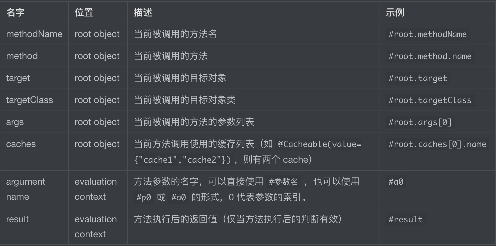
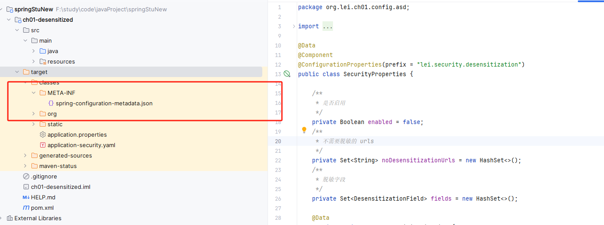
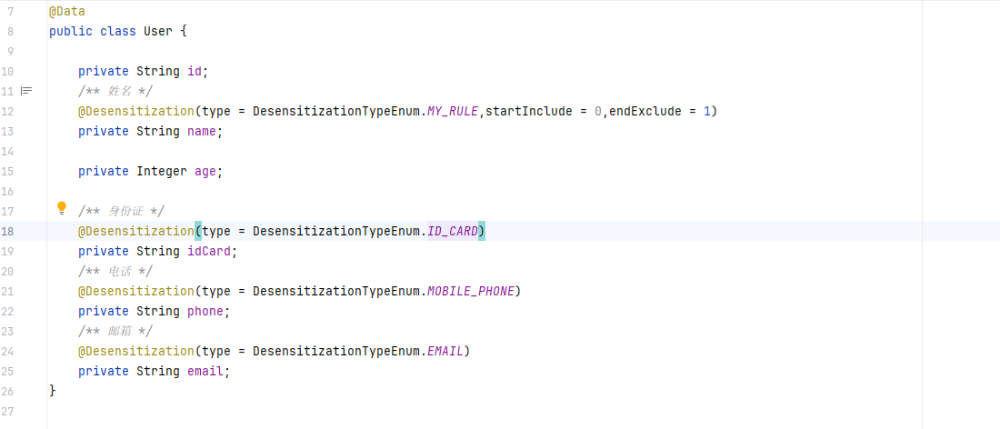
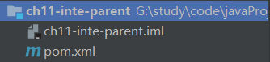
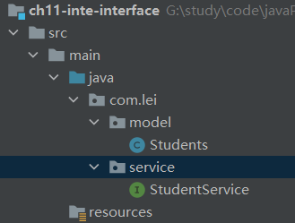
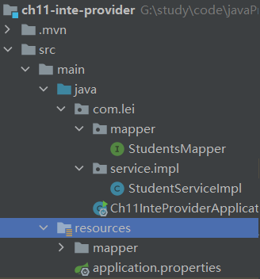
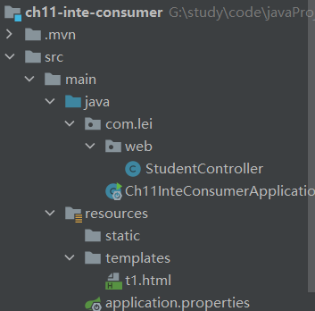

# SpringBoot案例

## 集成

### 整合jsp

- 声明SpringBoot内嵌tomcat对jsp支持依赖

  ```xml
  <dependency>
      <groupId>org.apache.tomcat.embed</groupId>
      <artifactId>tomcat-embed-jasper</artifactId>
  </dependency>
  ```

- 在main目录下创建webapp，并在包设置设定该目录为web资源目录

- SpringBoot默认支持view不是jsp，需要手动指定jsp文件编译后位置，SpringBoot规定位置为 META-INF/resources

  ```xml
  <resource>
      <directory>src/main/webapp</directory>
      <targetPath>META-INF/resources</targetPath>
      <includes>
          <include>*.*</include>
      </includes>
  </resource>
  ```

- 在核心配置文件中配置视图解析器

  ```properties
  spring.mvc.view.prefix=/
  spring.mvc.view.suffix=.jsp
  ```

### 集成mybatis（逆向工程）

- 声明相关依赖，mysql驱动依赖、mybatis整合SpringBoot的起步依赖

  ```xml
  <dependency>
      <groupId>mysql</groupId>
      <artifactId>mysql-connector-java</artifactId>
  </dependency>
  <dependency>
      <groupId>org.mybatis.spring.boot</groupId>
      <artifactId>mybatis-spring-boot-starter</artifactId>
      <version>2.2.0</version>
  </dependency>
  ```
  
  

>使用mybatis提供的逆向工程生成实体类、映射文件、Dao接口

- 根目录下创建`generatorConfig.xml`逆向工程配置文件

  ```xml
  <?xml version="1.0" encoding="UTF-8"?>
  <!DOCTYPE generatorConfiguration
          PUBLIC "-//mybatis.org//DTD MyBatis Generator Configuration 1.0//EN"
          "http://mybatis.org/dtd/mybatis-generator-config_1_0.dtd">
  
  <generatorConfiguration>
  <!--    mysql驱动位置 -->
      <classPathEntry location="G:\mysql-connector-java-8.0.25.jar" />
  
      <context id="tables" targetRuntime="MyBatis3">
          <!-- 关闭注释生成 -->
          <commentGenerator>
              <property name="suppressAllComments" value="true" />
          </commentGenerator>
  
          <jdbcConnection driverClass="com.mysql.cj.jdbc.Driver"
                          connectionURL="jdbc:mysql://192.168.10.129:3306/crm_manage?useSSL=true&amp;useUnicode=true&amp;characterEncoding=utf8"
                          userId="crm_manage"
                          password="JCRMp3LHkrSZ5y6c">
          </jdbcConnection>
  
          <javaTypeResolver >
              <property name="forceBigDecimals" value="true" />
          </javaTypeResolver>
  
          <javaModelGenerator targetPackage="com.lei.model" targetProject="src/main/java/">
              <property name="enableSubPackages" value="true" />
              <property name="trimStrings" value="true" />
          </javaModelGenerator>
  
          <sqlMapGenerator targetPackage="com.lei.mapper"  targetProject="src/main/java/">
              <property name="enableSubPackages" value="true" />
          </sqlMapGenerator>
  
          <javaClientGenerator type="XMLMAPPER" targetPackage="com.lei.mapper"  targetProject="src/main/java/">
              <property name="enableSubPackages" value="true" />
          </javaClientGenerator>
  
          <table tableName="tbl_activity" domainObjectName="Activity"
                 enableCountByExample="false"
                 enableSelectByExample="false"
                 enableDeleteByExample="false"
                 enableUpdateByExample="false"
                 selectByExampleQueryId="false"
          />
      </context>
      
  </generatorConfiguration>
  ```

- pom.xml中配置逆向工程插件

  ```xml
  <plugin>
      <groupId>org.mybatis.generator</groupId>
      <artifactId>mybatis-generator-maven-plugin</artifactId>
      <version>1.4.0</version>
      <configuration>
        <!--本地逆向工程配置文件位置-->  
          <configurationFile>generatorConfig.xml</configurationFile>
          <verbose>true</verbose>
          <overwrite>true</overwrite>
      </configuration>
  </plugin>
  ```

- 使用maven的逆向工程插件，生成对应的mapper、domain

> mybatis和SpringBoot整合

1. 在mapper接口上使用注解 @Mapper 注解，将其注入到spring容器

2. 或者使用 @MapperScan("com.lei.mapper")注解，将其注解到主配置文件上，指定需要扫描的mapper包

3. 在 SpringBoot 核心配置文件中配置 数据库链接信息

   ```properties
   spring.datasource.driver-class-name=com.mysql.cj.jdbc.Driver
   spring.datasource.url=jdbc:mysql://192.168.10.129:3306/crm_manage?useSSL=true&useUnicode=true&characterEncoding=utf8
   spring.datasource.username=crm_manage
   spring.datasource.password=JCRMp3LHkrSZ5y6c
   ```

4. pom.xml配置资源文件用于编译mapper.xml文件

> mapper.xml存放位置，两种

- 和接口放在一起，需要在pom.xml中配置资源目录

- 直接将mapper.xml和接口分开，将mapper.xml放在 resource目录下

  - 在资源目录下创建mapper文件夹，将mapper.xml文件放进去

  - 在SpringBoot核心配置文件中指定mapper所在位置

    ```properties
    mybatis.mapper-locations=classpath:mapper/*.xml
    ```

  - 不需要在pom.xml中指定资源目录


### 集成redis

SpringBoot2.x之后，原来使用的jedis被替换成了 lettuce

区别：

- jedis：采用直连，多个线程操作的话，是不安全的，如果要避免不安全，使用jedis pool连接池，像 BIO
- lettuce：采用netty，实例可以多个线程中进行共享，不存在线程不安全的情况！可以减少线程数据，像 NIO

1. 添加依赖

   ```xml
   <!-- SpringBoot集成redis起步依赖 -->
   <dependency>
       <groupId>org.springframework.boot</groupId>
       <artifactId>spring-boot-starter-data-redis</artifactId>
   </dependency>
   ```

   

2. 在SpringBoot核心配置文件中添加redis配置

   ```properties
   spring.redis.host=192.168.10.129
   spring.redis.port=6379
   spring.redis.password=123456
   ```

3. redis起步依赖提供了一个操作redis的对象，注入操作redis的对象

   ```java
   @Autowired
   private RedisTemplate<Object,Object> redisTemplate;
   ```

4. 事务操作的实现，通过SessionCallback/RedisCallback；默认情况下：redisTemplate每次操作都是采用新的连接执行，而`redisTemplate.multi()`是无效的(因为连接池连接默认自动提交)，手动提交时会报错`ERR EXEC without MULTI`

   **SessionCallback实现事务操作**

   ```java
   @Override
   public void set(String key, String value) {
       try {
           Boolean execute = redisTemplate.execute(new SessionCallback<Boolean>() {
               @Override
               public Boolean execute(RedisOperations redisOperations) throws DataAccessException {
                   redisOperations.multi();
                   //设置缓存
                   redisOperations.opsForValue().setIfAbsent(key, value);
                   //设置超时时间
                   redisOperations.expire(key, 120L, TimeUnit.SECONDS);
                   List list = redisOperations.exec();
                   return (Boolean) list.get(0);
               }
           });
       } finally {
           //清除缓存
           redisTemplate.delete(key);
       }
   }
   ```

   RedisCallback实现事务操作

   ```java
   public void set(String key, String value) {
       try {
           redisTemplate.execute(new RedisCallback<Boolean>() {
               @Override
               public Boolean doInRedis(RedisConnection redisConnection) throws DataAccessException {
                   redisConnection.multi();
                   Expiration seconds = Expiration.seconds(60L);
                   //如果不存在则设置值
                   redisConnection.set(key.getBytes(),value.getBytes(),seconds, RedisStringCommands.SetOption.SET_IF_ABSENT);
                   //设置超时时间
                   redisConnection.expire(key.getBytes(),60L);
                   List<Object> exec = redisConnection.exec();
                   return null;
               }
           });
       }finally {
           //清除缓存
           redisTemplate.delete(key);
       }
   
   }
   ```

   

### 集成Dubbo分布式框架

> dubbo简介

- 接口工程：存放实体bean和业务接口
- 服务提供者：业务接口的实现类并将服务暴露且注册到注册中心，调用数据数据持久层
  - 添加依赖：dubbo，注册中心，接口工程
  - 配置服务者核心配置文件
- 服务消费者：处理浏览器客户端发送的请求，从注册中心调用服务提供者所提供的服务
  - 添加依赖：dubbo，注册中心，接口工程
  - 配置服务消费者核心配置文件

> 集成步骤

1. 创建接口工程（maven项目）、创建服务提供者（SpringBoot项目）、创建服务消费者（SpringBoot项目）

2. 服务提供者

   - 添加依赖

     ```xml
     <!--dubbo集成SpringBoot起步依赖-->
     dubbo-spring-boot-starter
     <!--注册中心依赖-->
     zkclient
     <!--接口工程-->
     ```

   - 核心配置文件中配置

     ```properties
     #内嵌tomcat端口号
     #设置上下文根
     #声明当前工程名字
     spring.application.name=
     
     #设置dubbo配置，注意，没有提示
     #声明当前工程是一个服务提供者工程
     spring.dubbo.server=true
     #指定注册中心
     spring.dubbo.registry=zookeeper://ip:2181
     ```

3. 服务消费者

   - 添加依赖

     ```xml
     <!--dubbo集成SpringBoot起步依赖-->
     dubbo-spring-boot-starter
     <!--注册中心依赖-->
     zkclient
     <!--接口工程-->
     ```

   - 核心配置文件中配置

     ```properties
     #内嵌tomcat端口号
     #设置上下文根
     #声明当前工程名字
     spring.application.name=
     
     #设置dubbo配置，注意，没有提示
     #声明当前工程是一个服务提供者工程
     spring.dubbo.server=true
     #指定注册中心
     spring.dubbo.registry=zookeeper://ip:2181
     ```

### 集成logback日志

SpringBoot默认集成了logback日志框架（log4j 原意 log for java）

SpringBoot核心配置文件可以配置日志，当SpringBoot核心配置文件不够使用时，也可以引入自己扩展的日志配置文件 `logback-spring.xml`

SpringBoot核心配置文件与logback相关配置

```yaml
logging:
  level:
    #单独给mysql日志级别配置为 debug，其他的为 warn
    com.lei.mapper: debug
    root: info   #日志级别
  file:
    path: /logs    #指定日志输出的文件路径，/在windows下是直接定位到当前工作文件磁盘下的
    name: log       #指定日志文件名
  config: classpath:logback-spring.xml  	#指定自定义配置的logback位置
```

> 自定义扩展配置 logback-spring.xml

```xml
<?xml version="1.0" encoding="UTF-8"?>
<!-- 日志级别从低到高分为TRACE < DEBUG < INFO < WARN < ERROR < FATAL，如果设置为WARN，则低于WARN的信息都不会输出 -->
<!-- scan:当此属性设置为true时，配置文件如果发生改变，将会被重新加载，默认值为true -->
<!-- scanPeriod:设置监测配置文件是否有修改的时间间隔，如果没有给出时间单位，默认单位是毫秒。当scan为true时，此属性生效。默认的时间间隔为1分钟。 -->
<!-- debug:当此属性设置为true时，将打印出logback内部日志信息，实时查看logback运行状态。默认值为false。 -->
<configuration  scan="true" scanPeriod="10 seconds">

    <!--输出到控制台的追加器-->
    <appender name="CONSOLE" class="ch.qos.logback.core.ConsoleAppender">
        <!--此日志appender是为开发使用，只配置最底级别，控制台输出的日志级别是大于或等于此级别的日志信息-->
        <filter class="ch.qos.logback.classic.filter.ThresholdFilter">
            <level>DEBUG</level>
        </filter>
        <encoder>
            <Pattern>%date [%-5p] [%thread] %-5level %logger{50} - %msg%n</Pattern>
            <!-- 设置字符集 -->
            <charset>UTF-8</charset>
        </encoder>
    </appender>

    <!--输出到文件的追加器-->
    <appender name="DEBUG_FILE" class="ch.qos.logback.core.rolling.RollingFileAppender">
        <!-- 正在记录的日志文件的路径及文件名 -->
        <file>D:/log_debug.log</file>
        <!--日志文件输出格式-->
        <encoder>
            <pattern>%d{yyyy-MM-dd HH:mm:ss.SSS} [%thread] [%-5level] %logger{50} - %msg%n</pattern>
            <charset>UTF-8</charset> <!-- 设置字符集 -->
        </encoder>
        <!-- 日志记录器的滚动策略，按日期，按大小记录 -->
        <rollingPolicy class="ch.qos.logback.core.rolling.TimeBasedRollingPolicy">
            <!-- 日志归档 -->
            <fileNamePattern>d:/debug/log-debug-%d{yyyy-MM-dd}.%i.log</fileNamePattern>
            <timeBasedFileNamingAndTriggeringPolicy class="ch.qos.logback.core.rolling.SizeAndTimeBasedFNATP">
                <maxFileSize>100MB</maxFileSize>
            </timeBasedFileNamingAndTriggeringPolicy>
            <!--日志文件保留天数-->
            <maxHistory>10</maxHistory>
        </rollingPolicy>
        <!-- 此日志文件只记录debug级别的 -->
        <filter class="ch.qos.logback.classic.filter.LevelFilter">
            <level>debug</level>
            <onMatch>ACCEPT</onMatch>
            <onMismatch>DENY</onMismatch>
        </filter>
    </appender>
    <!--
        <logger>用来设置某一个包或者具体的某一个类的日志打印级别、以及指定<appender>。<logger>仅有一个name属性，一个可选的level和一个可选的addtivity属性。
        name:用来指定受此logger约束的某一个包或者具体的某一个类。
        level:用来设置打印级别，大小写无关：TRACE, DEBUG, INFO, WARN, ERROR, ALL 和 OFF，
              还有一个特俗值INHERITED或者同义词NULL，代表强制执行上级的级别。
              如果未设置此属性，那么当前logger将会继承上级的级别。
        addtivity:是否向上级logger传递打印信息。默认是true。
    -->
    <!--
        使用mybatis的时候，sql语句是debug下才会打印，而这里我们只配置了info，所以想要查看sql语句的话，有以下两种操作：
        第一种把<root level="info">改成<root level="DEBUG">这样就会打印sql，不过这样日志那边会出现很多其他消息
        第二种就是单独给dao下目录配置debug模式，代码如下，这样配置sql语句会打印，其他还是正常info级别：
     -->
    <logger name="com.lei.mapper" level="debug"/>
    <!--
        root节点是必选节点，用来指定最基础的日志输出级别，只有一个level属性
        level:用来设置打印级别，大小写无关：TRACE, DEBUG, INFO, WARN, ERROR, ALL 和 OFF，
        不能设置为INHERITED或者同义词NULL。默认是DEBUG
        可以包含零个或多个元素，标识这个appender将会添加到这个logger。
    -->

    <root level="info">
        <appender-ref ref="CONSOLE" />
        <appender-ref ref="DEBUG_FILE" />
    </root>

</configuration>
```


1. 日志级别从低到高：TRACE < DEBUG <WARN < ERROR < FATAL，设置了日志级别后，低于该级别的信息都不会输出
2. scan：此属性为 true 时，配置文件如果发生改变，将会重新加载，默认为 true
   1. scanPeriod：设置监测配置文件是否有修改的时间间隔，如果没有给出时间间隔，默认为毫秒。当 scan 为 true 时，此属性生效。默认时间间隔为 1 分钟
3. debug ：当此属性设置为true时，控制台将打印出 logback 内部日志信息，实时查看。默认值 false，通常不打印


### 使用swagger和lombok

OAS规范，Linux基金会的一个项目，试图定义一种用来描述API格式或API定义语言，来规范RESTFUL服务开发过程

Swagger是目前最受欢迎的 OAS 规范开发工具框架；随着项目自动生成API文档（通过一些注解）

> Swagger使用

1. pom.xml 添加起步依赖

   ```xml
   <!--3.0导入起步依赖-->
   <dependency>
       <groupId>io.springfox</groupId>
       <artifactId>springfox-boot-starter</artifactId>
       <version>3.0.0</version>
   </dependency>
   <!--老版本2.x导入以下依赖-->
   <dependency>
       <groupId>io.springfox</groupId>
       <artifactId>springfox-swagger2</artifactId>
       <version>2.9.2</version>
   </dependency>
   <dependency>
       <groupId>io.springfox</groupId>
       <artifactId>springfox-swagger-ui</artifactId>
       <version>2.9.2</version>
   </dependency>
   ```

2. 2.x的老版本swagger除了需要导入相关依赖，还要编写一个配置类

   ```java
   @Configuration
   @EnableSwagger2  //开启swagger2的支持
   public class MyConfig {
       @Bean
       public Docket docket(){
           //链式编程，构造器模式，基本是固定的
           return new Docket(DocumentationType.SWAGGER_2)
                   .apiInfo(apiInfo())
                   .select()
                   .apis(RequestHandlerSelectors.withMethodAnnotation(ApiOperation.class))   //扫描有ApiOperation注解的方法
                   .paths(PathSelectors.any())
                   .build();
       }
       private ApiInfo apiInfo() {
           return new ApiInfoBuilder()
                   .title("接口文档")
                   .description("接口文档描述")
                   .termsOfServiceUrl("https://www.lei.com")
                   .contact(new Contact("lei","https://www.lei.com","lei@qq.com"))
                   .license("采用api2.0开源许可证")
                   .licenseUrl("https://www.lei.com/context.txt")
                   .version("1.0.0")
                   .build();
       }
   }
   ```

   

3. 编写控制类，并使用相关注解说明，以便生成接口文档

   ```java
   @Api(tags = "SpringBoot使用swagger测试")
   @RestController
   public class UserController {
       @ApiOperation(value = "获取用户信息",notes = "根据id获取用户信息")
       @ApiImplicitParams({
               @ApiImplicitParam(paramType = "path",name = "id",value = "用户id",dataTypeClass = String.class)
       })
       @ApiResponses({
               @ApiResponse(code = 400,message = "缺少请求参数"),
               @ApiResponse(code = 401,message = "请求路径没有权限"),
               @ApiResponse(code = 403,message = "请求路径被隐藏不能访问"),
               @ApiResponse(code = 404,message = "请求路径错误"),
               @ApiResponse(code = 405,message = "请求方法不支持")
       })
       @RequestMapping(value = "/query/{id}",method = RequestMethod.GET)
       public User query(@PathVariable("id") String id){
           User user=new User();
           user.setId(id);
           user.setName("小王");
           return user;
       }
   
       @ApiOperation(value = "删除用户",notes = "根据id和用户名删除")
       @ApiImplicitParams({
               @ApiImplicitParam(paramType = "path",dataTypeClass = String.class,name = "id",value = "用户id"),
               @ApiImplicitParam(paramType = "path",dataTypeClass = String.class,name = "name",value = "用户姓名"),
       })
       @ApiResponses({
               @ApiResponse(code = 400,message = "缺少请求参数"),
               @ApiResponse(code = 401,message = "请求路径没有权限"),
               @ApiResponse(code = 403,message = "请求路径被隐藏不能访问"),
               @ApiResponse(code = 404,message = "请求路径错误"),
               @ApiResponse(code = 405,message = "请求方法不支持")
       })
       @RequestMapping(value = "/del/{id}/{name}",method = RequestMethod.POST)
       public String del(@PathVariable("id") String id,@PathVariable("name") String name){
           return "删除成功";
       }
   }
   ```

4. 实体类相关注解

   ```java
   @Data
   @ApiModel(value = "User",description = "User实体类")
   public class User {
       @ApiModelProperty(name = "id",value = "用户id")
       private String id;
       @ApiModelProperty(name = "name",value = "用户姓名")
       private String name;
   }
   ```

5. 浏览器访问

   1. 3.0访问地址：http://localhost:8080/swagger-ui/index.html#/
   2. 2.x访问地址：http://localhost:8080/swagger-ui.html

6. SpringBoot核心配置文件关闭swagger-ui访问

   ```properties
   springfox.documentation.swagger-ui.enabled=false
   ```


### 使用jasypt加密敏感信息

1. 导入依赖

   ```xml
   <dependency>
       <groupId>com.github.ulisesbocchio</groupId>
       <artifactId>jasypt-spring-boot-starter</artifactId>
       <version>3.0.3</version>
   </dependency>
   ```

2. SpringBoot核心配置文件配置加密解密的 key

   ```properties
   jasypt.encryptor.password=sdjhauidasdw
   ```

3. 注入 jasypt bean，并使用加密解密功能生成 密文

   ```java
   package com.lei;
   
   @SpringBootApplication
   public class Application implements CommandLineRunner {
   
       @Autowired
       private StringEncryptor stringEncryptor;	//注入加密解密的bean
   
       public static void main(String[] args) {
           SpringApplication springApplication=new SpringApplication(Application.class);
           ApplicationContext context=springApplication.run();
           StringEncryptor stringEncryptor=context.getBean(StringEncryptor.class);
           String username=stringEncryptor.encrypt("root");
           System.out.println("username加密结果 :" + username);
           System.out.println("username解密结果："+stringEncryptor.decrypt(username));
           String password=stringEncryptor.encrypt("123456");
           System.out.println("password加密结果 :" + password);
           System.out.println("password解密结果："+stringEncryptor.decrypt(password));
       }
   }
   //输出
   /*
   username加密结果 :KeJAwKEAUZ+HB8NucwwUygG99tWMT7EO/X9J3J50sqFjddx8Nb6jTTQUPEPji2It
   username解密结果：root
   password加密结果 :ov7Is+mJiVsT72YCO5t0lgQE4YpEnwYIWkh4dmx6nh+HSg/4W072tGQMzYS0HmE8
   password解密结果：123456
   */
   ```

4. 在SpringBoot核心配置文件配置；EVC(密文) 为默认识别密文的格式，可以通过配置文件修改

   ```properties
   jasypt.encryptor.password=sdjhauidasdw
   jasypt.encryptor.property.prefix=EVC(
   jasypt.encryptor.property.suffix=)
   
   spring.datasource.username=EVC(KeJAwKEAUZ+HB8NucwwUygG99tWMT7EO/X9J3J50sqFjddx8Nb6jTTQUPEPji2It)
   spring.datasource.password=EVC(ov7Is+mJiVsT72YCO5t0lgQE4YpEnwYIWkh4dmx6nh+HSg/4W072tGQMzYS0HmE8)
   ```


### 使用fastjson替换默认jackson

1. 导入依赖

   ```xml
   <dependency>
       <groupId>com.alibaba</groupId>
       <artifactId>fastjson</artifactId>
       <version>2.0.7</version>
       </dependency>
   ```

2. 配置 `HttpMessageConverters` Bean

   ```java
   @Bean
   public HttpMessageConverters fastJsonHttpMessageConverters(){
       //1、先定义一个convert转换消息的对象
       FastJsonHttpMessageConverter fastConverter=new FastJsonHttpMessageConverter();
       //2、添加fastjson的配置信息，比如是否要格式化返回的json数据；
       FastJsonConfig fastJsonConfig=new FastJsonConfig();
       fastJsonConfig.setSerializerFeatures(
           SerializerFeature.WriteMapNullValue,
           SerializerFeature.WriteNullListAsEmpty,
           SerializerFeature.WriteNullNumberAsZero,
           //SerializerFeature.UseISO8601DateFormat,
           SerializerFeature.WriteClassName,
           SerializerFeature.WriteNullStringAsEmpty,
           SerializerFeature.WriteDateUseDateFormat  //使用日期格式化
       );
       //附加：处理中文乱码
       List<MediaType> fastMedisTypes = new ArrayList<MediaType>();
       fastMedisTypes.add(MediaType.APPLICATION_JSON);
       fastConverter.setSupportedMediaTypes(fastMedisTypes);
       //3、在convert中添加配置信息
       fastConverter.setFastJsonConfig(fastJsonConfig);
       HttpMessageConverter<?> converter=fastConverter;
       return new HttpMessageConverters(converter);
   }
   ```

3. 查看

   ```java
   /*
   * AbstractMessageConverterMethodProcessor类
   * writeWithMessageConverters 写入响应消息的方法
   *   genericConverter.write(body, targetType, selectedMediaType, outputMessage)
   * 可以查看消息转换器，fastjson在列表第一个
   *  */
   ```


### 集成Thymeleaf

1. Thymeleaf 是一个流行的 java 模板引擎，以 html 为载体
2. Thymeleaf模板引擎页面访问，必须经过中央调度器（不能直接访问，类似于页面放在 WEB-INF 目录下）
3. http://www.thymeleaf.org

**Thymeleaf起步**

1. 添加thymeleaf起步依赖

   ```xml
   <dependency>
       <groupId>org.springframework.boot</groupId>
       <artifactId>spring-boot-starter-thymeleaf</artifactId>
   </dependency>
   ```

2. 在 templates 目录下创建模板文件 hello.html，并引入命名空间

   ```html
   <!DOCTYPE html>
   <!--suppress ALL -->
   <html lang="en"  xmlns:th="http://www.thymeleaf.org" >
   <head>
       <meta charset="UTF-8">
       <title>Title</title>
   </head>
   <body>
   <h1 th:text="${msg}"></h1>
   </body>
   </html>
   ```

3. SpringBoot核心配置文件配置关闭缓存，方便开发，启动类需要设置动态更新资源

   ```properties
   spring.thymeleaf.cache=false
   spring.thymeleaf.prefix=classpath:templates/
   spring.thymeleaf.suffix=.html
   ```

**Thymeleaf表达式**

1. `${}`：标准表达式，和el表达式一致，推荐使用
2. `*{}`：选择变量表达式，必须使用 th:object 属性来绑定这个对象
3. `@{}`：路径表达式，

**Thymeleaf常见属性**

1. 标准表达式
   1. `th:text` 
   2. `th:method`
   3. `th:action`
   4. `th:id`
   5. `th:name`
   6. `th:onclick`
2. `th:each="user,userStat:${userList}"`：遍历，依赖于一个html元素
3. 条件判断
   1. `th:if="${sex} eq 1`：满足条件显示
   2. `th:unless="${sex} eq 1"`：满足条件不显示，和 th:if 相反
   3. `th:switch/th:case`：选择，满足显示，否则不显示
4. `th:inline=""`：内敛表达式，有三个值
   1. text：然后在修饰标签里面，可以通过 [[${}]] 取值，而不需要 th:text="${}" 取值
   2. javascript：可以在 js 中直接取得后台返回过来值，通过 [[${}]]
5. 字面量：字符串的意思，分为字符字面量、数字字面量、boolean字面量
6. 字符串拼接
   1. `th:text="|这里为需要拼接的${data}字符串|"`
7. 数学运算

后台发送过来的值时，才使用 Thymeleaf 属性

**Thymeleaf对象**

基本表达式对象

1. #request
2. #session

功能表达式对象

1. `#dates`：java.util.Date 对象的实用方法
2. `#calendars`：和dates类似，但是是java.util.Calendar 对象
3. `#numbers`：格式化数字对象的实用方法
4. `#strings`：字符串对象的实用方法
5. `#objects`：对 objects 操作的实用方法
6. `#arrays`：数组的实用方法
7. `#bools`：对布尔值求值的实用方法
8. `#lists`：list 的实用方法，
9. `#sets`：set 的实用方法
10. `#maps`：map 的实用方法
11. `#aggregates`：对数组或集合创建聚合的实用方法

**实例**

```html
<!DOCTYPE html>
<!--suppress ALL -->  <!--防止模板引擎取值时报红-->
<html lang="en"  xmlns:th="http://www.thymeleaf.org" >
<head>
    <meta charset="UTF-8">
    <title>Title</title>
</head>
<body>
<!--
uList：{user1,user2,user3..}
sex：1   1表示男，0表示女
msg：hello
-->
<!--循环-->
<div th:each="user,uStatus:${uList}">
    index：<span th:text="${uStatus.index} "></span>
    count：<span th:text="${uStatus.count} "></span>
    current：<span th:text="${uStatus.current} "></span>
    id：<span th:text="${user.id} "></span>
    name：<span th:text="${user.name} "></span>
    <br>
</div>
<!--判断-->
<div>
    <span th:if="${sex} eq 1">男</span>
    <span th:if="${sex} eq 0">女</span>
</div>
<!--inline-->
<script th:inline="javascript">
    console.log([[${sex}]])
</script>
<!--字符串拼接-->
<div th:text="|字符串拼接${msg}|"></div>
<!--路径表达式-->
<a th:href="@{/t2(msg=hello)}" th:text="跳转"/>
<!--常用对象-->
<div>
    <span th:text="${#request.getRequestURL()}"></span><br>
    <span th:text="${#session}"></span><br>
    <span th:text="${#request.getScheme()}"></span><br>
</div>
<!--#lists对象使用-->
<div>
    uList长度：<span th:text="${#lists.size(uList)}"></span><br>
</div>
</body>
</html>
```


## 配置

### 多数据源

核心配置，指定`mapper接口扫描位置和sqlsession/sqlfactory的映射关系`、`mapper 和 sqlsession/sqlfactory 的对应关系`

多数据源注意事务问题，如果存在多个事务管理器，需明确指定使用哪一个`@Transactional("db1TransactionManager")`

1. 配置文件

   ```properties
   my.datasource.db1.url=jdbc:mysql://192.168.10.131:3306/db1?useSSL=true&useUnicode=true&characterEncoding=utf8
   my.datasource.db1.username=root
   my.datasource.db1.password=123456
   
   my.datasource.db2.url=jdbc:mysql://192.168.10.131:3306/db2?useSSL=true&useUnicode=true&characterEncoding=utf8
   my.datasource.db2.username=root
   my.datasource.db2.password=123456
   ```

2. 配置数据源相关

   **db1数据源**

   ```xml
   <?xml version="1.0" encoding="UTF-8"?>
   <beans xmlns:xsi="http://www.w3.org/2001/XMLSchema-instance"
          xmlns:tx="http://www.springframework.org/schema/tx"
          xmlns:aop="http://www.springframework.org/schema/aop"
          xmlns="http://www.springframework.org/schema/beans"
          xsi:schemaLocation="http://www.springframework.org/schema/beans
       http://www.springframework.org/schema/beans/spring-beans-4.2.xsd
       http://www.springframework.org/schema/aop
        http://www.springframework.org/schema/aop/spring-aop-4.2.xsd">
   
       <bean id="db1DataSource" class="org.springframework.jdbc.datasource.DriverManagerDataSource">
           <property name="url" value="${my.datasource.db1.url}"/>
           <property name="username" value="${my.datasource.db1.username}"/>
           <property name="password" value="${my.datasource.db1.password}"/>
       </bean>
       <!--    SqlSessionFactory -->
       <bean id="db1SqlSessionFactory" class="org.mybatis.spring.SqlSessionFactoryBean">
           <property name="dataSource" ref="db1DataSource"/>
           <property name="mapperLocations" value="classpath*:sql/db1/*Mapper.xml"/>
       </bean>
       <!-- 这里的配置可以使用注解 @MapperScan   -->
   <!--    <bean class="org.mybatis.spring.mapper.MapperScannerConfigurer">
           <property name="basePackage" value="com.lei.**.db1dao"/>
           <property name="sqlSessionFactoryBeanName" value="db1SqlSessionFactory"/>
       </bean>-->
       <!--    sqlSessionTemplate -->
       <bean id="db1SqlSession" class="org.mybatis.spring.SqlSessionTemplate">
           <!-- 只能使用构造方法注入，因为该类没有 set 方法-->
           <constructor-arg ref="db1SqlSessionFactory"/>
       </bean>
   
       <bean id="db1TransactionManager" class="org.springframework.jdbc.datasource.DataSourceTransactionManager">
           <property name="dataSource" ref="db1DataSource"/>
       </bean>
       <!-- 自动为spring容器中那些配置@aspectJ切面的bean创建代理-->
       <aop:aspectj-autoproxy/>
   </beans>
   ```
   
   **db2数据源**
   
   ```xml
   <?xml version="1.0" encoding="UTF-8"?>
   <beans xmlns:xsi="http://www.w3.org/2001/XMLSchema-instance"
          xmlns:tx="http://www.springframework.org/schema/tx"
          xmlns:aop="http://www.springframework.org/schema/aop"
          xmlns="http://www.springframework.org/schema/beans"
          xsi:schemaLocation="http://www.springframework.org/schema/beans
       http://www.springframework.org/schema/beans/spring-beans-4.2.xsd
       http://www.springframework.org/schema/aop
        http://www.springframework.org/schema/aop/spring-aop-4.2.xsd">
   
       <bean id="db2DataSource" class="org.springframework.jdbc.datasource.DriverManagerDataSource">
           <property name="url" value="${my.datasource.db2.url}"/>
           <property name="username" value="${my.datasource.db2.username}"/>
           <property name="password" value="${my.datasource.db2.password}"/>
       </bean>
       <!--    SqlSessionFactory -->
       <bean id="db2SqlSessionFactory" class="org.mybatis.spring.SqlSessionFactoryBean">
           <property name="dataSource" ref="db2DataSource"/>
           <property name="mapperLocations" value="classpath*:sql/db2/*Mapper.xml"/>
       </bean>
   <!--    <bean class="org.mybatis.spring.mapper.MapperScannerConfigurer">-->
   <!--        <property name="basePackage" value="com.lei.**.db2dao"/>-->
   <!--        <property name="sqlSessionFactoryBeanName" value="db2SqlSessionFactory"/>-->
   <!--    </bean>-->
       <!-- sqlSessionTemplate -->
       <bean id="db2SqlSession" class="org.mybatis.spring.SqlSessionTemplate">
           <!-- 只能使用构造方法注入，因为该类没有 set 方法-->
           <constructor-arg ref="db2SqlSessionFactory"/>
       </bean>
   
       <bean id="db2TransactionManager" class="org.springframework.jdbc.datasource.DataSourceTransactionManager">
           <property name="dataSource" ref="db2DataSource"/>
       </bean>
       <aop:aspectj-autoproxy/>
   </beans>
   ```
   
3. 启动类配置相关注解

   ```java
   @SpringBootApplication
   //@EnableTransactionManagement
   //导入数据源配置文件
   @ImportResource({"classpath*:config/db1.xml","classpath*:config/db2.xml"})
   //绑定mapper接口和sqlsession
   @MapperScan(basePackages ="com.lei.**.db1dao", sqlSessionTemplateRef = "db1SqlSession")
   @MapperScan(basePackages ="com.lei.**.db2dao", sqlSessionTemplateRef = "db2SqlSession")
   public class TwoApplication {
       public static void main(String[] args) {
           SpringApplication.run(TwoApplication.class, args);
       }
   }
   ```

进行测试，多数据源配置成功

**注意**：定义扫描dao接口时，可能多个数据源扫描了同一位置，此时后扫描到的dao接口时，不再创建实例bean，此时可以通过数据源配置文件导入先后顺序来控制

```xml
<!-- 
	这里的db1配置扫描的mapper范围会将db2的mapper扫描到
	因此先加载db2配置，这样db2 的 mapper 先实例化，后续db1扫描到就会忽略
-->

<!--分布式关系数据库-->
<import resource="classpath:config/db2.xml"/>
<import resource="classpath:config/db1.xml"/>
```


### 事务支持

**声明式事务**

 `@Transactional`：可以标注在类上或方法上，事务支持

`@EnableTransactionManagement`：Application 类上，表示开启事务，可以省略

**编程式事务**

事务管理器 PlatformTransactionManager、事务状态 TransactionStatus、事务属性的定义 TransactionDefinition

1. 通过`PlatformTransactionManager`实现编程式事务

   ```java
   @Override
   public StudentEntity update(StudentEntity studentEntity) {
       //事务定义
   	DefaultTransactionDefinition definition = new DefaultTransactionDefinition();
       definition.setPropagationBehavior(TransactionDefinition.PROPAGATION_REQUIRED);
       //新开事务
       TransactionStatus status = transactionManager.getTransaction(definition);
       try {
           studentsDao.update(studentEntity);
           //事务定义
           DefaultTransactionDefinition definition1 = new DefaultTransactionDefinition();
           definition1.setPropagationBehavior(TransactionDefinition.PROPAGATION_REQUIRES_NEW);
           //新开事务
           TransactionStatus status1 = transactionManager.getTransaction(definition1);
           try {
               StudentEntity studentEntity1=new StudentEntity();
               BeanUtils.copyProperties(studentEntity,studentEntity1);
               studentEntity1.setId(2L);
               studentEntity1.setName("后续更新");
               studentsDao.update(studentEntity1);
               int a=10/0;
               transactionManager.commit(status1);
           }catch (Exception e){
               transactionManager.rollback(status1);
           }
           //提交事务
           transactionManager.commit(status);
       }catch (Exception e){
           //回滚事务
           transactionManager.rollback(status);
       }
   }
   ```

2. 通过`transactionTemplate`实现编程式事务

   ```java
   @Override
   public StudentEntity update(StudentEntity studentEntity) {
   	transactionTemplate.setPropagationBehavior(TransactionDefinition.PROPAGATION_REQUIRED);
       this.transactionTemplate.execute(new TransactionCallbackWithoutResult() {
           @Override
           protected void doInTransactionWithoutResult(TransactionStatus transactionStatus) {
               try {
                   studentsDao.update(studentEntity);
                   //设置事务的传播级别
                   transactionTemplate.setPropagationBehavior(TransactionDefinition.PROPAGATION_NEVER);
                   //新开事务
                   transactionTemplate.execute(new TransactionCallbackWithoutResult() {
                       @Override
                       protected void doInTransactionWithoutResult(TransactionStatus transactionStatus) {
                           try {
                               StudentEntity studentEntity1=new StudentEntity();
                               BeanUtils.copyProperties(studentEntity,studentEntity1);
                               studentEntity1.setId(2L);
                               studentEntity1.setName("后续更新");
                               studentsDao.update(studentEntity1);
                           }catch(Exception e){
                               //标记事务为回滚
                               transactionStatus.setRollbackOnly();
                           }
                       }
                   });
                   int a=10/0;
               }catch (Exception e){
                   transactionStatus.setRollbackOnly();
               }
           }
       });
   }
   ```

注：以上两种编程式事务，都是事务嵌套；外层事务和内层事务通过事务传播级别关联；设置不同的事务传播级别，可以实现：内部事务抛错外部回滚，内部抛错外部提交等；通过事务传播级别，设置事务管理器中的事务是否`RollbackOnly`

**注意**：SpringBoot集成mybatis时，通过sqlSession进行数据库操作时，必须注意 sqlSession 可以设置自动提交，但是连接池连接的自动提交并不能在获取sqlSession时设置

>openSession(boolean autoCommit)，`autoCommit` 可选参数传递 `true` 值即可开启自动提交功能，没有提供同时设置 `Connection` 和 `autoCommit` 的方法，这是因为 MyBatis 会依据传入的 Connection 来决定是否启用 autoCommit

**SqlSessionTemplate**

`SqlSessionTemplate` 是 MyBatis-Spring 的核心，作为 `SqlSession` 的一个实现，这意味着可以使用它无缝代替你代码中已经在使用的 `SqlSession`，`SqlSessionTemplate` 是线程安全的，可以被多个 DAO 或映射器所共享使用，`SqlSessionTemplate` 将会保证使用的 `SqlSession` 与当前 Spring 的事务相关

```java
@Override
public StudentEntity update(StudentEntity studentEntity) {
    SqlSession sqlSession=null;
    TransactionDefinition definition = new DefaultTransactionDefinition();
    TransactionStatus status = transactionManager.getTransaction(definition);
    try {
        //这里通过sqlSessionTemplate获取到的sqlSession总是加入当前已存在事务
        sqlSession = sqlSessionTemplate.getSqlSessionFactory().openSession(ExecutorType.SIMPLE,false);
        StudentsDao mapper = sqlSession.getMapper(StudentsDao.class);
        mapper.update(studentEntity);
        //sqlSessionTemplate的特性，这里的提交失效，以外层事务为准
        sqlSession.commit();
    }catch (Exception e){
        sqlSession.rollback();
    }finally {
        if (sqlSession!=null){
            sqlSession.close();
        }
    }
    //这里提交或回滚，包括sqlSessionTemplate进行的sql操作
    transactionManager.commit(status);
    return this.queryById(studentEntity.getId());
}
```

**rollback-only**

当事务嵌套时,事务传播特性(propagation)为`REQUIRED`时,以下情况会出现rollback-only

1. 当里层事务抛错,标记为回滚,但是错误被捕获,外层未抛错出来,此时里层缺已经标记为只能rollbackOnly,外层提交事务就会抛错rollback-only
2. 当外层为只读事务时,里层事务抛错,此时只读事务提交也会抛错rollback-only

**业务代码执行时，记录错误**

```java
@Override
@Transactional("db1TransactionManager")
public Object testB() {
    Db1Tb1 db1Tb1=new Db1Tb1();
    db1Tb1.setAge(12);
    db1Tb1.setName("db1");
    db1Tb1Dao.insert(db1Tb1);

    DefaultTransactionDefinition transactionDefinition=new DefaultTransactionDefinition();
    //注意事务传播级别，新开事务
    //用于记录业务代码中的错误，业务代码回滚，错误信息提交
    transactionDefinition.setPropagationBehavior(TransactionDefinition.PROPAGATION_REQUIRES_NEW);
    TransactionStatus transaction = platformTransactionManager.getTransaction(transactionDefinition);
    try {
        db1Tb1.setAge(16);
        db1Tb1Dao.insert(db1Tb1);
        platformTransactionManager.commit(transaction);
    }catch (Exception e){
        platformTransactionManager.rollback(transaction);
    }
    //这里抛错 不会影响第新开事务的数据插入
    int i =1/0;
    return null;
}
```


### RESTFul风格

主要是用`@PathVariable("")`注解

1. controller代码 

   ```java
   @RestController
   public class TestController {
       @RequestMapping("/test/{id}/{name}")
       public String test(@PathVariable("id") Integer id,
                          @PathVariable("name") String name){
           return id+" "+name;
       }
   }
   ```

2. 访问地址：127.0.0.1:8080/test/123/唐磊

注意请求路径不清楚的情况，restful风格，通常使用对应的方法请求mapping注解，例：

```java
//请求访问时，会出现请求模糊的错误
@RestController
public class TestController {
    @RequestMapping("/test/{id}/{name}")
    public String test(@PathVariable("id") Integer id,
                       @PathVariable("name") String name){
        return id+" "+name;
    }
    @RequestMapping("/test/{id}/{desc}")
    public String test2(@PathVariable("id") Integer id,
                       @PathVariable("desc") String name){
        return id+" "+name;
    }
}
```

修改为以下代码无误，然后通过对应的请求方式发送请求

```java
@RestController
public class TestController {
    @PostMapping("/test/{id}/{name}")
    public String test(@PathVariable("id") Integer id,
                       @PathVariable("name") String name){
        return id+" "+name;
    }
    @GetMapping("/test/{id}/{desc}")
    public String test2(@PathVariable("id") Integer id,
                       @PathVariable("desc") String name){
        return id+" "+name;
    }
}
```


### 普通java程序

SpringBoot实现普通java程序，有两种方法

1. 在SpringBoot启动方法中获取 ConfigurableApplicationContext

   ```java
   //获得容器，然后取得bean并执行
   ConfigurableApplicationContext context=SpringApplication.run(Application.class, args);
   ```

2. 在SpringBoot启动类实现CommandLineRunner接口，并重写run方法

   ```java
   //实现CommandLineRunner接口，并重写run方法
   CommandLineRunner
   @SpringBootApplication
   public class Application implements CommandLineRunner
   CommandLineRunner {
       //注入bean
       @Autowired
       private UserService userService;
       public static void main(String[] args) {
           SpringApplication.run(Application.class, args);
       }
   //重写接口方法，调用bean方法，SpringBoot容器启动后会回调该方法
       @Override
       public void run(String... args) throws Exception {
           userService.say();
       }
   }
   ```


### 拦截器 Interceptor

1. 实现`HandlerInterceptor`接口并实现相关方法

   ```java
   @Order(1)    //order代表拦截器执行顺序
   @Component	 //注册到spring容器，以便后续将拦截在WebMvcConfigurer中注册
   public class LoginInterceptor implements HandlerInterceptor {
       //预处理回调方法，实现处理器的预处理，如登录检查；true表示执行下一流程、false中断流程（需要通过response来响应）
       @Override
       public boolean preHandle(HttpServletRequest request, HttpServletResponse response, Object handler) throws Exception {
           if (request.getSession().getAttribute("user")==null){
               response.sendRedirect(request.getContextPath()+"/user/err");
               return false;
           }
           return true;
       }
   
       //后处理回调方法，在控制器后视图层前，可以通过modelAndView来处理视图层
       @Override
       public void postHandle(HttpServletRequest request, HttpServletResponse response, Object handler, ModelAndView modelAndView) throws Exception {
           HandlerInterceptor.super.postHandle(request, response, handler, modelAndView);
       }
   
       //整个请求处理完毕后的回调方法，即在视图渲染完毕后回调；如性能监控，在此输出结束时间，还可以进行资源清理（类似于finally）
       @Override
       public void afterCompletion(HttpServletRequest request, HttpServletResponse response, Object handler, Exception ex) throws Exception {
           HandlerInterceptor.super.afterCompletion(request, response, handler, ex);
       }
   }
   ```

   

2. 注册 `WebMvcConfigurer bean`，添加拦截器到SpringBoot容器，并配置需要拦截的请求

   ```java
   @Bean
   WebMvcConfigurer createWebMvcConfigurer(@Autowired LoginInterceptor loginInterceptor) {
       return new WebMvcConfigurer() {
           //需要被拦截的请求 **代表当前请求路径下的所有请求，*代表当前请求路径同级请求
           // /user/* 表示拦截/user/xx的请求，/user/** 表示拦截 /user/xx/xx...的请求
           String[] addPath={"/user/**"};
           String[] excludePath={"/user/login","/user/err"};
           public void addInterceptors(InterceptorRegistry registry) {
               registry.addInterceptor(loginInterceptor)
                   .addPathPatterns(addPath)      //需要拦截的请求地址
                   .excludePathPatterns(excludePath);  //不需要拦截的请求地址
           }
       };
   }
   ```

3. 编写测试类

   ```java
   @RestController
   @RequestMapping("/user")
   public class UserController {
       //登录，可不登录访问
       @RequestMapping("/login")
       public String login(HttpServletRequest request, HttpServletResponse response) throws IOException {
           User user= (User) request.getSession().getAttribute("user");
           if (user==null){
               user=new User();
               user.setId(UUID.randomUUID().toString());
               request.getSession().setAttribute("user",user);
           }else {
               response.sendRedirect(request.getContextPath()+"/user/home");
           }
           return "login";
       }
       //需要登录后访问
       @RequestMapping("/home")
       public String home(HttpServletRequest request){
           User user= (User) request.getSession().getAttribute("user");
           return "home"+user;
       }
       //错误，可不登录访问，未登录时跳转这个请求
       @RequestMapping("/err")
       public String err(){
           return "err";
       }
   }
   ```

### servlet、过滤器、监听器

> servlet    @WebServlet

两种实现方式：主要步骤都是编写一个Servlet，然后在web.xml中注册该servlet

1. 方式一：注解方式实现 `@WebServlet` `@ServletComponentScan`

   1. servlet编写

      ```java
      //@WebServlet声明该类是一个servlet
      @WebServlet(urlPatterns = "/oneSetvlet")
      public class OneServlet extends HttpServlet {
          @Override
          protected void doGet(HttpServletRequest req, HttpServletResponse resp) throws ServletException, IOException {
              resp.getWriter().println("one servlet");
              resp.getWriter().flush();
              resp.getWriter().flush();
          }
      }
      ```

   2. SpringBoot启动类配置servlet扫描

      ```java
      @SpringBootApplication
      //@ServletComponentScan 启动servlet扫描
      @ServletComponentScan(basePackages = "com.lei.servlet")
      public class Application {
          public static void main(String[] args) {
              SpringApplication.run(Application.class, args);
          }
      }
      ```

      

2. 方式二：配置类注册组件实现

   1. 编写servlet

      ```java
      public class TwoServlet extends HttpServlet {
          @Override
          protected void doGet(HttpServletRequest req, HttpServletResponse resp) throws ServletException, IOException {
              resp.getWriter().println("two servlet");
              resp.getWriter().flush();
              resp.getWriter().flush();
          }
      }
      ```

   2. 编写配置类，并注册servlet

      ```java
      @Configuration
      public class MyConfig {
          @Bean
          public ServletRegistrationBean<HttpServlet> registrationBean(){
              return new ServletRegistrationBean<>(new TwoServlet(),"/twoServlet");
          }
      }
      ```

> 过滤器   @WebListenner

过滤器属于servlet的，声明过滤器，注册到SpringBoot容器中

SpringBoot有两种实现方式：

1. 方式一：注解方式 `@WebFilter`、`@`

   1. 创建过滤器，实现 servlet 下的 Filter 接口，并重写方法

      ```java
      //定义该类为一个过滤器
      @WebFilter(urlPatterns = "/*")
      public class TwoFilter implements Filter {
          //过滤器的创建由web服务器控制，过滤器执行顺序，可在注册时通过setOrder，当不设置 setOrder 次序时，过滤器的执行顺序默认是 Bean 的加载顺序
          //初始化参数，在创建Filter时自动调用。当我们需要设置初始化参数的时候，可以写到该方法中
          @Override
          public void init(FilterConfig filterConfig) throws ServletException {
              Filter.super.init(filterConfig);
          }
          //拦截到要执行的请求时，doFilter就会执行。这里面写我们对请求和响应的预处理
          @Override
          public void doFilter(ServletRequest servletRequest, ServletResponse servletResponse, FilterChain filterChain) throws IOException, ServletException {
              System.out.println("过滤器1生效");
          }
          //在销毁Filter时自动调用
          @Override
          public void destroy() {
              Filter.super.destroy();
          }
      }
      ```

   2. SpringBoot启动类，配置启动servlet扫描

      ```java
      @SpringBootApplication
      @ServletComponentScan(basePackages = "com.lei.filter")
      public class Application {
          public static void main(String[] args) {
              SpringApplication.run(Application.class, args);
          }
      }
      ```

      

2. 方式二：配置类注册组件方式

   1. 创建过滤器，实现 servlet 下的 Filter 接口，并重写方法

      ```java
      public class Filter1 implements Filter {
          @Override
          public void init(FilterConfig filterConfig) throws ServletException {
              Filter.super.init(filterConfig);
          }
          @Override
          public void destroy() {
              Filter.super.destroy();
          }
          @Override
          public void doFilter(ServletRequest servletRequest, ServletResponse servletResponse, FilterChain filterChain) throws IOException, ServletException {
              System.out.println("过滤器1");
              //放行
             filterChain.doFilter(servletRequest,servletResponse);
          }
      }
      ```

   2. 编写配置类，注册过滤器到SpringBoot

      ```java
      @Configuration
      public class MyConfig {
          @Bean
          public FilterRegistrationBean<Filter> registrationBean(){
              FilterRegistrationBean<Filter> registrationBean=new FilterRegistrationBean<>(new Filter1());
              registrationBean.addUrlPatterns("/*");
              System.out.println(registrationBean.getOrder());
              return registrationBean;
          }
      }
      ```

> listenner 和 servlet 监听器实现类似

**过滤器实现过滤空参数**

创建ServletRequest包装类处理空字符

```java
public class TrimHttpServletRequestWrapper extends HttpServletRequestWrapper {
    /**
     * 设置不需要去掉空格的参数
     * key:为uri地址
     * values：参数名称
     */
    private final Map<String, Set<String>> ignoreFieldMap;

    public TrimHttpServletRequestWrapper(HttpServletRequest request, Map<String, Set<String>> ignoreFieldMap) {
        super(request);
        this.ignoreFieldMap = ignoreFieldMap;
    }


    @Override
    public String[] getParameterValues(String name) {
        String[] values = super.getParameterValues(name);
        if (values == null || ignoreFieldMap.get(name) != null) {
            return values;
        } else {
            int length = values.length;
            String[] escapeValues = new String[length];

            for (int i = 0; i < length; i++) {
                escapeValues[i] = values[i].trim();
            }
            return escapeValues;
        }
    }

    @Override
    public String getParameter(String parameter) {
        String value = super.getParameter(parameter);
        if (value == null || ignoreFieldMap.get(parameter) != null) {
            return value;
        } else {
            return value.trim();
        }
    }
}
```

创建过滤器

```java
/**
 * 处理请求参数中前后空格
 */
@Component
@WebFilter(urlPatterns = "/**", filterName = "ParamsFilter", dispatcherTypes = DispatcherType.REQUEST)
public class ParamFilter implements Filter {

    @Value("${server.servlet.context-path}")
    public String contextPath;

    /**
     * 不过滤空格的uri地址
     */
    private Set<String> excludeUris;

    /**
     * 设置需要过滤空格的uri
     */
    private Set<String> includeUris;

    /**
     * 设置不需要去掉空格的参数
     * key:为uri地址
     * values：参数名称
     */
    private Map<String, Set<String>> ignoreFieldMap;

    private static final PathMatcher matcher = new AntPathMatcher();

    @Override
    public void init(FilterConfig filterConfig) throws ServletException {
        this.includeUris = new HashSet<>();
        this.excludeUris = new HashSet<>();
        this.ignoreFieldMap = new HashMap<>();

        includeUris.add(contextPath + "/**/testA");
        ignoreFieldMap.put("", new HashSet<>());
    }

    @Override
    public void doFilter(ServletRequest request, ServletResponse response, FilterChain chain) throws IOException, ServletException {

        HttpServletRequest httpServletRequest = (HttpServletRequest) request;
        String requestUri = httpServletRequest.getRequestURI();

        //是否需要过滤标志
        boolean includeFlag = false;
        boolean excludeFlag = true;
        //匹配需要进行处理的url
        for (String uris : includeUris) {
            if (match(uris, requestUri)) {
                includeFlag = true;
                break;
            }
        }
        //匹配除去的url
        for (String uris : excludeUris) {
            if (match(uris, requestUri)) {
                excludeFlag = false;
                break;
            }
        }
        chain.doFilter(request, response);
        if (includeFlag && excludeFlag) {
            //过滤器处理
            chain.doFilter(new TrimHttpServletRequestWrapper(httpServletRequest, ignoreFieldMap), response);
        } else {
            //放行
            chain.doFilter(request, response);
        }
    }

    private boolean match(String uris, String requestUri) {
        if (Objects.isNull(uris) || Objects.isNull(requestUri)) {
            return false;
        }
        return matcher.match(uris, requestUri);
    }

    @Override
    public void destroy() {
        Filter.super.destroy();
    }
}
```


### 设置字符编码

针对servlet使用，两种方式

方式一：使用SpringBoot核心配置文件设置

- application.properties

  ```properties
  server.servlet.encoding.enabled=true
  server.servlet.encoding.force=true
  server.servlet.encoding.charset=utf-8
  ```

- 设置浏览器编码

  ```java
  @WebServlet(urlPatterns = "/oneSetvlet")
  public class OneServlet extends HttpServlet {
      @Override
      protected void doGet(HttpServletRequest req, HttpServletResponse resp) throws ServletException, IOException {
          resp.setContentType("text/html;character=utf-8");
          resp.getWriter().println("你好世界，one servlet");
          resp.getWriter().flush();
          resp.getWriter().close();
      }
  }
  ```

方式二：通过注册spring编码过滤器，并关闭SpringBoot自带编码

- SpringBoot自带编码过滤器注册

  ```java
  @Configuration
  public class MyConfig {
      @Bean
      public FilterRegistrationBean<Filter> filterFilterRegistrationBean(){
          CharacterEncodingFilter characterEncodingFilter=new CharacterEncodingFilter("utf-8");
          //forceEncoding用来设置是否理会 request.getCharacterEncoding()方法，设置为true则强制覆盖之前的编码格式
          characterEncodingFilter.setForceEncoding(true);
          FilterRegistrationBean<Filter> filterFilterRegistrationBean=new FilterRegistrationBean<>();
          filterFilterRegistrationBean.setFilter(characterEncodingFilter);
          return filterFilterRegistrationBean;
      }
  }
  ```

- 关闭SpringBoot自带编码

  ```properties
  server.servlet.encoding.enabled=false
  ```

- 设置浏览器编码

  ```java
  @WebServlet(urlPatterns = "/oneSetvlet")
  public class OneServlet extends HttpServlet {
      @Override
      protected void doGet(HttpServletRequest req, HttpServletResponse resp) throws ServletException, IOException {
          resp.setContentType("text/html;character=utf-8");
          resp.getWriter().println("你好世界，one servlet");
          resp.getWriter().flush();
          resp.getWriter().close();
      }
  }
  ```

### SpringBoot工程打包

> 打包war

1. 修改pom.xml

   1. 修改打包形式
   2. 移除内嵌tomcat
   3. 添加servlet依赖
   4. 指定web资源文件夹，指定配置资源文件夹

2. 配置类继承 SpringBootServletInitializer 并重写 configure 方法

   ```java
   @SpringBootApplication
   @ServletComponentScan(basePackages = "com.lei.filter")
   //打包war启动类继承SpringBootServletInitializer类，并重写configure方法
   public class Application extends SpringBootServletInitializer {
       public static void main(String[] args) {
           SpringApplication.run(Application.class, args);
       }
   
       @Override
       protected SpringApplicationBuilder configure(SpringApplicationBuilder builder) {
           return builder.sources(Application.class);
       }
   }
   ```

SpringBoot打war包，在SpringBoot核心配置文件中配置的tomcat相关配置失效，以部署的tomcat配置为主

### 热部署插件

1. JRebel插件 或者  devtools  或者   启动配置更新 resource 和 class
2. 代码修改后 build一下

### 数据库连接池

SpringBoot2.x后默认使用 HikariCP 作为数据源，因此使用其他数据源需要进行配置

1. pom.xml 排除默认的 HikariCP 数据库连接池，并添加 数据库连接池

   ```xml
   <dependency>
       <groupId>org.mybatis.spring.boot</groupId>
       <artifactId>mybatis-spring-boot-starter</artifactId>
       <exclusions>
           <exclusion>
               <groupId>com.zaxxer</groupId>
               <artifactId>HikariCP</artifactId>
           </exclusion>
       </exclusions>
   </dependency>
   <dependency>
       <groupId>com.alibaba</groupId>
       <artifactId>druid</artifactId>
       <version>1.2.6</version>
   </dependency>
   ```

2. SpringBoot核心配置文件指定数据源

   ```properties
   #指定数据源
   spring.datasource.type=com.alibaba.druid.pool.DruidDataSource
   ```

也可以直接使用起步依赖，不需要在SpringBoot核心配置文件中指定数据源，并且可以在SpringBoot核心配置文件中配置该连接池相关参数

```xml
<dependency>
    <groupId>org.mybatis.spring.boot</groupId>
    <artifactId>mybatis-spring-boot-starter</artifactId>
    <exclusions>
        <exclusion>
            <groupId>com.zaxxer</groupId>
            <artifactId>HikariCP</artifactId>
        </exclusion>
    </exclusions>
</dependency>
<dependency>
    <groupId>com.alibaba</groupId>
    <artifactId>druid-spring-boot-starter</artifactId>
    <version>1.2.6</version>
</dependency>
```

### CORS跨域

传统ajax请求，只能请求同一域下的资源，否则存在跨域错误

同源：指的是协议、端口、host都相同，则视为同源

1. 使用`CorsRegistry`，注册 WebMvcConfigurer bean，在该bean中配置可以跨域访问的请求

   ```java
   @Bean
   public WebMvcConfigurer mvcConfigurer(){
       return new WebMvcConfigurer() {
           @Override
           public void addCorsMappings(CorsRegistry registry) {
               registry.addMapping("/api/**")
                   //放行哪些请求方式
                   .allowedMethods("GET","POST")
                   //设置放行哪些原始域
                   .allowedOrigins("*")
                   //放行哪些原始请求头部信息
                   .allowedHeaders("*")
                   //暴露哪些原始请求头部信息
                   .exposedHeaders("*");
           }
       };
   }
   ```
   
2. 创建配置类，实现接口WebMvcConfigurer ，并重写 addCorsMappings() 方法

   ```java
   @Configuration
   public class MyWebMvcConfig implements WebMvcConfigurer {
       @Override
       public void addCorsMappings(CorsRegistry registry) {
           registry.addMapping("/api/**")
                   //放行哪些请求方式
                   .allowedMethods("GET","POST")
                   //设置放行哪些原始域
                   .allowedOrigins("*")
                   //放行哪些原始请求头部信息
                   .allowedHeaders("*")
                   //暴露哪些原始请求头部信息
                   .exposedHeaders("*");
       }
   }
   ```
   
3. 使用注解`@CrossOrigin(origins = "*",methods = {RequestMethod.GET,RequestMethod.POST})`

4. 使用jsonp方式，只支持get请求，局限性大，但是支持老式浏览器

### 静态资源的处理

SpringBoot默认静态资源位于 classpath 目录下，且满足如下命名

1. `/static`
2. `/public`
3. `/resources`
4. `/META-INF/resources`

以上目录编译后在classpath下，可以直接访问，不需要加目录名

可以通过资源类查看

```java
private static final String[] CLASSPATH_RESOURCE_LOCATIONS = new String[]{"classpath:/META-INF/resources/", "classpath:/resources/", "classpath:/static/", "classpath:/public/"};
```

可以通过核心配置文件修改默认的静态资源放置位置，修改后原先默认的失效

```properties
spring.web.resources.static-locations=classpath:/mystatic/
```

### 线程池异步调用

SpringBoot框架自动装配提供了一个线程池，用于异步提交任务

有了线程池，只需要编写任务即可，采用注解`@Async`提交任务

SpringBoot自动装配的线程池还可以根据需要配置

1. 创建配置类，注入线程池 bean，覆盖默认的线程池，会覆盖SpringBoot创建的默认线程池

   ```java
   @Bean
   public ThreadPoolTaskExecutor asyncExecutor(){
       ThreadPoolTaskExecutor taskExecutor=new ThreadPoolTaskExecutor();
       taskExecutor.setThreadNamePrefix("mythread");
       taskExecutor.setCorePoolSize(2);
       taskExecutor.setMaxPoolSize(10);
       taskExecutor.setQueueCapacity(9999);
       taskExecutor.setRejectedExecutionHandler(new ThreadPoolExecutor.CallerRunsPolicy());
       return taskExecutor;
   }
   ```

2. SpringBoot核心配置文件也可以配置线程池

   ```properties
   spring.task.execution.pool.core-size=5
   spring.task.execution.pool.max-size=100
   spring.task.execution.thread-name-prefix=th-
   spring.task.execution.pool.queue-capacity=999
   ```

   

3. 实例一：通过`@Async`注解，需要在启动类开启异步执行`@EnableAsync`，@Async标注的方法会放入线程池中执行（通过AOP方式）

   ```java
   @Service
   public class MyServiceImpl implements MyService {
       @Async		//标注该方法异步执行
       @Override
       public Future<String> speak() {
           return AsyncResult.forValue("hello");
       }
   }
   
   
   @SpringBootApplication
   @EnableAsync    //开启异步执行
   public class Application implements CommandLineRunner {
   
       @Autowired
       private MyService myService;
   
       public static void main(String[] args) {
          ApplicationContext context= SpringApplication.run(Application.class, args);
           System.out.println(1);
       }
   
       @Override
       public void run(String... args) throws Exception {
           System.out.println("主--------------");
           Future<String> th =myService.speak();
           System.out.println("主------------");
           System.out.println("线程池任务-----"+th.get());
       }
   }
   ```

4. 实例二：通过注入的线程池执行对象

   ```java
   @SpringBootApplication
   public class Application implements CommandLineRunner {
       @Autowired
       private ThreadPoolTaskExecutor taskExecutor;
   
       public static void main(String[] args) {
          ApplicationContext context= SpringApplication.run(Application.class, args);
       }
   
       @Override
       public void run(String... args) throws Exception {
           List<Future<String>> futureList=new ArrayList<>();
           for (int i=0;i<20;i++){
               Future<String> future=taskExecutor.submit(()->{
                   System.out.println(Thread.currentThread().getName()+"线程池任务运行");
                   Thread.sleep(150);
                   return "运行成功";
               });
               futureList.add(future);
           }
   
           for(Future<String> future:futureList){
               //轮询查询任务执行完没，完了获取返回值终止等待该任务返回值，否则睡5ms再次查询
               while (true){
                   if (future.isDone()&&!future.isCancelled()){
                       //获取线程执行返回值
                       System.out.println(future.get()+ LocalDateTime.now());
                       break;
                   }else {
                       Thread.sleep(10);
                   }
               }
           }
       }
   }
   ```

### 内嵌服务器

SpringBoot内嵌服务器默认为 Tomcat，也可以将程序切换为其他服务器 Undertow、Jetty，只需要通过pom.xml配置即可

排除默认的tomcat服务器，导入其他服务器的起步依赖

```xml
<dependency>
    <groupId>org.springframework.boot</groupId>
    <artifactId>spring-boot-starter-web</artifactId>
    <exclusions>
        <exclusion>
            <groupId>org.springframework.boot</groupId>
            <artifactId>spring-boot-starter-tomcat</artifactId>
        </exclusion>
    </exclusions>
</dependency>
<!--        
<dependency>
     <groupId>org.springframework.boot</groupId>
     <artifactId>spring-boot-starter-undertow</artifactId>
</dependency>
-->
<!--如果需要支持jsp，需要额外添加依赖，undertow不支持jsp-->
<dependency>
    <groupId>org.springframework.boot</groupId>
    <artifactId>spring-boot-starter-jetty</artifactId>
</dependency>
```

### HTTPS支持

1. 生成证书，JDK生成（也可以采用openssl生成）
   ```bash
   #生成jks证书文件
   keytool -genkey -keyalg RSA -keystore tomcat.jks
   #转换为行业规范 pkcs12 证书
   keytool -importkeystore -srckeystore tomcat.jks -destkeystore tomcat.pkcs12 -deststoretype pkcs12
   #查看证书内容
   keytoll -list -v -keystore tomcat.jks
   ```
2. SpringBoot核心配置文件配置

   ```properties
   #ssh端口
   server.port=8088
   #证书
   server.ssl.key-store=classpath:tomcat.pkcs12
   #证书密码
   server.ssl.key-store-password=123456
   #证书证书类型 jks/PKCS12
   server.ssl.trust-store-type=PKCS12
   ```

3. 浏览器访问：https://127.0.0.1:8088/web/t1

4. HTTPS和HTTP不能同时配置，可以通过配置一个HTTPS，编写类实现一个HTTP

> HTTPS和HTTP共存

- 方法一

  - 核心配置文件中启动 HTTPS支持

  - 在配置类中注册 servletContainer bean

    ```java
    @Bean
    public TomcatServletWebServerFactory servletContainer(){
        TomcatServletWebServerFactory tomcat=new TomcatServletWebServerFactory(){
            @Override
            //该方法重写可以实现用户访问HTTP时，跳转到HTTPS
            protected void postProcessContext(Context context) {
                SecurityConstraint constraint=new SecurityConstraint();
                constraint.setUserConstraint("CONFIDEETIAL");
                SecurityCollection collection=new SecurityCollection();
                collection.addPattern("/*");
                constraint.addCollection(collection);
                context.addConstraint(constraint);
            }
        };
        tomcat.setContextPath("/web");
        tomcat.addAdditionalTomcatConnectors(createHttpConnector());
        return tomcat;
    }
    //创建连接器
    private Connector createHttpConnector() {
        Connector connector=new Connector("org.apache.coyote.http11.Http11NioProtocol");
        connector.setScheme("http");
        connector.setPort(8080);
        connector.setSecure(false);
        //https端口
        connector.setRedirectPort(8088);
        return  connector;
    }
    ```

  - 此时访问http会自动跳转到https上

- 全部通过代码实现HTTP和HTTPS，HTTPS实现也是注册一个bean

### 全局异常拦截

> 方式一：

1. 创建一个拦截异常的控制器

   ```java
   //ControllerAdvice返回指定页面；RestControllerAdvice返回JSON数据，也可以使用@ControllerAdvice和@ResponBody配合返回JSON数据
   
   //annotations表示存在该注解的类，发生错误时，拦截
   @RestControllerAdvice(annotations = {Controller.class, RestController.class})
   public class ExceptionAdvice {
       // 可以注入已存在的 bean
       @ExceptionHandler(LoginException.class)
       public Object errHandlerError(HttpServletRequest request, Exception e) throws Exception{
           Map<String,String> map=new HashMap<>();
           map.put("请登录","value1");
           // 获取错误信息
           map.put("error",e.getMessage());
           return map;
       }
   }
   ```

2. 此时当控制器出现异常时，会返回指定信息；也可以配置为返回指定错误页，不能多次定义一个异常

> 方式二

注册一个 WebServerFactory Bean，并重写其中的 factory方法，会拦截SpringBoot的错误响应，并根据状态码返回不同的页面

```java
@Bean
public WebServerFactoryCustomizer<ConfigurableWebServerFactory> webServerFactoryCustomizer(){
    return ((ConfigurableWebServerFactory factory) -> {
        ErrorPage errorPage400=new ErrorPage(HttpStatus.BAD_REQUEST,"/400.html");
        ErrorPage errorPage404=new ErrorPage(HttpStatus.NOT_FOUND,"/404.html");
        ErrorPage errorPage500=new ErrorPage(HttpStatus.INTERNAL_SERVER_ERROR,"/500.html");
        ErrorPage errorPage503=new ErrorPage(HttpStatus.SERVICE_UNAVAILABLE,"/503.html");
        factory.addErrorPages(errorPage400,errorPage404,errorPage500,errorPage503);
    });
}
```

注意：错误页放在以下目录中都可：

```tex
[Classpath [META-INF/resources/], Classpath [resources/], Classpath [static/], Classpath [public/], ServletContext [/]]
```

> 方式三

在控制器中创建`@ExceptionHandler`注解标记的方法，该异常处理方法没有固定的方法签名，可以传入`Exception`、`HttpServletRequest`等，返回值可以是`void`，也可以是`ModelAndView`等

ControllerA定义的`ExceptionHandler`对ControllerB不生效

```java
@Controller
public class BaseController {
    @ExceptionHandler(LoginException.class)
    @ResponseBody
    public Object handleUnknowException(Exception ex) {
        Map<String,String> map=new HashMap<>();
        map.put("请登录","value1");
        map.put("key2","value2");
        return map;
    }
}
```

### 统一切面日志打印

```java
/**
 * 请求日志方面
 *
 * @author lei
 * @date 2023/05/09
 */
@Component
@Aspect
@Slf4j
public class RequestLogAspect {

    @Pointcut("execution(* org.lei.*.controller..*(..))")
    public void requestServer() {
    }

    @Around("requestServer()")
    public Object doAround(ProceedingJoinPoint proceedingJoinPoint) throws Throwable {
        long start = System.currentTimeMillis();
        ServletRequestAttributes attributes = (ServletRequestAttributes) RequestContextHolder.getRequestAttributes();
        HttpServletRequest request = attributes.getRequest();
        Object result = proceedingJoinPoint.proceed();
        RequestInfo requestInfo = new RequestInfo();
        requestInfo.setIp(request.getRemoteAddr());
        requestInfo.setUrl(request.getRequestURL().toString());
        requestInfo.setHttpMethod(request.getMethod());
        requestInfo.setClassMethod(String.format("%s.%s", proceedingJoinPoint.getSignature().getDeclaringTypeName(),
                proceedingJoinPoint.getSignature().getName()));
        requestInfo.setRequestParams(getRequestParamsByProceedingJoinPoint(proceedingJoinPoint));
        requestInfo.setResult(result);
        requestInfo.setTimeCost(System.currentTimeMillis() - start);
        log.info("Request Info      : {}", JSON.toJSONString(requestInfo));

        return result;
    }


    @AfterThrowing(pointcut = "requestServer()", throwing = "e")
    public void doAfterThrow(JoinPoint joinPoint, RuntimeException e) {
        ServletRequestAttributes attributes = (ServletRequestAttributes) RequestContextHolder.getRequestAttributes();
        HttpServletRequest request = attributes.getRequest();
        RequestErrorInfo requestErrorInfo = new RequestErrorInfo();
        requestErrorInfo.setIp(request.getRemoteAddr());
        requestErrorInfo.setUrl(request.getRequestURL().toString());
        requestErrorInfo.setHttpMethod(request.getMethod());
        requestErrorInfo.setClassMethod(String.format("%s.%s", joinPoint.getSignature().getDeclaringTypeName(),
                joinPoint.getSignature().getName()));
        requestErrorInfo.setRequestParams(getRequestParamsByJoinPoint(joinPoint));
        requestErrorInfo.setException(e);
        log.warn("Error Request Info      : {}", JSON.toJSONString(requestErrorInfo));
    }

    /**
     * 获取入参
     * @param proceedingJoinPoint
     *
     * @return
     * */
    private Map<String, Object> getRequestParamsByProceedingJoinPoint(ProceedingJoinPoint proceedingJoinPoint) {
        //参数名
        String[] paramNames = ((MethodSignature)proceedingJoinPoint.getSignature()).getParameterNames();
        //参数值
        Object[] paramValues = proceedingJoinPoint.getArgs();

        return buildRequestParam(paramNames, paramValues);
    }

    private Map<String, Object> getRequestParamsByJoinPoint(JoinPoint joinPoint) {
        //参数名
        String[] paramNames = ((MethodSignature)joinPoint.getSignature()).getParameterNames();
        //参数值
        Object[] paramValues = joinPoint.getArgs();

        return buildRequestParam(paramNames, paramValues);
    }

    private Map<String, Object> buildRequestParam(String[] paramNames, Object[] paramValues) {
        Map<String, Object> requestParams = new HashMap<>();
        for (int i = 0; i < paramNames.length; i++) {
            Object value = paramValues[i];

            //如果是文件对象
            if (value instanceof MultipartFile) {
                MultipartFile file = (MultipartFile) value;
                value = file.getOriginalFilename();  //获取文件名
            }

            requestParams.put(paramNames[i], value);
        }

        return requestParams;
    }

    @Data
    public static class RequestInfo {
        private String ip;
        private String url;
        private String httpMethod;
        private String classMethod;
        private Object requestParams;
        private Object result;
        private Long timeCost;
    }

    @Data
    public static class RequestErrorInfo {
        private String ip;
        private String url;
        private String httpMethod;
        private String classMethod;
        private Object requestParams;
        private RuntimeException exception;
    }
}
```

### SpringCache

1. 定义缓存管理器

   ```java
   // 这里使用简单的本地缓存
   @Bean("cacheManager")
   public CacheManager cacheManager() {
       SimpleCacheManager cacheManager = new SimpleCacheManager();
       ConcurrentMapCache cache = new ConcurrentMapCache("concurrentMapCache");
       cacheManager.setCaches(List.of(cache));
       return cacheManager;
   }
   ```

2. 启动添加注解

   ```java
   @SpringBootApplication
   @EnableCaching
   public class Application implements ApplicationRunner {
       //...............
   }
   ```

3. 在需要缓存的方法上使用注解开启缓存

   ```java
   /*
   * cacheManager 缓存管理器bean
   * cacheNames 缓存的名字
   * key 缓存的key，可自定义，默认是方法参数值 使用spEL 表达式
   * unless 否定缓存。当 unless 指定的条件为 true ，方法的返回值就不会被缓存 使用spEL 表达式
   * condition 符合条件的情况下才缓存 使用spEL 表达式
   */
   @Cacheable(cacheManager = "cacheManager", cacheNames = {"concurrentMapCache"}, key = "#root.methodName+'['+#paramA+#paramB+']'", unless = "#paramA=='noCache'",,condition = "#result!=null")
   public Object cacheableTestB(String paramA, String paramB) {
       return paramA + paramB;
   }
   ```


> SpringCache 中 spEL 表达式常用元数据



### 配置元数据

`spring-configuration-metadata.json`用于配置元数据，主要作用是当在配置文件中尝试编写配置时，IDE 可以根据这个元数据信息进行提示

配置元数据文件位于jars中 `META-INF/spring-configuration-metadata.json` 下。 它们使用JSON格式，项目分类为 “groups” 或 “properties”，附加值提示分类为 "hints"

#### Group 属性

包含在 `groups` 数组中的JSON对象可以包含下表中的属性。

| Name           | 类型   | 目的                                                         |
| :------------- | :----- | :----------------------------------------------------------- |
| `name`         | String | 该组的全名。 这个属性是强制性的。                            |
| `type`         | String | 该组的数据类型的类名。 例如，如果该组是基于一个用 `@ConfigurationProperties` 注解的类，该属性将包含该类的完全限定名称。 如果它是基于一个 `@Bean` 方法，它将是该方法的返回类型。 如果类型不详，该属性可以省略。 |
| `description`  | String | 对该组的简短描述，可以显示给用户。 如果没有描述，可以省略。 建议描述是简短的段落，第一行提供一个简洁的摘要。 描述中的最后一行应以句号（`.`）结束。 |
| `sourceType`   | String | 贡献这个组的来源的类名。 例如，如果这个组是基于一个 `@Bean` 方法，用 `@ConfigurationProperties` 注释，这个属性将包含包含该方法的 `@Configuration` 类的完全合格名称。 如果不知道源类型，该属性可以省略。 |
| `sourceMethod` | String | 贡献这个组的方法的全名（包括括号和参数类型）（例如，一个 `@ConfigurationProperties` 注释的 `@Bean` 方法的名称）。 如果源方法不知道，可以省略。 |

#### Property 属性

`properties` 数组中包含的JSON对象可以包含下表中描述的属性。

| Name           | 类型        | 目的                                                         |
| :------------- | :---------- | :----------------------------------------------------------- |
| `name`         | String      | 属性的全名。 名称采用小写的句号分隔形式（例如，`server.address`）。 这个属性是强制性的。 |
| `type`         | String      | 该属性的数据类型的完整签名（例如，`java.lang.String`），但也有完整的通用类型（例如 `java.util.Map<java.lang.String,com.example.MyEnum>`）。 你可以使用此属性来指导用户可以输入的值的类型。 为了保持一致性，基元的类型是通过使用其包装类型来指定的（例如，`boolean` 变成 `java.lang.Boolean`）。 请注意，这个类可能是一个复杂的类型，当值被绑定时，会从 `String` 转换过来。 如果该类型不知道，可以省略。 |
| `description`  | String      | 可以显示给用户的该property的简短描述。 如果没有描述，可以省略。 建议描述是简短的段落，第一行提供一个简洁的摘要。 描述中的最后一行应以句号（`.`）结束。 |
| `sourceType`   | String      | 贡献此属性的来源的类名。 例如，如果该属性来自于一个用 `@ConfigurationProperties` 注解的类，该属性将包含该类的完全限定名称。 如果源类型未知，可以省略。 |
| `defaultValue` | Object      | 默认值，如果没有指定该属性，则使用该值。 如果该属性的类型是一个数组，它可以是一个数组的值。 如果默认值是未知的，它可以被省略。 |
| `deprecation`  | Deprecation | 指定该属性是否被废弃。 如果该字段没有被废弃，或者不知道该信息，可以省略。 下表提供了关于 `deprecation` 属性的更多细节。 |

#### 注解处理器（Annotation Processor）生成元数据

该处理器同时拾取带有 `@ConfigurationProperties` 注解的类和方法。

导入依赖

```xml
<dependency>
    <groupId>org.springframework.boot</groupId>
    <artifactId>spring-boot-configuration-processor</artifactId>
    <optional>true</optional>
</dependency>
```



#### 实例

```json
{
  "groups": [
    {
      "name": "lei.security.desensitization",
      "type": "org.lei.ch01.config.asd.SecurityProperties",
      "sourceType": "org.lei.ch01.config.asd.SecurityProperties"
    }
  ],
  "properties": [
    {
      "name": "lei.security.desensitization.enabled",
      "type": "java.lang.Boolean",
      "description": "是否启用",
      "sourceType": "org.lei.ch01.config.asd.SecurityProperties",
      "defaultValue": false
    },
    {
      "name": "lei.security.desensitization.fields",
      "type": "java.util.Set<org.lei.ch01.config.asd.SecurityProperties$DesensitizationField>",
      "description": "脱敏字段",
      "sourceType": "org.lei.ch01.config.asd.SecurityProperties"
    },
    {
      "name": "lei.security.desensitization.no-desensitization-urls",
      "type": "java.util.Set<java.lang.String>",
      "description": "不需要脱敏的 urls",
      "sourceType": "org.lei.ch01.config.asd.SecurityProperties"
    }
  ],
  "hints": []
}
```


### 脱敏

脱敏的规则有很多种，例如：

- 替换(常用)：将敏感数据中的特定字符或字符序列替换为其他字符。例如，将信用卡号中的中间几位数字替换为星号（*）或其他字符。
- 删除：将敏感数据中的部分内容随机删除。例如，将电话号码的随机 3 位数字进行删除。
- 重排：将原始数据中的某些字符或字段的顺序打乱。例如，将身份证号码的随机位交错互换。
- 加噪：在数据中注入一些误差或者噪音，达到对数据脱敏的效果。例如，在敏感数据中添加一些随机生成的字符。

#### 方式1(@JsonSerialize)

利用Hutool 提供的 `DesensitizedUtil`脱敏工具类配合 Jackson 通过注解的方式完成数据脱敏

1. 新建自定义序列化类`DesensitizationSerialize`

   ```java
   
   /**
    * 自定义序列化类，用于数据脱敏处理
    * 支持多种脱敏类型，包括自定义规则。
    */
   @AllArgsConstructor
   @NoArgsConstructor
   public class DesensitizationSerialize extends JsonSerializer<String> implements ContextualSerializer {
   
       private DesensitizationTypeEnum type;
       private Integer startInclude;
       private Integer endExclude;
   
       @Override
       public void serialize(String s, JsonGenerator jsonGenerator, SerializerProvider serializerProvider) throws IOException {
           jsonGenerator.writeString(type.desensitize(s, startInclude, endExclude));
       }
   
       @Override
       public JsonSerializer<?> createContextual(SerializerProvider serializerProvider, BeanProperty beanProperty) throws JsonMappingException {
           if (beanProperty != null) {
               // 判断数据类型是否为String类型
               if (Objects.equals(beanProperty.getType().getRawClass(), String.class)) {
                   // 获取定义的注解
                   Desensitization desensitization = beanProperty.getAnnotation(Desensitization.class);
                   // 如果字段上没有注解，则从上下文中获取注解
                   if (desensitization == null) {
                       desensitization = beanProperty.getContextAnnotation(Desensitization.class);
                   }
                   // 如果找到了注解，创建新的序列化实例
                   if (desensitization != null) {
                       return new DesensitizationSerialize(desensitization.type(), desensitization.startInclude(), desensitization.endExclude());
                   }
               }
               // 如果不是String类型，使用默认的序列化处理
               return serializerProvider.findValueSerializer(beanProperty.getType(), beanProperty);
           }
           // 如果beanProperty为null，返回默认的null值序列化处理
           return serializerProvider.findNullValueSerializer(null);
       }
   }
   ```

2. 新建常用的脱敏类型`DesensitizationTypeEnum`

   ```java
   public enum DesensitizationTypeEnum {
       // 自定义
       MY_RULE {
           @Override
           public String desensitize(String str, Integer startInclude, Integer endExclude) {
               return StrUtil.hide(str, startInclude, endExclude);
           }
       },
       // 用户id
       USER_ID {
           @Override
           public String desensitize(String str, Integer startInclude, Integer endExclude) {
               return String.valueOf(DesensitizedUtil.userId());
           }
       },
       MOBILE_PHONE {
           @Override
           public String desensitize(String str, Integer startInclude, Integer endExclude) {
               return String.valueOf(DesensitizedUtil.mobilePhone(str));
           }
       },
       EMAIL {
           @Override
           public String desensitize(String str, Integer startInclude, Integer endExclude) {
               return String.valueOf(DesensitizedUtil.email(str));
           }
       },
       ID_CARD {
           @Override
           public String desensitize(String str, Integer startInclude, Integer endExclude) {
               return String.valueOf(DesensitizedUtil.idCardNum(str,4,4));
           }
       };
       // 省略其他枚举字段
       // ...
   
   
       // 使用 hutool 提供的脱敏工具对数据进行脱敏
       public abstract String desensitize(String str, Integer startInclude, Integer endExclude);
   }
   ```

3. 新建注解，用于标记需要脱敏字段`Desensitization`

   ```java
   @Target(ElementType.FIELD)
   @Retention(RetentionPolicy.RUNTIME)
   @JacksonAnnotationsInside
   // 指定序列化时使用 DesensitizationSerialize 这个自定义序列化类
   @JsonSerialize(using = DesensitizationSerialize.class)
   public @interface Desensitization {
       /**
        * 脱敏数据类型，在MY_RULE的时候，startInclude和endExclude生效
        */
       DesensitizationTypeEnum type() default DesensitizationTypeEnum.MY_RULE;
   
       /**
        * 脱敏开始位置（包含）
        */
       int startInclude() default 0;
   
       /**
        * 脱敏结束位置（不包含）
        */
       int endExclude() default 0;
   }
   ```

4. 在需要脱敏的实体类字段上使用该注解标注即可

   

#### 方式2(@JsonComponent)

不是用注解，在配置文件配置需要脱敏的字段和脱敏方式

1. 新增配置信息

   ```yaml
   lei:
     security:
       desensitization:
         enabled: true
         fields:
           - field: email
             sensitive-strategy: email
           - field: idCard
             sensitive-strategy: id_card
   ```

2. 新建配置读取文件，可以使用`spring-boot-configuration-processor`生成配置元数据，方便尝试编写配置时 IDE 可以提示

   ```java
   @Data
   @Component
   @ConfigurationProperties(prefix = "lei.security.desensitization")
   public class DesensitizationProperties {
   
       /**
        * 是否启用
        */
       private Boolean enabled = false;
       /**
        * 不需要脱敏的 urls
        */
       private Set<String> noDesensitizationUrls = new HashSet<>();
       /**
        * 脱敏字段
        */
       private Set<DesensitizationField> fields = new HashSet<>();
   
       @Data
       public static class DesensitizationField{
           private String field;
           private SensitiveStrategy sensitiveStrategy;
       }
   }
   ```

3. 自定义 String 类型的`JsonSerializer`

   ```java
   @JsonComponent
   public class DesensitizationJsonSerializer extends JsonSerializer<String> {
   
       @Resource
       private DesensitizationProperties desensitizationProperties;
   
       public DesensitizationJsonSerializer() {
       }
   
       public void serialize(String value, JsonGenerator gen, SerializerProvider serializers) throws IOException {
           JsonStreamContext outputContext = gen.getOutputContext();
           String currentName = outputContext.getCurrentName();
           // 判断是否启用脱敏 及 脱敏字段是否为空
           if (this.desensitizationProperties.getEnabled() && !this.desensitizationProperties.getFields().isEmpty()) {
               Optional<DesensitizationProperties.DesensitizationField> first = this.desensitizationProperties.getFields().stream()
                       .filter((desensitizationFieldx) -> desensitizationFieldx.getField().equalsIgnoreCase(currentName))
                       .findFirst();
               if (first.isPresent()) {
                   DesensitizationProperties.DesensitizationField desensitizationField = first.get();
                   // 通过脱敏枚举类进行脱敏操作
                   String apply = desensitizationField.getSensitiveStrategy().desensitizer().apply(value);
                   gen.writeString(apply);
                   return;
               }
           }
           gen.writeString(value);
       }
   }
   ```

4. 新建脱敏枚举类`SensitiveStrategy`

   ```java
   public enum SensitiveStrategy {
       PERSON_NAME((s) -> {
           return s.replaceAll("(?<=^.{1}).", "*");
       }),
       ID_CARD((s) -> {
           return s.replaceAll("\\d{6}(\\d{8})\\w{4}", "******$1****");
       }),
       PHONE((s) -> {
           return s.replaceAll("(\\d{3})\\d{4}(\\d{4})", "$1****$2");
       }),
       ADDRESS((s) -> {
           return s.replaceAll("(\\S{3})\\S{2}(\\S*)\\S{2}", "$1****$2****");
       }),
       EMAIL((s) -> {
           return s.replaceAll("(\\w+)\\w{3}@(\\w+)", "$1***@$2");
       }),
       BANK_CARD((s) -> {
           return s.replaceAll("(\\S{3})\\S*(\\S{3})", "$1******$2");
       });
   
       private final Function<String, String> desensitizer;
   
       SensitiveStrategy(Function<String, String> desensitizer) {
           this.desensitizer = desensitizer;
       }
   
       public Function<String, String> desensitizer() {
           return this.desensitizer;
       }
   }
   ```

## 综合案例

### 创建父工程



1. 创建 parent 工程，用于管理依赖
2. 修改 pom.xml 中package为 pom，指定JDK版本号以及相关依赖，声明SpringBoot父依赖，因为后续子工程包含有SpringBoot工程
3. pom.xml文件如下

```xml
<?xml version="1.0" encoding="UTF-8"?>
<project xmlns="http://maven.apache.org/POM/4.0.0"
         xmlns:xsi="http://www.w3.org/2001/XMLSchema-instance"
         xsi:schemaLocation="http://maven.apache.org/POM/4.0.0 http://maven.apache.org/xsd/maven-4.0.0.xsd">
    <modelVersion>4.0.0</modelVersion>

    <parent>
        <groupId>org.springframework.boot</groupId>
        <artifactId>spring-boot-starter-parent</artifactId>
        <version>2.5.1</version>
        <relativePath/> <!-- lookup parent from repository -->
    </parent>

    <groupId>com.lei</groupId>
    <artifactId>ch11-inte-parent</artifactId>
    <packaging>pom</packaging>
    <version>1.0.0</version>

    <properties>
        <maven.compiler.source>11</maven.compiler.source>
        <maven.compiler.target>11</maven.compiler.target>
        <mybatis-spring-boot.version>2.2.0</mybatis-spring-boot.version>
        <dubbo-spring-boot.version>2.7.8</dubbo-spring-boot.version>
        <dubbo.version>2.7.8</dubbo.version>
        <curator.version>4.2.0</curator.version>
    </properties>
    <dependencyManagement>
        <dependencies>
            <dependency>
                <groupId>org.mybatis.spring.boot</groupId>
                <artifactId>mybatis-spring-boot-starter</artifactId>
                <version>${mybatis-spring-boot.version}</version>
            </dependency>
            <dependency>
                <groupId>org.apache.dubbo</groupId>
                <artifactId>dubbo-spring-boot-starter</artifactId>
                <version>${dubbo-spring-boot.version}</version>
            </dependency>
            <!--dubbo-->
            <dependency>
                <groupId>org.apache.dubbo</groupId>
                <artifactId>dubbo</artifactId>
                <version>${dubbo.version}</version>
            </dependency>
            <!--zookeeper客户端-->
            <dependency>
                <groupId>org.apache.curator</groupId>
                <artifactId>curator-framework</artifactId>
                <version>${curator.version}</version>
            </dependency>
            <dependency>
                <groupId>org.apache.curator</groupId>
                <artifactId>curator-recipes</artifactId>
                <version>${curator.version}</version>
            </dependency>
        </dependencies>
    </dependencyManagement>
</project>
```

### 接口工程



1. 创建接口工程 interface，包含业务接口、实体bean
2. 声明父依赖
3. pom.xml文件

```xml
<?xml version="1.0" encoding="UTF-8"?>
<project xmlns="http://maven.apache.org/POM/4.0.0"
         xmlns:xsi="http://www.w3.org/2001/XMLSchema-instance"
         xsi:schemaLocation="http://maven.apache.org/POM/4.0.0 http://maven.apache.org/xsd/maven-4.0.0.xsd">
    <parent>
        <artifactId>ch11-inte-parent</artifactId>
        <groupId>com.lei</groupId>
        <version>1.0.0</version>
        <relativePath>../ch11-inte-parent/pom.xml</relativePath>
    </parent>
    <modelVersion>4.0.0</modelVersion>
    <artifactId>ch11-inte-interface</artifactId>
</project>
```

### 提供者



1. 创建服务提供者 provider 工程

2. pom.xml依赖，指定父工程，主要有 redis起步依赖、mybatis起步依赖、mysql驱动、dubbo、dubbo起步依赖、zookeeper客户端、接口工程

   ```xml
   <?xml version="1.0" encoding="UTF-8"?>
   <project xmlns="http://maven.apache.org/POM/4.0.0" xmlns:xsi="http://www.w3.org/2001/XMLSchema-instance"
            xsi:schemaLocation="http://maven.apache.org/POM/4.0.0 https://maven.apache.org/xsd/maven-4.0.0.xsd">
       <modelVersion>4.0.0</modelVersion>
       <parent>
           <groupId>com.lei</groupId>
           <artifactId>ch11-inte-parent</artifactId>
           <version>1.0.0</version>
           <relativePath>../ch11-inte-parent/pom.xml</relativePath>
       </parent>
       <artifactId>ch11-inte-provider</artifactId>
       <properties>
           <java.version>11</java.version>
       </properties>
       <dependencies>
           <dependency>
               <groupId>org.springframework.boot</groupId>
               <artifactId>spring-boot-starter</artifactId>
           </dependency>
           <dependency>
               <groupId>org.mybatis.spring.boot</groupId>
               <artifactId>mybatis-spring-boot-starter</artifactId>
           </dependency>
           <dependency>
               <groupId>mysql</groupId>
               <artifactId>mysql-connector-java</artifactId>
           </dependency>
           <dependency>
               <groupId>org.springframework.boot</groupId>
               <artifactId>spring-boot-starter-data-redis</artifactId>
           </dependency>
           <!--SpringBoot dubbo整合起步依赖-->
           <dependency>
               <groupId>org.apache.dubbo</groupId>
               <artifactId>dubbo-spring-boot-starter</artifactId>
           </dependency>
           <!--dubbo-->
           <dependency>
               <groupId>org.apache.dubbo</groupId>
               <artifactId>dubbo</artifactId>
           </dependency>
           <!--zookeeper客户端-->
           <dependency>
               <groupId>org.apache.curator</groupId>
               <artifactId>curator-framework</artifactId>
           </dependency>
           <dependency>
               <groupId>org.apache.curator</groupId>
               <artifactId>curator-recipes</artifactId>
           </dependency>
           <dependency>
               <groupId>com.lei</groupId>
               <artifactId>ch11-inte-interface</artifactId>
               <version>1.0.0</version>
           </dependency>
       </dependencies>
       <build>
           <plugins>
               <plugin>
                   <groupId>org.mybatis.generator</groupId>
                   <artifactId>mybatis-generator-maven-plugin</artifactId>
                   <version>1.4.0</version>
                   <configuration>
                       <!--本地逆向工程配置文件位置-->
                       <configurationFile>generatorConfig.xml</configurationFile>
                       <verbose>true</verbose>
                       <overwrite>true</overwrite>
                   </configuration>
               </plugin>
               <plugin>
                   <groupId>org.springframework.boot</groupId>
                   <artifactId>spring-boot-maven-plugin</artifactId>
               </plugin>
           </plugins>
       </build>
   </project>
   ```

3. mybatis逆向工程文件 generatorConfig.xml

   ```xml
   <?xml version="1.0" encoding="UTF-8"?>
   <!DOCTYPE generatorConfiguration
           PUBLIC "-//mybatis.org//DTD MyBatis Generator Configuration 1.0//EN"
           "http://mybatis.org/dtd/mybatis-generator-config_1_0.dtd">
   
   <generatorConfiguration>
   <!--    mysql驱动位置 -->
       <classPathEntry location="G:\study\soft\apache\MavenRepository\mysql\mysql-connector-java\8.0.25\mysql-connector-java-8.0.25.jar" />
   
       <context id="tables" targetRuntime="MyBatis3">
           <!-- 关闭注释生成 -->
           <commentGenerator>
               <property name="suppressAllComments" value="true" />
           </commentGenerator>
   
           <jdbcConnection driverClass="com.mysql.cj.jdbc.Driver"
                           connectionURL="jdbc:mysql://192.168.10.129:3306/jdbc_learn?useSSL=true&amp;useUnicode=true&amp;characterEncoding=utf8"
                           userId="jdbc_learn"
                           password="tWDp8b2xDFZpzF5N">
           </jdbcConnection>
   
           <javaTypeResolver >
               <property name="forceBigDecimals" value="true" />
           </javaTypeResolver>
   
           <javaModelGenerator targetPackage="com.lei.model" targetProject="G:\study\code\javaProject\SpringBoot\ch11-inte-interface\src\main\java\">
               <property name="enableSubPackages" value="true" />
               <property name="trimStrings" value="true" />
           </javaModelGenerator>
   
           <sqlMapGenerator targetPackage="mapper"  targetProject="src/main/resources/">
               <property name="enableSubPackages" value="true" />
           </sqlMapGenerator>
   
           <javaClientGenerator type="XMLMAPPER" targetPackage="com.lei.mapper"  targetProject="src/main/java/">
               <property name="enableSubPackages" value="true" />
           </javaClientGenerator>
   
           <table tableName="students" domainObjectName="Students"
                  enableCountByExample="false"
                  enableSelectByExample="false"
                  enableDeleteByExample="false"
                  enableUpdateByExample="false"
                  selectByExampleQueryId="false"
           />
       </context>
   
   </generatorConfiguration>
   ```

4. SpringBoot核心配置文件

   ```properties
   spring.datasource.driver-class-name=com.mysql.cj.jdbc.Driver
   spring.datasource.url=jdbc:mysql://192.168.10.129:3306/jdbc_learn?useSSL=true&useUnicode=true&characterEncoding=utf8
   spring.datasource.username=jdbc_learn
   spring.datasource.password=tWDp8b2xDFZpzF5N
   
   mybatis.mapper-locations=classpath:mapper/*.xml
   
   mybatis.type-aliases-package=com.lei.model
   dubbo.application.name=provider
   dubbo.registry.address=zookeeper://192.168.10.129
   dubbo.registry.port=2181
   dubbo.protocol.name=dubbo
   dubbo.protocol.port=20880
   dubbo.scan.base-packages=com.lei.service.impl
   
   spring.redis.host=192.168.10.129
   spring.redis.port=6379
   
   logging.level.root=info
   logging.level.com.lei.mapper=debug
   ```

5. SpringBoot启动类上配置 mapper 包扫描

   ```java
   @SpringBootApplication
   @MapperScan(basePackages = "com.lei.mapper")
   public class Ch11InteProviderApplication {
       public static void main(String[] args) {
           SpringApplication.run(Ch11InteProviderApplication.class, args);
       }
   }
   ```

6. 创建接口工程业务的实现，并使用 `@DubboService` 暴露服务

   ```java
   @DubboService
   public class StudentServiceImpl implements StudentService {
       @Autowired
       private StudentsMapper studentsMapper;
       @Autowired
       private RedisTemplate<Object,Object> redisTemplate;
       @Override
       public Students getById(int id) {
           Students students=null;
           students=studentsMapper.queryById(id);
           return students;
       }
   }
   ```


### 消费者



1. 创建服务消费者 consumer，并指定父工程

2. pom.xml 文件添加依赖，dubbo起步依赖、dubbo、zookeeper客户端、SpringBoot-web起步依赖、SpringBoot-thymeleaf起步依赖、接口工程

   ```xml
   <?xml version="1.0" encoding="UTF-8"?>
   <project xmlns="http://maven.apache.org/POM/4.0.0" xmlns:xsi="http://www.w3.org/2001/XMLSchema-instance"
            xsi:schemaLocation="http://maven.apache.org/POM/4.0.0 https://maven.apache.org/xsd/maven-4.0.0.xsd">
       <modelVersion>4.0.0</modelVersion>
       <parent>
           <groupId>com.lei</groupId>
           <artifactId>ch11-inte-parent</artifactId>
           <version>1.0.0</version>
           <relativePath>../ch11-inte-parent/pom.xml</relativePath>
       </parent>
       <artifactId>ch11-inte-consumer</artifactId>
       <properties>
           <java.version>11</java.version>
       </properties>
       <dependencies>
           <dependency>
               <groupId>org.springframework.boot</groupId>
               <artifactId>spring-boot-starter-thymeleaf</artifactId>
           </dependency>
           <dependency>
               <groupId>org.springframework.boot</groupId>
               <artifactId>spring-boot-starter-web</artifactId>
           </dependency>
           <dependency>
               <groupId>org.apache.dubbo</groupId>
               <artifactId>dubbo</artifactId>
           </dependency>
           <dependency>
               <groupId>org.apache.dubbo</groupId>
               <artifactId>dubbo-spring-boot-starter</artifactId>
           </dependency>
           <dependency>
               <groupId>org.apache.curator</groupId>
               <artifactId>curator-framework</artifactId>
           </dependency>
           <dependency>
               <groupId>org.apache.curator</groupId>
               <artifactId>curator-recipes</artifactId>
           </dependency>
           <dependency>
               <groupId>com.lei</groupId>
               <artifactId>ch11-inte-interface</artifactId>
               <version>1.0.0</version>
           </dependency>
   
       </dependencies>
   
       <build>
           <plugins>
               <plugin>
                   <groupId>org.springframework.boot</groupId>
                   <artifactId>spring-boot-maven-plugin</artifactId>
               </plugin>
           </plugins>
       </build>
   
   </project>
   ```

3. SpringBoot核心配置文件

   ```properties
   spring.thymeleaf.cache=false
   
   dubbo.application.name=consumer
   dubbo.registry.address=zookeeper://192.168.10.129
   dubbo.registry.port=2181
   dubbo.scan.base-packages=com.lei.controller
   
   server.servlet.encoding.enabled=false
   server.servlet.encoding.force=true
   server.servlet.encoding.charset=UTF-8
   ```

4. 编写控制类，并远程注入 服务bean

   ```java
   @Controller
   public class StudentController {
       @DubboReference
       private StudentService studentService;
       @RequestMapping("/t1/{id}")
       public String getUser(@PathVariable("id") int id, Model model){
           Students students=studentService.getById(id);
           model.addAttribute("student",students);
           return "t1";
       }
   }
   ```

5. 编写模板文件 t1.html

   ```xml
   <!DOCTYPE html>
   <!--suppress ALL -->  <!--防止模板引擎取值时报红-->
   <html lang="en"  xmlns:th="http://www.thymeleaf.org" >
   <head>
       <meta charset="UTF-8" >
       <title>Title</title>
   </head>
   <body>
   <h1>hello</h1>
   <div>
       id:<span th:text="${student.id}+'  '"></span>
       name:<span th:text="${student.name}+'  '"></span>
       gender:<span th:if="${student.gender eq 1}">男 </span>
       gender:<span th:unless="${student.gender eq 1}">女 </span>
       score:<span th:text="${student.score}+'  '"></span>
   </div>
   </body>
   </html>
   ```

   

