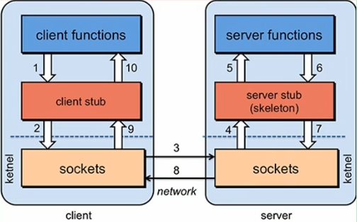
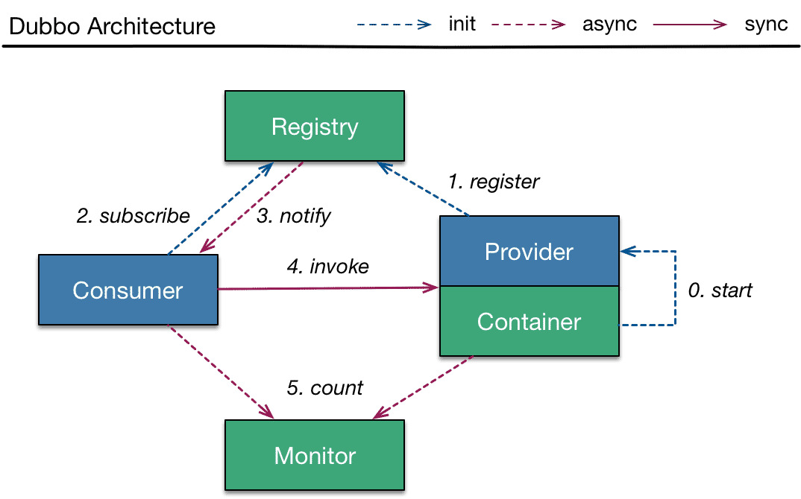
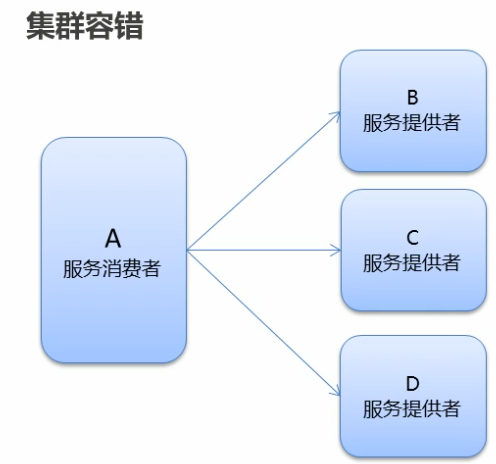

# Dubbo

## 基础

### rpc介绍

- RPC是指远程过程调用,也就是说两台服务器A,B,一个应用部署在A服务器上,想要调用B服务器上应用提供的函数/方法,由于不在一个内存空间,不能直接调用,需要通过网络来表达调用的语义和传达调用的数据。

- 分布式架构的难点：RPC

- 基本原理

  

- 影响RPC框架速度的原因：序列化与反序列化、通信效应

### 分布式系统

- 分布式系统是若干独立计算机的集合，这些计算机对于用户来说就像是单个系统
- 分布式系统（distributed system）是建立在网络之上的软件系统
- 应用架构发展
  - 单一应用：启动慢、可靠性差、可伸缩性差、性能低、可扩展性和可维护性低
  - 垂直应用：单体应用拆分为多个独立的应用；重复功能太多
  - 集群：多个人做一样的工作
  - 分布式服务：多个人做不一样的工作，合起来为一个大的工作；rpc概念
  - 微服务架构：业务需要彻底的组件化和服务化

### dobbo

- 优点

  - 面向接口代理的高性能RPC调用
  - 智能的负载均衡
  - 服务自动注册与发现（注册中心）
  - 高度可扩展能力
  - 运行期流量调度，轻松实现灰度发布
  - 可视化的服务治理与运维工具

- 设计架构

  

  | 节点        | 角色说明                               |
  | ----------- | -------------------------------------- |
  | `Provider`  | 暴露服务的服务提供方                   |
  | `Consumer`  | 调用远程服务的服务消费方               |
  | `Registry`  | 服务注册与发现的注册中心               |
  | `Monitor`   | 统计服务的调用次数和调用时间的监控中心 |
  | `Container` | 服务运行容器                           |

## Hello

### Zookeeper 注册中心

- dubbo支持多种注册中心，官方推荐使用zookeeper
- zookeeper是一个放源码的分布式应用程序协调服务
- 下载zookeeper，解压
- 在conf目录下修改配置文件名：zoo.cfg，配置zookeeper数据存放目录
- `./zookeeper start`：然后运行，默认使用端口2181
- `./zookeeper status`：查看状态
- `./zookeeper stop`：停止运行

### 公共接口

- 创建公共接口模块以及bean

  ```java
  package com.lei.service;
  public interface UserService {
      public String say();
  }
  ```

  

### 服务提供者

1. 创建服务提供者

2. 导入相关依赖：spring核心依赖、dubbo依赖、zookpper客户端依赖、公共接口依赖

   ```xml
   <dependencies>
       <dependency>
           <groupId>org.springframework</groupId>
           <artifactId>spring-context</artifactId>
           <version>5.3.8</version>
       </dependency>
       <dependency>
           <groupId>org.apache.dubbo</groupId>
           <artifactId>dubbo</artifactId>
           <version>2.7.3</version>
       </dependency>
       <dependency>
           <groupId>org.apache.curator</groupId>
           <artifactId>curator-framework</artifactId>
           <version>4.2.0</version>
       </dependency>
       <dependency>
           <groupId>org.apache.curator</groupId>
           <artifactId>curator-recipes</artifactId>
           <version>4.2.0</version>
       </dependency>
       <dependency>
           <groupId>org.example</groupId>
           <artifactId>api</artifactId>
           <version>1.0-SNAPSHOT</version>
       </dependency>
   </dependencies>
   ```

3. 创建服务实现类

   ```java
   package com.lei.service.impl;
   import com.lei.service.UserService;
   public class UserServiceImpl implements UserService {
       @Override
       public String say() {
           return "hello";
       }
   }
   ```

4. 配置spring配置文件：应用信息、注册中心、dubbo协议、需要暴露的服务接口、本地bean

   ```xml
   <?xml version="1.0" encoding="UTF-8"?>
   <beans xmlns="http://www.springframework.org/schema/beans"
          xmlns:xsi="http://www.w3.org/2001/XMLSchema-instance"
          xmlns:dubbo="http://dubbo.apache.org/schema/dubbo"
     xsi:schemaLocation="http://www.springframework.org/schema/beans  http://www.springframework.org/schema/beans/spring-beans-4.3.xsd  http://dubbo.apache.org/schema/dubbo        http://dubbo.apache.org/schema/dubbo/dubbo.xsd">
   
       <!-- 提供方应用信息，用于计算依赖关系 -->
       <dubbo:application name="provider-app"  />
       <!-- 使用zookeeper注册中心暴露服务地址 -->
       <dubbo:registry address="zookeeper://192.168.10.130:2181" />
       <!-- 用dubbo协议在20880端口暴露服务 -->
       <dubbo:protocol name="dubbo" port="20880" />
       <!-- 声明需要暴露的服务接口 -->
       <dubbo:service interface="com.lei.service.UserService" ref="userService" />
       <!-- 和本地bean一样实现服务 -->
       <bean id="userService" class="com.lei.service.impl.UserServiceImpl" />
   </beans>
   ```

5. 加载spring配置

   ```java
   public class Provider {
       public static void main(String[] args) throws Exception {
           ClassPathXmlApplicationContext context = new ClassPathXmlApplicationContext("provider.xml");
           context.start();
           System.in.read(); // 使应用阻塞，按任意键退出
       }
   }
   ```

### 服务消费者

1. 创建服务消费者

2. 导入相关依赖：spring核心依赖、dubbo依赖、zookpper客户端依赖、公共接口依赖

   ```xml
   <dependencies>
       <dependency>
           <groupId>org.springframework</groupId>
           <artifactId>spring-context</artifactId>
           <version>5.3.8</version>
       </dependency>
       <dependency>
           <groupId>org.apache.dubbo</groupId>
           <artifactId>dubbo</artifactId>
           <version>2.7.3</version>
       </dependency>
       <dependency>
           <groupId>org.apache.curator</groupId>
           <artifactId>curator-framework</artifactId>
           <version>4.2.0</version>
       </dependency>
       <dependency>
           <groupId>org.apache.curator</groupId>
           <artifactId>curator-recipes</artifactId>
           <version>4.2.0</version>
       </dependency>
       <dependency>
           <groupId>org.example</groupId>
           <artifactId>api</artifactId>
           <version>1.0-SNAPSHOT</version>
       </dependency>
   </dependencies>
   ```

3. 配置spring配置文件：应用信息、注册中心、生成远程服务代理

   ```xml
   <?xml version="1.0" encoding="UTF-8"?>
   <beans xmlns="http://www.springframework.org/schema/beans"
          xmlns:xsi="http://www.w3.org/2001/XMLSchema-instance"
          xmlns:dubbo="http://dubbo.apache.org/schema/dubbo" xsi:schemaLocation="http://www.springframework.org/schema/beans http://www.springframework.org/schema/beans/spring-beans-4.3.xsd http://dubbo.apache.org/schema/dubbo http://dubbo.apache.org/schema/dubbo/dubbo.xsd">
       <!-- 提供方应用信息，用于计算依赖关系 -->
       <dubbo:application name="consumer-app"  />
       <!-- 使用zookeeper注册中心暴露服务地址 -->
       <dubbo:registry address="zookeeper://192.168.10.130:2181" />
   <!-- 生成远程服务代理，可以和本地bean一样使用demoService -->
       <dubbo:reference id="userService" interface="com.lei.service.UserService" />
   </beans>
   ```

4. 加载spring配置，并调用远程服务

   ```java
   public class Consumer {
       public static void main(String[] args) throws Exception {
           ClassPathXmlApplicationContext context = new ClassPathXmlApplicationContext("consumer.xml");
           context.start();
           UserService userService = (UserService)context.getBean("userService"); // 获取远程服务代理
           String hello = userService.say(); // 执行远程方法
           System.out.println( hello ); // 显示调用结果
       }
   }
   ```

### dubbo-admin安装

> 老版本

1. `docker pull chenchuxin/dubbo-admin`
2. 运行

```bash
docker run -d \
-p 8088:8080 \
-e dubbo.registry.address=zookeeper://192.168.10.130:2181 \
-e dubbo.admin.root.password=root \
-e dubbo.admin.guest.password=guest \
chenchuxin/dubbo-admin
```

> 新版本

1. 下载 dubbo-admin
2. 运行 dubbo-admin-server springboot项目，可通过任意ide运行
3. 进入dubbo-admin-ui， `npm install`：安装，`npm run dev`：运行
4. 访问`localhost:8082`，默认用户名密码：root/root

## dubbo特性

### 序列化

- 两个机器间，对象的传输，序列化与反序列化，通过网络传播
- pojo类需要实现`Serializable`接口

### 地址缓存

- dubbo服务消费者第一次调用从将服务提供方的地址缓存到本地，以后调用时，不会访问注册中心
- 当服务提供者地址发生变化时，注册中心会通知服务消费者
- 问题：当注册中心挂了，服务消费者是否能够访问服务提供者（分情况：已经访问过得可以访问，因为有缓存；未访问过得，不能访问）

### 超时与重试

> 超时

- 服务消费者调用服务提供者时发生阻塞、等待的情形，这个时候，服务消费者会一直等待下去
- 在某个峰值时，大量的请求都在同时请求服务消费者，会造成线程大量堆积，程序崩溃
- 超时：dubbo利用了超时机制来解决这个问题，设置一个超时时间，在这个时间段内，无法完成服务访问，则会自动断开连接
- 超时设置：`timeout="1000"`单位毫秒，配置在服务提供方bean（配置文件或注解中）；也可以配置在服务消费方bean注入时，此时以服务消费方可以覆盖服务提供方

> 重试

- 出现网络抖动时，则本次请求会失败
- 重试：dubbo提供重试机制来解决这个问题；dubbo默认重试两次，加上第一次请求，总共请求三次
- 重试设置：`retries=2`

### 多版本

- 灰度发布：当出现新功能时，会让一部分用户先体验新功能，用户反馈没问题是，再将所有用户迁移到新功能
- dubbo中使用了`version`属性来设置和调用同一个接口的不同版本
- 配置
  - 设置服务提供方的`version`，bean配置文件或注解
  - 服务调用方调用时，设置调用的服务提供方版本`version`，bean配置文件或注解

### 负载均衡

> 策略（4种）

1. Random：按权重随机，默认值。按权重设置随机策略
   - `weight="100"`：设置权重，在申明服务处设置，注解或配置文件
   - 修改服务端口，不同服务端口不一样
   - `loadbalance="random"`：修改远程注入时负载均衡策略，注解或配置文件
2. RoundRobin：按权重轮询（所有服务都会被访问到）
3. LeastActive：最少活跃调用数，相同活跃数随机
4. ConsistentHash：一致性hash，相同参数的请求总会发送到同一个提供者

### 集群容错



> 容错机制

- Failover Cluster：失败重试，默认值，当出现失败时，自动重试其他服务器，默认重试2次，使用retries配置。一般用于读操作
  - `cluster="failover"`：在远程注入时配置
- Failfast Cluster：快速失败，直发起一次调用，失败立即报错，通常用于写操作
- Failsafe Cluster：失败安全，出现异常时，直接忽略。返回一个空结果
- Failback Cluster：失败后自动恢复，后台记录失败请求，定时重发
- Forking Cluster：并行调用多个服务器，只要一个成功即返回
- Broadcast Cluster：广播调用所有提供者，逐个调用，任意一台报错则报错

### 服务降级

`mock=force:return null`：表示消费者对该服务调用直接返回null值，不发起远程调用。用来屏蔽服务不可用时对调用方的影响，在远程注入配置

`mock=fail:return null`：表示消费方对服务调用方法失败时，再返回null值，不抛异常。用来容忍不重要服务不稳定时对调用方的影响

## dubbo集成springboot

### pom.xml

```xml
<dependencies>
    <dependency>
        <groupId>org.springframework.boot</groupId>
        <artifactId>spring-boot-starter-web</artifactId>
    </dependency>
	<!--dubbo springboot起步依赖-->
    <dependency>
        <groupId>org.apache.dubbo</groupId>
        <artifactId>dubbo-spring-boot-starter</artifactId>
        <version>2.7.8</version>
        <exclusions>
            <exclusion>
                <groupId>org.slf4j</groupId>
                <artifactId>slf4j-log4j12</artifactId>
            </exclusion>
        </exclusions>
    </dependency>
    <!--dubbo-->
    <dependency>
        <groupId>org.apache.dubbo</groupId>
        <artifactId>dubbo</artifactId>
        <version>2.7.8</version>
    </dependency>
    <!--zookeeper客户端-->
    <dependency>
        <groupId>org.apache.curator</groupId>
        <artifactId>curator-framework</artifactId>
        <version>4.2.0</version>
    </dependency>
    <dependency>
        <groupId>org.apache.curator</groupId>
        <artifactId>curator-recipes</artifactId>
        <version>4.2.0</version>
    </dependency>

    <dependency>
        <groupId>org.example</groupId>
        <artifactId>api</artifactId>
        <version>1.0-SNAPSHOT</version>
    </dependency>
</dependencies>
```

### springboot配置文件

> 服务提供者

```properties
dubbo.application.name=provider
dubbo.registry.client=curator
dubbo.registry.address=zookeeper://192.168.10.130
dubbo.registry.port=2181
dubbo.protocol.name=dubbo
dubbo.protocol.port=20880
dubbo.scan.base-packages=com.lei.service.impl
```

> 服务消费者

```properties
dubbo.application.name=consumer
dubbo.registry.client=curator
dubbo.registry.address=zookeeper://192.168.10.130
dubbo.registry.port=2181
dubbo.scan.base-packages=com.lei.controller
```

### 相关注解

`@DubboService`：暴露服务

`@DubboReference`：远程注入bean
