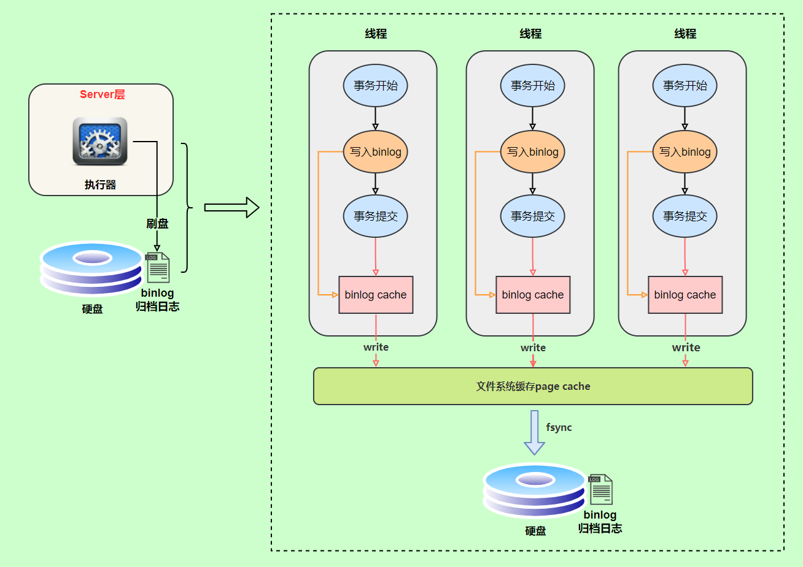

# MySQL

## 初见

1. 序列化反序列化也可以开发项目，不过太不方便了
2. 常见的数据库管理系统
   1. Oracle：甲骨文公司；用于传统企业，银行等
   2. MySql：甲骨文公司收购（MySql AB公司）
   3. DB2
   4. Sybase
   5. MS SqlServer（支持标准sql的数据库管理系统）
3. MySql安装；MySql卸载必须使用安装软件卸载，否则下次安装不上（卸载不干净），手动删除Program File下的Mysql以及ProgramData下的MySql
4. 每一个软件都有特定的端口号，不能重复；端口是软件的代号；MySql服务的默认端口3306
5. 登录MySql：mysql -u用户名 -p密码
6. **sql**,**DB**,**DBMS**
   **DB**：DataBase，数据库，在硬盘上以文件方式存在
   **DBMS**：DataBase Management System，数据库管理系统（Mysql）
   **SQL**：结构化查询语言，是一门标准通用的语言，是一种高级语言（sql语句编译有DBMS完成）
   **DBMS**执行**SQL**语句来操作**DB**中的数据
7. 表(table)：
   1. table是数据库基本组成单元，所有数据都是由表格形式组织，目的可读性强
   2. 每个表有行，列；行被称为数据/记录（data），列被称为字段（column）
   3. 每个字段（列）应该有：字段名、数据类型、相关约束
8. SQL语句分类
   1. **DQL**（数据查询语言）：select 查询语句
   2. **DML**（数据操作语言）：insert delete update，对表中数据进行增删改
   3. **DDL**（数据定义语言）：create drop alter，对表结构的增删改
   4. **TCL**（事务控制语言）：commit提交事务，rollback回滚事务（T是Transaction）
   5. **DCL**（数据控制语言）：grant授权，revoke撤销权限
9. 导入数据（sql文件）
   1. 登录Mysql
   2. 查看有哪些数据库：show databases;（MySql命令）
   3. 创建自己的数据库：create database mydata;（MySql命令）
   4. 使用mydata数据库：use mydata;
   5. 查看当前使用数据库有哪些表格：show tables;（MySql命令）
   6. 导入sql：source 文件路径;
10. .sql文件，以sql结尾，这样的文件被称为"sql脚本"，该文件中编写了大量的sql语句；想批量执行sql语句使用sql脚本
11. 表结构

## 常见命令使用

1. 数据库
   1. show databases：查看数据库列表；
   2. create mydata：创建数据库
   3. use 数据库：使用数据库
   4. select database()：查询当前使用数据库
   5. show version()：查看数据库版本
   6. drop database mydata：删除数据库
2. 表
   1. show tables：查看表列表
   2. desc 表名：查看表结构
   3. show create table emp：查看emp表创建语句
3. 其他
   1. \c：结束mysql语句
   2. quit()：退出数据库

## 查询（DQL）

### select

1. 所有sql语句以**‘；’**结尾；sql不区分大小写；sql语句要求字符串使用单引号
2. 语法格式
   select 字段名1，字段名2，... from 表名;
3. 字段可以参与数据运算

```sql
select ename,sql*12 as 年薪 from emp;//查询用户，年薪显示为年薪；可以省略as关键字
select * from emp;//查询所有字段，不建议，效率低
```

### 条件查询(where)

1. select 字段 from 表名 where 条件
2. 执行顺序：from-->where-->select
3. <>：不等于（大于小于不等于）
4. between ... and ...：闭区间，相当于>= and <=；可以用在字符方面（左闭右开）
5. is null、is not null：在数据库中null不是值，代表什么都没有（空），不能使用等号衡量
6. and：和，并且；优先级高于or
7. or：或者
8. in、not in：等同于or，in代表在其中的数据
9. like：模糊查询；**%**代表任意多个字符；**_**代表任意一个字符；可以使用**‘\’**转义字符

```sql
select sal from emp where ename='SMTTH'//查询名字叫SMTTH的员工的工资；字符串用单引号括起来（字段名修饰为varchar）
select ename from emp where sal<>3000;//工资不等于3000的员工
select ename from emp where sql between 1000 and 3000;//闭区间，工资在1000-3000的员工
select ename from emp where comm is null or comm=0;//没有补助的员工
select ename from emp where sal>1000 and (deptno=20 or deptno=30);//查询工资大于1000并且部门编号是20或者30的员工；and优先级比or高，所以使用括号
select ename from emp where sal in (1000,5000);//工资等于1000和5000的员工，注意不是包括
select ename from emp where ename like '_A%';//名字中第二个字母是A的员工；可以使用转义查询：\_普通字符_
```

### 排序(order by)

1. select 字段 from 表 order by 字段
2. 默认为升序，asc
3. 降序：desc
4. 多个排序规则，用**','**隔开，越靠前的字段，占主导地位；只有当前面字段无法排序时，才会启动后面字段
5. select ... from ... where ... order by...：执行顺序from-->where-->select-->order by；order by是最后执行的

```sql
select ename,sal from emp order by sal desc,ename asc;//按照工资降序排列,工资相同再按照名字排序
```

### 分组函数

1. 分组函数有：count：计数、sum：求和、max：最大值、min：最小值、avg：平均值
2. 分组函数只有上面5个；又叫做多行处理，输入多行，输出一行，分组函数自动忽略NULL；
3. 分组函数不可以直接出现在where子句中，原因：group by语句一定在where执行后执行
4. count(*)一定是总记录条数；count(字段)统计字段中不为null的元素

```sql
select count(ename) from emp;//找出总人数，多行处理函数
select avg(sal) from emp;//查出平均工资多行处理函数
select ename,ifnull(comm,0) from emp;//ifnull()空处理函数，如果是空，值为后面的
select ename,sal from emp where sal>avg(sal);//语法错误，分组函数不能出现在where子句中
select count(*),sum(sal),avg(sal),max(sal),min(sal) from emp;//分组函数组合起来使用
```

### 分组查询(group by,having)

1. group：按照某个字段或者某些字段进行分组
2. having：是对分组之后的数据进行再次过滤，一定出现在group by中
3. 分组函数一定在group by执行结束后执行，当一条sql语句没有group by，那么整张表自成一组；而group by语句一定在where执行后执行
4. 当一个sql语句中出现group by时，select后只能跟参与分组的字段和分组函数；其他字段没意义
5. group by多个字段联合起来分组，将多个字段看成一个字段
6. 能够使用where过滤的，尽量不用having，效率低

```sql
select max(sal) from emp group by job;//找出每个岗位的最高工资
select ename,sal from emp where sal>(select avg(sal) from emp);//找出薪资高于平均工资的人（1.找出平均工资，2.找出高于平均工资，子查询）
select max(sal),job from emp group by job;//查询每个岗位的最高工资
select max(sal),job from emp group by deptno,job;//查询每个部门不同岗位的最高薪资，分组联合
select avg(sal),deptno from emp group by deptno having avg(sal)>2000;//查询每个部门平均薪资大于2000的
select distinct job from emp;//查询工作岗位，去除重复
select distinct deptno,job from emp;//distinct后面所有字段去重
select count(distinct job) from emp;//统计岗位数量，先去重岗位，然后计数
```

### 连接查询

1. 实际开发中，大部分数据都不是从单表查询，而是多个表联合查询；一般一个业务都会对应多张表，为了解决数据冗余

2. 连接查询分类，
   根据年代划分：

   1. SQL92（很少用，只有一些老的DBA(数据库管理员)可能还在用）
   2. SQL99（比较新的语法）

   根据表的连接方式划分

   1. 内连接：等值连接，最大特点条件是等量关系；非等值连接，连接条件关系非等值；自连接，一张表看作两张表，自己连接自己
   2. 外连接：左外连接（左连接），左边表是主表；右外连接（右连接），右边表是主表
   3. 全连接（很少用）

3. 内连接：A,B两张表使用内连接，凡是A,B表能够匹配上的记录都查询出来，这就是内连接；A,B表没有主副之分

4. 外连接：A,B表使用外连接，A,B表有一张是主表，一张是附表；主要查询主表，捎带查询附表；附表数据没有和主表数据匹配上，附表会自动模拟出NULL与之匹配

5. 笛卡尔积现象：当两张表联合查询，没有任何限制时会出现该现象

6. 表的别名：执行效率高；可读性好

7. 避免笛卡尔积现象：不会减少记录匹配次数，通过加过滤条件

8. 内连接语法：**select** xx,xx **from** xx **inner join** xx **on** 连接条件 **where** 查询条件;inner可以省略

9. 外连接语法：**select** xx,xx **from** xx **left/right outer join** xx **on** 连接条件 **where** 查询条件;outer可以省略；因为外连接只有右left就必定是外连接了，不需要outer区分；外连接使用较多

10. ... A join B on ... join C on ...：A表和B表连接，然后A表和C表连接

```sql
select ename,dname from emp,dept;//查询结果条数为两张表结果条数的乘积，称为笛卡尔积现象，没有条件限制

select e.ename,d.dname from emp e,dept d;//给表取别名，ename只会从emp表查询

select e.ename,d.dname from emp e,dept d where e.deptno=d.deptno;//SQL92语法，避免笛卡尔积现象，记录匹配次数不会减少

select e.ename,d.dname from emp e join dept d on e.deptno=d.deptno where ...;//SQL99，内连接，常用的语法，结构更清晰，连接查询条件分离出来了,内连接等值连接，inner可以省略

select e.name,e.sal,s.grade from emp e join salgrade s on e.sal between s.losal and s.hisal;//内连接非等值查询

select a.ename b.ename from emp a join emp b on a.mgr=b.empno;//联合查询，内连接中自连接，重点理解

select a.ename b.ename from emp a left join empb on a.mgr=.b.empno;//外连接左连接，查询每个员工对应的上级领导

select d.* from emp e right join dept d on e.deptno=d.deptno where e.empno is null;//查询哪个部门没有员工，外连接右连接

select e.ename,d.dname,s.grade from emp e join dept d on e.deptno=d.deptno join salgrade s on e.sal between s.losal and s.hisal;//三张表进行查询，A和B连接，然后A和C连接 

select e.name '员工',d.dname,s.grade,e1.ename '领导' from emp e join dept d on e.deptno=d.deptno join salgrade s on e.sal between s.losal and s.hisal left join emp e1 on e.mgr=e1.empno;//查询每一个员工部门名称，工资等级，以及上级领导
```

### 子查询

1. 子查询：select语句中嵌套select语句，被嵌套的select语句就是子查询；嵌套select可以出现在select，from，where后

```sql
select ename,sal from emp where sal>(select avg(sal) from emp);//查询工资高于平均工资的员工，where后子查询

select t.*,s.grade from (select deptno,avg(sal) as avgsal from emp group by deptno) t join salgrade s on t.avgsal between s.losal and s.hisal;//找出每个部门平均薪水的等级，from后子查询；注意每个派生表必须取别名

select avg(grade),deptno from (select s.grade,e.ename,e.deptno from emp e join salgrade s on e.sal between s.losal and s.hisal) t  group by deptno;//这个没必要子查询，参考下面sql语句
select avg(s.grade),e.deptno from emp e join salgrade s on e.sal between s.losal and s.hisal group by deptno;//找出每个部门平均的薪水等级；

select e.ename,e.deptno,(select d.dname from dept d where e.deptno=d.deptno) as dname  from emp e;//找出每个员工所在部门的名字，显示员工名和部门名
```

### union/unionall

1. union/unionall可以将查询结果相加
2. 前后列数必须相同

```sql
select ename,job from emp where jon='MANAGER' union select ename,job from emp where jon='CLERK';//
```

### limit

1. limit是mysql特有的，其他数据库没有
2. limit取结果集中的部分数据
3. 语法：limit startIndex,length；startIndex表示数据起始位置，length表示取几个
4. limit是sql语句最后执行的环节

```sql
select ename,sal from emp order by sal limit 3,3;//查询薪资顺序的第4条记录到第6条记录
第一页：0，3
第二页：3，3
第三页：6，3
从上推导出：每页显示pagesize条记录
那么pageNo页：(pageNo-1)*pagesize,pagesize
```

### 其他

1. 不确定优先级时，使用括号
2. 只要表达式中，只要有NULL参与运算，结果必定是NULL，如800+NULL，结果为NULL
3. ifnull()空处理函数，如果是空，值为后面的；属于单行处理函数
4. distinct：去除重复记录；distinct关键字只能出现在所有关键字最前面，后面所有字段联合起来去除重复
5. DQL语句执行顺序
   select ... from ... where ... group by ... having .... order by ... 
   执行顺序：from-->where-->group by-->having-->select-->order by-->limit (pageNo-1)*pagesize,pagesize;
   先哪个表查，where筛选数据，group by进行分组，然后having对分组的数据再过滤，select查询出结果，然后对查询出的数据进行oder by排序，最后进行limit语句；

## 数据定义语言(DDL)

### 创建表(create)

1. 表名建议使用t_或者tbl\_开头

2. mysql常见数据类型

   1. int：整数型
   2. bigint：长整型（java中lang）
   3. float：浮点型（float/double）
   4. char：定长字符串（String）；存储'jack'时，定长分配6个字符空间；适合于实际开发数据长度定长的数据，如：性别，生日等
   5. varchar：可变长字符串（StringBuffer/StringBuilder）；存储'jack'时，会动态的分配4个字符的空间
   6. date：日期类型（java中java.sql.Date类型）
   7. BLOB：二进制大对象（存储图片，视频等流媒体信息，Binary Large Object）；使用java中的IO流插入
   8. CLOB：字符大对象（存储较大文本，可以存储4G的字符串 Character Large Object）；使用java中的IO流插入
   9. ........

3. default指定字段默认值，不指定默认值为NULL

4. 建表语句的语法格式

   ```sql
   create table 表名 (
   	字段名1 数据类型 default 默认值，字段名2 数据类型 ...
   );
   create table t_student(
   	no bigint,
       name varchar(255),
       sex char(1) default 1,
       classno varchar(255),
       birth char(10)
   )
   ```

### 表结构修改(alter)

### 删除表(drop)

1. drop table if exists t_student：如果t_student这个表存在的话删除

### 约束(Constraint)

1. 创建表时添加约束，保证表中数据的合法性，有效性，完成约束

2. 约束有哪些
   1. 非空约束(not null)：约束字段不能为NULL
   2. 唯一约束(unique)：约束字段不能重复，可以为NULL(不是值)
   3. 主键约束(primary key)：约束字段既不能为NULL,也不能重复（简称PK）；一张表只能有一个主键
   4. 外键约束(foreign key)：简称（FK）
   5. 检查约束(cheack)：注意mysql没有该约束，oracle有
   
3. 主键作用：

   1. 第一范式：每个表必须有主键；主键是每行记录的唯一标识值（类似身份证号）

4. 主键分类
   根据主键的字段数量来划分

   1. 单一主键（推荐使用）
   2. 复合主键（多个字段联合起来添加主键约束，不建议使用，违背第三范式）

   根据逐渐性质划分

   1. 自然主键（主键最好是一个和业务没有关联的自然数，推荐使用）
   2. 业务主键 （主键值与系统业务挂钩，如：身份证号做主键）

5. 外键约束
   外键约束：foreign key
   外键字段：添加有外键约束的字段
   外键值：外键字段中每一个值

6. 1. 外键约束要求：删除数据先子表再父表；添加数据先父表再子表；建表先父表再子表；删表先子表再父表
   2. 外键可以为NULL
   3. 外键字段引用其他表某个字段值，被引用的字段不一定为主键，但是必须唯一性约束 union

```sql
create table t_user (
	id int,
    username varchar(255) not null,
    password varchar(255)
);//非空约束，插入不给值时报错1364

create table t_user (
	id int,
    username varchar(255) unique,//列级约束
    password varchar(255),
    unique(username,password) //表级约束
);//唯一约束，插入重复值时报错1062；unique(username,password)表示这两个列合起来具有唯一性，多个字段联合添加约束

create table t_user (
	id int primary key auto_increment,//列级约束,自动递增，从1开始
    username varchar(255),
    password varchar(255)
);
create table t_user (
	id int,
    username varchar(255),
    password varchar(255),
    primary key(id) //表级约束
);//主键约束，1062不能重复重复错误，1364不能为空错误；主键约束primary，主键字段id，主键值1

create table t_class (
	cno int,
	cname varchar(255),
    primary key(cno)
);
create table t_student (
	sno int,
    sname varchar(255),
    classno int,
    primary key(sno),
    foreign key(classno) 
        references t_class(no)
);//t_student中的classno字段引用t_class中的cno字段，此时t_student表叫做子表，t_class表叫做父表；报错1452，子表外键字段添加数据父表不存在
```


### 表的复制

1. create table 表名 as select 语句：将查询结果当作表创建出来
2. insert into 表名 select 语句：将查询结果插入到一个表中

## 数据操作语言(DML)

术语CRUD：Create(增)、Retrieve(检索)、Update(修改)、Delete(删除)

### 插入数据(insert)

1. 要求：字段数量与值数量相同，且数据类型要对应
2. 字段顺序可以修改，只要对应就行
3. 可以一次插入多个值，只需要在value后用逗号隔开
4. 插入数据语法格式

```sql
insert into 表名 (字段名1，字段名2,...) values (值1,值2,...),(值1,值2,...);//字段数量与值的数量相同

insert into t_student
(no,name,sex,classno,birth) value
(102,'tom',1,1,'1998-08-27'),(103,'mary',1,2,'2000-01-30');
```

### 修改数据(update)

1. 注意：如果没有条件代表全部更新
2. 修改数据语法格式

```sql
update 表名 set 字段名1=值1，字段名2=值2，... where 条件;

update t_student set classno=5 where name='mary';
```

### 删除数据(delete)

1. 注意：如果没有条件代表全部删除
2. 表如果特别大，删除会很消耗时间，没有释放数据真实空间；删除大表中所有数据：truncate
3. 语法格式

```sql
delete from 表名 where 条件;
delete from 表名;//删除所有数据
truncate table 表名;//表被截断，不可回滚，永久丢失；删除大表中所有数据

delete from t_student where name='lei';
```

### 存储过程

SQL语句需要先编译然后执行，而存储过程（Stored Procedure）是一组为了完成特定功能的SQL语句集，经编译后存储在数据库中，用户通过指定存储过程的名字并给定参数（如果该存储过程带有参数）来调用执行它。

```
分隔符
```

MySQL默认以";"为分隔符，如果没有声明分割符，则编译器会把存储过程当成SQL语句进行处理，因此编译过程会报错，所以要事先用“DELIMITER //”声明当前段分隔符，让编译器把两个"//"之间的内容当做存储过程的代码，不会执行这些代码；“DELIMITER ;”的意为把分隔符还原。

**参数**

存储过程根据需要可能会有输入、输出、输入输出参数，如果有多个参数用","分割开。MySQL存储过程的参数用在存储过程的定义，共有三种参数类型,IN,OUT,INOUT:

**IN**：参数的值必须在调用存储过程时指定，在存储过程中修改该参数的值不能被返回，为默认值

**OUT**：该值可在存储过程内部被改变，并可返回

**INOUT**：调用时指定，并且可被改变和返回

**MySQL存储过程的调用**：用call和你过程名以及一个括号，括号里面根据需要，加入参数，参数包括输入参数、输出参数、输入输出参数。

**MySQL存储过程的删除** ： `DROP PROCEDURE [过程1[,过程2…]]`

用call和你过程名以及一个括号，括号里面根据需要，加入参数，参数包括输入参数、输出参数、输入输出参数。

- delimiter $$：将语句的结束符号从分号;临时改为两个$$(可以是自定义)，开启存储过程
- create procedure 存储过程名(参数)：创建存储过程
- begin...end $$：存储过程开始和结束符号
- set @var=1：传递变量
- delimiter：将语句的结束符号恢复为分号

```sql
DELIMITER //
  CREATE PROCEDURE myproc(OUT s int)
    BEGIN
      SELECT COUNT(*) INTO s FROM students;
    END
    //
DELIMITER ;
```


## 存储引擎

1. 存储引擎：表的存储方式

2. mysql支持很多存储引擎，每个不同的存储方式，各有优缺点

3. show engines \G；查看当前数据版本支持的存储引擎

   1. MyISAM引擎：用格式文件（xxx.frm，表结构）、数据文件（xxx.MVD，表数据）、索引文件(xxx.MVI，表索引)三个文件表示一张表；可被压缩，节省存储空间，可转化为只读表提升效率，不支持事务
   2. InnoDB引擎：mysql缺省存储引擎；表结构存储在xxx.frm文件，表数据存储在tablespace表空间(逻辑概念)中；支持事务，行级锁，外键等，数据安全，支持级联删除和级联更新（外键），提供崩溃后自动恢复数据
   3. MEMORY引擎：不支持事务，数据容易丢失，因为所有数据和索引都存储在内存中；查询速度最快

4. 完整建表语句

   ```sql
   CREATE TABLE `emp` (
     `EMPNO` int(4) NOT NULL,
     `ENAME` varchar(10) DEFAULT NULL,
     `JOB` varchar(9) DEFAULT NULL,
     `MGR` int(4) DEFAULT NULL,
     `HIREDATE` date DEFAULT NULL,
     `SAL` double(7,2) DEFAULT NULL,
     `COMM` double(7,2) DEFAULT NULL,
     `DEPTNO` int(2) DEFAULT NULL,
     PRIMARY KEY (`EMPNO`)
   ) ENGINE=InnoDB DEFAULT CHARSET=latin1;
   //默认存储引擎InnoDB，默认编码latin1
   ```

## 事务控制语言(TCL)

Transaction

### 简介

1. 一个事务是一个完整的业务逻辑，不可再分；
   如：A账户向B账户转钱，A减钱，B加钱，必须同时成功才算成功，不允许一条成功一条失败（事务机制实现）
2. 和事务相关的只有DML(insert,delete,update)语句，它们操作数据，事务保证数据的安全性，完整性
3. 一件事(事务[业务])需要多条DML语句才能完成，事务机制
4. 假设一件事，先执行insert，再执行update，最后执行delete，那么有：
   1. 开启事务机制（开始）
   2. 执行insert语句，执行成功后记录到缓存，并不会真实写入文件
      执行update语句，执行成功后记录到缓存，并不会真实写入文件
      执行delete语句，执行成功后记录到缓存，并不会真实写入文件
   3. 提交事务或者回滚事务（结束）
      提交事务（commit）：一次性修改硬盘上数据，且清空缓存（操作历史）
      回滚事务（rollback）：并不修改硬盘文件，但会清空缓存（操作历史）

### 事务特性(ACID)

1. A：原子性，事务是最小的工作单元，不可再分
2. C：一致性，事务必须保证多条DML语句同时成功或同时失败
3. I：隔离性，事务A与事务B之间具有隔离
4. D：持久性，最终数据必须持久化到硬盘上，事务才算是成功

### 事务隔离性

1. 事务隔离性存在隔离级别，理论上隔离级别包括四个
   1. 第一级别：读未提交（read uncommitted）；对方事务还未提交，我们当前事务可以读取到对方未提交数据；问题：读未提交存在脏读（Dirty Read）现象
   2. 第二级别：读已提交（read committed）；对方事务提交之后的数据可以读取到；解决了脏读现象；问题：不可重复读取（数据更新了）
   3. 第三级别：可重复读（repeatable read）；解决了不可重复读问题；问题：读取到的数据是幻象
   4. 第四级别：序列化读/串行化读（serializable）；解决了所有问题；问题：效率低，事务排队
2. mysql事务默认级别为第二级别；
3. mysql事务默认情况下是自动提交，关闭自动提交：start transaction；只要执行一条DML，数据自动写入硬盘
4. 事务隔离级别演示

```mysql
设置事务的全局隔离级别： set global transaction isolation level read uncommitted
查看事务的全局隔离级别：mysql>select @@global.tx_isolation;

1.演示 read uncommitted
mysql> start transaction; //事务1
mysql> start transaction; //事务2
mysql> insert into t_user (name) values ('tang'); //事务2
mysql> select * from t_user; //事务1读取到了未提交的数据
    +----+------+
    | id | name |
    +----+------+
    |  3 | zs   |
    |  4 | lisi |
    |  5 | tang |
    +----+------+

2.演示 read committed
mysql> start transaction; //事务1
mysql> start transaction; //事务2
mysql> insert into t_user (name) values ('tang'); //事务2
mysql> select * from t_user; //事务1读取不到未提交的数据
    +----+------+
    | id | name |
    +----+------+
    |  3 | zs   |
    |  4 | lisi |
    +----+------+
mysql> commit; //事务2提交
mysql> select * from t_user; //事务1读取到了事务2提交的数据
    +----+------+
    | id | name |
    +----+------+
    |  3 | zs   |
    |  4 | lisi |
    |  7 | tang |
    +----+------+
    3 rows in set (0.00 sec)
    
3.演示 repeatable read
mysql> start transaction; //事务1
mysql> start transaction;//事务2
mysql> insert into t_user (name) values ('lei');//事务1
mysql> commit;//事务1提交
mysql> select * from t_user;//事务2，读取不到事务1提交的数据
    +----+------+
    | id | name |
    +----+------+
    |  3 | zs   |
    |  4 | lisi |
    |  7 | tang |
    +----+------+
    3 rows in set (0.00 sec)

4.演示 serializable
mysql> start transaction;//事务1
mysql> start transaction;//事务2
mysql> insert into t_user (name) values ('hehe');//事务1
mysql> select * from t_user;//事务2读取不到数据，等待事务1提交
  。。。
mysql> commit;//事务1提交
mysql> select * from t_user;//事务2读取到了数据，在事务1提交后
    +----+------+
    | id | name |
    +----+------+
    |  3 | zs   |
    |  9 | hehe |
    +----+------+
    2 rows in set (4.27 sec)
```

## 索引

### 简介

1. 索引：相当于一本书的目录，通过目录可以快速找到对应资源；数据库中查询一张表的时候有两种检索方式：第一种，全表扫描；第二种，根据索引检索（效率高）

2. 索引不能随意添加，因为索引也是数据库中的对象，也需要数据库不断地维护；经常变化的数据不适合添加索引，因为数据一旦改变，索引需要重新排序进行维护

3. 添加索引是给某些字段添加

4. 什么时候考虑添加索引

   1. 数据量庞大
   2. 该字段很少的DML操作（索引需要维护）
   3. 该字段经常出现在where子句中

5. 注意：主键和具有unique约束的字段自动添加索引；根据主键查询效率很高

6. explain sql语句：查看sql语句执行计划

   ```mysql
   mysql> explain select * from emp where sal > 4000;
   ```

### 添加删除索引

1. 添加索引：create index 索引名 on 表名(字段)

   ```mysq
   create index emp_sal_index on emp(sal);//给emp表的sal字段添加emp_sal_index索引
   mysql> explain select * from emp where sal > 4000;//通过该命令查看sql语句执行计划的改变
   ```

2. 删除索引：drop index 索引名 on 表名

   ```mysq
   mysql> drop index emp_sal_index on emp;//删除索引
   ```

### 索引原理

1. 底层是一个树
2. 索引字段会自动排序，创建索引后，会在硬盘生成索引文件
3. 数据在硬盘上有物理地址，当查询有索引字段时，会自动将查询语句的条件变成物理地址从而查询
4. 通过B tree缩小扫描范围，底层索引进行了排序、分区；索引会携带数据在表中的“物理地址”，最终通过索引检索到数据之后，获取到关联物理地址，通过物理地址定位到表中的数据，效率是最高的

### 索引分类

1. 单一索引：给单个字段添加索引
2. 复合索引：给多个字段联合起来添加一个索引
3. 主键索引：主键上会自动添加索引
4. 唯一索引：有unique约束的字段会自动添加索引
5. 注意：模糊查询时，第一个通配符是%，这个时候索引是失效的

#### 联合索引

index_key(a,b,c)，联合索引，此时where字句必须包含`最左 a 字段`，才会走索引

```sql
#走索引情况
select  * from test where a = '333' and b = '333' and c = '333';
select  * from test where a = '333' and c = '333';

#不走索引情况
select  * from test where  b = '333' and c = '333';
```

#### 覆盖索引

覆盖索引其实是一种特殊的联合索引，怎么理解呢，即是你查询的字段的所有数据都在索引上，不需要再进行一次回表查询，这样的索引即为覆盖索引。查询的所有字段可直接从索引获得，称为覆盖索引

```sql
SELECT a,b,c from test where a = '333';
```

### 视图

1. 什么是视图：站在不同的角度去看数据（同一张表的数据，从不同的角度去看待）
2. 怎么创建视图：create view myview as select empno,ename from emp;
3. 怎么删除视图：drop view myview
4. 只有DQL语句能创建视图，但是可以对视图进行CRUD操作
5. 对视图进行增删改查会影响原表数据；通过视图影响原表数据
6. 视图作用：试图可以隐藏表的实现细节；保密级别较高的系统，数据库对外只提供相关视图，不展示原数据

### DBA命令

1. 将数据库当中数据导出(CMD界面)

   ```mysq
   mysqldump mydata>D:\mydata.sql -uroot -p123456 //导出mydata数据库
   mysqldump mydata emp>D:\mydata.sql -uroot -p123456 //导出mydata数据库emp表
   ```

   

2. 导入数据

   ```mysq
   create database mydata;
   use mydata;
   source D:\mydata.sql;//导入
   ```

## 范式

### 简介

1. 什么是范式：设计表的依据，按照这个依据创建的表没有数据冗余
2. 提醒：实际开发中以客户需求为主，有时候会拿冗余换执行速度

### 范式分类

1. 第一范式：任何一张表都应该有主键，并且每一个字段原子性不可再分
2. 第二范式：基于第一范式基础，所有非主键字段完全依赖主键，不能产生部分依赖
   多对多三张表，学生、讲师、关系三张表，两外键
3. 第三范式：基于第二范式，所有非主键字段直接依赖主键，不能产生传递依赖
   一对多，两张表，多的表加外键
4. 一对一表设计：主键共享、唯一外键

## 锁

### 悲观锁(行级锁)

1. 事务必须进行排队执行，数据锁住了，不允许并发
2. select ename,job from emp where job='MANAGER' for update;
   for update加行级锁，在当前事务没有完成时，别的事务不能对工作岗位为MANAGER的记录进行修改

### 乐观锁

1. 支持并发，事务无需排队，只不过需要一个版本号
2. 事务读取，会有一个版本号，如果提交修改数据时，版本号和读时的版本号一致则提交，不一致则回滚

## Mysql 日志

### 简介

Mysql 日志主要包括：错误日志、查询日志、慢查询日志、事务日志、二进制日志几大类

其中`二进制日志/归档日志（binlog）`、`事务日志/重做日志（redo log）`、回滚日志（undo log）

### 重做日志（redo log）

redo log 是 InnoDB 存储引擎独有的，它让Mysql拥有了崩溃恢复能力

> Mysql 中数据以页为单位，查询记录时会先从硬盘加载一页数据（数据页），然后放入`Buffer Pool`中；后续查询先从`Buffer Pool`中查询，如果没有命中则再次从硬盘加载数据页，减少磁盘的IO，提升性能；更新表数据，如果发现`Buffer Pool`中存在更新数据，就直接在`Buffer Pool`中更新，然后会在`重做日志缓存（redo log buffer）`里记录：`在某个数据页上做了什么修改`，接着刷盘到`redo log`文件里
>
> 每条 redo 记录由“表空间号+数据页号+偏移量+修改数据长度+具体修改的数据”组成

#### 刷盘时机

`InnoDB` 存储引擎为 `redo log` 的刷盘策略提供了 `innodb_flush_log_at_trx_commit` 参数，它支持三种策略：

- **0** ：设置为 0 的时候，表示每次事务提交时不进行刷盘操作
- **1** ：设置为 1 的时候，表示每次事务提交时都将进行刷盘操作（默认值）
- **2** ：设置为 2 的时候，表示每次事务提交时都只把 redo log buffer 内容写入 page cache

`innodb_flush_log_at_trx_commit`参数默认值为`1`，表示每次事务提交时都会调用`fsync`对`redo log`进行刷盘

`InnoDB`存储引擎存在一个后台线程，每隔`1`秒，就会把`redo log buffer`中内容写到`文件系统缓存（page cache）`，然后调用`fsync`刷盘

除了后台线`1`秒轮询操作，当`redo log buffer`占用空间即将到达`innodb_log_buffer_size`一半的时候，后台线程会主动刷盘

因此：一个没有提交事务的 `redo log` 记录，也可能会刷盘，因为在事务执行过程 `redo log` 记录是会写入`redo log buffer` 中，这些 `redo log` 记录会被后台线程刷盘

#### 日志文件组

硬盘上的`redo log`日志文件不止一个，而是以一个`日志文件组`的形式存在，每个`redo`日志文件大小都是一样的

例：配置一个文件组4个文件，一个文件`1GB`，那么这个文件组就可以记录`4G`的内容

它采用的是环形数组形式，从头开始写，写到末尾又回到头循环写


- **write pos** 是当前记录的位置，一边写一边后移
- **checkpoint** 是当前要擦除的位置，也是往后推移

每次刷盘 `redo log` 记录到**日志文件组**中，`write pos` 位置就会后移更新
每次 `MySQL` 加载**日志文件组**恢复数据时，会清空加载过的 `redo log` 记录，并把 `checkpoint` 后移更新
`write pos` 和 `checkpoint` 之间的还空着的部分可以用来写入新的 `redo log` 记录
如果 `write pos` 追上 `checkpoint` ，表示**日志文件组**满了，这时候不能再写入新的 `redo log` 记录，`MySQL` 得停下来，清空一些记录，把 `checkpoint` 推进一下

#### redo log 小结

> 为什么不把修改的数据页直接刷盘，而是采用`redo log`进行记录？
>
> 同样因为性能原因，因此每次修改可能只改了数据页很少一部分，所以没有必要将数据页进行刷盘；而且数据页刷盘是随机写，因为一个数据页对应的位置可能在硬盘文件的随机位置，所以性能是很差；如果是写 `redo log`，一行记录可能就占几十 `Byte`，只包含表空间号、数据页号、磁盘文件偏移 量、更新值，再加上是顺序写，所以刷盘速度很快；所以用 `redo log` 形式记录修改内容，性能会远远超过刷数据页的方式，这也让数据库的并发能力更强

### 归档日志（binlog）

`redo log`是物理日志，记录的内容是`哪个数据页上做了哪些修改`，属于`InnoDB`存储引擎、

`binlog`是逻辑日志，记录了语句的原始逻辑，属于`MySQL Server` 层；和存储引擎无关，只要发生表数据更新，就会产生`binlog`日志；`binlog`会记录所有涉及更新数据的逻辑操作，并且是顺序写

mysql数据库的数据备份、主从、主主都离不开`binlog`日志，需要`binlog`来同步数据，保证数据的一致性

#### 记录格式

`binlog` 日志有三种格式，可以通过`binlog_format`参数指定

- **statement**

  指定`statement`，记录的内容是`SQL`语句原文；sql语句包含时间函数会造成数据不一致的情况，则需要 `row格式`

- **row**

  记录的内容不再是简单的`SQL`语句了，还包含操作的具体数据；row格式对于时间函数等会记录为确切的数据；但是这种格式，需要更大的容量来记录，比较占用空间，恢复与同步时会更消耗`IO`资源，影响执行速度

- **mixed**

  相当于`statement`和`row`的折中方案，`MySQL`会判断这条`SQL`语句是否可能引起数据不一致，如果是，就用`row`格式，否则就用`statement`格式

#### 写入机制

`binlog`的写入时机也非常简单，事务执行过程中，先把日志写到`binlog cache`，事务提交的时候，再把`binlog cache`写到`binlog`文件中

因为一个事务的`binlog`不能被拆开，无论这个事务多大，也要确保一次性写入，所以系统会给每个线程分配一个块内存作为`binlog cache`

我们可以通过`binlog_cache_size`参数控制单个线程 binlog cache 大小，如果存储内容超过了这个参数，就要暂存到磁盘（`Swap`）

`binlog`日志刷盘流程如下：



- **上图的 write，是指把日志写入到文件系统的 page cache，并没有把数据持久化到磁盘，所以速度比较快**
- **上图的 fsync，才是将数据持久化到磁盘的操作**

> `rite`和`fsync`的时机，可以由参数`sync_binlog`控制，默认是`0`。
>
> 为`0`的时候，表示每次提交事务都只`write`，由系统自行判断什么时候执行`fsync`。
>
> 虽然性能得到提升，但是机器宕机，`page cache`里面的 binglog 会丢失。
>
> 为了安全起见，可以设置为`1`，表示每次提交事务都会执行`fsync`，就如同**binlog 日志刷盘流程**一样。
>
> 最后还有一种折中方式，可以设置为`N(N>1)`，表示每次提交事务都`write`，但累积`N`个事务后才`fsync`。
>
> 在出现`IO`瓶颈的场景里，将`sync_binlog`设置成一个比较大的值，可以提升性能。同样的，如果机器宕机，会丢失最近`N`个事务的`binlog`日志

#### 两阶段提交

`redo log`（重做日志）让`InnoDB`存储引擎拥有了崩溃恢复能力

`binlog`（归档日志）保证了`MySQL`集群架构的数据一致性

虽然它们都属于持久化的保证，但是则重点不同

在执行更新语句过程，会记录`redo log`与`binlog`两块日志，以基本的事务为单位，`redo log`在事务执行过程中可以不断写入，而`binlog`只有在提交事务时才写入，所以`redo log`与`binlog`的写入时机不一样

> `redo log`与`binlog`两份日志之间的逻辑不一致，会出现最终数据不一致，为了解决两份日志之间的逻辑一致问题，`InnoDB`存储引擎使用**两阶段提交**方案

`两阶段提交`原理很简单，将`redo log`的写入拆成了两个步骤`prepare`和`commit`，这就是**两阶段提交**

使用**两阶段提交**后，写入`binlog`时发生异常也不会有影响，因为`MySQL`根据`redo log`日志恢复数据时，发现`redo log`还处于`prepare`阶段，并且没有对应`binlog`日志，就会回滚该事务

> `redo log`设置`commit`阶段发生异常，并不会回滚事务，虽然`redo log`是处于`prepare`阶段，但是能通过事务`id`找到对应的`binlog`日志，所以`MySQL`认为是完整的，就会提交事务恢复数据

### undo log

要保证事务的原子性，就需要在异常发生时，对已经执行的操作进行**回滚**，在 MySQL 中，恢复机制是通过 **回滚日志（undo log）** 实现的，所有事务进行的修改都会先先记录到这个回滚日志中，然后再执行相关的操作。如果执行过程中遇到异常的话，我们直接利用 **回滚日志** 中的信息将数据回滚到修改之前的样子即可！并且，回滚日志会先于数据持久化到磁盘上。这样就保证了即使遇到数据库突然宕机等情况，当用户再次启动数据库的时候，数据库还能够通过查询回滚日志来回滚将之前未完成的事务。

另外，`MVCC` 的实现依赖于：**隐藏字段、Read View、undo log**。在内部实现中，`InnoDB` 通过数据行的 `DB_TRX_ID` 和 `Read View` 来判断数据的可见性，如不可见，则通过数据行的 `DB_ROLL_PTR` 找到 `undo log` 中的历史版本。每个事务读到的数据版本可能是不一样的，在同一个事务中，用户只能看到该事务创建 `Read View` 之前已经提交的修改和该事务本身做的修改

### 总结

MySQL InnoDB 引擎使用 **redo log(重做日志)** 保证事务的**持久性**，使用 **undo log(回滚日志)** 来保证事务的**原子性**。

`MySQL`数据库的**数据备份、主备、主主、主从**都离不开`binlog`，需要依靠`binlog`来同步数据，保证数据一致性。

## Mysql高性能规范

### 数据库基本设计规范

1. 所有表必须使用Innodb存储引擎

   没有特殊要求（即 Innodb 无法满足的功能如：列存储，存储空间数据等）的情况下，所有表必须使用 Innodb 存储引擎（MySQL5.5 之前默认使用 Myisam，5.6 以后默认的为 Innodb）。Innodb 支持事务，支持行级锁，更好的恢复性，高并发下性能更好。

2. 数据库和表的字符集统一使用UTF-8

   兼容性更好，统一字符集可以避免由于字符集转换产生的乱码，不同的字符集进行比较前需要进行转换会造成索引失效，如果数据库中有存储 emoji 表情的需要，字符集需要采用 utf8mb4 字符集。

3. 所有表和字段都需要添加注释

4. 尽量控制单表数据量的大小，建议控制在500w以内

   500 万并不是 MySQL 数据库的限制，过大会造成修改表结构，备份，恢复都会有很大的问题。

   可以用历史数据归档（应用于日志数据），分库分表（应用于业务数据）等手段来控制数据量大小。

5. 谨慎使用Mysql分区表

   分区表在物理上表现为多个文件，在逻辑上表现为一个表；谨慎选择分区键，跨分区查询效率可能更低；建议采用物理分表的方式管理大数据。

6. 尽量做到冷热数据分离，减小表的宽度

   > MySQL 限制每个表最多存储 4096 列，并且每一行数据的大小不能超过 65535 字节。

   减少磁盘 IO,保证热数据的内存缓存命中率（表越宽，把表装载进内存缓冲池时所占用的内存也就越大,也会消耗更多的 IO）；更有效的利用缓存，避免读入无用的冷数据；经常一起使用的列放到一个表中（避免更多的关联操作）。

7. 禁止在表中建立预留字段

   预留字段的命名很难做到见名识义；预留字段无法确认存储的数据类型，所以无法选择合适的类型；对预留字段类型的修改，会对表进行锁定。

8. 禁止在数据库中存储图片、文件等大的二进制文件

9. 禁止在线上做数据库压力测试

10. 禁止从开发环境、测试环境直接连接生产环境数据库

### 数据库字段设计规范

1. 优先选择符合存储需要的最小数据类型

   **原因：**列的字段越大，建立索引时所需要的空间也就越大，这样一页中所能存储的索引节点的数量也就越少也越少，在遍历时所需要的 IO 次数也就越多，索引的性能也就越差。

   **方法：** 

   1. 将字符串转换成数字类型存储,如:将 IP 地址转换成整形数据
   2. 对于非负型的数据 (如自增 ID,整型 IP) 来说,要优先使用无符号整型来存储；无符号相对于有符号多出一倍存储空间

2. 避免使用 TEXT,BLOB 数据类型，最常见的 TEXT 类型可以存储 64k 的数据

   建议把 BLOB 或是 TEXT 列分离到单独的扩展表中；TEXT 或 BLOB 类型只能使用前缀索引（因为MySQL) 对索引字段长度是有限制的）

3. 避免使用 ENUM 类型

   修改 ENUM 值需要使用 ALTER 语句；ENUM 类型的 ORDER BY 操作效率低，需要额外操作；禁止使用数值作为 ENUM 的枚举值

4. 尽量把所有列定义为`NOT NULL`

   索引 NULL 列需要额外的空间来保存，所以要占用更多的空间；进行比较和计算时要对 NULL 值做特别的处理

5. 使用 TIMESTAMP(4 个字节) 或 DATETIME 类型 (8 个字节) 存储时间

   使用字符串存储时间缺点：无法用日期函数进行计算和比较；用字符串存储日期要占用更多的空间

6. 同财务相关的金额类数据必须使用 decimal 类型

   1. 非精准浮点：float,double
   2. 精准浮点：decimal

   Decimal 类型为精准浮点数，在计算时不会丢失精度；占用空间由定义的宽度决定，每 4 个字节可以存储 9 位数字，并且小数点要占用一个字节；可用于存储比 bigint 更大的整型数据

### 索引设计规范

1. 限制每张表上的索引数量，建议单张表索引不超过5个

   MySQL 优化器在选择如何优化查询时，会根据统一信息，对每一个可以用到的索引来进行评估，以生成出一个最好的执行计划，如果同时有很多个索引都可以用于查询，就会增加 MySQL 优化器生成执行计划的时间，同样会降低查询性能

2. 禁止给表中每一列都建立单独的索引

   可以使用联合索引

3. 每个Innodb表必须有个主键

   Innodb 是一种索引组织表：数据的存储的逻辑顺序和索引的顺序是相同的。每个表都可以有多个索引，但是表的存储顺序只能有一种。

   Innodb 是按照主键索引的顺序来组织表的

   - 不要使用更新频繁的列作为主键，不适用多列主键（相当于联合索引）
   - 不要使用 UUID,MD5,HASH,字符串列作为主键（无法保证数据的顺序增长）
   - 主键建议使用自增 ID 值

4. 常见索引列建议

   - 出现在 SELECT、UPDATE、DELETE 语句的 WHERE 从句中的列
   - 包含在 ORDER BY、GROUP BY、DISTINCT 中的字段
   - 并不要将符合 1 和 2 中的字段的列都建立一个索引， 通常将 1、2 中的字段建立联合索引效果更好
   - 多表 join 的关联列

5. 如何选择索引列的顺序

   建立索引的目的是：希望通过索引进行数据查找，减少随机 IO，增加查询性能 ，索引能过滤出越少的数据，则从磁盘中读入的数据也就越少。

   - 区分度最高的放在联合索引的最左侧（区分度=列中不同值的数量/列的总行数）
   - 尽量把字段长度小的列放在联合索引的最左侧（因为字段长度越小，一页能存储的数据量越大，IO 性能也就越好）
   - 使用最频繁的列放到联合索引的左侧（这样可以比较少的建立一些索引）

6. 避免建立冗余索引和重复索引

   增加查询优化器生成执行计划的时间

   - 重复索引示例：primary key(id)、index(id)、unique index(id)
   - 冗余索引示例：index(a,b,c)、index(a,b)、index(a)

7. 对于频繁的查询优先考虑使用覆盖索引

   > 覆盖索引：就是包含了所有查询字段 (where,select,order by,group by 包含的字段) 的索引

   **覆盖索引的好处：**

   - **避免 Innodb 表进行索引的二次查询:** Innodb 是以聚集索引的顺序来存储的，对于 Innodb 来说，二级索引在叶子节点中所保存的是行的主键信息，如果是用二级索引查询数据的话，在查找到相应的键值后，还要通过主键进行二次查询才能获取我们真实所需要的数据。而在覆盖索引中，二级索引的键值中可以获取所有的数据，避免了对主键的二次查询 ，减少了 IO 操作，提升了查询效率。
   - **可以把随机 IO 变成顺序 IO 加快查询效率:** 由于覆盖索引是按键值的顺序存储的，对于 IO 密集型的范围查找来说，对比随机从磁盘读取每一行的数据 IO 要少的多，因此利用覆盖索引在访问时也可以把磁盘的随机读取的 IO 转变成索引查找的顺序 IO。

8. 索引SET规范

   **尽量避免使用外键约束**

   - 不建议使用外键约束（foreign key），但一定要在表与表之间的关联键上建立索引
   - 外键可用于保证数据的参照完整性，但建议在业务端实现
   - 外键会影响父表和子表的写操作从而降低性能

### *数据库SQL开发规范

1. 建议使用预编译语句进行数据库操作

   预编译语句可以重复使用这些计划，减少 SQL 编译所需要的时间，还可以解决动态 SQL 所带来的 SQL 注入的问题。只传参数，比传递 SQL 语句更高效。相同语句可以一次解析，多次使用，提高处理效率。

2. 避免数据类型的隐式转换

   隐式转换会导致索引失效如:

   ```sql
   select name,phone from customer where id = '111';
   ```

3. 充分利用表上已存在的索引

   避免使用双%号的查询条件。如：`a like '%123%'`，（如果无前置%,只有后置%，是可以用到列上的索引的）

   一个 SQL 只能利用到复合索引中的一列进行范围查询。如：有 a,b,c 列的联合索引，在查询条件中有 a 列的范围查询，则在 b,c 列上的索引将不会被用到。

   在定义联合索引时，如果 a 列要用到范围查找的话，就要把 a 列放到联合索引的右侧，使用 left join 或 not exists 来优化 not in 操作，因为 not in 也通常会使用索引失效。

4. 数据库设计时，应该要对以后的扩展进行考虑

5. 程序连接不同的数据库使用不同的账号，禁止跨库查询

   - 为数据库迁移和分库分表留出余地
   - 降低业务耦合度
   - 避免权限过大而产生的安全风险

6. 禁止使用 SELECT * 必须使用 SELECT <字段列表> 查询

   - 消耗更多的 CPU 和 IO 以网络带宽资源
   - 无法使用覆盖索引
   - 可减少表结构变更带来的影响

7. 禁止使用不含字段列表的 INSERT 语句

   ```sql
   #这种sql禁止使用
   insert into values ('a','b','c');
   ```

8. 避免使用子查询，可以把子查询优化为join操作

   通常子查询在 in 子句中，且子查询中为简单 SQL(不包含 union、group by、order by、limit 从句) 时,才可以把子查询转化为关联查询进行优化。

   **子查询性能差的原因：**

   子查询的结果集无法使用索引，通常子查询的结果集会被存储到临时表中，不论是内存临时表还是磁盘临时表都不会存在索引，所以查询性能会受到一定的影响。特别是对于返回结果集比较大的子查询，其对查询性能的影响也就越大。

   由于子查询会产生大量的临时表也没有索引，所以会消耗过多的 CPU 和 IO 资源，产生大量的慢查询。

9. 避免使用join关联太多的表

   对于 MySQL 来说，是存在关联缓存的，缓存的大小可以由 join_buffer_size 参数进行设置。

   在 MySQL 中，对于同一个 SQL 多关联（join）一个表，就会多分配一个关联缓存，如果在一个 SQL 中关联的表越多，所占用的内存也就越大。

   如果程序中大量的使用了多表关联的操作，同时 join_buffer_size 设置的也不合理的情况下，就容易造成服务器内存溢出的情况，就会影响到服务器数据库性能的稳定性。

   同时对于关联操作来说，会产生临时表操作，影响查询效率，MySQL 最多允许关联 61 个表，建议不超过 5 个。

10. 减少同数据库的交互操作

    数据库更适合处理批量操作，合并多个相同的操作到一起，可以提高处理效率。

11. 对同一列进行or判断时，使用`in`代替`or`

    in 的值不要超过 500 个，in 操作可以更有效的利用索引，or 大多数情况下很少能利用到索引。

12. 禁止使用order by rand()进行随机排序

    order by rand() 会把表中所有符合条件的数据装载到内存中，然后在内存中对所有数据根据随机生成的值进行排序，并且可能会对每一行都生成一个随机值，如果满足条件的数据集非常大，就会消耗大量的 CPU 和 IO 及内存资源。

    推荐在程序中获取一个随机值，然后从数据库中获取数据的方式。

13. where子句中禁止对列进行函数转换和计算

    对列进行函数转换或计算时会导致无法使用索引

    ```sql
    #不推荐
    where date(create_time)='20190101'
    
    #推荐
    where create_time >= '20190101' and create_time < '20190102'
    ```

14. 在明显不会有重复值时，使用`UNION ALL`而不是`UNION`

    - UNION 会把两个结果集的所有数据放到临时表中后再进行去重操作
    - UNION ALL 不会再对结果集进行去重操作

15. 拆分复杂的大SQL为多个小SQL

    - 大 SQL 逻辑上比较复杂，需要占用大量 CPU 进行计算的 SQL
    - MySQL 中，一个 SQL 只能使用一个 CPU 进行计算
    - SQL 拆分后可以通过并行执行来提高处理效率

### 数据库操作行为规范

1. 超 100 万行的批量写 (UPDATE,DELETE,INSERT) 操作,要分批多次进行操作

   **大批量操作可能会造成严重的主从延迟**

   主从环境中,大批量操作可能会造成严重的主从延迟，大批量的写操作一般都需要执行一定长的时间， 而只有当主库上执行完成后，才会在其他从库上执行，所以会造成主库与从库长时间的延迟情况

   **binlog 日志为 row 格式时会产生大量的日志**

   大批量写操作会产生大量日志，特别是对于 row 格式二进制数据而言，由于在 row 格式中会记录每一行数据的修改，我们一次修改的数据越多，产生的日志量也就会越多，日志的传输和恢复所需要的时间也就越长，这也是造成主从延迟的一个原因

   **避免产生大事务操作**

   大批量修改数据，一定是在一个事务中进行的，这就会造成表中大批量数据进行锁定，从而导致大量的阻塞，阻塞会对 MySQL 的性能产生非常大的影响。

   特别是长时间的阻塞会占满所有数据库的可用连接，这会使生产环境中的其他应用无法连接到数据库，因此一定要注意大批量写操作要进行分批

2. 对于大表使用 pt-online-schema-change 修改表结构

   - 避免大表修改产生的主从延迟
   - 避免在对表字段进行修改时进行锁表

   对大表数据结构的修改一定要谨慎，会造成严重的锁表操作，尤其是生产环境，是不能容忍的。

   pt-online-schema-change 它会首先建立一个与原表结构相同的新表，并且在新表上进行表结构的修改，然后再把原表中的数据复制到新表中，并在原表中增加一些触发器。把原表中新增的数据也复制到新表中，在行所有数据复制完成之后，把新表命名成原表，并把原来的表删除掉。把原来一个 DDL 操作，分解成多个小的批次进行。

3. 禁止为程序使用的账号赋予 super 权限

   - 当达到最大连接数限制时，还运行 1 个有 super 权限的用户连接
   - super 权限只能留给 DBA 处理问题的账号使用

4. 对于程序连接数据库账号,遵循权限最小原则

   - 程序使用数据库账号只能在一个 DB 下使用，不准跨库
   - 程序使用的账号原则上不准有 drop 权限

## 作业1

```sql
1.取得每个部门最高薪水的人员名称
select e.ename,t.maxsal from emp e join (select deptno,max(sal) maxsal  from emp group by deptno ) t on t.maxsal=e.sal;

2.哪些人的薪水在部门平均薪水之上
select e.ename,e.sal,t.deptno from emp e join (select deptno,avg(sal) as avgsal from emp group by deptno) t on e.deptno=t.deptno where e.sal>t.avgsal;

3.取得部门中（所有人的）平均薪水等级
select t.deptno,s.grade from salgrade s right join (select deptno,avg(sal) avgsal from emp group by deptno) t on t.avgsal between s.losal and s.hisal;

4.取得部门中（所有人的）平均的薪水等级
select e.deptno,avg(s.grade) from emp e join salgrade s on e.sal between s.losal and s.hisal group by e.deptno;

5.不准用组函数（MAX），取得最高薪水（给出两种解决方案）
select ename,sal from emp order by sal desc limit 0,1;//排序，取第一个
select sal from emp where sal not in (select distinct a.sal from emp a join emp b on a.sal<b.sal);//自连接

6.取得平均薪水最高的部门的部门编号
select max(t.avgsal) from (select deptno,avg(sal) avgsal from emp group by deptno) t;

7.求平均薪水的等级最低的部门的部门名称
SELECT
	t.deptno,
	s.grade
FROM
	(
		SELECT
			avg(e.sal) avgsal,
			e.deptno
		FROM
			emp e
		JOIN dept d ON e.deptno = d.deptno
		GROUP BY
			e.DEPTNO
	) t
JOIN salgrade s ON t.avgsal BETWEEN s.losal
AND HISAL
WHERE
s.GRADE=(SELECT
	max(t.grade)
FROM
	(
		SELECT
			t.dname,
			t.avgsal,
			s.grade
		FROM
			(
				SELECT
					d.dname,
					avg(e.sal) avgsal
				FROM
					emp e
				JOIN dept d ON e.deptno = d.deptno
				GROUP BY
					e.deptno
			) t
		JOIN salgrade s ON t.avgsal BETWEEN s.losal
		AND s.hisal
	) t
);//先取平均薪水的最高级别，然后对比查出

8.取得比普通员工（员工代码没有在mgr上出现的）的
最高薪水还要高的经理人姓名
select ename from emp where sal > (select max(sal) from emp where empno not in (select distinct ifnull(mgr,0) from emp));

9.取得薪水最高的前五名员工
select ename,sal from emp order by sal desc limit 0,5;

10.取得薪水最高的第六到第十名员工
select ename,sal from emp order by sal desc limit 5,5;

11.取得最后入职的5名员工
select ename,hiredate from emp order by hiredate desc,ename desc  limit 0,5;

12.取得每个薪水等级有多少员工
select s.grade,count(*) from emp e join salgrade s on e.sal between s.losal and s.hisal group by s.grade;

13.列出所有员工及领导的名字
select a.ename,b.ename from emp a left join emp b on a.mgr=b.empno;

14.列出受雇日期早于其直接上级的所有员工编号、姓名、部门名称
select d.dname,t.* from (select a.ename,a.deptno,a.hiredate empHiredate,b.empno Lempno,b.ename Lename,b.hiredate LempHiredate from emp a join emp b on a.mgr=b.empno where a.hiredate<b.hiredate) t join dept d on t.deptno=d.deptno;//自连接找出入职比直接领导早的员工，再查询部门

15.列出部门名称和这些部门的员工信息，同时列出那些
没有员工的部门
select d.deptno,d.dname,e.ename from dept d left join emp e on d.deptno=e.deptno order by d.deptno;
```

## 作业2

```sql
16.列出至少有5个员工的所有部门
select e.deptno,d.dname,count(e.empno) from emp e join dept d on e.deptno=d.deptno group by e.deptno having count(e.empno)>=5;

17列出薪水比“SMITH”多的所有员工信息
select ename,sal from emp where sal>(select sal from emp where ename='SMITH');

18.列出所有“CLERK”（办事员）的姓名及其部门名
称，部门人数
select d.dname,d.deptno,e.ename,e.job,t.toal from emp e  join dept d on e.deptno=d.deptno join (select deptno,count(*) toal from emp group by deptno) t on t.deptno=e.deptno  where job='CLERK';

19.列出最低薪水大于1500的各种工作及从事此工作的全部雇员人数
select job, min(sal),count(*) from emp group by job having min(sal)>1500;

20.列出在部门“SALES”<销售部>工作的员工的姓名，
假定不知道销售部门的部门编号
select e.ename,e.deptno from emp e where deptno = (select deptno from dept where dname='SALES');

21.列出薪金高于公司平均薪金的所有员工，所在部门、
上级领导、雇员的工资等级

22.列出不“SCOTT”从事相同工作的所有员工及部门
名称

23.列出薪金等亍部门30中员工的薪金的其它员工的姓名和薪金

24.列出薪金高亍在部门30工作的所有员工的薪金的员工姓名和薪金、部门名称

25.列出在每个部门工作的员工数量、平均工资和平均
服务期限

26.列出所有员工的姓名、部门名称和工资

27.列出所有部门的详细信息和人数

28.列出各种工作的最低工资及从事此工作的雇员姓名

29.列出各个部门MANAGER的最低薪金

30.列出所有员工的年工资，按年薪从低到高掋序

31.求出员工领导的薪水超过3000的员工名称和领导名称

32.求部门名称中带“S”字符的部门员工的工资合计、
部门人数

33.给仸职日期超过30年的员工加薪10%
```


