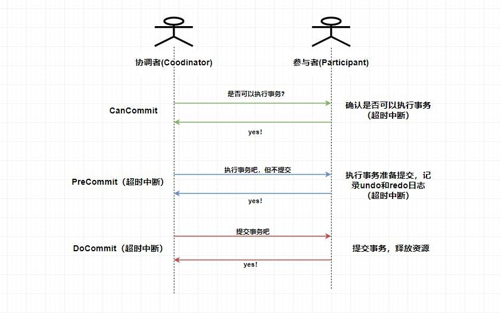
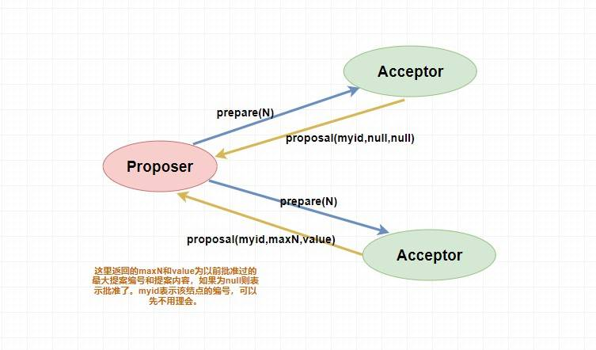

# zookeeper

## 简介

- zookeeper是一个**分布式协调服务框架**，主要用于解决分布式服务中心常遇到的一些数据管理问题，如：统一命名服务、状态同步服务、集群管理、分布式应用配置项的管理等
- 简单地说zookeeper=文件系统+坚挺通知机制

> 集群和分布式

集群：集群是多台机器，跑相同的程序，负载均衡

分布式：将程序按照业务拆分，部署到多台机器上；分布式需要考虑到很多：比如各个分布式组件如何协调起来，如何减少各个系统之间的耦合度，分布式事务的处理，如何去配置整个分布式系统等等。`zookeeper`主要就是解决这些问题的

> 文件系统

- zookeeper维护的是一个类似文件系统的数据结构
- 每个子目录项被称为znode（目录节点），和文件系统一样，我们能够自由的增加、删除znode，在一个znode下增加、删除子znode，唯一的不同在于znode是可以存储数据的
- znode四种类型
  - **persistent**：持久化目录节点，客户端与zookeeper断开连接后，该节点依旧存在
  - **persistent_sequential**：持久化顺序编号目录节点，客户端与zookeeper断开连接后，该节点依旧存在，只是Zookeeper给该节点名称进行顺序编号
  - **ephemeral**：临时目录节点，客户端与zookeeper断开连接后，该节点被删除
  - **ephemeral_sequential**：临时顺序编号目录节点，被编号的临时节点

> 监听通知机制

客户端注册监听它关心的目录节点，当目录节点发生变化（数据改变、被删除、子目录节点增加删除）时，zookeeper会通知客户端。

### 作用

- zookeeper功能非常强大，可以实现诸如分布式应用配置管理、统一命名服务、状态同步服务、集群管理等功能，我们这里拿比较简单的分布式应用配置管理为例来说明。
- 假设我们的程序是分布式部署在多台机器上，如果我们要改变程序的配置文件，需要逐台机器去修改，非常麻烦，现在把这些配置全部放到zookeeper上去，保存在 zookeeper 的某个目录节点中，然后所有相关应用程序对这个目录节点进行监听，一旦配置信息发生变化，每个应用程序就会收到 zookeeper 的通知，然后从 zookeeper 获取新的配置信息应用到系统中

### 安装

1. 下载zookeeper，解压
2. 重命名配置文件为 `zoo.cfg`

### 使用

1. `./zkServer.sh start`：启动zookeeper
2. `zkCli.sh`：zookeeper客户端连接服务端

```bash
create /node1 "node1"	#通过 create 命令在根目录创建了 node1 节点，与它关联的字符串是"node1"
create /node1/node1.1 123  #创建node1的子节点node1.1

set /node1 "set node1"    #set命令，更新节点数据内容

get node1    #get 命令可以获取指定节点的数据内容和节点的状态
node1

ls /		#通过 ls 命令查看根目录下的节点，操作类似于linux的ls命令

stat /node1   #通过 stat 命令查看节点状态
cZxid = 0x47
ctime = Sun Jan 20 10:22:59 CST 2019
mZxid = 0x47
mtime = Sun Jan 20 10:22:59 CST 2019
pZxid = 0x4a
cversion = 1
dataVersion = 0
aclVersion = 0
ephemeralOwner = 0x0
dataLength = 11
numChildren = 1

delete /node1/node1.1  #如果要删除某一个节点，那么这个节点必须无子节点才行
```


## 一致性问题

设计一个分布式系统必定会遇到一个问题—— **因为分区容忍性（partition tolerance）的存在，就必定要求我们需要在系统可用性（availability）和数据一致性（consistency）中做出权衡** 。这就是著名的 `CAP` 定理。

而上述前者就是 `Eureka` 的处理方式，它保证了AP（可用性），后者就是 `ZooKeeper` 的处理方式，它保证了CP（数据一致性）

而为了解决数据一致性问题，出现了很多的一致性协议和算法。比如 2PC（两阶段提交），3PC（三阶段提交），Paxos算法等等

> **拜占庭将军问题** ：
>
> 它意指 **在不可靠信道上试图通过消息传递的方式达到一致性是不可能的**， 所以所有的一致性算法的 **必要前提** 就是安全可靠的消息通道。

!>PC是 phase-commit 的缩写，即阶段提交

### 2PC（两阶段提交）

两阶段提交是一种保证分布式系统数据一致性的协议，现在很多数据库都是采用的两阶段提交协议来完成 **分布式事务** 的处理。

在分布式系统中，整个调用链中，我们所有服务的数据处理要么都成功要么都失败，即所有服务的 **原子性问题** 。

> 在两阶段提交中，主要涉及到两个角色，分别是协调者和参与者：
>
> `第一阶段`：当要执行一个分布式事务的时候，事务发起者首先向协调者发起事务请求，然后协调者会给所有参与者发送 `prepare` 请求（其中包括事务内容）告诉参与者你们需要执行事务了，如果能执行我发的事务内容那么就先执行但不提交，执行后请给我回复。然后参与者收到 `prepare` 消息后，他们会开始执行事务（但不提交），并将 `Undo` 和 `Redo` 信息记入事务日志中，之后参与者就向协调者反馈是否准备好了。
>
> `第二阶段`：第二阶段主要是协调者根据参与者反馈的情况来决定接下来是否可以进行事务的提交操作，即提交事务或者回滚事务。

比如这个时候 **所有的参与者** 都返回了准备好了的消息，这个时候就进行事务的提交，协调者此时会给所有的参与者发送 **`Commit` 请求** ，当参与者收到 `Commit` 请求的时候会执行前面执行的事务的 **提交操作** ，提交完毕之后将给协调者发送提交成功的响应。

而如果在第一阶段并不是所有参与者都返回了准备好了的消息，那么此时协调者将会给所有参与者发送 **回滚事务的 `rollback` 请求**，参与者收到之后将会 **回滚它在第一阶段所做的事务处理** ，然后再将处理情况返回给协调者，最终协调者收到响应后便给事务发起者返回处理失败的结果。


2PC只解决了各个事务的原子性问题，但也存在如下问题：

- **单点故障问题**，如果协调者挂了那么整个系统都处于不可用的状态了。
- **阻塞问题**，即当协调者发送 `prepare` 请求，参与者收到之后如果能处理那么它将会进行事务的处理但并不提交，这个时候会一直占用着资源不释放，如果此时协调者挂了，那么这些资源都不会再释放了，这会极大影响性能。
- **数据不一致问题**，比如当第二阶段，协调者只发送了一部分的 `commit` 请求就挂了，那么也就意味着，收到消息的参与者会进行事务的提交，而后面没收到的则不会进行事务提交，那么这时候就会产生数据不一致性问题。

### 3PC（三阶段提交）

3PC为了解决2PC存在的一系列问题：`单点`、`阻塞`、`数据不一致`

> 三阶段提交如下：
>
> 1. **CanCommit阶段**：协调者向所有参与者发送 `CanCommit` 请求，参与者收到请求后会根据自身情况查看是否能执行事务，如果可以则返回 YES 响应并进入预备状态，否则返回 NO 。
> 2. **PreCommit阶段**：协调者根据参与者返回的响应来决定是否可以进行下面的 `PreCommit` 操作。如果上面参与者返回的都是 YES，那么协调者将向所有参与者发送 `PreCommit` 预提交请求，**参与者收到预提交请求后，会进行事务的执行操作，并将 `Undo` 和 `Redo` 信息写入事务日志中** ，最后如果参与者顺利执行了事务则给协调者返回成功的响应。如果在第一阶段协调者收到了 **任何一个 NO** 的信息，或者 **在一定时间内** 并没有收到全部的参与者的响应，那么就会中断事务，它会向所有参与者发送中断请求（abort），参与者收到中断请求之后会立即中断事务，或者在一定时间内没有收到协调者的请求，它也会中断事务。
> 3. **DoCommit阶段**：这个阶段其实和 `2PC` 的第二阶段差不多，如果协调者收到了所有参与者在 `PreCommit` 阶段的 YES 响应，那么协调者将会给所有参与者发送 `DoCommit` 请求，**参与者收到 `DoCommit` 请求后则会进行事务的提交工作**，完成后则会给协调者返回响应，协调者收到所有参与者返回的事务提交成功的响应之后则完成事务。若协调者在 `PreCommit` 阶段 **收到了任何一个 NO 或者在一定时间内没有收到所有参与者的响应** ，那么就会进行中断请求的发送，参与者收到中断请求后则会 **通过上面记录的回滚日志** 来进行事务的回滚操作，并向协调者反馈回滚状况，协调者收到参与者返回的消息后，中断事务。



`3PC` 通过一系列的超时机制很好的缓解了阻塞问题，但是最重要的一致性并没有得到根本的解决，比如在 `PreCommit` 阶段，当一个参与者收到了请求之后其他参与者和协调者挂了或者出现了网络分区，这个时候收到消息的参与者都会进行事务提交，这就会出现数据不一致性问题。

要解决一致性问题还需要靠 `Paxos` 算法

### Paxos算法

`Paxos` 算法是基于**消息传递且具有高度容错特性的一致性算法**，是目前公认的解决分布式一致性问题最有效的算法之一，**其解决的问题就是在分布式系统中如何就某个值（决议）达成一致** 。

在 `Paxos` 中主要有三个角色，分别为 `Proposer提案者`、`Acceptor表决者`、`Learner学习者`。`Paxos` 算法和 `2PC` 一样，也有两个阶段，分别为 `Prepare` 和 `accept` 阶段。

#### prepare 阶段

- `Proposer提案者`：负责提出 `proposal`，每个提案者在提出提案时都会首先获取到一个 **具有全局唯一性的、递增的提案编号N**，即在整个集群中是唯一的编号 N，然后将该编号赋予其要提出的提案，在**第一阶段是只将提案编号发送给所有的表决者**。

- `Acceptor表决者`：每个表决者在 `accept` 某提案后，会将该提案编号N记录在本地，这样每个表决者中保存的已经被 accept 的提案中会存在一个**编号最大的提案**，其编号假设为 `maxN`。每个表决者仅会 `accept` 编号大于自己本地 `maxN` 的提案，在批准提案时表决者会将以前接受过的最大编号的提案作为响应反馈给 `Proposer` 。

- 流程图

  

#### accept阶段

- 当一个提案被 `Proposer` 提出后，如果 `Proposer` 收到了超过半数的 `Acceptor` 的批准（`Proposer` 本身同意），那么此时 `Proposer` 会给所有的 `Acceptor` 发送真正的提案（你可以理解为第一阶段为试探），这个时候 `Proposer` 就会发送提案的内容和提案编号。

- 表决者收到提案请求后会再次比较本身已经批准过的最大提案编号和该提案编号，如果该提案编号 **大于等于** 已经批准过的最大提案编号，那么就 `accept` 该提案（此时执行提案内容但不提交），随后将情况返回给 `Proposer` 。如果不满足则不回应或者返回 NO 。

- 流程图

  

当 `Proposer` 收到超过半数的 `accept` ，那么它这个时候会向所有的 `acceptor` 发送提案的提交请求。需要注意的是，因为上述仅仅是超过半数的 `acceptor` 批准执行了该提案内容，其他没有批准的并没有执行该提案内容，所以这个时候需要**向未批准的 `acceptor` 发送提案内容和提案编号并让它无条件执行和提交**，而对于前面已经批准过该提案的 `acceptor` 来说 **仅仅需要发送该提案的编号** ，让 `acceptor` 执行提交就行了。

而如果 `Proposer` 如果没有收到超过半数的 `accept` 那么它将会将 **递增** 该 `Proposal` 的编号，然后 **重新进入 `Prepare` 阶段** 。

#### paxos死循环问题

比如说，此时提案者 P1 提出一个方案 M1，完成了 `Prepare` 阶段的工作，这个时候 `acceptor` 则批准了 M1，但是此时提案者 P2 同时也提出了一个方案 M2，它也完成了 `Prepare` 阶段的工作。然后 P1 的方案已经不能在第二阶段被批准了（因为 `acceptor` 已经批准了比 M1 更大的 M2），所以 P1 自增方案变为 M3 重新进入 `Prepare` 阶段，然后 `acceptor` ，又批准了新的 M3 方案，它又不能批准 M2 了，这个时候 M2 又自增进入 `Prepare` 阶段。。。

就这样无休无止的永远提案下去，这就是 `paxos` 算法的死循环问题。

解决：只允许一个提案者

**`Zookeeper`**：作为一个优秀高效且可靠的分布式协调框架，`ZooKeeper` 在解决分布式数据一致性问题时并没有直接使用 `Paxos` ，而是专门定制了一致性协议叫做 `ZAB(ZooKeeper Atomic Broadcast)` 原子广播协议，该协议能够很好地支持 **崩溃恢复** 。

## 重要概念

### 数据模型

ZooKeeper 数据模型采用层次化的多叉树形结构，每个节点上都可以存储数据，这些数据可以是数字、字符串或者是二级制序列。并且。每个节点还可以拥有 N 个子节点，最上层是根节点以“/”来代表。每个数据节点在 ZooKeeper 中被称为 **znode**，它是 ZooKeeper 中数据的最小单元。并且，每个 znode 都一个唯一的路径标识


### 数据节点

每个数据节点在 ZooKeeper 中被称为 **znode**，它是 ZooKeeper 中数据的最小单元，用于存放数据

> Znode的四种类型

- **持久（PERSISTENT）节点** ：一旦创建就一直存在即使 ZooKeeper 集群宕机，直到将其删除。
- **临时（EPHEMERAL）节点** ：临时节点的生命周期是与 **客户端会话（session）** 绑定的，**会话消失则节点消失** 。并且，**临时节点只能做叶子节点** ，不能创建子节点。
- **持久顺序（PERSISTENT_SEQUENTIAL）节点** ：除了具有持久（PERSISTENT）节点的特性之外， 子节点的名称还具有顺序性。比如 `/node1/app0000000001` 、`/node1/app0000000002` 。
- **临时顺序（EPHEMERAL_SEQUENTIAL）节点** ：除了具备临时（EPHEMERAL）节点的特性之外，子节点的名称还具有顺序性。

> znode 数据结构

每个 znode 由 2 部分组成:

- **stat** ：状态信息
- **data** ： 节点存放的数据的具体内容

Stat 类中包含了一个数据节点的所有状态信息的字段，包括事务 ID-cZxid、节点创建时间-ctime 和子节点个数-numChildren 等等

| znode 状态信息 | 解释                                                         |
| -------------- | ------------------------------------------------------------ |
| cZxid          | create ZXID，即该数据节点被创建时的事务 id                   |
| ctime          | create time，即该节点的创建时间                              |
| mZxid          | modified ZXID，即该节点最终一次更新时的事务 id               |
| mtime          | modified time，即该节点最后一次的更新时间                    |
| pZxid          | 该节点的子节点列表最后一次修改时的事务 id，只有子节点列表变更才会更新 pZxid，子节点内容变更不会更新 |
| cversion       | 子节点版本号，当前节点的子节点每次变化时值增加 1             |
| dataVersion    | 数据节点内容版本号，节点创建时为 0，每更新一次节点内容(不管内容有无变化)该版本号的值增加 1 |
| aclVersion     | 节点的 ACL 版本号，表示该节点 ACL 信息变更次数               |
| ephemeralOwner | 创建该临时节点的会话的 sessionId；如果当前节点为持久节点，则 ephemeralOwner=0 |
| dataLength     | 数据节点内容长度                                             |
| numChildren    | 当前节点的子节点个数                                         |

### 版本

对应于每个 znode，ZooKeeper 都会为其维护一个叫作 **Stat** 的数据结构，Stat 中记录了这个 znode 的三个相关的版本：

- **dataVersion** ：当前 znode 节点的版本号
- **cversion** ： 当前 znode 子节点的版本
- **aclVersion** ： 当前 znode 的 ACL 的版本。

### ACL（权限控制）

ZooKeeper 采用 ACL（AccessControlLists）策略来进行权限控制，类似于 UNIX 文件系统的权限控制。

对于 znode 操作的权限，ZooKeeper 提供了以下 5 种：

- **CREATE** : 能创建子节点
- **READ** ：能获取节点数据和列出其子节点
- **WRITE** : 能设置/更新节点数据
- **DELETE** : 能删除子节点
- **ADMIN** : 能设置节点 ACL 的权限

其中尤其需要注意的是，**CREATE** 和 **DELETE** 这两种权限都是针对 **子节点** 的权限控制。

对于身份认证，提供了以下几种方式：

- **world** ： 默认方式，所有用户都可无条件访问。
- **auth** :不使用任何 id，代表任何已认证的用户。
- **digest** :用户名:密码认证方式： *username:password* 。
- **ip** : 对指定 ip 进行限制。

### Watcher（监听器）

Watcher（事件监听器），是 ZooKeeper 中的一个很重要的特性。ZooKeeper 允许用户在指定节点上注册一些 Watcher，并且在一些特定事件触发的时候，ZooKeeper 服务端会将事件通知到感兴趣的客户端上去，该机制是 ZooKeeper 实现分布式协调服务的重要特性。


### Session（会话）

Session 可以看作是 ZooKeeper 服务器与客户端的之间的一个 TCP 长连接，通过这个连接，客户端能够通过心跳检测与服务器保持有效的会话，也能够向 ZooKeeper 服务器发送请求并接受响应，同时还能够通过该连接接收来自服务器的 Watcher 事件通知

Session 有一个属性叫做：`sessionTimeout` ，`sessionTimeout` 代表会话的超时时间。当由于服务器压力太大、网络故障或是客户端主动断开连接等各种原因导致客户端连接断开时，只要在`sessionTimeout`规定的时间内能够重新连接上集群中任意一台服务器，那么之前创建的会话仍然有效

另外，在为客户端创建会话之前，服务端首先会为每个客户端都分配一个 `sessionID`。由于 `sessionID`是 ZooKeeper 会话的一个重要标识，许多与会话相关的运行机制都是基于这个 `sessionID` 的，因此，无论是哪台服务器为客户端分配的 `sessionID`，都务必保证全局唯一

## 集群

为了保证高可用，最好是以集群形态来部署 ZooKeeper，这样只要集群中大部分机器是可用的（能够容忍一定的机器故障），那么 ZooKeeper 本身仍然是可用的。通常 3 台服务器就可以构成一个 ZooKeeper 集群了。ZooKeeper 官方提供的架构图就是一个 ZooKeeper 集群整体对外提供服务。


上图中每一个 Server 代表一个安装 ZooKeeper 服务的服务器。组成 ZooKeeper 服务的服务器都会在内存中维护当前的服务器状态，并且每台服务器之间都互相保持着通信。集群间通过 ZAB 协议（ZooKeeper Atomic Broadcast）来保持数据的一致性。

**最典型集群模式： Master/Slave 模式（主备模式）**。在这种模式中，通常 Master 服务器作为主服务器提供写服务，其他的 Slave 服务器从服务器通过异步复制的方式获取 Master 服务器最新的数据提供读服务。

### 集群角色

在 ZooKeeper 中没有选择传统的 Master/Slave 概念，而是引入了 Leader、Follower 和 Observer 三种角色。如下图所示：


ZooKeeper 集群中的所有机器通过一个 **Leader 选举过程** 来选定一台称为 “**Leader**” 的机器，Leader 既可以为客户端提供写服务又能提供读服务。

| 角色     | 说明                                                         |
| -------- | ------------------------------------------------------------ |
| Leader   | 为客户端提供读和写的服务，负责投票的发起和决议，更新系统状态。 |
| Follower | 为客户端提供读服务，如果是写服务则转发给 Leader。参与选举过程中的投票。 |
| Observer | 为客户端提供读服务，如果是写服务则转发给 Leader。不参与选举过程中的投票，也不参与“过半写成功”策略。在不影响写性能的情况下提升集群的读性能。此角色于 ZooKeeper3.3 系列新增的角色。 |

当 Leader 服务器出现网络中断、崩溃退出与重启等异常情况时，就会进入 Leader 选举过程；Leader 选举大概过程：

1. **Leader election（选举阶段）**：节点在一开始都处于选举阶段，只要有一个节点得到超半数节点的票数，它就可以当选准 leader。
2. **Discovery（发现阶段）** ：在这个阶段，followers 跟准 leader 进行通信，同步 followers 最近接收的事务提议。
3. **Synchronization（同步阶段）** :同步阶段主要是利用 leader 前一阶段获得的最新提议历史，同步集群中所有的副本。同步完成之后 准 leader 才会成为真正的 leader。
4. **Broadcast（广播阶段）** :到了这个阶段，ZooKeeper 集群才能正式对外提供事务服务，并且 leader 可以进行消息广播。同时如果有新的节点加入，还需要对新节点进行同步。

### 集群中的服务器状态

- **LOOKING** ：寻找 Leader。
- **LEADING** ：Leader 状态，对应的节点为 Leader。
- **FOLLOWING** ：Follower 状态，对应的节点为 Follower。
- **OBSERVING** ：Observer 状态，对应节点为 Observer，该节点不参与 Leader 选举。

### 选举过半机制防止脑裂

> 集群脑裂

对于一个集群，通常多台机器会部署在不同机房，来提高这个集群的可用性。保证可用性的同时，会发生一种机房间网络线路故障，导致机房间网络不通，而集群被割裂成几个小集群。这时候子集群各自选主导致“脑裂”的情况。

举例说明：比如现在有一个由 6 台服务器所组成的一个集群，部署在了 2 个机房，每个机房 3 台。正常情况下只有 1 个 leader，但是当两个机房中间网络断开的时候，每个机房的 3 台服务器都会认为另一个机房的 3 台服务器下线，而选出自己的 leader 并对外提供服务。若没有过半机制，当网络恢复的时候会发现有 2 个 leader。仿佛是 1 个大脑（leader）分散成了 2 个大脑，这就发生了脑裂现象。脑裂期间 2 个大脑都可能对外提供了服务，这将会带来数据一致性等问题。

> **过半机制是如何防止脑裂现象产生的**？

ZooKeeper 的过半机制导致不可能产生 2 个 leader，因为少于等于一半是不可能产生 leader 的，这就使得不论机房的机器如何分配都不可能发生脑裂

### 集群服务器为什么最好为奇数台?

因为`过半防止脑裂机制`，所以存在如下推论：

ZooKeeper 集群在宕掉几个 ZooKeeper 服务器之后，如果剩下的 ZooKeeper 服务器个数大于宕掉的个数的话整个 ZooKeeper 才依然可用。假如我们的集群中有 n 台 ZooKeeper 服务器，那么也就是剩下的服务数必须大于 n/2。先说一下结论，2n 和 2n-1 的容忍度是一样的，都是 n-1，大家可以先自己仔细想一想，这应该是一个很简单的数学问题了。

比如假如我们有 3 台，那么最大允许宕掉 1 台 ZooKeeper 服务器，如果我们有 4 台的的时候也同样只允许宕掉 1 台。 假如我们有 5 台，那么最大允许宕掉 2 台 ZooKeeper 服务器，如果我们有 6 台的的时候也同样只允许宕掉 2 台。

综上，何必增加那一个不必要的 ZooKeeper 呢？

### ZAB协议的两种基本模式

ZAB 协议包括两种基本的模式，分别是：`崩溃恢复`、`消息广播`

- **崩溃恢复** ：当整个服务框架在启动过程中，或是当 Leader 服务器出现网络中断、崩溃退出与重启等异常情况时，ZAB 协议就会进入恢复模式并选举产生新的 Leader 服务器。当选举产生了新的 Leader 服务器，同时集群中已经有过半的机器与该 Leader 服务器完成了状态同步之后，ZAB 协议就会退出恢复模式。其中，**所谓的状态同步是指数据同步，用来保证集群中存在过半的机器能够和 Leader 服务器的数据状态保持一致**。
- **消息广播** ：**当集群中已经有过半的 Follower 服务器完成了和 Leader 服务器的状态同步，那么整个服务框架就可以进入消息广播模式了。** 当一台同样遵守 ZAB 协议的服务器启动后加入到集群中时，如果此时集群中已经存在一个 Leader 服务器在负责进行消息广播，那么新加入的服务器就会自觉地进入数据恢复模式：找到 Leader 所在的服务器，并与其进行数据同步，然后一起参与到消息广播流程中去。

## 总结

1. ZooKeeper 本身就是一个分布式程序（只要半数以上节点存活，ZooKeeper 就能正常服务）。
2. 为了保证高可用，最好是以集群形态来部署 ZooKeeper，这样只要集群中大部分机器是可用的（能够容忍一定的机器故障），那么 ZooKeeper 本身仍然是可用的。
3. ZooKeeper 将数据保存在内存中，这也就保证了 高吞吐量和低延迟（但是内存限制了能够存储的容量不太大，此限制也是保持 znode 中存储的数据量较小的进一步原因）。
4. ZooKeeper 是高性能的。 在“读”多于“写”的应用程序中尤其地明显，因为“写”会导致所有的服务器间同步状态。（“读”多于“写”是协调服务的典型场景。）
5. ZooKeeper 有临时节点的概念。 当创建临时节点的客户端会话一直保持活动，临时节点就一直存在。而当会话终结时，临时节点被删除。持久节点是指一旦这个 znode 被创建了，除非主动进行 znode 的移除操作，否则这个 znode 将一直保存在 ZooKeeper 上。
6. ZooKeeper 底层其实只提供了两个功能：① 管理（存储、读取）用户程序提交的数据；② 为用户程序提供数据节点监听服务。
