# Docker

## Docker概述

### 容器与虚拟机

- 传统虚拟机，虚拟化出一套硬件，运行一个完整的操作系统，然后在这个系统上运行软件
- 容器内的应用直接运行在宿主机上，容器没有内核，也没有虚拟化硬件，所以轻便了
- 每个容器相互隔离，有属于自己的文件系统，互不影响

### DevOps（开发、运维）

**应用更快的交付和部署**

- 传统：一堆帮助文档，安装程序
- docker：打包镜像发布测试，一键运行

**更快捷的升级和扩缩容**

- 使用docker后，部署应用就像搭积木一样
- 项目打包为一个镜像

**更简单的系统运维**

- 在容器化后，我们开发和测试环境都是高度一致的

**更高效的计算机资源利用**

- docker是内核级别的虚拟化，可以在一个物理机上运行很多容器实例！服务器性能被压榨到极致

## Docker安装

### Docker基本组成

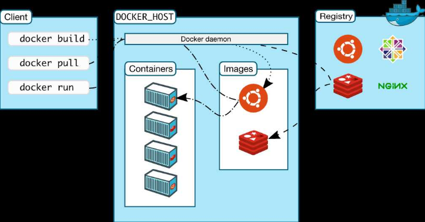

**镜像（image）:**

docker镜像好比一个模板，可以通过这个模板来创建容器服务；一个镜像可以创建多个容器（最终服务运行或项目运行就是在容器中）

**容器（container）：**

docker利用容器技术，独立运行一个或一组应用，通过镜像创建

启动、停止、删除，基本命令

可以将容器理解为一个简易的linux

**仓库（repository）：**

仓库就是存放镜像的地方

docker Hub（默认是国外的）

仓库可以自己配置成国内的

### 安装docker

> 查看环境

可在docker官方，查看对应系统的安装步骤

```shell
#系统版本
[root@localhost ~]## cat /etc/os-release
```

> 安装

帮助文档：

```shell
#1、卸载旧的docker版本
yum remove docker \
           docker-client \
           docker-client-latest \
           docker-common \
           docker-latest \
           docker-latest-logrotate \
           docker-logrotate \
           docker-engine
           
#2、需要的安装包
yum install -y yum-utils

#3、设置镜像仓库
yum-config-manager --add-repo \
    https://mirrors.cloud.tencent.com/docker-ce/linux/centos/docker-ce.repo
  
#更新软件包索引
yum makecache fast
  
#4、安装docker相关的 docker-ce社区版、ee企业版
yum install docker-ce docker-ce-cli containerd.io

#5、启动docker
systemctl start docker

#查看docker版本
docker version

#6、测试hellow-world，未安装会自动从仓库下载镜像
docker run hello-world

#7、查看docker镜像
docker images
REPOSITORY    TAG       IMAGE ID       CREATED       SIZE
hello-world   latest    d1165f221234   3 weeks ago   13.3kB

#8、卸载docker（了解）
#卸载依赖
yum remove docker-ce docker-ce-cli containerd.io
#删除目录，/var/lib/docker为docker默认工作路径
rm -rf /var/lib/docker
rm -rf /var/lib/containerd
```

### Hello-world启动流程

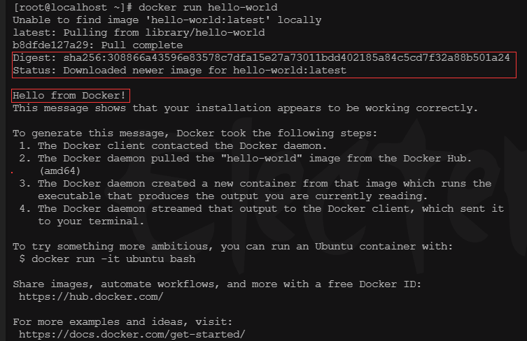


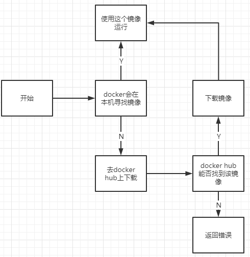

### 底层原理

**docker怎么工作？**

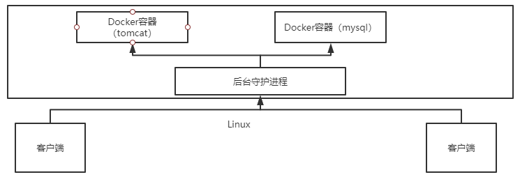

docker是一个Client-Server结构的系统，docker守护进程运行在服务器上，通过Socker从客户端访问！

dockerServer接收到docker-Client的指令，就会执行这个命令！

**docker为什么比VM快？**

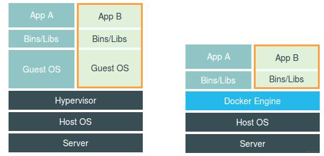

- docker有着更少的抽象层
- docker利用的是宿主机内核，VM需要的是Guest OS，所以新建容器时，docker不需要虚拟机重新加载一个操作系统内核，避免引导（秒级）

## Docker常用命令

### 帮助命令

```shell
docker version		#显示docker版本信息
docker info			#显示docker系统信息，包括镜像和容器数量
docker 命令 --help	#帮助命令
```

帮助文档地址：https://docs.docker.com/reference/

### 镜像命令

**docker images** 查看所有本机上的镜像

```bash
docker images		#查看已有镜像列表
docker images -a	#等同于docker images
docker images -q	#仅查看镜像ID
docker images -help		#查看命令帮助


docker search mysql		#搜索 mysql 镜像
docker search mysql --filter=STARS=500	#根据条件搜索，这里搜索 STARS 大于500 的


## docker 下载镜像采用分层下载，只有用下载存在差异的部分(有些镜像存在公共依赖)
## 可在 docker hub 查询搜索镜像，以及镜像使用参数
docker pull mysql	#下载镜像，不写版本号默认 latest
docker pull mysql:5.7	#下载指定版本


## -f 参数，是否删除已有的对应容器
docker rmi -f 镜像ID [镜像ID]		#删除指定ID的镜像
docker rmi -f $(docker images -aq)		#删除所有镜像
```


### 容器命令

**说明：有了镜像才可以创建容器，linux，下载一个 Centos 测试学习**

```shell
#运行容器的命令
docker run [可选参数] image

#参数说明
--name="Name"	容器名字，tomcat01/02等等，用于区分容器
--restart       指定容器重启策略，always | no | on-failure
-d				后台方式运行
-it				使用交互方式运行，进入容器查看内容
-p				指定容器端口
	-p	ip:主机端口:容器端口
	-p	主机端口:容器端口（常用）
	-p	容器端口
-P	指定随机端口

docker pull centos		#下载镜像
docker run -it centos /bin/bash		#启动并进入容器
	uname -a			#查看容器内的centos
	exit	# 直接停止容器并退出
	Ctrl+P+Q	#容器不停止退出
	
docker run -d centos		#后台运行(docker容器使用后台运行，就必须要有一个前台进程,否则会自动停止)
docker run -d centos /bin/sh -c "while true;do echo lei;sleep 1;done"		#可以通过自己写一个shell脚本，使容器不自动停止

docker ps	#列出当前正在运行容器
    	-a	#列出所有容器
   	 	-n=?	#显示最近创建的容器
   		-q	#只显示容器编号
    
docker inspect mysql	#查看容器详情信息(该命令还可查看镜像、网络等)

docker rm 容器id	#删除指定容器，不能删除运行中容器
docker rm -f 容器id	#强制删除容器，包括运行中的
docker rm -f $(docker ps -aq)	#删除所有容器

docker start 容器id		#启动容器
docker restart 容器id		#重启容器
docker stop 容器id		#停止容器
docker kill 容器id		#强制停止容器

#查看指定容器ip地址
docker inspect --format='{{.Name}}:{{range .NetworkSettings.Networks}}{{.IPAddress}}{{end}}' 容器id

# 查看所有容器ip地址
docker inspect --format='{{.Name}}:{{range .NetworkSettings.Networks}}{{.IPAddress}}{{end}}' $(docker ps -aq)

# 查看指定容器是否自启
docker inspect --format '{{.Name}}:{{ .HostConfig.RestartPolicy.Name }}' 容器id

# 查看容器是否自启
docker inspect --format '{{.Name}}:{{ .HostConfig.RestartPolicy.Name }}' $(docker ps -aq)

# 进入容器（新建shell）
docker exec -it 容器id bash

# 设置容器自启策略  always | no | on-failure
docker update --restart always 容器id
```

### 其他命令

**查看日志**

```shell
docker logs -tf -tail 容器id 	#查看日志	
    -tf		#显示日志
    --tail number	#显示日志的条数
    
docker logs -f -t --tail 2 5418490896ce		#显示10条日志
docker top 容器id		#查看容器中进程
docker inspect 5418490896ce	#查看当前运行容器所有相关数据

docker exec -it 容器id bashshell	#进入容器后，新开一个终端
docker attach 容器id	#进入容器后，进入当前正在运行的终端

#从容器拷贝文件到主机上
docker cp 容器id:容器内路径 目的主机路径	
docker cp 968bf5041902:/home/lei.java /home		#拷贝(先进入容器建立文档,然后在主机上使用命令拷贝出来)
```

### 可视化

docker有许多可视化管理工具

```bash
#portainer/portainer
docker run -d -p8088:9000 \
--restart=always -v /var/run/docker.sock:/var/run/docker.sock --privileged=true portainer/portainer
```

### 小结

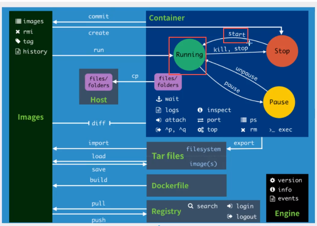

### 练习

> Docker 安装nginx

```shell
#1、搜索镜像 可以去docker官网上搜索，有帮助文档
#2、下载镜像 pull
#3、运行测试

#下载nginx镜像
docker search nginx		#搜索
docker pull nginx	#下载镜像
docker images	#查看已有镜像
docker run --name="nginx2" -d -p 3344:80 nginx	#启动运行nginx镜像
docker ps	#查看运行的容器
docker exec -it nginx2 /bin/bash	#进入容器
	whereis nginx	#搜索nginx安装在什么地方
	
#官方用法，容器停止即销毁(一次性的运行)
docker run -it --rm tomcat:9.0
```

## 容器数据卷

### 什么是容器数据卷

如果数据都在容器中，那么删除容器，数据就会丢失！**需求：数据可以持久化**

MySQL 容器删了，数据丢失！**需求：MySQL数据可以存储在本地**

容器之间可以有一个数据共享技术！docker容器中产生的数据，同步到本地！

这就是卷技术，目录的挂载，将我们容器内的目录，挂载到 Linux 上面！

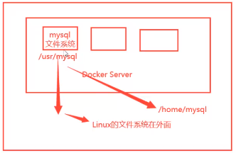

**总结：容器的持久化和同步操作！容器间也是可以数据共享的！**

### 使用数据卷

> 方式一：直接使用命令挂载 -v

```shell
docker run -it -v 主机目录:容器内目录 镜像

#测试
#启动容器，挂载目录
docker run -it -v $PWD/centos:/home centos /bin/bash

#容器内挂载的目录创建或删除，容器外同步
[root@bb4661143603 home]## touch 1.txt
[root@localhost home]## ls
centos
[root@localhost home]## cd centos/
[root@localhost centos]## ls
1.txt
#查看详细信息（挂载信息）
[root@localhost]## docker inspect bb4661143603
[
	......
	"Mounts": [
            {
                "Type": "bind",
                "Source": "/home/centos",
                "Destination": "/home",
                "Mode": "",
                "RW": true,
                "Propagation": "rprivate"
            }
        ]
        .....
]
#即使容器没有启动，宿主机修改了文件，容器启动时依旧会同步到容器的挂载目录
```

### 实例：MySQL安装

```shell
#运行容器，数据挂载
#MySQL 启动需要设置密码，以下挂载了两次数据卷，并设置了Mysql的root密码
#/etc/mysql/conf.d 为mysql配置文件目录
#/var/lib/mysql 为mysql数据存储目录
#通过以下数据卷方法启动容器，那么即使容器删除，数据依然会在本地保存
-d	后台运行
-p	端口映射
-v	卷挂载
-e	环境配置
--name	容器名字
[root@localhost ~]## docker run -d -p 3306:3306 -v /home/mysql/conf:/etc/mysql/conf.d -v /home/mysql/data:/var/lib/mysql -e MYSQL_ROOT_PASSWORD=123456 --name mysql-5.7 mysql:5.7
#测试，注意开启 Linux端口，否则可能会访问失败（以下为Centos7操作方法）
firewall-cmd --get-active-zones		#运行完成之后，可以看到zone名称
firewall-cmd --zone=public --add-port=6379/tcp --permanent	#开启端口
firewall-cmd --reload		#重启防火墙
firewall-cmd --query-port=6379/tcp		#查看端口是否开启
```

### 具名和匿名挂载

```shell
#匿名挂载
-v 容器内路径
docker run --name nginx -d -p 80:80 -v /etv/nginx nginx

#查看所有的卷（volume）情况
#发现，以下就是匿名挂载，在启动容器时 -v 只写了容器内路径，没有写容器外路径
[root@localhost]## docker volume list
DRIVER    VOLUME NAME
local     5f6260afa9af890a4ac31fd65807f61be2646d380214b1742bc0d6259e5a0802

#具名挂载
-v 卷名:容器内路径
[root@localhost ~]## docker run --name nginx3 -d -v myvolume:/etc/nginx nginx

#查看这个卷信息，可以看到文件具体保存在什么位置
[root@localhost ~]## docker volume inspect myvolume
[
    {
        "CreatedAt": "2021-04-03T14:58:04+08:00",
        "Driver": "local",
        "Labels": null,
        "Mountpoint": "/var/lib/docker/volumes/myvolume/_data",
        "Name": "myvolume",
        "Options": null,
        "Scope": "local"
    }
]
```

所有 docker 容器内的卷，没有指定目录的情况下，都在 /var/lib/docker/volumes/卷名/_data 目录下

通过具名挂载可以快速地找到一个卷，所以通常我们采用**具名挂载**

```shell
#如何确定是具名挂载还是匿名挂载，还是指定路径挂载
-v 容器内路径		#匿名挂载
-v 卷名:容器内路径		#具名挂载
-v 宿主机路径:容器内路径	#指定目录挂载
```

**扩展**

```shell
#通过 -v 容器内路径:ro rw   改变读写权限
ro	#只读
rw	#可读可写

#一旦设置了容器权限，容器对我们挂载出来的目录就有限定了
[root@localhost ~]## docker run --name nginx3 -d -v myvolume:/etc/nginx:ro nginx

#ro 说明该路径只能宿主机操作，容器内无法操作
```

## Dockr 网络

### 理解 docker0

> 测试

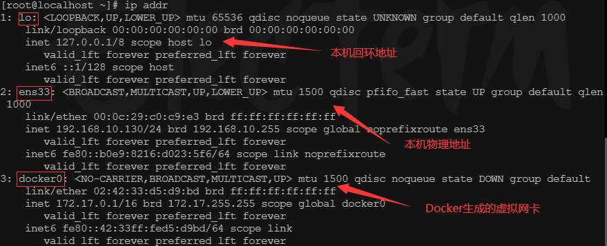

三个网络

```shell
#问题：docker如何处理容器网络访问的？

#测试本机 ping 容器

[root@localhost ~]## docker pull tomcat		#下载镜像
#启动容器，并查看容器ip地址
[root@localhost ~]## docker run -d tomcat ip addr
[root@localhost ~]## docker exec -it laughing_faraday ip addr
1: lo: <LOOPBACK,UP,LOWER_UP> mtu 65536 qdisc noqueue state UNKNOWN group default qlen 1000
    link/loopback 00:00:00:00:00:00 brd 00:00:00:00:00:00
    inet 127.0.0.1/8 scope host lo
       valid_lft forever preferred_lft forever
6: eth0@if7: <BROADCAST,MULTICAST,UP,LOWER_UP> mtu 1500 qdisc noqueue state UP group default 
    link/ether 02:42:ac:11:00:02 brd ff:ff:ff:ff:ff:ff link-netnsid 0
    inet 172.17.0.2/16 brd 172.17.255.255 scope global eth0
       valid_lft forever preferred_lft forever		
[root@localhost ~]## ping 172.17.0.2		#进行 ping 测试
PING 172.17.0.2 (172.17.0.2) 56(84) bytes of data.
64 bytes from 172.17.0.2: icmp_seq=1 ttl=64 time=0.088 ms

```


> 原理

每启动一个docker容器，docker就会给容器分配一个ip；只要安装了docker，就会有一个网卡 docker0桥接模式，使用的技术是 evth-pair技术

再次查看本机 ip

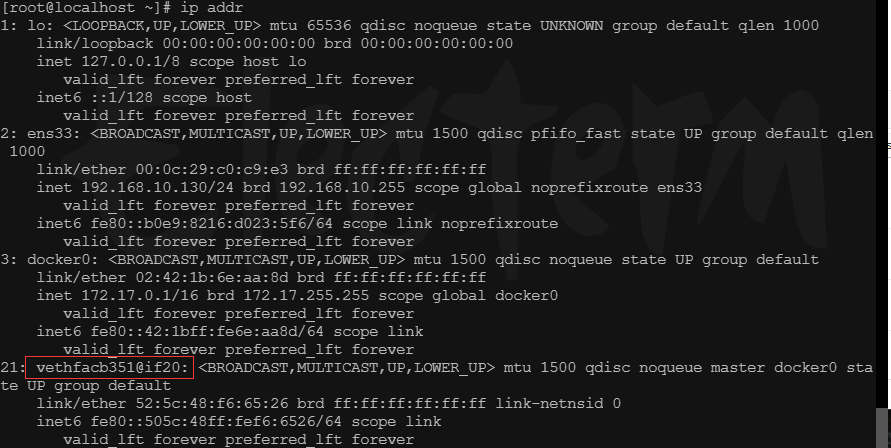

查看容器ip

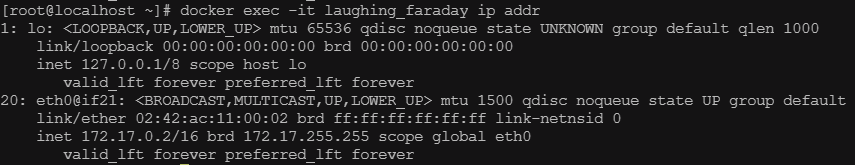

```shell
#通过以上发现，启动一个容器，会生成一对网卡；容器和主机，这对网卡称为 evth-pair 
#evth-pair就是一对虚拟设备接口，他们是成对出现，一端连着协议栈，一端彼此相连着
#evth-pair充当一个桥梁，链接各种虚拟网络设备（桥接）
```

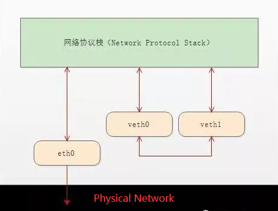

容器之间是可以相互 ping 通的

**通信流程图**

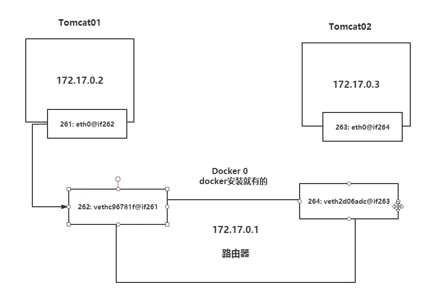

结论：tomcat01 与 tomcat02 是共用的一个路由器，docker0

所有容器默认情况下，都是 docker0 路由的，docker会给容器分配一个默认的IP

> 小结

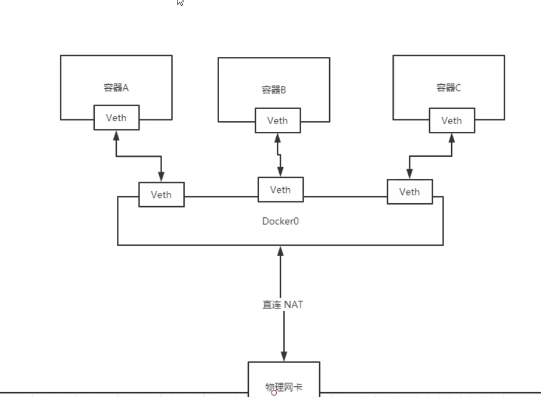

docker 中所有的网络接口都是虚拟的，因为转发效率高（内网转发）

只要容器删除，对应的一对 evth-pair 就会消失

### --link

>希望可以通过名字直接访问容器，而不是通过ip地址

```shell
#通过以下命令，容器之间不能通过名字访问（可以解决），可以通过ip进行访问
docker run -d -P --name tomcat1 tomcat
docker run -d -P --name tomcat2 tomcat
docker exec -it tomcat1 ping tomcat2
ping: tomcat2: Name or service not known

docker exec -it tomcat1 ping 172.17.0.3
PING 172.17.0.3 (172.17.0.3) 56(84) bytes of data.
64 bytes from 172.17.0.3: icmp_seq=1 ttl=64 time=0.077 ms

#解决方法
#通过--link可以解决 
docker run -d -P --name tomcat3 --link tomcat2 tomcat
docker exec -it tomcat3 ping tomcat2
PING tomcat2 (172.17.0.3) 56(84) bytes of data.
64 bytes from tomcat2 (172.17.0.3): icmp_seq=1 ttl=64 time=0.079 ms

#通过网络命令查看网络信息
docker network --help
Usage:  docker network COMMAND
Manage networks
Commands:
  connect     Connect a container to a network
  create      Create a network
  disconnect  Disconnect a container from a network
  inspect     Display detailed information on one or more networks
  ls          List networks
  prune       Remove all unused networks
  rm          Remove one or more networks
  
```

**分析 --link 原理**

```shell
docker exec -it tomcat3 cat /etc/hosts
127.0.0.1       localhost
::1     localhost ip6-localhost ip6-loopback
fe00::0 ip6-localnet
ff00::0 ip6-mcastprefix
ff02::1 ip6-allnodes
ff02::2 ip6-allrouters
172.17.0.3      tomcat2 6630985cb8e8
172.17.0.4      45f864f1185c

#可以看到，--link其实就是在容器中的host文件进行了配置
```

不推荐使用 --link

自定义网络，不适用 docker0

docker0 问题，不支持容器名链接访问

### 自定义网络

> 查看所有docker网络

```shell
docker network ls
NETWORK ID     NAME      DRIVER    SCOPE
385ca7094413   bridge    bridge    local
d6c7c505f7e6   host      host      local
55a39633c2e2   none      null      local
```

**网络模式**

bridge：桥接 docker（默认）

none：不配置网络

host：和主机共享网络

container：容器网络连通（局限大，用的少）

**测试**

```shell
#之前直接启动的容器，实际有--net参数，而这个就是docker0（默认）
docker run -d -P --name tomcat1 --net bridge tomcat

#docker0特点，默认，域名不能访问，--link可以打通连接

#创建自己的网络(mynet)
docker network create --driver bridge --subnet 192.168.0.0/24 --gateway 192.168.0.1 mynet
docker network ls	#查看docker网络列表

docker run --rm -d --name myeureka -p18761:8761 --net mynet  myeureka
```

### 网络互联

> 自定义的不同网络中的容器互联

```shell
#使用docker network connect 命令
#使自定义的不同网络中的容器可以互联
#该命令会向 tomcat2 中添加一个虚拟网卡，ip 为 mynet1 网段的ip地址
#这样 tomcat2 就同时加入了 mynet1网络和mynet2网络

docker network connect mynet1 tomcat2
docker exec -it tomcat2 ip addr	#查看tomcat2 ip地址
```

## docker镜像

### 镜像是什么

镜像是一种轻量级，可执行独立软件包，用来打包软件运行环境和基于运行环境开发的软件，它包含运行某个软件所需要的所有内容，包括代码、运行时、库、环境变量和配置文件。

所有的应用，直接打包docker镜像，就可以直接跑起来

如何得到镜像：

- 从远程仓库下载
- 朋友拷贝
- 自己制作一个镜像

### docker镜像加载原理

> UnionFS（联合文件系统 UFS）

UnionFS（联合文件系统）：UnionFS文件系统（UnionFS）是一种分层、轻量级并且高性能的文件系统，它支持对文件系统的修改作为一次提交来一层层的叠加，同时可以将不同的目录挂载到同一个虚拟文件系统下（unite several directions into a single virtual filesystem）。Union文件系统是docker镜像的基础。镜像可以通过分层来进行集成，基于基础镜像（没有父镜像），可以制作各种具体的应用镜像。

特性：一次同时加载多个文件系统，但从外面看起来，只能看到一个文件系统，联合加载会把各层文件系统叠加起来，这样最终的文件系统会包含所有底层的文件和目录。

> docker镜像加载原理

docker的镜像实际上由一层一层的文件系统组成，这种层级的文件系统就是UnionFS

**bootfs**：bootfs（boot file system）主要包括bootloader和kernel，bootloader主要是引导加载kernel，Linux刚启动时会加载bootfs文件系统，在docker镜像的最底层是bootfs。这一层与我们典型的Linux/Unix系统是一样的，包含boot加载器和内核。当boot加载完成之后整个内核就都在内存中了，此时内存的使用权已由bootfs转交给内核，此时系统也会卸载bootfs。

**rootfs：**rootfs（root file system）在bootfs之上。包含的就是典型Linux系统中的/dev,/proc,/bin,/etc 等标准目录和文件。rootfs就是各种不同的操作系统发行版，比如 Ubuntu，Centos等等。

### 分层理解

docker下载镜像时，观察日志输出，可以看到是一层一层的下载

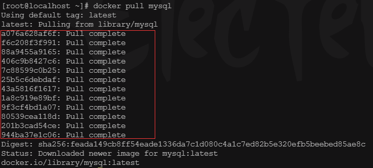

**理解：**

所有 docker 镜像都始于一个基础镜像层，当进行修改或增加新的内容时，就会在当前镜像层之上，创建新的镜像层

例：假如 Ubuntu 16.04 创建一个新的镜像，这就是新镜像的第一层；如果在该镜像中添加 Python 包，就会在基础镜像层上创建第二个镜像层；如果继续添加一个安全补丁，就会创建第三个镜像层

> 特点

docker 镜像都是只读的，当容器启动时，一个新的可写层被加载到镜像的顶部，这一层就是通常所说的容器层，容器之下都是镜像层

### commit镜像

```shell
docker commit	#提交容器成为一个新的副本
docker commit -m="提交的描述信息" -a="作者" 容器id 目标镜像名:[TAG]

#测试
docker run -d -p 8081:8080 tomcat	#启动默认tomcat
docker exec -it 9e6d3ccbca7b /bin/bash	#修改容器内容，这里拷贝文件
	cp -r webapps.dist/* webapps
docker commit -m="add webapps app" -a="lei"  e8017bfcb8ac mytom:1.2	#将该容器提交为一个新的镜像
docker images	#查看镜像
```

如果想保存当前容器的状态，可以使用 commit 提交为一个镜像

### push镜像

可以使用docker官网，需要在docker官网注册账号

这里使用阿里云的镜像服务；登陆阿里云，在容器镜像服务下创建命名空间，然后创建一个镜像的仓库，然后使用命令登录即可

```bash
docker login --username=lei****huan registry.cn-hangzhou.aliyuncs.com	#登录阿里云docker Registry

docker pull registry.cn-hangzhou.aliyuncs.com/tlei/lei:[镜像版本号]	#从Registry中拉取镜像

#将镜像推送到Registry
docker login --username=lei****huan registry.cn-hangzhou.aliyuncs.com
docker tag [ImageId] registry.cn-hangzhou.aliyuncs.com/tlei/lei:[镜像版本号]	#重命名镜像,需要将发布的镜像改到自己账户名
docker push registry.cn-hangzhou.aliyuncs.com/tlei/lei:[镜像版本号]

#将该镜像推送至远程
docker push registry-vpc.cn-hangzhou.aliyuncs.com/acs/agent:0.7-dfb6816	

docker logout	#登出

#例子
docker commit -a="leiking" e8017bfcb8ac mytom:1.2	#提交镜像
docker images	#查看所有镜像
docker tag 86a113c92138 registry.cn-hangzhou.aliyuncs.com/leiking/lei:3.5	#给镜像重新打上标签
docker push registry.cn-hangzhou.aliyuncs.com/tlei/lei:3.5	#push镜像
docker pull registry.cn-hangzhou.aliyuncs.com/tlei/lei:3.5	#拉取镜像
```


### docker镜像加速器使用

登录阿里云，找到容器镜像服务，通过镜像工具下的镜像加速器配置就好

```bash
sudo mkdir -p /etc/docker
sudo tee /etc/docker/daemon.json <<-'EOF'
{
  "registry-mirrors": ["https://l2z6apov.mirror.aliyuncs.com"]
}
EOF
sudo systemctl daemon-reload
sudo systemctl restart docker
```

### dockerFile(构建镜像)

dockerfile 就是用来构建 docker 镜像的构建文件！命令参数脚本！

构建步骤：

1. 编写一个 dockerfile 文件
2. docker build 构建成为一个镜像
3. docker run运行镜像
4. docker push 发布镜像（dockerHub、阿里云镜像仓库...）

查看centos镜像官方dockerfile：

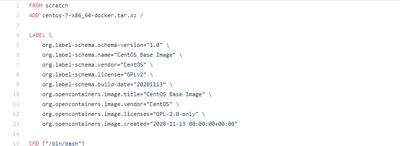

很多官方镜像都是基础包，很多功能没有，我们通常会自己搭建自己的镜像！

**基础知识：**

1. 每个保留关键字（指令）都必须是大写字母
2. 指令从上到下依次执行
3. #代表注释
4. 每一个指令都会创建提交一个新的镜像层，并提交

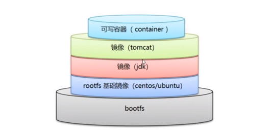

dockerfile是面向开发的，以后发布项目，做镜像，需要编写docker文件

**dockerFile指令**

| 指令       | 作用                                                         |
| :--------- | ------------------------------------------------------------ |
| FROM       | 基础镜像，一切从这里开始构建                                 |
| MAINTAINER | 镜像作者，姓名+邮箱                                          |
| RUN        | 镜像构建的时候需要运行的命令                                 |
| ADD        | 添加文件到镜像(自动解压)                                     |
| COPY       | 类似ADD, 添加文件到镜像（不解压）                            |
| WORKDIR    | 镜像的工作目录                                               |
| VOLUME     | 挂载目录                                                     |
| EXPOSE     | 暴露端口配置，在运行时使用随机端口映射时，也就是 docker run -P 时，会自动随机映射 EXPOSE 的端口 |
| CMD        | 指定这个容器启动时要运行的命令,只有最后一个会生效，可被替代  |
| ENTRYPOINT | 指定这个容器启动的时候要运行的命令，可以追加命令             |
| ONBUILD    | 当构建一个被继承 dockerFile 这个时候就会运行 ONBUILD 的指令。触发指令 |
| ENV        | 构建时设置环境变量，构建和容器运行时生效                     |

### 测试

**构建自己的Centos**

1. 编写 dockerfile 配置文件(命名mydockerfile)

   ```shell
   FROM centos
   MAINTAINER lei<81497400@qq.com>
   ENV MYPATH /usr/local
   WORKDIR $MYPATH
   RUN yum -y install vim \
   	&& yum -y install net-tools
   EXPOSE 80
   CMD echo $MYPATH
   CMD echo "---end--"
   CMD /bin/bash
   ```

2. 通过 dockerfile 构建镜像

   ```bash
   #构建命令 docker build -f dockerfile文件路径 -t 镜像名:[tag]
   
   docker build -f mydockerfile -t mycentos:0.1 .		## . 代表上下文路径，会将该路径文件打包发送给docker 引擎
   
   #使用docker run 运行; 可以发现在这个centos中可以运行 vim、ipconfig 命令，并默认在 /usr/local 目录,而官方的 centos 是没有 vim 等命令的
   ```

### 实战

**Tomcat镜像**

1. 准备镜像文件、tomcat压缩包、jdk压缩包

   编写dockerfile文件，官方命名 **dockerfile**，打包成镜像时不需要指定 dockerfile文件位置，docker 会自动找到该文件

   ```shell
   FROM centos
   MAINTAINER lei<81497400@qq.com>
   COPY readme.txt /usr/local/readme.txt
   ADD jdk-11.0.10_linux-x64_bin.tar.gz /usr/local
   ADD apache-tomcat-9.0.44.tar.gz /usr/local
   RUN yum install -y vim
   ENV MYPATH /usr/local
   WORKDIR $MYPATH
   ENV JAVA_HOME /usr/local/jdk-11.0.10
   ENV CLASSPATH $JAVA_HOME/lib/dt.jar:$JAVA_HOME/lib/tools.jar
   ENV CATALINA_HOME /usr/local/apache-tomcat-9.0.44
   ENV CATALINA_BASH /usr/local/apache-tomcat-9.0.44
   ENV PATH $PATH:$JAVA_HOME/bin:$CATALINA_HOME/bin
   EXPOSE 8080
   CMD /usr/local/apache-tomcat-9.0.44/bin/startup.sh && tail -F /usr/local/apache-tomcat-9.0.44/logs/catalina.out
   ```

2. 构建镜像

   ```shell
   #通过 docker build 构建镜像。因为上面dockerfile 官方命名，这里不需要指定 dockerfile 路径
   docker build -t diytomcat .
   ```

3. 启动镜像

   ```shell
   #通过以命令下可以看到 tomcat 镜像启动成功
   docker run --name mytomcat -p 8080:8080 -v /home/tomcat/webapps:/usr/local/apache-tomcat-9.0.44/webapps -v /home/tomcat/logs:/usr/local/apache-tomcat-9.0.44/logs mytomcat:1.0
   ```

4. 测试，编写一个**Hello.jsp**，并访问测试

   ```shell
   #编写 index.jsp，保存在本地 /home/tomcat/webapps/test/index.jsp，因为目录挂载，会自动同步到容器之中 
   cat index.jsp 
   <html>
   <head><title>Hello World</title></head>
   <body>
   Hello World!<br/>
   <%
   System.out.println("Your IP address is " + request.getRemoteAddr());
   %>
   </body>
   </html>
   
   #访问   http://宿主机ip:8080/test/index.jsp
   #如果看到 Hello World！则部署成功
   ```

**eureka注册中心构建**

1. 准备所需文件，jdk包、eureka包 (eureka jar包、启动eureka的脚本、日志存放目录)

   ```shell
   #启动脚本，需要个死循环，否则脚本结束，运行的程序也结束了
   #!/bin/bash
   java -jar /usr/local/eureka/springcloud-eureka-server-1.0-SNAPSHOT.jar --spring.profiles.active=eure01 > /usr/local/eureka/log/eure01 &
   java -jar /usr/local/eureka/springcloud-eureka-server-1.0-SNAPSHOT.jar --spring.profiles.active=eure02 > /usr/local/eureka/log/eure02 &
   java -jar /usr/local/eureka/springcloud-eureka-server-1.0-SNAPSHOT.jar --spring.profiles.active=eure03 > /usr/local/eureka/log/eure03 &
   
   while [[ true ]]; do
       sleep 10
   done
   ```

   

2. dockerfile编写

   ```shell
   FROM centos:7
   MAINTAINER lei<81497400@qq.com>
   ADD jdk-11.0.15_linux-x64_bin.tar.gz /usr/local
   ADD eureka.tar.gz /usr/local
   #环境变量 构建及在容器运行时保留
   ENV MYPATH=/usr/local JAVA_HOME=/usr/local/jdk-11.0.15
   ENV CLASSPATH $JAVA_HOME/lib/dt.jar:$JAVA_HOME/lib/tools.jar
   ENV PATH $PATH:$JAVA_HOME/bin
   #为后续的RUN、CMD、ENTRYPOINT指令配置工作目录
   WORKDIR $MYPATH
   RUN yum install -y vim
   RUN yum install -y iputils
   EXPOSE 8761 8762 8763	## 暴露端口
   RUN chmod 755 /usr/local/eureka/start.sh
   ENTRYPOINT ["/usr/local/eureka/start.sh"]	## 启动容器时执行,不可被覆盖,CMD命令会作为参数传进来
   ```

3. 构建镜像

   ```shell
   docker build -t myeureka .
   ```

4. 运行镜像

   ```shell
   docker run --rm -d --name myeureka -p18761:8761 -p18762:8762 -p18763:8763  myeureka
   ```

5. 访问测试  http://192.168.10.131:18761/

## docker 实例

### docker Compose

### docker Swarm

### CI/CD Jenkins 流水线


## 常用应用启动命令

```bash
#rabbitMQ启动，指定容器名，rabbitMQ用户名，rabbitMQ密码，rabbitMQmanagement插件，映射端口
docker run -d --hostname rabbit \ 
	-p5672:5672 -p15672:15672 --name rabbit \
    -e RABBITMQ_DEFAULT_USER=root -e RABBITMQ_DEFAULT_PASS=123456 \
    rabbitmq:3-management
    
#redis
docker run -d --name redis -p 6379:6379 redis --requirepass "123456"

#mysql
# lower_case_table_names=0: 表名和列名是大小写敏感的。这意味着在创建表和查询数据时，需要严格区分大小写。
# lower_case_table_names=1: 表名和列名是大小写不敏感的。MySQL 会自动将大写字母转换为小写字母。这种方式可以避免因大小写问题导致的错误，但可能会影响到一些依赖于大小写的业务逻辑
# lower_case_table_names=2: 表名和列名是大小写敏感的，但 MySQL 会自动将大写字母转换为小写字母存储。这种方式可以保证在查询时大小写不敏感，同时保留了大小写信息
docker run -d \
	--name mysql -p3306:3306 \
	-e MYSQL_ROOT_PASSWORD=123456 mysql:8.0 \
	--character-set-server=utf8mb4 \
	--collation-server=utf8mb4_unicode_ci \
	--lower_case_table_names=1

#postgresql
docker run -d \
	--name postgres \
	-p5432:5432 \
	-e POSTGRES_PASSWORD=123456 \
	-e PGDATA=/var/lib/postgresql/data/pgdata \
	-v $PWD/postgres:/var/lib/postgresql/data \
	postgres
	
#nginx
#将配置文件拷贝出来
docker run -d --name nginx nginx
mkdir conf
docker cp nginx:/etc/nginx/nginx.conf $PWD/conf
docker cp nginx:/etc/nginx/conf.d $PWD/conf
docker container stop nginx
docker container rm nginx
#重新创建容器并挂载目录
mkdir html
docker run -d -p 80:80 -p 443:443  \
		 --name nginxweb \
		 -v $PWD/html:/usr/share/nginx/html \
		 -v $PWD/conf/nginx.conf:/etc/nginx/nginx.conf \
		 -v $PWD/conf/conf.d:/etc/nginx/conf.d \
		 -v $PWD/logs:/var/log/nginx \
		 nginx
		 
#halo博客搭建
mkdir $PWD/.halo && cd ./.halo
wget https://dl.halo.run/config/application-template.yaml -O ./application.yaml
docker pull halohub/halo:1.5.3
docker run -it -d --name halo \
			-p 8090:8090 \
			-v /home/lei/docker/halo/.halo:/root/.halo \
			#--restart=unless-stopped \     #表示docker重启后自动重启该容器
			halohub/halo:1.5.3
			
#青龙面板
docker run -dit \
  -v $PWD/ql:/ql/data \
  -p 5700:5700 \
  --name qinglong \
  --hostname qinglong \
  --restart unless-stopped \
  whyour/qinglong:latest
```

