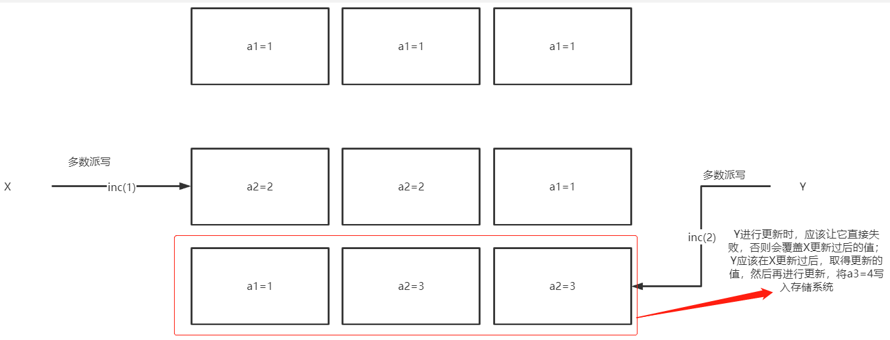

# paxos算法

## 分布式系要解决的问题

Paxos的工作，就是把一堆机器协同起来，使多个机器成为一个整体的系统。在这个系统中，必须让其中每台机器的状态达成一致，例如：三台机器的集群，其中一台机器上传了图片，那么另外两台也必须复制这张图，这样系统才达到`一致`的状态

**复制策略：**

- **主从异步复制**

  最简单策略，客户端将数据存储到master服务端后，收到`数据安全(OK)信息`，而此时`master服务端`还没将数据复制到其他`Salve主机`，如果此时master遭受不可抗力，可能导`致数据丢失`

- **主从同步复制**

  与主从异步复制相比，`主从同步复制`提供了完整的可靠性，直到数据真正的安全同步到所有主机后才会返回数据安全信息；

  但是主从同步复制缺点，当系统中任意一台主机宕机，写入就会中断，相当于系统的`可靠性随着集群中机器数量的增多而降低`

- **主从半同步复制**

  半同步复制是异步复制和同步复制的一个折中方案，它要求master在应答客户端之前必须把数据复制到**足够多**的机器上, 但不需要是全部. 这样副本数够多可以提供比较高的可靠性; 1台机器宕机也不会让整个系统停止写入。

  但是它存在如下问题：数据a复制到了salve-1但没有达到salve-2，数据b复制到了salve-2但没有达到salve-1，而此时master宕机，需要从salve中恢复数据，而此时系统中salve主机都不能提供完整的数据。所以系统中可能存在`数据不一致`

- **多数派读写**

  每次数据必须写入`半数以上`的机器，每次读都必须检查半数以上的机器是否存在该数据；这种策略宕机可以容忍，任意一台机器故障也没问题

  但是：1.salve-1和salve-2都写入了a=x，2.下次更新时 salve-2和salve-3更新了a=y；此时读取a的数据，联系上了salve-1和salve-2，此时会看到两条不同数据，产生`歧义`。因此更新数据时需要加上时间戳，总是以最新时间戳为准，这样可以保证多次更新一条数据不产生歧义

  但是：如果在客户端没有完成一次性读写时，例如：写入时 salve-1和salve-2数据a=x，更新时 salve-3 更新为a=y后客户端挂掉了；此时读取数据时，如果联系的时salve-1和salve-2则会得到a=x数据，如果联系的是salve-2和salve-3则会得到a=y的数据。整个`系统对外提供的数据仍然不是一致性`的

## 从多数派到paxos的推导

假设存在一个存在三个存储节点存储系统集群，现在需要实现强一致性存储，因此下面步骤：

假定该存储系统支持如下命令：

- get    读取最新的数据 a
- set    设置a的值，会生成一个新的版本
- inc     对 a 的值加n，也会生成新版本

set命令实现为一个多数派写；inc命令实现为读取变量a的值，进行加操作，然后使用多数派写入存储系统；set和inc都会对数据a的版本进行更新

**存在问题**：如果存在两个线程X,Y同时进行`inc操作`，那么在多数派实现中必然会X覆盖Y的数据问题，存在`数据更新不一致或数据丢失`；`paxos`可以让Y检测到这种并发冲突行为，从而采取措施避免数据更新不一致或数据丢失的问题

上图简述为：当X、Y同时去更新a的值时，以X来说应该能知晓Y的存在，并且在Y更新结束后，拿到新的a2进行操作，最终写入写入存储系统的版本应该为a3；换句话说，在本系统中a的每个版本都只能写入一次，不允许修改，如果满足这个要求，那么上述的X、Y的inc操作就能得到正确结果

**解决方法**： 

在X或Y写之前先做一次`多数派读`, 以便确认是否有其他客户端进程已经在写了, 如果有, 则放弃

`但是`如果X和Y同时做写前读操作，那么得到的结果都是没有其他客户端写，还是会存在数据更新问题

因此所有的存储节点应该必须记得谁`最后一个做过写前读操作`，并且`只允许`最后一个做过写前读操作的线程进行写操作

**对应到paxos算法中：**

- Proposer 可以理解为客户端线程.
- Acceptor 可以理解为存储节点.
- Quorum 半数以上的Acceptor.
- Round 用来标识一次paxos算法实例, 每个round是2次多数派读写: 算法描述里分别用phase-1和phase-2标识. 同时为了简单和明确, 算法中也规定了每个Proposer都必须生成全局单调递增的round, 这样round既能用来区分先后也能用来区分不同的Proposer(客户端).

## Paxos算法

Paxos是分布式系统中，基于消息传递的一致性算法；Paxos算法必须要是在受信任的环境中才能成立，这个环境是不会被侵入和破坏的。

Paxos中进程是平等的，既Paxos算法不依赖于一个特殊的进程。因为如果Paxos如果依赖一个特殊的进程，那么这个进程挂掉必然会影响Paxos算法。对于分布式系统，无法保证单个进程必活，因此Paxos必须能够容忍一定数量的进程挂掉。

Paxos算法大致内容如下：

它包含角色有：`提议者 (Proposer)`，`决策者 (Acceptor)`，`最终决策学习者 (Learner)`

**Proposer**：提出提案(Proposal)。提案信息包括`提案编号(PID)`和`提案的值(Value)`

**Acceptor**：参与决策，回应Proposer的提案。收到`Proposal`后，可选择接受提案。当一个提案被大多数 决策者 接受时，则称该提案被批准

**Learner**：不参与决策，从`Proposer/Acceptor`学习最新达成一致性的提案

**Paxos算法中每条消息的流程**：

- Prepare(准备)：Proposer生成全局唯一且递增的PID，向所有的Acceptors发送Prepare请求，这里只需要携带PID即可
- Promise：Acceptors收到Prepare请求，`承诺与应答`
  - 承诺：不再接受PID`小于或等于`当前请求的Prepare请求
  - 承诺：不在接受PID`小于`当前请求的Propose请求
  - 再不违背承诺下，回复已经决策过的`PID最大的提案(Value和PID)`，没有则返回空值

**Propose**：Proposer收到Acceptors的Promise应答后，从应答中选择PID最大的提案(PID和Value)，作为本次要发起的提案。如果Value为空，则Proposer可以随意决定提案的Value，然后携带PID发送提案到所有的Acceptor

**Propose**：Proposer收到Propose请求后，在不违背自己承诺的前提下接受并持久化保存提案(PID和Value)

**Learn**: Proposer收到多数Acceptors的Accept后，决议形成，将形成的决议发送给所有Learners

