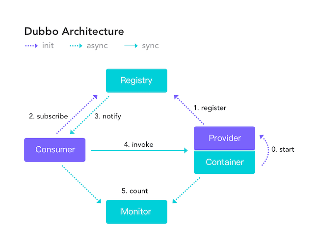

# 一致性理论

## CAP理论

[CAP 理论/定理](https://zh.wikipedia.org/wiki/CAP定理)起源于 2000年，由加州大学伯克利分校的Eric Brewer教授在分布式计算原理研讨会（PODC）上提出，因此 CAP定理又被称作 **布鲁尔定理（Brewer’s theorem）**

### 简介

**CAP** 也就是 **Consistency（一致性）**、**Availability（可用性）**、**Partition Tolerance（分区容错性）** 这三个单词首字母组合。

CAP 定理（CAP theorem）指出对于一个分布式系统来说，当设计读写操作时，只能同时满足以下三点中的两个：

- **一致性（Consistence）** : 所有节点访问同一份最新的数据副本
- **可用性（Availability）**: 非故障的节点在合理的时间内返回合理的响应（不是错误或者超时的响应）。
- **分区容错性（Partition tolerance）** : 分布式系统出现网络分区的时候，仍然能够对外提供服务。

**网络分区**：分布式系统中，多个节点之前的网络本来是连通的，但是因为某些故障（比如部分节点网络出了问题）某些节点之间不连通了，整个网络就分成了几块区域，这就叫网络分区。

### CAP实现

>**当发生网络分区的时候，如果我们要继续服务，那么强一致性和可用性只能 2 选 1。也就是说当网络分区之后 P 是前提，决定了 P 之后才有 C 和 A 的选择。也就是说分区容错性（Partition tolerance）我们是必须要实现的。**
>
>简而言之就是：CAP 理论中分区容错性 P 是一定要满足的，在此基础上，只能满足可用性 A 或者一致性 C。

因此，**分布式系统理论上不可能选择 CA 架构，只能选择 CP 或者 AP 架构。** 比如 ZooKeeper、HBase 就是 CP 架构，Cassandra、Eureka 就是 AP 架构，Nacos 不仅支持 CP 架构也支持 AP 架构。

!>**如果网络分区正常的话（系统在绝大部分时候所处的状态），也就说不需要保证 P 的时候，C 和 A 能够同时保证。**

### CAP 实际应用案例

下图是 Dubbo 的架构图。**注册中心 Registry 在其中扮演了什么角色呢？提供了什么服务呢？**

注册中心负责服务地址的注册与查找，相当于目录服务，服务提供者和消费者只在启动时与注册中心交互，注册中心不转发请求，压力较小。

常见的可以作为注册中心的组件有：ZooKeeper、Eureka、Nacos...。

1. **ZooKeeper 保证的是 CP。** 任何时刻对 ZooKeeper 的读请求都能得到一致性的结果，但是， ZooKeeper 不保证每次请求的可用性比如在 Leader 选举过程中或者半数以上的机器不可用的时候服务就是不可用的。
2. **Eureka 保证的则是 AP。** Eureka 在设计的时候就是优先保证 A （可用性）。在 Eureka 中不存在什么 Leader 节点，每个节点都是一样的、平等的。因此 Eureka 不会像 ZooKeeper 那样出现选举过程中或者半数以上的机器不可用的时候服务就是不可用的情况。 Eureka 保证即使大部分节点挂掉也不会影响正常提供服务，只要有一个节点是可用的就行了。只不过这个节点上的数据可能并不是最新的。
3. **Nacos 不仅支持 CP 也支持 AP。**

### 总结

在进行分布式系统设计和开发时，我们不应该仅仅局限在 CAP 问题上，还要关注系统的扩展性、可用性等等

在系统发生“分区”的情况下，CAP 理论只能满足 CP 或者 AP。要注意的是，这里的前提是系统发生了“分区”

如果系统没有发生“分区”的话，节点间的网络连接通信正常的话，也就不存在 P 了。这个时候，我们就可以同时保证 C 和 A 了。

总结：**如果系统发生“分区”，我们要考虑选择 CP 还是 AP。如果系统没有发生“分区”的话，我们要思考如何保证 CA 。**

## BASE理论

### 简介

**BASE** 是 **Basically Available（基本可用）** 、**Soft-state（软状态）** 和 **Eventually Consistent（最终一致性）** 三个短语的缩写。BASE 理论是对 CAP 中一致性 C 和可用性 A 权衡的结果，其来源于对大规模互联网系统分布式实践的总结，是基于 CAP 定理逐步演化而来的，它大大降低了我们对系统的要求。

### BASE理论核心思想

即使无法做到强一致性，但每个应用都可以根据自身业务特点，采用适当的方式来使系统达到最终一致性。

> 也就是牺牲数据的一致性来满足系统的高可用性，系统中一部分数据不可用或者不一致时，仍需要保持系统整体“主要可用”。

**BASE 理论本质上是对 CAP 的延伸和补充，更具体地说，是对 CAP 中 AP 方案的一个补充。**

**为什么这样说呢？**

CAP 理论这节我们也说过了：

> 如果系统没有发生“分区”的话，节点间的网络连接通信正常的话，也就不存在 P 了。这个时候，我们就可以同时保证 C 和 A 了。因此，**如果系统发生“分区”，我们要考虑选择 CP 还是 AP。如果系统没有发生“分区”的话，我们要思考如何保证 CA 。**

因此，AP 方案只是在系统发生分区的时候放弃一致性，而不是永远放弃一致性。在分区故障恢复后，系统应该达到最终一致性。这一点其实就是 BASE 理论延伸的地方。

### BASE理论三要素

1. `基本可用`：基本可用指的是分布式应用出现不可预知故障的时候，允许损失部分可用性。但是，绝不代表系统不可用

   **什么是损失部分可用性？**

   - **响应时间上的损失**: 正常情况下，处理用户请求需要 0.5s 返回结果，但是由于系统出现故障，处理用户请求的时间变为 3 s。
   - **系统功能上的损失**：正常情况下，用户可以使用系统的全部功能，但是由于系统访问量突然剧增，系统的部分非核心功能无法使用。

2. `软状态`：软状态允许系统中数据存在中间态（CAP理论中的数据不一致），并认为中间状态的存在不会影响系统整体的可用性，即允许系统在不同的数据节点间数据同步存在一定的延时性

3. `最终一致性`：最终一致性强调的是系统中的所有数据副本，在经过一段时间后达到一致状态。因此最终一致性本质是，系统保证最终数据一致性，而不需要实时保证数据强一致性

   >分布式一致性的 3 种级别：
   >
   >1. **强一致性** ：系统写入了什么，读出来的就是什么。
   >2. **弱一致性** ：不一定可以读取到最新写入的值，也不保证多少时间之后读取到的数据是最新的，只是会尽量保证某个时刻达到数据一致的状态。
   >3. **最终一致性** ：弱一致性的升级版，系统会保证在一定时间内达到数据一致的状态。
   >
   >**业界比较推崇是最终一致性级别，但是某些对数据一致要求十分严格的场景比如银行转账还是要保证强一致性。**

   实现强一致性具体方式：

   >- **读时修复** : 在读取数据时，检测数据的不一致，进行修复。比如 Cassandra 的 Read Repair 实现，具体来说，在向 Cassandra 系统查询数据的时候，如果检测到不同节点 的副本数据不一致，系统就自动修复数据。
   >- **写时修复** : 在写入数据，检测数据的不一致时，进行修复。比如 Cassandra 的 Hinted Handoff 实现。具体来说，Cassandra 集群的节点之间远程写数据的时候，如果写失败 就将数据缓存下来，然后定时重传，修复数据的不一致性。
   >- **异步修复** : 这个是最常用的方式，通过定时对账检测副本数据的一致性，并修复。
   >
   >推荐写时修复，对性能友好

### 总结

**ACID 是数据库事务完整性的理论，CAP 是分布式系统设计理论，BASE 是 CAP 理论中 AP 方案的延伸。**
