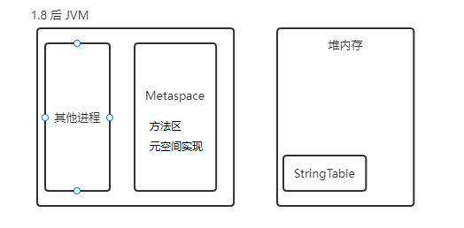
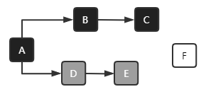

# JVM

## 引言

> 基于JDK1.8

### jvm是什么

**定义**

jvm 全称 Java Virtual Machine ， java 虚拟机，java 二进制字节码的运行环境

**优点**

- 一次编写，到处执行，jvm 屏蔽了底层操作系统之间的差距
- 自动内存管理，垃圾回收功能
- 数组下标越界检查（c 的数据越界可能会覆盖其他内存数据）
- 多态

### jdk、jre、jvm区别

- jdk：JVM + 基础类库 + 编译工具
- jre：JVM + 基础类库
- jvm：java 字节码运行环境


### JVM组成


## 内存结构

### 相关概念

- 二进制字节码：类基本信息、常量池、类方法定义（包含了虚拟机指令）；通过`javap -v HelloWorld.class` 可以显示反编译字节码后的详细信息
- 堆=新生代+老年代，不包括永久代（方法区）
- java文件执行过程：Class源代码 ===编译===> 二进制字节码(jvm指令) ===解释器===> 机器码 ===> cpu执行

### 程序计数器

**定义**：Program Counter Register 程序计数器（寄存器）

**作用**：在jvm指令执行过程中，记住下一条jvm指令执行的地址

**特点**

- 程序计数器是`线程私有`的，每个线程都有自己的程序计数器
- 不会存在内存溢出，jvm 中`唯一`不会存在内存溢出的区域

### 虚拟机栈


**介绍**：栈内存可以在程序运行时手动指定大小，通过 -Xss size 来手动指定栈内存大小；例如：`-Xss 1m | -Xss 1024k`

**虚拟机栈**：线程运行需要的内存空间；结构类似于子弹夹的样子，先进后出

**栈帧**(Frame)：栈中放入的每一个元素称为栈帧，虚拟机栈帧为每个方法运行时需要的内存空间；每个线程运行时只能有一个活动栈帧(栈的顶部)

**栈内存溢出**（StackOverrflowError）：

- 栈帧过多，会导致栈内存溢出（递归）
- 栈帧过大，会导致栈内存溢出 

**栈帧演示**

1. java代码如下

   ```java
   public static void main(String[] args) {
       int a=0;
       method1();
   }
   
   private static void method1() {
       int b=0;
       method2();
   }
   
   private static void method2() {
       int c=0;  //在这个位置打断点
   }
   ```

2. debug界面

   


**问题**

1. 垃圾回收是否涉及栈？

   不需要，栈在每次方法运行结束后会自动弹出栈，内存自动回收

2. 栈内存越大越好吗？

   栈内存越大，线程数越少(内存总量 = 线程数 * 栈内存)；一般使用jvm默认的

3. 方法内的局部变量是否线程安全

   线程安全，局部变量存储在栈里面，每个线程的栈是互相独立的

**栈内存溢出**

`java.lang.StackOverflowError`

- 栈帧过多，超过栈内存；递归未设置合适的结束条件
- 栈帧过大，栈帧直接比栈内存大；该情况很少

```java
/*
* -Xss256k vm options
* 演示栈内存溢出
* */
private static int count=0;
public static void main(String[] args) {
    try {
        method1();
    }catch (Throwable throwable){
        //这里 count 值为3836，可以调整栈内存，count 值会更大
        throwable.printStackTrace();
    }
}

private static void method1() {
    count++;
    method1();
}
```

**线程运行诊断**

案例1：CPU 占用过多
1. 编写一段java代码，并运行

   ```java
   public class StackDemo_2 {
       public static void main(String[] args) {
           new Thread(() -> {
               while (true){}
           },"thread1").start();
           new Thread(() -> {
               try {
                   Thread.sleep(1000000L);
               } catch (InterruptedException e) {
                   throw new RuntimeException(e);
               }
           },"thread2").start();
           new Thread(() -> {
               try {
                   Thread.sleep(1000000L);
               } catch (InterruptedException e) {
                   throw new RuntimeException(e);
               }
           },"thread3").start();
       }
   }
   ```

   ```bash
   nohup java ./StackDemo_2.java &
   ```
2. 定位 ：`top` 命令定位那个进`程`占用cpu过高；可以看到进程17550占用cpu高达92%

   
3. 查看哪个`线程`占用过高：`ps -H -eo pid,tid,%cpu | grep 进程id`；可以看到线程17550

   
4. jstack 进程id：根据线程id，可以进一步定位到出问题的代码的源代码行数；jstack 是jdk提供的工具，显示的是jvm运行相关信息，展示的线程id为16进制

1. 定位 ：`top` 命令定位那个进`程`占用cpu过高
2. 查看哪个`线程`占用过高：`ps -H -eo pid,tid,%cpu | grep 进程id`
3. jstack 进程id：根据线程id，可以进一步定位到出问题的代码的源代码行数；jstack 是jdk提供的工具，显示的是jvm运行相关信息，展示的线程id为16进制

```java
/**
* jps
* jstack
* "Thread_1" #19 prio=5 os_prio=0 cpu=115062.50ms elapsed=115.20s tid=0x000001d267e76000 nid=0x47c runnable  [0x0000005e709ff000]
*/
private static void test1() {
    new Thread(()->{
        while (true){

        }
    },"Thread_1").start();
}
```

案例2：程序运行很长时间没有结果
1. 可能是死锁造成
2. 通过 jstack 查看，具体死锁发生的位置

```java
private static void test2() {
    Object a=new Object();
    Object b=new Object();
    new Thread(()->{
        synchronized (a){
            try {
                TimeUnit.SECONDS.sleep(1);
                synchronized (b){
                    //TODO some things
                }
            } catch (InterruptedException e) {
                throw new RuntimeException(e);
            }
        }
    }).start();
    new Thread(()->{
        synchronized (b){
            synchronized (a){
                //TODO some things
            }
        }
    }).start();
}
```


### 本地方法栈

本地方法（Native Method）：就是一个Java调用非Java代码的接口，用于和系统底层进行交互

本地方法栈：为本地方法运行提供内存空间，本地方法不是 java 编写的方法，native 声明的方法

### 堆

Heap堆：通过new关键词，创建的对象都会使用堆内存

**特点**

1. 它是`线程共享`的，堆中对象都需要考虑线程安全的问题
2. 有垃圾回收机制

**堆内存溢出（OutOfMemaryError）**

`-Xmx1M`：该参数用于修改堆的大小

```java
/**
 * 堆内存溢出 java.lang.OutOfMemoryError: Java heap space
 * -Xmx64M 设置最大堆内存大小
 */
public class HeapDemo_1 {
    private static int count=0;
    public static void main(String[] args) {
        try {
            List<String> list=new ArrayList<>();
            String a="abc";
            while (true){
                count++;
                list.add("abcd");
                a=a+a;
            }
        }catch (Throwable e){
            System.out.println("count:"+count);
            e.printStackTrace();
        }
    }
}
```

**堆内存溢出诊断一**

```java
private static void heapMethod1() throws InterruptedException {
    System.out.println("1........");
    TimeUnit.SECONDS.sleep(30);
    byte[] array=new byte[1024*1024*10];  //堆内存 10M
    System.out.println("2.........");
    TimeUnit.SECONDS.sleep(30);
    array=null;
    System.gc();
    System.out.println("3........");
    TimeUnit.SECONDS.sleep(100);
}
```

分析方法一：

```bash
#运行程序，jps查看进程ID，然后分别在打印 1 2 3 处抓取堆信息
$ jps
PS E:\space\study\code\java\javase> jps                          
12560 Jps
2992 HeapDemo_2

$ jhsdb jmap --heap --pid 2992  #打印 1...... 时执行
Heap Configuration:   #堆配置信息
   MinHeapFreeRatio         = 40
   MaxHeapFreeRatio         = 70
   MaxHeapSize              = 4278190080 (4080.0MB)
   NewSize                  = 1363144 (1.2999954223632812MB)
   MaxNewSize               = 2566914048 (2448.0MB)
   OldSize                  = 5452592 (5.1999969482421875MB)
   NewRatio                 = 2
   SurvivorRatio            = 8
   MetaspaceSize            = 22020096 (21.0MB)
   CompressedClassSpaceSize = 1073741824 (1024.0MB)
   MaxMetaspaceSize         = 17592186044415 MB
   G1HeapRegionSize         = 2097152 (2.0MB)
Heap Usage:
G1 Heap:
   regions  = 2040
   capacity = 4278190080 (4080.0MB)
   used     = 4194304 (4.0MB)		#堆已使用4m
   free     = 4273995776 (4076.0MB)
   0.09803921568627451% used
.......
   
$ jhsdb jmap --heap --pid 2992  #打印 2...... 时执行
......
Heap Usage:
G1 Heap:
   regions  = 2040
   capacity = 4278190080 (4080.0MB)
   used     = 16777216 (16.0MB)		#堆已使用16m，大概为创建的byte数组大小
   free     = 4261412864 (4064.0MB)
   0.39215686274509803% used
......

$ jhsdb jmap --heap --pid 2992  #打印 3...... 时执行
......
Heap Usage:
G1 Heap:
   regions  = 2040
   capacity = 4278190080 (4080.0MB)
   used     = 1915240 (1.8265151977539062MB)	#在垃圾回收后，堆使用只有1.8m
   free     = 4276274840 (4078.173484802246MB)
   0.04476752935671339% used
......
```

分析方法二：

```bash
#运行程序，然后使用jconsole命令，使用图形化监控，实时监控
$ jconsole
```

**堆内存溢出诊断二**

```java
/**
 * jvisualvm 可视化展示虚拟机
 * 尝试进行垃圾回收，发现堆内存依旧占用很大，考虑代码问题，使用工具进行分析
 */
public class HeapDemo_3 {
    public static void main(String[] args) throws InterruptedException {
        List<S> sList=new ArrayList<>();
        for (int i = 0; i < 200; i++) {
            sList.add(new S());
        }
        TimeUnit.SECONDS.sleep(360);
    }
}
class S{
    private byte[] a=new byte[1024*1024];
}
```

分析方法

1. 使用`jvisualvm`打开可视化jvm

2. 抓取（dump）进程的堆信息

   

3. 查看堆信息

   

   可以看到堆占用过大的原因，然后可进行代码优化

### 方法区

**定义**

- 所有JVM虚拟机线程共享的区域，存储了类结构相关信息（方法、构造器、成员方法、运行时常量池等）
- 方法区在虚拟机启动时创建，逻辑上是堆的一部分（具体实现不同jvm厂商，实现可能不一样）

- 方法区内存溢出

  

  1.8后方法区是`元空间`实现，默认使用的是系统内存；并将`StringTable`移动到了堆内存中，StringTable概念上属于方法区

  ```txt
  元空间内存溢出：java.lang.OutOfMemoryError:Metaspace
  -XX:MaxMetaspaceSize=8m
  ```

  1.8之前方法区是`永久代`实现

  ```txt
  永久代内存溢出：java.lang.OutOfMemoryError:PermGen space
  -XX:MaxPermSize=8m
  ```

**运行时常量池**

  - 常量池就是一张表，虚拟机指令根据这张常量表找到要执行的类名、方法名、参数类型、字面量等信息

  - 运行时常量池，常量池是*.class中的信息（可以使用`javap`反编译查看），当该类被加载，它的常量池信息就会放入运行时常量池，并把里面的符号地址变为真实地址

**StringTable（串池）**

1. ​    StringTable串池，延时加载，运行时需要加载字符串的时候，才会加载到串池，并不会一次性的将所有的字符串从常量池加载到运行时常量池
2.  1.8的 `intern()` 尝试将字符串放入StringTable中，返回串池中对象；1.6的 `intern()`，会把字符串对象拷贝一份放入串池，返回串池对象

```bash
#以下启动参数，设置了最小堆大小、最大堆大小、打印StringTable信息、设置StringTable大小
-Xms10m -Xmx20m -XX:+PrintStringTableStatistics -XX:StringTableSize=2000
```

**方法区（元空间）内存溢出演示**

```java
/**
 * asm-9.3.jar 先下载asm框架，利用 asm 框架动态生成类
 * 
 * 该类继承 ClassLoader ，表示它为一个类加载器，可以用来加载二进制字节码
 * 方法区（元空间）内存溢出，1.8方法默认使用系统内存，需要设置元空间大小
 * -XX:MaxMetaspaceSize=8m
 * 内存溢出 ： Exception in thread "main" java.lang.OutOfMemoryError: Metaspace
 */
public class MetaspaceDemo_1 extends ClassLoader{
    public static void main(String[] args) throws InterruptedException {
        int i=0;
        try {
            MetaspaceDemo_1 metaspaceDemo_1 = new MetaspaceDemo_1();
            for (i=0;i<100000;i++){
                // ClassWriter 生成类的二进制字节码
                ClassWriter cw=new ClassWriter(0);
                // java版本、public、类名、包名、父类、接口
                cw.visit(Opcodes.V17,Opcodes.ACC_PUBLIC,"Class"+i,null,"java/lang/Object",null);
                //返回 byte数组
                byte[] code=cw.toByteArray();
                //执行类加载
                metaspaceDemo_1.defineClass("Class"+i,code,0,code.length);
            }
        }finally {
            System.out.println(i);
        }
        // 可以使用 jvisualvm jconsole 观察加载类的数量
        TimeUnit.SECONDS.sleep(360);
    }
}
```

### StringTable代码分析

**StringTable调优**

StringTable底层是一个hash表，因此适当设置串池的大小，当字符串放入串池时会减少寻找速度；当串池过小，hash冲突就会变多，寻找就会变慢

> 接续上一节的方法区

测试1.8之后 StringTable 放在堆中

```java
/**
 * StringTable 放置位置演示
 * -Xmx10m 设置最大堆内存
 * Exception in thread "main" java.lang.OutOfMemoryError: Java heap space
 */
public class StringTableDemo_2 {
    public static void main(String[] args) {
        List<String> list=new ArrayList<>();
        int i=0;
        try {
            for (i=0;;i++){
                list.add(String.valueOf(i).intern());   //将字符串对象放入常量池
            }
        }finally {
            System.out.println(i);
        }
    }
}
```

**分析代码一**

  ```java
  //StringTable[ ]，hashtable结构，不能扩容（字符串常量池）
  // javap -v Main.class 反编译查看
  //首先加载运行时常量池信息（类名、方法名、参数类型、字面量等），字符串会直接分配地址，放入StringTable中
  //然后在执行到相应的创代码时创建对象，此时字符串常量池中的内容可以直接拿来使用，而通过变量构造的字符串，会创建新的对象
  //通过反编译分析 v4是通过字符串拼接创建的对象，v5是直接根据常量池中内容创建的对象，因此v4和v5不是同一个对象
  public static void main(String[] args) {
      String v1="a";
      String v2="b";
      String v3="ab";
      String v4=v1+v2;	//编译器不知道，会新建一个字符串对象
      String v5="a"+"b";		//编译器优化，直接给出结果 "ab"
      System.out.println(v3==v4);   //false
      System.out.println(v3==v5);   //true
      // v4.intern()  将动态创建的"ab"字符串（堆中），尝试放入串池，如果已经存在则直接返回串池对象
  }
  ```

  分析`javap -v Main.class`反编译的代码：

  ```sh
  Constant pool:  #常量池
  #1 = Methodref          #7.#27         // java/lang/Object."<init>":()V
  #2 = String             #28            // a
  #3 = String             #29            // b
  #4 = String             #30            // ab
  #5 = InvokeDynamic      #0:#34         // #0:makeConcatWithConstants:(Ljava/lang/String;Ljava/lang/String;)Ljava/lang/String;
  #6 = Class              #35            // io/leiking/javasestud/string/Main
  #7 = Class              #36            // java/lang/Object
  #8 = Utf8               <init>
  
  code：  #代码
  stack=2, locals=6, args_size=1
  #0:通过常量池符号创建对象 "a"；1：将对象 a 存入LocalVariableTable 1 的位置
  0: ldc           #2                  // String a
  2: astore_1
  
  3: ldc           #3                  // String b
  5: astore_2
  
  #6：通过常量池符号创建对象"ab"；8：存入LocalVariableTable 3 的位置
  6: ldc           #4                  // String ab
  8: astore_3
  
  #9、10：加载 LocalVariableTable 1和2位置的变量
  9: aload_1
  10: aload_2
  #11：执行字符串的拼接，创建"ab"，并将结果存入LocalVariableTable 4的位置
  11: invokedynamic #5,  0              // InvokeDynamic #0:makeConcatWithConstants:(Ljava/lang/String;Ljava/lang/String;)Ljava/lang/String;
  16: astore        4
  
  #18：通过常量池符号创建对象"ab"；19：放入LocalVariableTable 5的位置
  #这一步骤属于javac在编译期间的优化，因为两个确定的字符串拼接，结果确定，javac会进行优化
  18: ldc           #4                  // String ab
  20: astore        5
  22: return
  LineNumberTable:
  line 9: 0
  line 10: 3
  line 11: 6
  line 12: 9
  line 13: 18
  line 14: 22
  LocalVariableTable:
  Start  Length  Slot  Name   Signature
  0      23     0  args   [Ljava/lang/String;
  3      20     1    v1   Ljava/lang/String;
  6      17     2    v2   Ljava/lang/String;
  9      14     3    v3   Ljava/lang/String;
  18       5     4   v4   Ljava/lang/String;
  22       1     5   v5   Ljava/lang/String;
  ```

**分析代码二**

```java
public static void main(String[] args) {
    String s1="ab";     // 运行到这一行时，会将 "ab" 放入串池
    String s2=new String("a")+new String("b");  // 新建字符串对象，该对象此时在堆中
    String s3 = s2.intern();    //尝试将 s2 放入串池，返回的是串池对象
    // s1==s3  true
    // s2==s3  false
}
```

###   直接内存

- 定义（Direct Memory）
  - 属于操作系统的内存
  - 常见于NIO操作时，用于数据缓冲区（例如：ByteBuffer所分配的内存）
  - 分配回收成本较高，但是读写性能高
  - 不受JVM内存回收管理
- 分配和回收原理
  - 使用了Unsafe对象完成直接内存的分配回收，并且回收需要主动调用freeMemory方法；UnSafe对象需要通过反射获取
  - ByTeBuffer的实现类内部，使用了Cleaner（虚引用）来监测ByteBuffer对象，一旦ByteBuffer对象被垃圾回收，那么就会由ReferenceHandler线程通过Cleaner的clean方法调用freeMemory来释放直接内存
- 禁用显示垃圾回收
  - -xx:+DisableExplicitGC：该参数禁用显示垃圾回收，代码中的`System.gc()`方法失效
  - 目的：因为显示垃圾回收触发的是`Full GC`，会很影响性能，因此应该禁止显示垃圾回收
  - 禁用显示垃圾回收，会使直接内存长时间占用；可以手动创建`Unsafe`对象，并调用`unsafe.freeMemory()`来进行直接内存的释放垃圾回收

**直接内存溢出演示代码**

```java
/**
 * java.lang.OutOfMemoryError: 
 *   Cannot reserve 104857600 bytes of direct buffer memory (allocated: 4194312192, limit: 4278190080)
 */
public class IODemo2 {
    public static void main(String[] args) {
        List<ByteBuffer> list=new ArrayList<>();
        int i=0;
        try {
            while (true){
                i++;
                // 100m
                ByteBuffer direct = ByteBuffer.allocateDirect(1024 * 1024 * 100);
                list.add(direct);
            }
        }finally {
            System.out.println(i); //41
        }
    }
}
```

**直接内存和传统io效率演示代码**

```java
/**
 * 演示直接内存和传统io读写效率区别
 */
public class IODemo {
    static final String FROM="G:\\HEU_KMS_Activator_v24.6.0.zip";
    static final String TO="G:\\0.zip";
    static final int _1MB=1024*1024;

    public static void main(String[] args) {
        IODemoIo();    //用时：344ms
        IODemoDirectBuffer();    //用时：156ms
    }

    /**
     * 直接内存
     */
    private static void IODemoDirectBuffer() {
        long start = System.currentTimeMillis();
        try(FileChannel from=new FileInputStream(FROM).getChannel();
            FileChannel to=new FileOutputStream(TO).getChannel()){
            //这个缓存区是直接内存
            ByteBuffer byteBuffer=ByteBuffer.allocateDirect(_1MB);
            while (true){
                int i = from.read(byteBuffer);
                if (i==-1){
                    break;
                }
                byteBuffer.flip();  // limit设置为容量设置为当前位置。在写模式下调用flip()之后，Buffer从写模式变成读模式，翻转指针等
                to.write(byteBuffer);
                byteBuffer.clear();  // 清除此缓冲区。postion设置为零，limit设置为容量，标记被丢弃
            }
        }catch (Exception ignore){
        }
        System.out.println("直接内存运行时间："+(System.currentTimeMillis()-start)+"ms");
    }

    /**
     * 传统IO
     */
    private static void IODemoIo() {
        long start = System.currentTimeMillis();
        try (FileInputStream from=new FileInputStream(FROM);
        FileOutputStream to=new FileOutputStream(TO)){
        byte[] buf=new byte[_1MB];
        while (true){
            int len=from.read(buf);
            if (len==-1){
                break;
            }
            to.write(buf,0,len);
        }
        }catch (Exception ignore){
        }
        System.out.println("传统IO运行时间："+(System.currentTimeMillis()-start)+"ms");
    }
}
```


## 垃圾回收

### 如何判断对象可以回收

> 引用计数法

1. 一个对象被引用一次就会把引用计数加一，为0时表示没有引用
2. 缺点：两个对象相互引用，那么引用计数始终为1

> 可达性分析算法

1. java虚拟机中的垃圾回收器使用 `可达性分析算法` 来探索所有存活对象
2. 扫描堆中对象，看是否能够沿着 `GC Root对象` 为起点的引用链找到该对象，找不到，表示可以回收
3. `GC Root 为不能够被回收的对象；GC Root对象有以下几种`：
   1. **Class** - 由系统类加载器(system class loader)加载的对象，这些类是不能够被回收的，他们可以以静态字段的方式保存持有其它对象。我们需要注意的一点就是，通过用户自定义的类加载器加载的类，除非相应的`java.lang.Class`实例以其它的某种（或多种）方式成为roots，否则它们并不是roots，.
   2. **Thread** - 活着的线程
   3. **Stack Local** - Java方法的local变量或参数
   4. **JNI Local** - JNI方法的local变量或参数
   5. **JNI Global** - 全局JNI引用
   6. **Monitor Used** - 用于同步的监控对象
   7. **Held by JVM** - 用于JVM特殊目的由GC保留的对象，但实际上这个与JVM的实现是有关的。可能已知的一些类型是：系统类加载器、一些JVM知道的重要的异常类、一些用于处理异常的预分配对象以及一些自定义的类加载器等。**然而，JVM并没有为这些对象提供其它的信息，因此就只有留给分析分员去确定哪些是属于"JVM持有"的了**

> GC Root演示

```bash
## 运行一个java程序

#查看运行程序的线程id
jps   

#抓取指定进程的堆状态；format=b 保存为二进制格式、live 只抓取存活对象、file=1.bin 保存为当前目录下的1.bin文件
jmap -dump:format=b,live,file=1.bin 16232 

#使用堆分析工具，分析堆信息； 
#下载 eclipse memory analyzer 堆分析工具，然后运行后打开抓取的堆状态文件
```


### 四种引用

- 强引用：`Object object= new Object()`，这种方式为强引用，强引用在任何时候都不会被 jvm 垃圾回收，即使抛出 OutOfMemoryError 

- 软引用：通过`SoftReference`的get方法来获取对象。软引用，在jvm内存不足的情况下发生垃圾回收时会被回收
- 弱引用：通过`WeakReference`的get方法来获取对象。弱引用，只要发生垃圾回收都会回收该对象，不管内存是否充足

- 虚引用：虚引用和没有引用是一样的，需要和队列(ReferenceQueue)联合使用。当jvm扫描到虚引用对象时，会将此对象放入关联的引入队列中，后续可以通过判断队列中是否存这个对象，来进行回收前的一些处理。

- 终结器引用：对象销毁时，触发finallize()方法，通过终结器引用去调用；无需手动编码，内部联合引用队列使用，在垃圾回收时终结器引用入队（被引用的对象暂时没有回收），再由finalizer线程通过通过终结器引用找到被引用的对象，调用该对象的finalize()方法，第二次GC时才能回收被引用的对象；

  处理 终结器引用队列 的线程优先级很低，可能会导致 finallize() 迟迟得不到执行，对象也因此不能被回收，因此不推荐使用 finallize() 方法

```java
// 设置jvm堆内存为20m：-Xmx20m；设置打印GC信息：-XX:+PrintGCDetails -verbose:gc
private final static int _4M=1024*1024;

public static void main(String[] args){
    strongReference();  //因为堆内存为20m，强引用不被回收，报错：OutOfMemoryError: Java heap space
    softReference();   //软引用，在jvm内存不足时回收，不会内存溢出，软引用引用对象被回收了
    weakReference();   //弱引用，在full gc 时会回收所有弱引用，不会内存溢出，也可以通过引用队列回收弱引用本身
}

// 强引用
public static void strongReference(){
    List<Byte[]> list=new ArrayList<>();
    for (int i=0;i<8;i++){
        list.add(new Byte[_4M]);
    }
}

// 软引用 内存不足时会释放软引用对象
public static void softReference(){
        List<SoftReference<byte[]>> list=new ArrayList<>();
        // 引用队列
        ReferenceQueue<byte[]> reQueue=new ReferenceQueue<>();
        for (int i=0;i<8;i++){
            // 软引用关联引用队列，当该软引用指向的 byte[] 被回收时，自动把自己加入到引用队列
            SoftReference<byte[]> ref=new SoftReference<>(new byte[_4M],reQueue);
            System.out.print(ref.get()+"--- ");
            list.add(ref);
        }
        System.out.println();
        // 取出队列中的软引用对象
        Reference<? extends byte[]> poll=reQueue.poll();
        // 从队列中取出已经无用的软引用对象，然后移除list集合中无用的软引用；清除软引用自身占用的内存
        while (poll!=null){
            list.remove(poll);
            poll=reQueue.poll();
        }
        for (SoftReference<byte[]> ref:list){
            System.out.print(ref.get() + "*** ");
        }
}
// 弱引用
public static void weakReference(){
    List<WeakReference<byte[]>> list=new ArrayList<>();
    // 同样可以配合应用队列，将指向自己的引用断开，以便进行自己的回收
    for (int i=0;i<8;i++){
        // 软引用关联引用队列，当该软引用为指向的 byte[] 被回收时，自动把自己加入到引用队列
        WeakReference<byte[]> ref=new WeakReference<>(new byte[_4M]);
        System.out.print(ref.get()+"--- ");
        list.add(ref);
    }
    System.out.println();
    for (WeakReference<byte[]> ref:list){
        System.out.print(ref.get()+"*** ");
    }
}
```

### 垃圾回收算法

**第一种：标记清除**

- 第一步标记无用对象；第二步清除标记的内存区域，并放入地址表供后续使用
- 优点：效率高
- 缺点：内存不连续，空间碎片

**第一种：标记整理**

- 第一步：标记无用对象；第二步：将可用的对象放一边，然后进行回收标记区域
- 优点：不存在内存碎片
- 缺点：牵涉对象的地址移动，效率较低

**第一种：复制**

- 将内存区域分为两块；第一步：标记无用对象；第二步：将存活对象复制到另一个区域，回收垃圾区域
- 优点：不会产生碎片
- 缺点：复制算法占用两份内存空间


### 分代垃圾回收

**JVM虚拟机将堆内存分为：新生代（伊甸园、幸存区From、幸存区To）、老年代**


空间回收基本流程：

- 对象首先分配在`伊甸园区`
- 新生代内存不足时，触发一次`Minor GC`，伊甸园和From区域对象复制到To中，对象存活年龄`+1`，并`交换`From To分区，此时存活对象保存在 From区域中，`清空`伊甸园和From分区
- Minor GC会`引发`stop the world，暂停其他用户线程，等待垃圾回收完毕
- 当对象存活年龄超过阈值，则会将`对象晋升`到老年代；最大寿命为15 ，因为对象存活年龄 存储的空间为 4 bit
- 老年代空间不足，先触发`MinorGC`，仍不足时触发`full GC`
- full GC会`引发`stop the world，且STW时间更长

**代码**

```java
/**
 * GC分析
 * -Xms堆初始大小  -Xmx堆最大大小 -Xmn新生代大小
 * +UseSerialGC 使用 UseSerialGC 垃圾回收器
 * +PrintGCDetails 打印jvm的GC信息
 * -verbose:gc 监视GC运行情况
 * -Xms20M -Xmx20M -Xmn10M -XX:+UseSerialGC -XX:+PrintGCDetails -verbose:gc
 */
public class GCDemo_2 {
    public static void main(String[] args) {

    }
}
```

运行代码可以看到打印输出内容如下

```bash
[] -XX:+PrintGCDetails is deprecated. Will use -Xlog:gc* instead.
[] Using Serial			## 使用了 Serial GC
[] Heap address: 0x0.., size: 20 MB, Compressed Oops mode: 32-bit	#堆大小20M
[] Heap
[] def new generation   total 9216K, used 3008K [0x0.., 0x0.., 0x0..) #新生代大小，幸存区to空间始终为空，所以这里的大小不会算上为9M
[]  eden space 8192K,  36% used [0x0.., 0x0.., 0x0..)  #伊甸园大小
[]  from space 1024K,   0% used [0x0.., 0x0.., 0x0..)  #幸存者from区
[]  to   space 1024K,   0% used [0x0.., 0x0.., 0x0..)  #幸存者to区
[] tenured generation   total 10240K, used 0K [0x0.., 0x0.., 0x0..)  #老年代大小
[]  the space 10240K,   0% used [0x0.., 0x0.., 0x0.., 0x0..)
[] Metaspace       used 647K, capacity 4535K, committed 4864K, reserved 1056768K #原空间信息
[] class space    used 60K, capacity 401K, committed 512K, reserved 1048576K
```

> 一个线程内的堆内存溢出 (OutOfMemoryError: Java heap space)，不会导致主线程异常结束

### 垃圾回收器

在安全点才暂停用户线程是因为垃圾回收时对象的内存地址可能会发生变化

可以分为以下三类：

**串行**

- 单线程
- 堆内存较小时，适合个人电脑
- `-XX:+UseSerialGC`：开启串行垃圾回收器，它有两个垃圾回收器（Serial + SerialOld）；`Serial`：工作在新生代，采用复制算法；`SerialOld`：工作在老年代，采用标记整理算法


**吞吐量优先**

- 多线程
- 适合堆内存较大，需要多核CPU支持
- 让单位时间 STW（stop the world）时间最短
- `-XX:+UseParallelGC -XX:+UseParallelOldGC `：开启吞吐量优先并行垃圾回收，JDK1.8默认开启；UseParallelGC 工作在新生代，采用复制算法；UseParallelGC 工作在老年代，采用标记整理算法；只需开启其中一个，另一个自动开启
- `-XX:ParallelGCThreads=n`：控制吞吐量优先并行垃圾回收使用的线程数，默认和cpu核数相同


**响应时间优先`CMS`**

   - 多线程
   - 适合堆内存较大，需要多核CPU支持
   - 尽可能让 STW（stop the world）的单次时间最短
   - `-XX:+UseConcMarkSweepGC -XX+:UseParNewGC~SerialOld`：开启响应时间优先并发垃圾回收器（CMS）；CMS 工作在老年代，是一个标记清除的垃圾回收器，与之配合的是UseParNewGC工作在新生代；CMS 垃圾回收器在垃圾回收的某些时刻，用户线程也可以同时运行；在并发失败时会退化为SerialOld
   - `-XX:ParallelGCThreads=n1  -XX:ConcGCThreads=n2`：n1设置并行垃圾回收线程数；n2设置并发垃圾回收线程数，通常为并行垃圾回收线程数的1/4
   - `-XX: CMSInitiatingOccupancyFraction=percent`：CMS执行的时机，内存占比；不等到空间不足时才触发，给浮动垃圾（因为CMS是并发执行，在垃圾回收过程中有其他线程产生的新垃圾）预留位置
   - `- XX:+CMSScavengeBeforeRemark`：开启开关，默认是开启的；在CMS执行前，先进行一次新生代的垃圾回收

   

1. 初始标记（CMS initial mark） 初始标记仅只是标记一下GC Roots能直接关联到的对象，速度很快，需要“Stop The World”
2. 并发标记（CMS concurrent mark） 并发标记阶段就是进行GC Roots Tracing的过程
3. 重新标记重新标记阶段是为了修正并发标记期间因用户程序继续运作而导致标记产生变动的那一部分对象的标记记录，这个阶段的停顿时间一般会比初始标记阶段稍长一些，但远比并发标记的时间短，仍然需要“Stop The World”
4. 并发清除（CMS concurrent sweep） 并发清除阶段会清除对象；并发清除时不能清除用户线程新产生的垃圾，这些垃圾被称为`浮动垃圾`

### G1垃圾回收器

#### 简介

Garbage First（G1垃圾回收器）

- 2004年论文发布
- 2009年 jdk6u14 体验版
- 2012年 jdk7u4 官方支持
- 2017年 jdk9 默认就为G1垃圾回收器，取代了之前的CMS垃圾回收器

**适用场景**

- 同时注重吞吐量（Throughput）和低延迟（Low lateency），默认暂停目标是200ms
- 超大堆内存，会将堆分为多个大小相等的Region（区域）
- 整体上是标记+整理算法，两个Region（区域）之间是复制算法

**相关 JVM 参数**

- -XX:+UseG1GC：jdk1.9以后默认，jdk1.8使用该参数启用G1垃圾回收器
- -XX:G1HeapRegionSize=size：设置划分区域的大小
- -XX:+MaxGCPauseMillis=time：设置暂停目标，默认为200ms

#### G1垃圾回收器阶段

分成三个阶段：

1. Young Collection：新生代垃圾收集（所有伊甸园区域占满时），会将伊甸园存活对象拷贝到幸存者区，幸存者区满足条件的对象会晋升到老年区
2. Young Collection + Concurrent&Mark：新生代垃圾收集，并发标记
   1. 在 Young GC 时会进行GC Root的初始标记
   2. 当老年代占用达到堆空间阈值时，进行并发标记(不会STW，默认是占用45%时)；`-XX: InitiatingHeapOccupancyPercent=percent`控制并发标记的阈值
3. Mixed Collection：混合收集，新生代、老年区
   1. 最终标记(Remark)会 STW 
   2. 拷贝存活(Evacuation)会 STW，拷贝回收价值较高的区域的存活对象，以供后续的回收；`-XX :MaxGCPauseMillis=ms`设置最大暂停时间


#### Remark



D、E对象为未标记处理对象，F为标记为垃圾的对象、A、B、C为强引用对象；因为并发标记，此时F对象可能被其他对象进行引用，如果不进行处理，那么F对象会因为已经标记为垃圾对象而被回收，是不合理的

pre-write barrier + satb_mark_queue：写屏障 + 队列；当对象的引用发生变化时，会触发写屏障的代码的执行，将对象标记为未处理，并将对象引用加入到一个队列中；当Remark阶段时，会重新处理该队列中的对象

#### G1垃圾回收器一些优化

jdk8与jdk9的G1垃圾回收器的一些优化

**JDK 8u40 字符串去重**

```java
String a=new String("hello");  //char[] = {'h','e','l','l','o'}
String b=new String("hello");  //char[] = {'h','e','l','l','o'}
/*
* String a 和 String b 底层会指向两个 char[] 数组
* 当新生代回收时，G1并发检查 char数组 是否有重复
* 如果他们值一样，让他们引用同一个char[] 数组
*/
```

- 优点：节省大量内存
- 缺点：略微多占用了 cpu 时间，新生代回收时间略微增加
- 将所有新分配的字符串放入一个队列
- 注意，与String.intern() 不一样
  - String.intern() 关注的是字符串对象
  - 而字符串对象关注的是 char[]
  - 在 JVM 内部，使用了不同的字符串表
- -XX:+UseStringDeduplication ：开启字符串去重

**JDK 8u60 并发类卸载**

所有对象都经过并发标记后，就能知道哪些类不再被使用，当一个类加载器的所有类都不再使用，则卸载它所加载的所有类；针对框架等自定义的类加载器，jdk自带类加载器不会卸载

-XX:+ClassUnloadingWithConcurrentMark：默认启用

**JDK 8u60 回收巨型对象**

- 一个对象大于 region（区域）的一半时，称之为巨型对象
- G1 不会对巨型对象进行拷贝
- 回收时被优先考虑
- G1 会跟踪老年代所有 incoming 引用，这样老年代 incoming 引用为0的巨型对象就可以在新生代垃圾回收时处理掉；即没有对象引用该巨型对象时，该对象就可以在新生代垃圾回收被处理

**JDK 9 并发标记起始时间的调整**

- 并发标记必须在堆空间占满前完成，否则退化为 full GC
- jdk 9 之前需要使用 `-XX:InitiatingHeapOccupancyPercent`设置老年代占比阈值（默认为45%），固定的，超过阈值则会开始进行老年代垃圾回收
- jdk 9 可以动态调整；`-XX:InitiatingHeapOccupancyPercent` 用于设置初始值，进行数据采样并动态调整这个阈值；总是会预留一个安全的空档空间来容纳浮动垃圾，不至于频繁的造成 full GC

### 垃圾回收调优

调优跟应用、环境有关，不存在通用的调优法则

**调优领域**

- 内存
- 锁竞争
- cpu占用
- io

**调优的目的**

根据目的选择合适的垃圾回收器

- 低延迟：CMS、G1、ZGC
- 高吞吐量：ParallelGC


## 常用

### 相关JVM参数

|        含义         | 参数                                                         |
| :-----------------: | ------------------------------------------------------------ |
|     栈初始大小      | -Xss  例如：-Xss256k                                         |
|     堆初始大小      | -Xms 例如：-Xms2m                                            |
|     堆最小大小      | -Xms 例如：-Xms5m                                            |
|     堆最大大小      | -Xmx 或 -XX:MaxHeapSize=size  例如：-Xmx10m                  |
|     新生代大小      | -Xmn 或 -XX:NewSize=size+-XX:MaxNewSize=size                 |
|       GC限制        | -XX:-UseGCOverheadLimit     -号关闭GC限制，+开启GC限制 当GC效果弱到一定程度抛错 |
| 打印StringTable信息 | -XX:+PrintStringTableStatistics                              |
|   打印jvm的GC信息   | -Xlog:gc*  或  -XX:+PrintGCDetails                           |
|   监视GC运行情况    | -verbose:gc                                                  |
| 幸存区比例（动态）  | -XX:InitialSurvivoRatio=ration 和 -XX:+UseAdaptiveSizePolicy |
|     幸存区比例      | -XX:SurvivorRatio=ratio                                      |
|      晋升阈值       | --XX:MaxTenuringThreshold=threshold                          |
|      晋升详情       | -XX:+PrintTenuringDistribution                               |
|       GC详情        | -XX:+PrintGCDetails -verbose:gc                              |
|  FullGC前先MinorGC  | -XX:+ScavengeBeforeFullGC                                    |

### 常用方法

```bash
jps #查看当前运行的进程id

#抓取指定进程的堆状态；format=b 保存为二进制格式、live 只抓取存活对象、file=1.bin 保存为当前目录下的1.bin文件
jmap -dump:format=b,live,file=1.bin 16232 

jhsdb jmap --heap --pid 14632  #获取堆的信息快照，java8以后

jconsole #查看进程运行情况，检测死锁等，几乎是实时监控

jvisualvm	#可视化展示虚拟机

javap -v .\HeapDemo_1.class  #反编译类，-v 查看类附加信息
```


