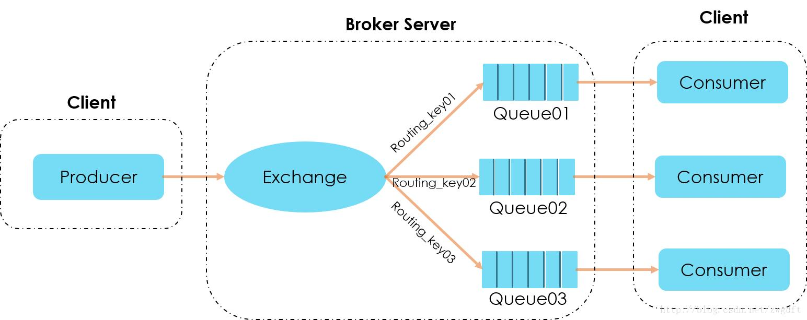
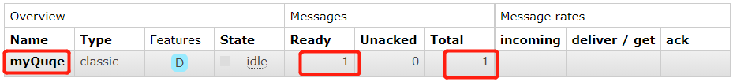
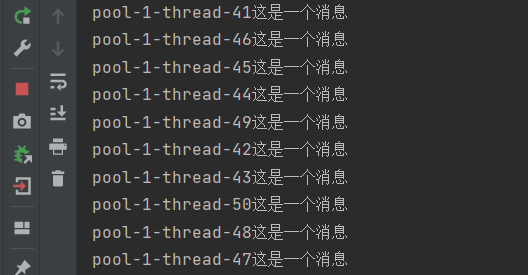
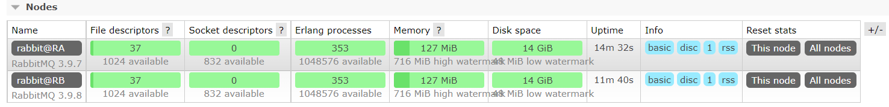
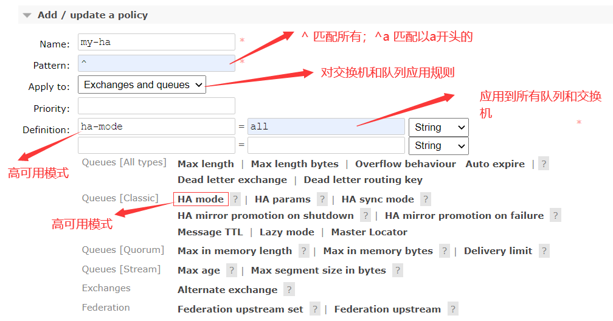
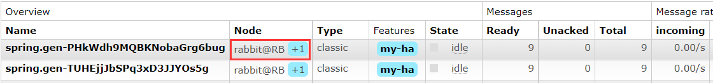
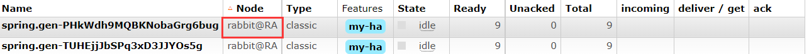
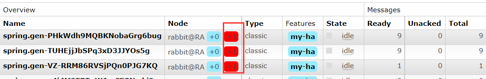

# RabbitMQ

## 简介

**介绍**：rabbitMMQ是一个由Erlang语言开发的`AMQP`的开源实现

**AMQP**：Advanced Message Quqe，高级消息队列协议。是应用层协议的一个开放标准，为面向消息的中间件设计，基于此协议的客户端与消息中间件可传递消息，不局限于语言

**特点**：可靠性（Reliability）、灵活路由（Flexible Routing）、消息集群（Clustering）、高可用（Highly Available）、多种协议、多语言客户端、管理界面、跟踪机制（Tracing）



组成部分说明：

- Broker：消息队列服务进程，此进程包含：Exchange 和 Queue
- Exchange：消息队列交换机，按一定的规则将消息转发到某个队列，对消息进行过滤
- Queue：消息队列，存储消息的队列；一个消息可以存储一个或多个队列，等待消费者消费
- Binding：将交换机和消息队列进行绑定。一个绑定就是基于路由键将交换机和消息队列连接起来的路由规则
- 提供者：消息的生产者，发送消息到交换机，然后由交换机根据`Binding`转发到相应的队列
- 消费者：消息的消费者，从消息队列取得消息的客户端

生产者发送消息：

1. 生产者和Broker建立TCP连接
2. 生产者和Broker建立通道
3. 生产者通过通道将消息发送给Broker，由Exchange将消息进行转发
4. Exchange将消息转发到指定的Queue（队列）

消费者消费消息：

1. 消费者和Broker建立TCP连接
2. 消费者和Broker建立通道
3. 消费者监听指定的Queue（队列）
4. 当有消息到达Queue时Broker默认将消息推送给消费者
5. 消费者接收到消息
6. ack回复

## 安装及设置

### 在线安装

1. 安装Erlang环境和Rabbitmq，访问Rabbitmq官网

   ```bash
   #1.新建仓库文件 /etc/yum.repos.d/rabbitmq.repo，仓库文件内容查看rabbitmq官网
   
   #2.更新包
   yum update -y
   yum -q makecache -y --disablerepo='*' --enablerepo='rabbitmq_erlang' --enablerepo='rabbitmq_server'
   
   #3.从仓库安装依赖
   yum install socat logrotate -y
   
   #4.安装Erlang和RabbitMQ
   yum install --repo rabbitmq_erlang --repo rabbitmq_server erlang rabbitmq-server -y
   ```

### Docker安装

```bash
docker run -d --hostname rabbit1 --name rabbit1 -p 5672:5672 -p 15672:15672 -e RABBITMQ_DEFAULT_USER=root -e RABBITMQ_DEFAULT_PASS=123456 rabbitmq:3-management
```

访问标准后台管理控制台：http://192.168.10.131:15672  用户名/密码：root/123456

### 基础设置

1. 输入`erl`，可以看到屏幕输出erlang语言的版本

   ```bash
   [root@localhost ~]$ erl
   Erlang/OTP 24 [erts-12.1] [source] [64-bit] [smp:1:1] [ds:1:1:10] [async-threads:1] [jit]
   Eshell V12.1  (abort with ^G)
   ```

2. 启动`Rabbitmq`

   ```bash
   rabbitmq-server start &		#后台启动
   rabbitmqctl stop		#关闭rabbit和erlang程序
   
   rabbitmq-server -detached	#以守护进程启动
   rabbitmqctl stop_app	#停止rabbit应用
   rabbitmqctl start_app	#启动rabbit应用
   ```

3. 插件的安装

   ```bash
   rabbitmq-plugins enable	[插件名]	#安装插件
   rabbitmq-plugins disable [插件名]	#卸载插件
   
   #安装rabbitmq管控台插件，然后重启rabbitmq
   rabbitmq-plugins enable rabbitmq_management
   #关闭防火墙
   systemctl stop firewalld
   #浏览器访问：http://192.168.10.131:15672/
   ```

4. 用户管理

   ```bash
   #添加用户
   rabbitmqctl add_user {user} {passwd}
   
   #删除用户
   rabbitmqctl delete_user {user}
   
   #查看用户列表
   rabbitmqctl list_users
   
   #修改密码
   rabbitmqctl change_password {user} {newPwd}
   
   #设置用户角色，可以存在如下tag
   #	management
   #	monitoring
   #	policymaker
   #	administrator
   ## management < policymaker|monitoring  < administrator
   rabbitmqctl set_user_tags {username} {tag}
   ```

5. 权限管理

   ```bash
   #授权命令
   #rabbitmqctl [--node <node>] [--longnames] [--quiet] set_permissions [--vhost <vhost>] <username> <conf> <write> <read>
   #配置user用户拥有对所有资源的读写配置权限
   rabbitmqctl set_permissions -p / user '.*' '.*' '.*'
   
   #查看用户权限
   rabbitmqctl list_permissions
   #查看指定用户权限
   rabbitmqctl list_user_permissions user
   ```

6. vhost配置

   vhost是rabbitmq的一个命名空间，可以限制消息的存放位置；利用命名空间可以进行权限的控制，类似于win中的文件夹，不同文件夹中存放不同的文件

   ```bash
   #添加
   rabbitmqctl add_vhost {vhostName}
   
   #删除
   rabbitmqctl delete_vhost {vhostName}
   
   #查看所有命名空间
   rabbitmqctl list_vhost
   ```


## RabbitMQ流程


**流程**：Publisher`生产消息`，通过`信道`发送消息到`Broker(rabbitmq主服务进程)`，Borker进程通过相关配置将消息发送到`Virtual Host`中的`Exchange`中，Exchange根据不同的`Binging（路由键）`将消息发送到对应的消息队列中，consumer通过`信道`从消息队列中取出消息

## Exchange类型

Exchange分发消息到消息队列时，根据类型的不同，分发策略不一样。有如下类型：direct、fanout、topic、headers

1. **direct**：消息中的`路由键(routing key)`如果和Binding中的`binding key`一致，该交换机就将消息发送到对应的队列中；它是完全匹配、单播的模式

2. **fanout**：每个发到`fanout类型交换机`的消息都会分发到`所有`绑定的队列上去；fanout交换机`不处理路由键`，`Binding`只是简单的将消息队列绑定到交换机，交换机会将消息转发到与该交换机绑定的所有消息队列中；fanout类型交换机转发消息是`最快的`；该类型交换机类似于广播模式、一对多

   消费者需要在消息发送前监听队列，否则消息先发送则消费者可能会错过消息；这种模式适合用于消息数据不重要的情况下

3. **topic**：topic交换机模式匹配消息的路由键属性，将路由键和某个模式进行匹配，此时队列需绑定到一个模式上。它将路由键和绑定键的字符串切分成单词，这些单词用点隔开。`topic`中的绑定键可以写通配符`#`和`*`，`#`匹配0个或多个单词，`*`匹配一个单词

   

## 发送消息到队列

1.  **依赖**

   ```xml
   <dependency>
       <groupId>com.rabbitmq</groupId>
       <artifactId>amqp-client</artifactId>
       <version>5.9.0</version>
   </dependency>
   ```

2. **创建工具类**

   ```java
   public class MqUtil {
       private static final ConnectionFactory factory;
       private MqUtil(){}
       static {
           //创建连接工厂
           factory=new ConnectionFactory();
           //配置rabbitMq连接信息
           factory.setHost("192.168.10.131");
           factory.setPort(5672);
           factory.setUsername("user");
           factory.setPassword("1998");
       }
       public static ConnectionFactory getConnectionFactory(){
           return factory;
       }
   }
   ```

3. `Quqe`、`Exchange`、`BindKey`可以通过代码创建，也可以在管控台手动创建

4. **直接发送消息到队列**

   ```java
   ConnectionFactory factory=MqUtil.getConnectionFactory();	//通过工具类获取连接工厂
   try(Connection connection=factory.newConnection()){     //获取链接
       try(Channel channel=connection.createChannel()){    //创建信道
           /* 
            * 声明一个队列，当队列已存在时直接忽略，不存在时创建队列，当该名字队列已存在时，声明队列非必须
            * 参数1：队列名取值
            * 参数2：是否持久化队列
            * 参数3：是否自动排外，自动排外则只允许一个消费者监听
            * 参数4：是否自动删除队列，自动删除时，队列中没有消息 && 没有消费者监听则删除队列
            * 参数5：设置队列的一些属性，通常可以为null
            * */
           channel.queueDeclare("myQuqe",true,false,false,null);
           String message="这是一个消息";
           /*
            * 发送消息到mq
            * 参数1：交换机名称，为空串代表不使用交换机
            * 参数2：为队列名或routingKey，当指定了交换机名称时该值为为队列名或routingKey
            * 参数3：消息属性，通常为空
            * 参数4：为具体的消息的字节数组
            * */
           for (int i=0;i<10;i++){
               channel.basicPublish("","myQuqe",null,message.getBytes(StandardCharsets.UTF_8));
               System.out.println("消息:"+i+"发送成功");
           }
       }
   } catch (Exception e) {
       e.printStackTrace();
   }
   ```

   在管控台查看队列，检查消息是否发送成功

   

5. **接收消息**

   ```java
   ConnectionFactory factory=MqUtil.getConnectionFactory();	//通过工具类获取连接工厂
   Connection connection = null;
   Channel channel = null;
   try {
       connection = factory.newConnection(); //获取链接
       channel = connection.createChannel(); //创建信道
       /*
        * 声明一个队列，如果存在该名称队列，则忽略
        */
       channel.queueDeclare("myQuqe", true, false, false, null);
       /*
        * 接收消息
        * 参数1：当前消费者需要监听的队列名，队列名须和发送消息时的队列名一致
        * 参数2：消息是否自动确认；true自动确认，表示确收接收消息后，消息从队列移除
        * 参数3：消息接收者的标签；多个消费者监听一个队列时用于区分不同的消费者
        * 参数4：消息接收后的回调方法，用于接收消息后的处理代码
        * 注意：使用了 basicConsume 方法后，会自动启动一个线程持续监听队列，如果队列中有消息，则会自动接收
        * 因此，这里不能关闭连接和信道对象
        */
       channel.basicConsume("myQuqe", true, "", new DefaultConsumer(channel) {
           @Override
           public void handleDelivery(String consumerTag, Envelope envelope, AMQP.BasicProperties properties, byte[] body) throws IOException {
               String message= new String(body,StandardCharsets.UTF_8);
               System.out.println(message);
           }
       });
   } catch (Exception e) {
       e.printStackTrace();
   }
   ```

   此时可以从`myQuqe`获取到前面发送的消息

## Exchange转发消息

创建一个 MQ 工具类，用于获取连接

```java
public class MqUtil {
    private static final ConnectionFactory factory;
    private MqUtil(){}
    static {
        //创建连接工厂
        factory=new ConnectionFactory();
        //配置rabbitMq连接信息
        factory.setHost("192.168.10.131");
        factory.setPort(5672);
        factory.setUsername("user");
        factory.setPassword("1998");
    }
    public static ConnectionFactory getConnectionFactory(){
        return factory;
    }
}
```

1. **direct**

   **消息发送者：**

   ```java
   ConnectionFactory factory=MqUtil.getConnectionFactory();	//通过工具类获取连接工厂
   try(Connection connection=factory.newConnection()) {     //获取链接
       try (Channel channel = connection.createChannel()) {    //创建信道
           // 申明队列，非必须
           channel.queueDeclare("myQuqe",true,false,false,null);
           /*
            * 声明交换机
            * 参数1：交换机名称，任意取值
            * 参数2：交换机类型，取值为：direct、fanout、topic、headers
            * 参数3：是否是持久化交换机
            * 注意：和队列类似，声明时如果存在则放弃声明，不存在则声明
            * 声明代码非必须，但交换机需要保证必须存在
            * */
           channel.exchangeDeclare("myExchange","direct",true);
           /*
            * 将队列绑定到交换机
            * 参数1：队列名称
            * 参数2：交换机名称
            * 参数3：消息的routingKey(就是BindingKey)
            * 注意：绑定时必须保证 队列 和 交换机 都已成功声明
            * */
           channel.queueBind("myQuqe","myExchange","directKey");
           String message="这是一个消息";
           // basicPublish(交换机名称、routingKey、消息属性、消息)
           // exchange 通过比较 routingKey 和 bindingKey ，然后转发消息到对应的队列
           channel.basicPublish("myExchange","directKey",null,message.getBytes(StandardCharsets.UTF_8));
       }
   }catch (Exception e){
       e.printStackTrace();
   }
   ```

   

2. **fanout**：fanout类型需要先启动消息监听，不然有可能会错过消息；fanout类似于广播模式，`不需要绑定RoutingKey`，而有可能有多个消费来接收这个交换机中的数据，因此创建队列名时需要随机（可能有太多的队列）

   **消息消费者：**

   ```java
   //采用多线程模拟多个消费者监听消息
   for (int i=0;i<10;i++){
       Thread thread=new Thread(ReviceMq::reviceMqByExchangeFanout);
       thread.start();
   }
   //消息消费者，在消费者中创建随机队列，以及将交换机和队列进行简单的绑定
   private static void reviceMqByExchangeFanout() {
       ConnectionFactory factory=MqUtil.getConnectionFactory();
       try(Connection connection=factory.newConnection()){
           try(Channel channel=connection.createChannel()){
               /*
                * queueDeclare()获取一个队列
                * 没有参数的 queueDeclare() 获取的队列有如下特征：
                * 这个队列的数据非持久化
                * 是排外的（最多允许一个消费者监听）
                * 自动删除的，没有任何消费者监听时，会自动删除
                * */
               String queue = channel.queueDeclare().getQueue();
               //exchangeDeclare(交换机名字，交换机类型，交换机是否持久化)，对于已存在的交换机该方法忽略执行
               channel.exchangeDeclare("fanoutExchange","fanout",true);
               //queueBind(队列名，交换机名，RoutingKey),将随机队列绑定到交换机，fanout类型不需要指定RoutingKey
               channel.queueBind(queue,"fanoutExchange","");
               channel.basicConsume(queue,true,"",new DefaultConsumer(channel){
                   @Override
                   public void handleDelivery(String consumerTag, Envelope envelope, AMQP.BasicProperties properties, byte[] body) throws IOException {
                       String msg=new String(body);
                       System.out.println(Thread.currentThread().getName()+msg);
                   }
               });
           }
       }catch (Exception e){
           e.printStackTrace();
       }
   }
   ```

   **消息生产者**：

      ```java
   //声明交换机，非必须，但必须保证交换机已经存在
   String message="这是一个消息";
   // basicPublish(交换机名称、routingKey、消息属性、消息)
   /*
   * basicPublish(交换机名称、routingKey、消息属性、消息)
   * 因为时fanout类型交换机，因此不需要指定RoutingKey
   * */
   channel.basicPublish("fanoutExchange","",null,message.getBytes(StandardCharsets.UTF_8));
      ```

   当消息生产者发送一条消息时，所有绑定了`fanoutExchange`交换机的队列都会收到消息；以下为模拟消息消费者打印的结果

      

   可以看到监听绑定`fanoutExchange`交换机的所有队列都接收到消息

    消费者代码运行后可以在管控台看到，创建了许多随机队列、一个交换机；当程序停止时，队列消失，交换机依然存在

3. **topic**

   **消息消费者**：

   ```java
   //和 fanout 类似，创建 topic 类型交换机，持久化或者非持久化队列(看对数据一致性要求)，队列与交换机绑定时可使用通配符
   //创建三个消息接收者，伪代码如下：
   Connection connection = factory.newConnection();
   Channel channel = connection.createChannel();
   
   //queueDeclare(队列名，是否持久化，是否自动排外，是否自动删除，其他属性)
   channel.queueDeclare("topicQuqe1",true,false,false,null);
   
   channel.exchangeDeclare("topicExchange","topic");  //创建交换机
   
   //queueBind(队列名，交换机名，RoutingKey)
   channel.queueBind("topicQuqe1","topicExchange","aa");  //消费者1，绑定 ：aa
   //channel.queueBind("topicQuqe2","topicExchange","aa.*"); //消费者2，绑定 ：aa.*
   //channel.queueBind("topicQuqe3","topicExchange","aa.#"); //消费者3，绑定 ：aa.#
   
   //basicConsume(队列名，是否自动确认，消费者标签，接收消息后的回调方法)
   channel.basicConsume("topicQuqe1",true,"",new DefaultConsumer(channel){
       @Override
       public void handleDelivery(String consumerTag, Envelope envelope, AMQP.BasicProperties properties, byte[] body) throws IOException {
           System.out.println(new String(body));
       }
   });
   ```

   **消息生产者**：

   ```java
   String message="这是一个消息";
   //basicPublish(交换机名称、routingKey、消息属性、消息)
   channel.basicPublish("topicExchange","aa",null,message.getBytes(StandardCharsets.UTF_8));
   ```

   当消息生产者发送消息时，消息接收者的控制台输出如下：

   

   `routingKey为aa`的消息通过topic交换机转发到了 `bindingKey 为 aa` 和`bindingKey为aa.#`的队列；`bindingKey为aa.*`的队列未收到消息，`*`表示只匹配一个单词

4. **topic和fanout应用场景分析**

   1. Topic类型，消息一对多的一种交换机类型；和fanout都能实现一个消息发送多个队列
   2. Fanout更适用于同一个功能的不同进程来获取数据；例如：手机app，每个用户安装都启动一个随机队列，监听同一个fanout交换机，用于接收消息
   3. Topic更适用于不同功能模块接收同一个消息；例如：商城下单成功后需要发送消息到队列，订单 order.dingdan、order.fapiao、order.wl，可以针对不同的功能设置topic
   4. topic可以使用明确的队列名称（针对数据一致性要求严格的使用明确队列名，并使用持久化队列），也可以使用随机队列名称；fanout建议使用随机队列名称

5. 一些词的描述

   1. 是否自动删除：针对队列和交换机，在没有被监听或绑定的情况下，自动删除创建的 交换机或队列
   2. 是否持久化：针对队列和交换机，当`rabbit重启`时
   3. 是否排外：针对队列，是否只允许一个消费者监听

   运行成功后可以在管控台界面查看交换机和队列的绑定信息，以及消息信息；消费者接收消息同前面一样，监听队列即可

   


## 事务性消息

> 事务消息与数据库的事务类似，保证MQ中的消息是否全部发送成功，防止消息丢失的一种策略

RabbitMQ有两种方式解决这个问题：

1. 通过AMQP提供的事务机制实现
2. 使用发送者确认模式实现，效率`高于`AMQP提供的事务机制

事务的实现主要是对信道(Channel)的设置，方法如下：

- channel.txSelect()：声明启动事务
- channel.txCommit()：提交事务
- channel.txRollback()：回滚事务

### AMQP事务机制

**事务消息消费者**：

```java
private static void reviceTransactionMQ() {
    ConnectionFactory factory = MqUtil.getConnectionFactory();
    try {
        Connection connection = factory.newConnection();
        Channel channel = connection.createChannel();
        //exchangeDeclare(交换机名，交换机类型);
        channel.exchangeDeclare("transactionExchange","fanout");
        //queueDeclare(队列名，是否持久化，是否自动排外，是否自动删除，其他属性)
        String queue = channel.queueDeclare().getQueue();
        //queueBind(队列名，交换机名，RoutingKey)
        channel.queueBind(queue,"transactionExchange","");
        //basicConsume(队列名，是否自动确认，消费者标签，接收消息后的回调方法)
        channel.basicConsume(queue,true,"",new DefaultConsumer(channel){
            @Override
            public void handleDelivery(String consumerTag, Envelope envelope, AMQP.BasicProperties properties, byte[] body) throws IOException {
                String msg=new String(body)+"_aa";
                System.out.println(msg);
            }
        });
    }catch (Exception e){
        e.printStackTrace();
    }
}
```


**事务消息发送者**：

```java
private static void sendTransactionMQ() {
    ConnectionFactory factory = MqUtil.getConnectionFactory();
    Channel channel = null;
    try (Connection connection = factory.newConnection()) {     //获取链接
        channel = connection.createChannel();    //创建信道
        String message = "这是一个消息";
        /*
        * 开启事务，此时必须要手动提交或者回滚
        * */
        channel.txSelect();
        //basicPublish(交换机名称、routingKey、消息属性、消息)
        channel.basicPublish("transactionExchange", "", null, message.getBytes(StandardCharsets.UTF_8));
        System.out.println(10/0);  //报错，展示开启事务后效果
        channel.basicPublish("transactionExchange", "", null, message.getBytes(StandardCharsets.UTF_8));
        /*
        * 提交事务，将消息发送到队列，释放内存
        * */
        channel.txCommit();
    } catch (Exception e) {
        try {
            //回滚事务
            channel.txRollback();
        } catch (IOException ex) {
            ex.printStackTrace();
        }
        e.printStackTrace();
    }
}
```

如上代码，如果发送多条消息，不开启事务时，会出现消息不完整的情况；开启事务后，多条消息要么全部发送成功，要么一条都不成功

### 发送者确认模式

Confirm发送者确认模式和事务类似，也是通过对设置Channel进行发送方确认的，最终达到确保所有消息发送成功

对于AMQP事务机制，如果一次性发送的消息很多，因为一条消息错误而回滚，那么效率会很低

Confirm发送者确认模式，会不断地尝试重新发送消息，直到全部成功

**Confirm有三种方式**

1. **方式一：普通确认**

   ```java
   /**
    * 普通确认模式
    */
   private static void sendConfirmMq1() {
       ConnectionFactory factory = MqUtil.getConnectionFactory();
       Channel channel = null;
       try (Connection connection = factory.newConnection()) {     //获取链接
           channel = connection.createChannel();    //创建信道
           String message = "这是一个消息";
           /*
            * 开启普通确认模式
            * */
           channel.confirmSelect();
           //basicPublish(交换机名称、routingKey、消息属性、消息)
           channel.basicPublish("confirmExchange", "aa", null, message.getBytes(StandardCharsets.UTF_8));
           /*
            * 阻塞并等待确认消息发送成功，可以传入时间参数（毫秒）；如果服务确认消息发送成功返回true，否则返回false
            * 如果等待超时会抛出InterruptedException异常，此时表示服务器出现了问题需要补发消息
            * 补发可以通过：递归调用补发消息；或者将消息存入redis，等待定时任务补发
            * */
           boolean flag = channel.waitForConfirms();
           System.out.println(flag+"：消息");
       } catch (Exception e) {
           //补发消息 或 将消息存入redis
           e.printStackTrace();
       }
   }
   ```

   

2. **方式二：批量确认**

   ```java
   /**
    * 批量确认模式
    */
   private static void sendConfirmMq2() {
       ConnectionFactory factory = MqUtil.getConnectionFactory();
       Channel channel = null;
       try (Connection connection = factory.newConnection()) {     //获取链接
           channel = connection.createChannel();    //创建信道
           String message = "这是一个消息";
           /*
            * 开启普通确认模式
            * */
           channel.confirmSelect();
           //basicPublish(交换机名称、routingKey、消息属性、消息)
           channel.basicPublish("confirmExchange", "aa", null, message.getBytes(StandardCharsets.UTF_8));
           // 多条消息
           channel.basicPublish("confirmExchange", "aa", null, message.getBytes(StandardCharsets.UTF_8));
           /*
           * waitForConfirmsOrDie() 批量消息确认，它会向服务器中确认当前信道所有发送的消息
           * 该方法没有返回值，如果服务器中有一条消息没能够发送成功，或发送确认消息失败，则会抛出InterruptedException异常，则需要执行补发策略
           * waitForConfirmsOrDie() 有一个参数，表示等待服务确认的时间
           * 注意： 批量确认模式比普通确认模式要快
           *       如果出现需要补发情况，无法定位具体哪一条消息抛出异常，需要将本次发送的消息全部补发
           * */
           channel.waitForConfirmsOrDie();
       } catch (Exception e) {
           //补发策略
           e.printStackTrace();
       }
   }
   ```

   

3. **方式三：异步确认**

   ```java
   /**
    * 异步确认消息
    */
   private static void sendConfirmMq3() {
       ConnectionFactory factory = MqUtil.getConnectionFactory();
       Channel channel = null;
       try (Connection connection = factory.newConnection()) {     //获取链接
           channel = connection.createChannel();    //创建信道
           String message = "这是一个消息";
           channel.confirmSelect();
           /*
           * 开启消息确认监听
           * 注意：需要在发送消息之前开启监听
           * */
           channel.addConfirmListener(new ConfirmListener() {
               /**
                * 消息确认后的回调方法
                * 参数一：为被确认的消息编号，从 1 开始，依次递增，标记当前是第几条消息
                * 参数二：是否确认多条，true 表示本次同时确认了多条消息，false 表示仅确认了当前消息
                */
               @Override
               public void handleAck(long l, boolean b) throws IOException {
                   System.out.println(l+"消息发送成功，是否全部确认："+b);
               }
   
               /**
                * 消息没有确认的回调方法
                * 参数一：为没被确认的消息编号，从 1 开始，依次递增，标记当前是第几条消息
                * 参数二：是否同时没确认多条
                * 如果参数二为 true，表示小于当前消息编号的所有消息都可能没有发送成功，可能需要补发
                *          为 false，表示仅当前编号消息没有被确认，需要补发
                */
               @Override
               public void handleNack(long l, boolean b) throws IOException {
                   //补发策略
                   System.out.println(l+"消息发送成功失败，是否全部没确认："+b);
               }
           });
           for (int i=0;i<4000;i++){
               //basicPublish(交换机名称、routingKey、消息属性、消息)
               channel.basicPublish("confirmExchange", "aa", null, message.getBytes(StandardCharsets.UTF_8));
           }
       } catch (Exception e) {
           //补发策略
           e.printStackTrace();
       }
   }
   ```

### 消费者确认模式*

**注意**：

- 消费者手动确认消息时，如果开启了事务，则必须提交事务，否则会造成消息重处理
- 可以使用 `envelope.isRedeliver()`判断当前消息是否已经被接收过，从而判断消息是否已经处理成功，可以进行防重处理

```java
/**
 * 手动确认消息
 */
private static void confirmMQ() {
    ConnectionFactory factory = MqUtil.getConnectionFactory();
    try {
        Connection connection = factory.newConnection();
        Channel channel = connection.createChannel();

        /*
        * basicConsume(队列名，是否自动确认，消费者标签，接收消息后的回调方法)
        * 参数二：是否自动确认；如果自动确认，那么当消费者收到消息时，就会确认并从队列中移除
        * 在处理消息时报错，就会造成消息的丢失，即当前消息未处理，但是已经被确认了；因此需要手动确认
        * */
        channel.basicConsume("topicQuqe1",false,"topic1",new DefaultConsumer(channel){
            @Override
            public void handleDelivery(String consumerTag, Envelope envelope, AMQP.BasicProperties properties, byte[] body) throws IOException {
                // isRedeliver() 判断消息是否已经被接收过，如果被接收过 返回true，否则返回false
                boolean redeliver = envelope.isRedeliver();
                //获取消息编号，后面根据编号来确认消息
                long tag=envelope.getDeliveryTag();
                //获取当前内部类信道
                Channel c=this.getChannel();
                if (!redeliver){ //消息没被接收过
                    String msg=new String(body);
                    //处理消息逻辑
                    System.out.println(msg);
                    /*
                     * 手动确认消息，确认以后表示当前消息已经处理成功，需要从列队中移除
                     * 该方法的调用应该在当前消息已经被处理结束后执行
                     * 参数一：为当前消息的编号，参数二：是否确认多个，true 表示确认小于等于当前消息编号的消息，false 只确认当前消息
                     * 注意：手动确认时，如果开启了事务，则必须将事务提交，否则会确认失败
                     * */
                    c.basicAck(tag,true);
                }else {
                    //消息之前已经被接收过，消息可能已经被处理，未确认； 需要进行防重处理
                    //如果经过判断，该条消息未处理完成，则进行消息的处理
                    //如果消息已经处理完成，则只需要确认消息
                    c.basicAck(tag,false);
                }

            }
        });
    }catch (Exception e){
        e.printStackTrace();
    }
}
```


## springboot集成rabbitmq

导入rabbitMQ起步依赖

```xml
<dependency>
    <groupId>org.springframework.boot</groupId>
    <artifactId>spring-boot-starter-amqp</artifactId>
    <version>2.5.6</version>
</dependency>
```

配置 application 文件

```properties
spring.rabbitmq.host=192.168.10.131
spring.rabbitmq.port=5672
spring.rabbitmq.username=user
spring.rabbitmq.password=1998
```

### 消息消费者

1. 先启动消费者，通过注解创建交换机和队列，并通过注解启动监听
2. 接收消息处理使用注解，也可以用 `AmqpTemplate` 来进行接收，不过它只会获取一条消息，不会一直监听消息队列
3. 注意：在springboot中，当处理消息报错时不会自动确认，会一直尝试获取消息并处理；因此，在处理消息时需要注意逻辑，防止消息重处理

```java
//标记方法，该方法会自动监听并接收消息，可以附带参数，用于创建交换机、队列、以及进行绑定
@RabbitListener(bindings = {
    @QueueBinding(
        value = @Queue(durable = Exchange.FALSE,exclusive = Exchange.FALSE,autoDelete = Exchange.TRUE),
        exchange=@Exchange(name = "bootTopicExchange",type = "topic",durable=Exchange.FALSE),
        key = "aa")})
public void reviceTopicMsg1(Message message) {
    System.out.println(new String(message.getBody())+"aa");
}
```

### 发送者

```java
@Autowired
AmqpTemplate amqpTemplate;

public void topicMsgSend() {
    //convertAndSend(交换机，routingKey，msg)
    //在发送消息时，需要保证此时交换机已经存在
    amqpTemplate.convertAndSend("bootTopicExchange","aa","这是一条消息 topicMsgSend");
}
```


## 集群

### 集群搭建步骤

1. 准备两台主机，并安装rabbitmq，添加用户并给与权限

2. 配置 hosts 文件

   ```bash
   #修改主机名,方便区分rabbit节点
   $vim /etc/hostname
   RA
   
   ## hosts文件配置，两台主机都需要配置
   $vim /etc/hosts
   192.168.10.131 RA
   192.168.10.132 RB
   ```

3. 保证两台主机 `/var/lib/rabbitmq/.erlang.cookie`中内容一致

   ```bash
   #可以通过scp 文件 ip:文件 进行跨主机拷贝
   $scp .erlang.cookie 192.168.10.132:/var/lib/rabbitmq
   ```

4. 任意选择一台主机，作为rabbitmq节点加入另外一台主机

   ```bash
   #以守护进程方式启动rabbitmq
   rabbitmq-server -detached
   
   #仅停止应用；rabbitmqctl stop 会关闭应用和erlang节点
   rabbitmqctl stop_app
   
   #加入另一个节点
   rabbitmqctl join_cluster rabbit@RA
   
   #启动应用
   rabbitmqctl start_app
   ```

   此时可以查看管控台界面如下：

   

5. 注意：普通集群模式，并不保证队列的高可用性。尽管交换机、绑定这些可以复制到集群里的任何一个节点，但是队列内容不会复制。虽然该模式解决一项目组节点压力，但队列节点宕机直接导致该队列无法应用，只能等待重启。所以要想在队列节点宕机或故障也能正常应用，就要复制队列内容到集群里的每个节点，也就是必须要创建镜像队列

6. 配置镜像集群，通过管控台配置

   

   

   添加了以上规则后，集群变为高可用，对于队列和交换机都产生镜像

### springboot连接集群

1. 配置 application 文件

   ```properties
   #单机模式
   #spring.rabbitmq.host=192.168.10.131
   #spring.rabbitmq.port=5672
   #spring.rabbitmq.username=user
   #spring.rabbitmq.password=1998
   
   #集群模式
   spring.rabbitmq.addresses=192.168.10.130:5672,192.168.10.132:5672
   spring.rabbitmq.username=root
   spring.rabbitmq.password=root
   ```

2. 在没有配置镜像集群时，当消息发送到集群中一个节点上的队列时，此时该节点宕机，消息就会直接丢失；

   在配置了镜像集群时，队列中的消息会同步到另一个节点队列中；当消息节点宕机时，消息会自动在另一个节点的该队列中

   镜像模式，两个节点都正常工作时：

   

   当`rabbit@RB节点宕机`时，此时消息已经在 rabbit@RA中：

   

   当再次`重启rabbit@RB节点`时，管控台node会出现`+1`，表示有一个镜像

   


