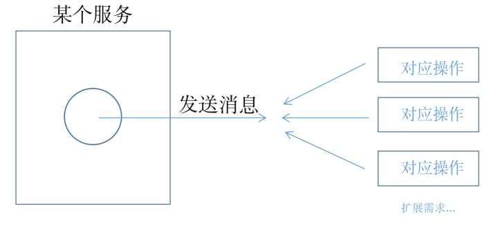

# Java中事件监听

## 应用场景

### 案例

假设现在有这么一个业务场景：

> 用户在京西商城下单成功后，平台要发送短信通知用户下单成功

最直观的想法是直接在order()方法中添加发送短信的业务代码：

```java
public void order(){
  // 下单成功
  System.out.println("下单成功...");
  // 发送短信
  sendSms();
}
```

乍一看没什么不妥，但是如果我们加上一根时间轴，那么代码就有问题了：

> 一个月后，京西搞了自建物流体系，用户下单成功后，需要通知物流系统发货

于是你又要打开OrderService修改order()方法：

```java
public void order(){
  // 下单成功
  System.out.println("下单成功...");
  // 发送短信
  sendSms();
  // 通知车队发货 
  notifyCar();
}
```

> 又过了一个月，东哥被抓了，股价暴跌，决定卖掉自己的车队，所以下单后就不用通知车队了

重新修改OrderService：

```java
public void order(){
  // 下单成功
  System.out.println("下单成功...");
  // 发送短信
  sendSms();
  // 车队没了，注释掉这行代码 
  // notifyCar();
}
```

又过了一个月，东哥明尼苏达州荣耀归来：回来做我的兄弟一起开车吧。

好的，东哥。

```java
public void order(){
  // 下单成功
  System.out.println("下单成功...");
  // 发送短信
  sendSms();
  // 车队买回来了
  notifyCar()
}
```

车队回来了，你却受不了这大起大落异常刺激的生活，决定离职

### 以增量的方式应对变化的需求



## Spring事件监听

### 业务代码

```java
/**
 * 订单服务
 */
@Service
public class OrderService {

    @Autowired
    private ApplicationContext applicationContext;

    public void order() {
        // 下单成功
        System.out.println("下单成功...");
        // 发布通知
        applicationContext.publishEvent(new OrderSuccessEvent(this));
        System.out.println("main线程结束...");
    }
}
```

### 自定义事件

OrderSuccessEvent（继承ApplicationEvent，自定义事件）

```java
public class OrderSuccessEvent extends ApplicationEvent {
	//这里还可以自定义参数，并通过构造方法赋值
    public OrderSuccessEvent(Object source) {
        super(source);
    }
}
```


### 监听事件

可以指定监听者监听的事件类型，那么就会对未声明的事件不进行监听

SmsService（实现ApplicationListener，监听OrderSuccessEvent）

```java
/**
 * 短信服务，监听OrderSuccessEvent
 */
@Service
public class SmsService implements ApplicationListener<OrderSuccessEvent> {

    @Override
    public void onApplicationEvent(OrderSuccessEvent event) {
        this.sendSms();
    }

    /**
     * 发送短信
     */
    public void sendSms() 
        System.out.println("发送短信...");
    }
}
```

**也可以通过注解的方式监听事件**

```java
@EventListener(classes = OrderSuccessEvent.class)
public void onApplicationEvent(OrderSuccessEvent event) {
    System.out.println("发送短信...");
}
```

### Test

```java
@RunWith(SpringRunner.class)
@SpringBootTest
public class Test {

    @Autowired
    private OrderService orderService;

    @Test
    public void testSpringEvent() {
        orderService.order();
    }
}

//输出
//	下单成功...
//	发送短信...
//	main线程结束...
```

### 异步调用

某些时候，为了推送第三方信息的执行不影响业务代码，可以通过在监听事件的方法上添加注解`@Async`注解，开启异步执行(启动类需要配置注解：`@EnableAsync`)

### 事务监听

对于业务代码需要提交事务后，或者说等待主线程执行完毕后再推送第三方信息，则可以使用事务监听

和普通事件监听类似，先定义事件，其次再定义事件监听器，事件监听器的代码如下

```java
// phase 指定事务什么情况下执行该监听器
// classes 指定事件
@Async
@TransactionalEventListener(phase = TransactionPhase.AFTER_COMMIT,classes = MyApplicationEvent.class)
public void onApplicationEventLister(MyApplicationEvent event) {
    System.out.println("时间监听器B 收到事件：" + event);
}
```

### 示例

1. 创建事件抽象类，以及其实现

   ```java
   //事件抽象类
   public abstract class TestEvent extends ApplicationEvent {
       private static final long serialVersionUID = -7558477450921553407L;
       private String listenerType;
       private String msgTwo;
   
       protected TestEvent(Object source) {
           super(source);
       }
   
       protected TestEvent(Object source, Clock clock) {
           super(source, clock);
       }
   
       public String getListenerType() {return listenerType;}
   
       public void setListenerType(String listenerType) {this.listenerType = listenerType;}
   
       public String getMsgTwo() {return msgTwo;}
   
       public void setMsgTwo(String msgTwo) {this.msgTwo = msgTwo;}
   }
   
   
   //事件实现类，事件T
   public class EventT extends TestEvent{
       private static final long serialVersionUID = -3817485810073854944L;
       private String mineMsg;
       public EventT(String listenerType,Object source, String mineMsg) {
           super(source);
           super.setListenerType(listenerType);
           this.mineMsg=mineMsg;
       }
   
       public String getMineMsg() {return mineMsg;}
   
       public void setMineMsg(String mineMsg) {this.mineMsg = mineMsg;}
   }
   ```

   

2. 创建事件监听抽象类，以及其实现

   ```java
   //事件监听器抽象类，也可通过注解，不实现ApplicationListener接口
   public abstract class TestEventListener implements ApplicationListener<TestEvent> {
       @Override
       public void onApplicationEvent(TestEvent event) {
           if (event.getSource() instanceof String) {
               handleBusinessData(event);
           } else {
               throw new IllegalArgumentException("事件类型代码错误");
           }
       }
       protected abstract void handleBusinessData(TestEvent event);
       
       //通过注解实现事件监听，而不实现ApplicationListener接口
   /*  @Async
       @EventListener(TestEvent.class)
       public void onApplicationEvent(TestEvent event) {
           if (event.getSource() instanceof String) {
               handleBusinessData(event);
           } else {
               throw new IllegalArgumentException("事件类型代码错误");
           }
       }*/
   }
   
   //事件监听器A实现类，可以根据source与ListenerType对多个不同事件处理不同处理逻辑
   @Component
   public class EventListenerA extends TestEventListener{
       @Override
       protected void handleBusinessData(TestEvent event) {
           if (!"listenerA".equals(event.getListenerType())) {
               return;
           }
           String code= (String) event.getSource();
           switch (code){
               case "EventT":
                   System.out.println("EventT");
                   break;
               default:
                   throw new RuntimeException("未实现的事件方法");
           }
       }
   }
   ```

3. 事件发布

   ```java
   //事件发布工具类，实现ApplicationContextAware接口，会自动注入ApplicationContext
   @Component
   public class PubEventUtil implements ApplicationContextAware {
       private static ApplicationContext applicationContext;
       @Override
       public void setApplicationContext(ApplicationContext applicationContext) throws BeansException {
           PubEventUtil.applicationContext=applicationContext;
       }
       public static void pubEvent(ApplicationEvent event){
           applicationContext.publishEvent(event);
       }
   }
   
   //发布事件
   TestEvent eventT = new EventT("listenerA","EventT", "msg");
   PubEventUtil.publishEvent(eventT);
   ```
   


## 消息队列发布订阅模式

