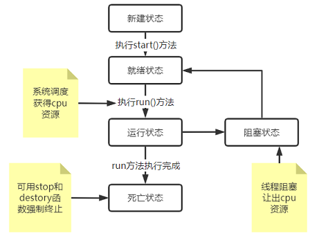

# Java多线程

## 线程基础

### 线程的周期



- 新建状态: 使用 **new** 关键字和 **Thread** 类或其子类建立一个线程对象后，该线程对象就处于新建状态。它保持这个状态直到程序 **start()** 这个线程
- 就绪状态: 当线程对象调用了start()方法之后，该线程就进入就绪状态。就绪状态的线程处于就绪队列中，要等待JVM里线程调度器的调度
- 运行状态: 如果就绪状态的线程获取 CPU 资源，就可以执行 **run()**，此时线程便处于运行状态。处于运行状态的线程最为复杂，它可以变为阻塞状态、就绪状态和死亡状态
- 阻塞状态: 如果一个线程执行了sleep（睡眠）、suspend（挂起）等方法，失去所占用资源之后，该线程就从运行状态进入阻塞状态。在睡眠时间已到或获得设备资源后可以重新进入就绪状态。可以分为三种：
  - 等待阻塞：运行状态中的线程执行 wait() 方法，使线程进入到等待阻塞状态。
  - 同步阻塞：线程在获取 synchronized 同步锁失败(因为同步锁被其他线程占用)。
  - 其他阻塞：通过调用线程的 sleep() 或 join() 发出了 I/O 请求时，线程就会进入到阻塞状态。当sleep() 状态超时，join() 等待线程终止或超时，或者 I/O 处理完毕，线程重新转入就绪状态
- 死亡状态: 一个运行状态的线程完成任务或者其他终止条件发生时，该线程就切换到终止状态

### 线程的优先级

每一个 Java 线程都有一个优先级，这样有助于操作系统确定线程的调度顺序

Java 线程的优先级是一个整数，其取值范围是 1 （Thread.MIN_PRIORITY ） - 10 （Thread.MAX_PRIORITY ）

默认情况下，每一个线程都会分配一个优先级 NORM_PRIORITY（5）

具有较高优先级的线程对程序更重要，并且应该在低优先级的线程之前分配处理器资源。但是，线程优先级不能保证线程执行的顺序，而且非常依赖于平台

## 线程创建

### 通过实现 Runnable 接口

实现 Runnable，在创建线程时传入实现了Runnable接口的实例，并调用start()方法启动线程

```java
public class MyThread implements Runnable{
    public static void main(String[] args) {
        //创建线程，并传入实现了Runnable类实例
        Thread thread=new Thread(new MyThread());
        thread.start();
        System.out.println("----------");
    }
    @Override
    public void run() {
        System.out.println("Runnable多线程");
    }
}
```

通过函数式编程快捷创建线程

```java
public class MyThread{
    public static void main(String[] args) {
        Thread thread=new Thread(()->{
            System.out.println("Runnable多线程");
        });
        thread.start();
        System.out.println("----------");	//此处打断点
    }
}

//输出结果：
//        -----------
//        Runnable多线程
```


### 通过继承 Thread 类

继承Thread，直接创建子类实例，并调用start()方法启动线程

```java
public class MyThread extends Thread{
    public static void main(String[] args) {
        MyThread thread=new MyThread();
        thread.start();
        System.out.println("-----------");
    }
    @Override
    public void run() {
        System.out.println("继承Thread多线程");	//此处打断点
    }
}

//输出结果：
//        -----------
//        继承Thread多线程
```

### 通过 Callable 和 Future 创建线程

- 创建 Callable 接口的实现类，并实现 call() 方法，该 call() 方法将作为线程执行体，并且有返回值
- 创建 Callable 实现类的实例，使用 FutureTask 类来包装 Callable 对象，该 FutureTask 对象封装了该 Callable 对象的 call() 方法的返回值
- 使用 FutureTask 对象作为 Thread 对象的 target 创建并启动新线程
- 调用 FutureTask 对象的 get() 方法来获得子线程执行结束后的返回值

```java
public class MyCallableThread implements Callable<String> {
    public static void main(String[] args) throws ExecutionException, InterruptedException {
        FutureTask<String> future=new FutureTask<>(new MyCallableThread());
        Thread thread = new Thread(future);
        thread.start();
        System.out.println("-----------");
        String s = future.get();        //获取线程执行结束后的返回值
        System.out.println(s);
    }
    @Override
    public String call() throws Exception {
        System.out.println("继承Callable实现线程");	//此处打断点
        return "123";
    }
}

//输出结果：
//        -----------
//        继承Callable实现线程
//        123
```

### 创建线程的三种方式的对比

- 采用实现 Runnable、Callable 接口的方式创建多线程时，线程类只是实现了 Runnable 接口或 Callable 接口，还可以继承其他类
- 使用继承 Thread 类的方式创建多线程时，编写简单，如果需要访问当前线程，则无需使用 Thread.currentThread() 方法，直接使用 this 即可获得当前线程

## 线程池的使用

线程池创建应该使用`ThreadPoolExecutor`方式创建，而不使用Executors去创建；Executor框架虽然提供了如newFixedThreadPool()、newSingleThreadExecutor()、newCachedThreadPool()等创建线程池的方法，但都有其局限性，不够灵活；另外由于前面几种方法内部也是通过ThreadPoolExecutor方式实现，使用ThreadPoolExecutor有助于大家明确线程池的运行规则，创建符合自己的业务场景需要的线程池，避免资源耗尽的风险

### ThreadPoolExecutor的构造函数

```java
public ThreadPoolExecutor(int corePoolSize,
                          int maximumPoolSize,
                          long keepAliveTime,
                          TimeUnit unit,
                          BlockingQueue<Runnable> workQueue,
                          ThreadFactory threadFactory,
                          RejectedExecutionHandler handler) {
    if (corePoolSize < 0 ||
        maximumPoolSize <= 0 ||
        maximumPoolSize < corePoolSize ||
        keepAliveTime < 0)
        throw new IllegalArgumentException();
    if (workQueue == null || threadFactory == null || handler == null)
        throw new NullPointerException();
    this.corePoolSize = corePoolSize;
    this.maximumPoolSize = maximumPoolSize;
    this.workQueue = workQueue;
    this.keepAliveTime = unit.toNanos(keepAliveTime);
    this.threadFactory = threadFactory;
    this.handler = handler;
}

// corePoolSize:指定了线程池中的线程数量
// maximumPoolSize:指定了线程池中的最大线程数量
// keepAliveTime:当线程池中空闲线程数量超过corePoolSize时，多余的线程会在多长时间内被销毁
// unit:keepAliveTime的单位
// workQueue:任务队列，被添加到线程池中，但尚未被执行的任务；它一般分为直接提交队列、有界任务队列、无界任务队列、优先任务队列几种
// threadFactory:线程工厂，用于创建线程，一般用默认即可
// handler:拒绝策略；当任务太多来不及处理时，如何拒绝任务
```

### workQueue任务队列

1. **直接提交队列**：设置为SynchronousQueue队列，SynchronousQueue是一个特殊的BlockingQueue，它没有容量，每执行一个插入操作就会阻塞，需要再执行一个删除操作才会被唤醒，反之每一个删除操作也都要等待对应的插入操作

2. **有界的任务队列**：有界的任务队列可以使用ArrayBlockingQueue实现

   当任务小于 corePoolSize 时，直接线程池分配任务；当任务大于 corePoolSize 时，将任务放入队列；当任务将 队列填满时，继续创建线程执行；当线程达到 maximumPoolSize 时，则执行拒绝策略。在这种情况下，线程数量的上限与有界任务队列的状态有直接关系，如果有界队列初始容量较大或者没有达到超负荷的状态，线程数将一直维持在corePoolSize以下，反之当任务队列已满时，则会以maximumPoolSize为最大线程数上限

3. **无界的任务队列**：无界任务队列可以使用LinkedBlockingQueue实现

   使用无界队列时，maximumPoolSize无效，因为任务可以无限添加到队列中

4. **优先任务队列：**优先任务队列通过PriorityBlockingQueue实现

   PriorityBlockingQueue它其实是一个特殊的`无界队列`，它其中无论添加了多少个任务；线程池创建的线程数也不会超过corePoolSize的数量，只不过其他队列一般是按照先进先出的规则处理任务，而PriorityBlockingQueue队列可以自定义规则根据任务的优先级顺序先后执行

### 拒绝策略

当队列满了，并且线程池线程数量已经达到 maximumPoolSize 时，此时有新任务进来时，执行拒绝策略

1. **AbortPolicy策略**：该策略会直接抛出异常，阻止系统正常工作
2. **CallerRunsPolicy策略**：如果线程池的线程数量达到上限，该策略会把任务队列中的任务放在调用者线程当中运行
3. **DiscardOledestPolicy策略**：该策略会丢弃任务队列中最老的一个任务，也就是当前任务队列中最先被添加进去的，马上要被执行的那个任务，并尝试再次提交
4. **DiscardPolicy策略**：该策略会默默丢弃无法处理的任务，不予任何处理。当然使用此策略，业务场景中需允许任务的丢失

以上内置的策略均实现了`RejectedExecutionHandler`接口，也可以自己扩展RejectedExecutionHandler接口，定义自己的拒绝策略

**自定义拒绝策略**

```java
private static void testThreadPoolRej() {
    ThreadPoolExecutor poolExecutor=new ThreadPoolExecutor(2, 4,5, TimeUnit.SECONDS,
            new ArrayBlockingQueue<>(1), Executors.defaultThreadFactory(),
            new RejectedExecutionHandler() {
                @Override
                public void rejectedExecution(Runnable r, ThreadPoolExecutor executor) {
                    System.out.println("执行了拒绝策略");
                    if (!executor.isShutdown()) {
                        executor.getQueue().poll();
                        executor.execute(r);
                    }
                }
            });
}
```


### ThreadFactory自定义线程创建

 线程池中线程就是通过ThreadPoolExecutor中的ThreadFactory，线程工厂创建的。那么通过自定义ThreadFactory，可以按需要对线程池中创建的线程进行一些特殊的设置，如命名、优先级等，下面代码我们通过ThreadFactory对线程池中创建的线程进行记录与命名

```java
private static void testThreadFactory() {
    ThreadPoolExecutor poolExecutor=new ThreadPoolExecutor(2, 4,
            5, TimeUnit.SECONDS,
            new ArrayBlockingQueue<>(1), new ThreadFactory() {
        @Override
        public Thread newThread(Runnable r) {
            // 这里使用函数式编程实现ThreadFactory，并对新建线程重命名
            return new Thread(r,"threadPool"+r.hashCode());
        }
    },new ThreadPoolExecutor.DiscardOldestPolicy());
}
```


### ThreadPoolExecutor扩展

ThreadPoolExecutor扩展主要是围绕beforeExecute()、afterExecute()和terminated()三个接口实现的，

1. **beforeExecute**：线程池中任务运行前执行
2. **afterExecute**：线程池中任务运行完毕后执行
3. **terminated**：线程池退出后执行

通过这三个接口我们可以监控每个任务的开始和结束时间，或者其他一些功能

```java
private static void testThreadPoolExt() {
    ThreadPoolExecutor poolExecutor=new ThreadPoolExecutor(2, 4,
            5, TimeUnit.SECONDS,
            new ArrayBlockingQueue<>(1), Executors.defaultThreadFactory(),
            new ThreadPoolExecutor.DiscardOldestPolicy()){
        @Override
        protected void beforeExecute(Thread t, Runnable r) {
            System.out.println("线程准备执行");
        }
        @Override
        protected void afterExecute(Runnable r, Throwable t) {
            System.out.println("线程执行结束");;
        }

        @Override
        protected void terminated() {
            System.out.println("线程池退出");
        }
    };
}
```


### 线程池数量

线程吃线程数量的设置没有一个明确的指标，根据实际情况，只要不是设置的偏大和偏小都问题不大，结合下面这个公式即可

```java
/**
* Nthreads=CPU数量
* Ucpu=目标CPU的使用率，0<=Ucpu<=1
* W/C=任务等待时间与任务计算时间的比率
*/
Nthreads = Ncpu*Ucpu*(1+W/C)
```

### 获取线程返回值

通过`Future`和线程池的`submit方法添加的Callable的实例`，可以获取多线程执行后返回的结果

```java
private static void testThreadPoolFuture() throws Exception {
    ThreadPoolExecutor poolExecutor=new ThreadPoolExecutor(6, 8,
            5, TimeUnit.SECONDS,
            new ArrayBlockingQueue<>(4), Executors.defaultThreadFactory(),
            new ThreadPoolExecutor.AbortPolicy());
    //创建Future队列，用于存放线程池任务的返回值
    BlockingQueue<Future<String>> futureBlockingQueue=new LinkedBlockingQueue<>();
    //循环添加任务到线程池
    for (int i=0;i<10;i++){
        futureBlockingQueue.add(poolExecutor.submit(()-> {
            Thread.sleep(1000);
            return Thread.currentThread().getName();
        }));
    }
    //循环取得返回值
    while (futureBlockingQueue.size()!=0){
        Future<String> stringFuture = futureBlockingQueue.take();
        System.out.println(stringFuture.get());
    }
    System.out.println("程序结束");
}
```

## Fork/join

### 介绍

ForkJoinPool是自Java7开始，jvm提供的一个用于并行执行的任务框架。其主旨是将大任务分成若干小任务，之后再并行对这些小任务进行计算，最终汇总这些任务的结果

**伪代码**

```java
if(任务很小）{
    直接计算得到结果
}else{
    分拆成N个子任务
    调用子任务的fork()进行计算
    调用子任务的join()合并计算结果
}
```

### 实例

**Fork/Join对大数据进行并行求和**

```java
/**
 * Fork/Join线程池演示
 * @author lei
 * @date 2022/08/16
 */
public class ThreadForkJoinDemo {
    public static void main(String[] args) {
        try {
            ThreadForkJoinTest_1();
        }catch (Exception e){
            e.printStackTrace();
        }

    }

    /**
     * Fork/Join对大数据进行并行求和
     */
    private static void ThreadForkJoinTest_1() throws ExecutionException, InterruptedException {
        long[] arr=new long[2000];
        Random random = new Random();
        for (int i = 0; i < arr.length; i++) {
            arr[i] = random.nextInt(10000);
        }

        // fork/join:
        ForkJoinTask<Long> task = new SumTask(arr, 0, arr.length);
        long startTime = System.currentTimeMillis();
        // invoke是同步执行，调用之后需要等待任务完成，才能执行后面的代码
        // submit是异步执行，只有在调用get的时候会阻塞
//        Long result = ForkJoinPool.commonPool().invoke(task);
        ForkJoinTask<Long> task1 = ForkJoinPool.commonPool().submit(task);
        Long result = task1.get();
        long endTime = System.currentTimeMillis();

        PrintUtil.println("Fork/join sum: " + result + " in " + (endTime - startTime) + " ms.");
    }


    /**
     * 通常情况下我们不需要直接继承 ForkJoinTask 类，而只需要继承它的子类
     * Fork/Join 框架提供了以下两个子类：
     * RecursiveAction：用于没有返回结果的任务
     * RecursiveTask ：用于有返回结果的任务
     */
    private static class SumTask extends RecursiveTask<Long> {

        //阈值
        static final int THRESHOLD = 100;

        long[] array;
        int start;
        int end;

        SumTask(long[] array, int start, int end) {
            this.array = array;
            this.start = start;
            this.end = end;
        }

        @Override
        protected Long compute() {
            if (end - start <= THRESHOLD) {
                // 如果任务足够小,直接计算:
                long sum = 0;
                for (int i = start; i < end; i++) {
                    sum += this.array[i];
                    // 故意放慢计算速度:
                    try {
                        TimeUnit.MILLISECONDS.sleep(10);
                    } catch (InterruptedException ignore) {
                    }
                }
                PrintUtil.println(String.format("[ %s , %s ] = %s", start , end , sum));
                return sum;
            }
            // 任务太大,一分为二:
            int middle = (end + start) / 2;
            PrintUtil.println(String.format("split %d~%d ==> %d~%d, %d~%d", start, end, start, middle, middle, end));

            SumTask subtask1 = new SumTask(this.array, start, middle);
            SumTask subtask2 = new SumTask(this.array, middle, end);

            // fork 执行拆分后的任务，invokeAll比fork效率更高
            invokeAll(subtask1, subtask2);

            // join 等待执行结果
            Long subResult1 = subtask1.join();
            Long subResult2 = subtask2.join();

            return subResult1 + subResult2;
        }
    }
}
```


## 线程安全

### synchronized

synchronized 是`JDK`内部提供的`同步机制`，这也是使用比较多的手段

分为：`同步方法` 和 `同步代码块` 优先使用同步代码块，因为同步方法的粒度是整个方法，范围太大，相对来说，更消耗代码的性能


> 其实，每个对象内部都有一把锁，只有抢到那把锁的线程，才被允许进入对应的代码块执行相应的代码；当代码块执行完之后，JVM底层会自动释放那把锁


**同步代码块**

```java
private static void testThreadSafetySynchronized() throws Exception {
    final int[] arr = {0};
    LinkedBlockingDeque<FutureTask> taskQue=new LinkedBlockingDeque<>();
    for (int i=0;i<100;i++){
        Callable<Integer> callable = () -> {
            Thread.sleep(new Random().nextInt(10));
            //对arr的值改变时 加锁；这里不加锁时，最后输出结果arr不可预见
            synchronized (ThreadSafeDemo.class) {
                return ++arr[0];
            }
        };
        taskQue.add(new FutureTask(callable));
    }
    //将所有任务分配线程执行
    for (FutureTask task : taskQue) {
        new Thread(task).start();
    }
    //等待所有线程执行完毕
    while (!taskQue.isEmpty()){
        taskQue.poll().get();
    }
    logger.info(String.valueOf(arr[0]));
}
```

**同步方法**

```java
private static void testThreadSafetySynchronized() throws Exception {
    final int[] arr = {0};
    LinkedBlockingDeque<FutureTask> taskQue=new LinkedBlockingDeque<>();
    for (int i=0;i<100;i++){
        Callable<Integer> callable = () -> {
            Thread.sleep(new Random().nextInt(10));
            //这里对arr值的改变调用了 加锁的方法
            return addInt(arr);
        };
        taskQue.add(new FutureTask(callable));
    }
    //将所有任务分配线程执行
    for (FutureTask task : taskQue) {
        new Thread(task).start();
    }
    //等待所有线程执行完毕
    while (!taskQue.isEmpty()){
        taskQue.poll().get();
    }
    logger.info(String.valueOf(arr[0]));
}

//这里如果缺少 synchronized ，当多线程调用该方法时，对于arr数组更改结果不可见
//这里因为是静态方法，实际上锁的是该类
//如果是非静态方法，锁的则是对象
public static synchronized int addInt(int[] arr){
    return ++arr[0];
}
```

### Lock

Lock接口

```java
// Lock接口中各个方法的说明
public interface Lock {
    // 阻塞方法，获取锁
    void lock();
    // 阻塞方法，可中断的获取锁
    void lockInterruptibly() throws InterruptedException;
    // 非阻塞方法，尝试获取锁。获取到了返回true，否则返回false
    boolean tryLock();
    // 非阻塞方法，带超时时间的尝试获取锁。在指定时间内获取到了返回true，否则返回false
    boolean tryLock(long time, TimeUnit unit) throws InterruptedException;
    // 释放锁
    void unlock();
    // 实例化Condition，用于线程间通信
    Condition newCondition();
}
```

1. **lock()**  用来获取锁。如果锁已被其他线程获取，则进行等待

   ```java
   lock.lock();
   try{
       //处理任务
   }catch(Exception ex){
   
   }finally{
       lock.unlock();   //释放锁
   }
   ```

2. **tryLock() & tryLock(long time, TimeUnit unit)**  tryLock()方法是有返回值的，它表示用来尝试获取锁，如果获取成功，则返回true；如果获取失败（即锁已被其他线程获取），则返回false，也就是说，这个方法无论如何都会立即返回（在拿不到锁时不会一直在那等待）；tryLock(long time, TimeUnit unit)方法和tryLock()方法是类似

   ```java
   if(lock.tryLock()) {
        try{
            //处理任务
        }catch(Exception ex){
   
        }finally{
            lock.unlock();   //释放锁
        } 
   }else {
       //如果不能获取锁，则直接做其他事情
   }
   ```

3. **lockInterruptibly()**  通过这个方法去获取锁时，如果线程 正在等待获取锁，则这个线程能够 响应中断，即中断线程的等待状态；注意，当一个线程获取了锁之后，是不会被interrupt()方法中断的，因为interrupt()方法只能中断阻塞过程中的线程而不能中断正在运行过程中的线程

#### 重入锁

重入锁`ReentrantLock`是对`Lock`接口的实现

重入锁相比synchronized优点

- 重入锁可被中断
- 非阻塞性获取锁或超时等待
- 支持公平锁

重入锁需要注意点

- 进入了多少次锁，则需要退出多少次锁，次数必须相同
- 如果进入的次数比退出的次数多，则会产生死锁
- 如果进入的次数比退出的次数少，则会出现异常Java.lang.IllegalMonitorStateException
- unlock()的调用必须放在finally中，以便保证锁的退出肯定会执行

重入锁实例：

```java
private static void testThreadSafetySynchronized() throws Exception {
    final ReentrantLock lockA = new ReentrantLock();
    final int[] arr = {0};
    LinkedBlockingDeque<FutureTask> taskQue=new LinkedBlockingDeque<>();
    for (int i=0;i<100;i++){
        Callable<Integer> callable = () -> {
            //获得锁
            //这里也可以使用trylock()尝试获取锁，如果失败则进行额外处理
            //也可以使用 lockInterruptibly() ，会阻塞当前线程，不过可以被interrupt()中断
            lockA.lock();
            try {
                Thread.sleep(new Random().nextInt(10));
                return ++arr[0];
            }finally {
                //必须在finally中释放锁
                //释放锁，释放次数和加锁次数一致
                lockA.unlock();
            }
        };
        taskQue.add(new FutureTask(callable));
    }
    //将所有任务分配线程执行
    for (FutureTask task : taskQue) {
        new Thread(task).start();
    }
    //等待所有线程执行完毕
    while (!taskQue.isEmpty()){
        taskQue.poll().get();
    }
    logger.info(String.valueOf(arr[0]));
}
```

#### Condition

对于Lock实现类的锁，使用`Condition`对象来实现`wait`和`notify`的功能

- `await()`会释放当前锁，进入等待状态
- `signal()`会唤醒某个等待线程
- `signalAll()`会唤醒所有等待线程
- 唤醒线程从`await()`返回后需要重新获得锁

注意：`Condition`对象必须从`Lock`对象获取

示例代码：

```java
//新建一个 ReentrantLock 对象
final ReentrantLock lockA = new ReentrantLock();
//从lock获得 Condition 对象
final Condition condition=lockA.newCondition();
```

#### 读写锁

ReadWriteLock 可以保证

- 只允许一个线程写入（其他线程既不能写入也不能读取）
- 没有写入时，多个线程允许同时读（提高性能）

使用`ReadWriteLock`时，适用条件是同一个数据，有大量线程读取，但仅有少数线程修改；适合**读多写少**的情况

当有线程进行写时，读锁不能被获取；悲观锁

示例代码：

```java
//新建一个读写锁
final ReadWriteLock readWriteLock=new ReentrantReadWriteLock();
//获得读锁
Lock readLock = readWriteLock.readLock();
//获得写锁
Lock writeLock = readWriteLock.writeLock();

//加读锁，可以多个线程获得
readLock.lock();
try {
	//.....
}finally {
    readLock.unlock();
}

//写锁，只会有一个写
writeLock.lock();
try {
	//.....
}finally {
    writeLock.unlock();
}
```

## CountDownLatch

### 逻辑

主线程新建 mainLatch和threadLatch，分别对应主线程和子线程；开启子线程传入 mainLatch、threadLatch 、回滚标志、业务数据；然后等待 threadLatch 

子线程执行业务代码，如果有异常设置回滚标志，关闭 threadLatch；等待主线程 mainLatch

主线程收到 threadLatch 信号  ，继续执行并判断回滚标志，关闭 mainLatch

子线程收到 mainLatch 信号，继续执行，并根据回滚标志是否回滚

### 伪代码

**主线程代码**

```java
// 监控主线程
CountDownLatch mainLatch = new CountDownLatch(1);
// 监控子线程
CountDownLatch threadLatch = new CountDownLatch(size);

// 等待子线程执行
threadLatch.await(60, TimeUnit.SECONDS);
// 关闭主线程Latch，唤醒子线程继续执行
mainLatch.countDown();
```

**子线程代码**

```java
/*
* 子线程代码
*/
try{
    // 子线程业务逻辑
}catch(Exception e){
    // 修改共有对象标志为回滚
}finally{
    threadLatch.countDown()
}

try{
    mainLatch.await()
}catch(Exception e){
    // 修改共有对象标志为回滚
}
// 根据共有对象回滚标志 是否进行回滚
```

### 实例代码

1. 创建共享对象 ShareData

   ```java
   @Data
   public class ShareData {
       private volatile Boolean rollback;
       private Object otherData;
   }
   ```

2. 子线程需要执行的具体业务逻辑代码；注意该方法应该是具有事务的方法

   ```java
   @Override
   public void doSomeThings(CountDownLatch mainLatch, CountDownLatch threadLatch, ShareData shareData, List<String> taskList) {
       try {
           //doSomeThings
           StaticLog.info(Thread.currentThread().getName()+"线程执行");
           Person person=new Person();
           person.setId(String.valueOf(IdUtil.getSnowflakeNextId()));
           save(person);
       } catch (Exception e) {
           // 设置回滚标志为 true
           shareData.setRollback(true);
           throw new RuntimeException(e.getMessage());
       } finally {
           // 关闭当前子线程 Latch
           threadLatch.countDown();
       }
   
       try {
           //等待主线程执行结束
           mainLatch.await();
       } catch (InterruptedException e) {
           // 设置回滚标志为 true
           shareData.setRollback(true);
           // 中断当前线程，并抛出异常，回滚
           Thread.currentThread().interrupt();
           throw new RuntimeException("");
       }
       // 抛出异常，回滚
       if (shareData.getRollback()) {
           StaticLog.info(Thread.currentThread().getName()+"线程回滚");
           throw new RuntimeException();
       }
       StaticLog.info(Thread.currentThread().getName()+"线程提交");
   }
   ```

3. 主线程逻辑代码

   ```java
   // 创建线程池
   public static ThreadPoolExecutor executorPool = new ThreadPoolExecutor(6, 8, 60,TimeUnit.SECONDS, new LinkedBlockingDeque<>(), r -> new Thread(r, "多线程通信线程" + r.hashCode()));
   
   @Override
   public void t1() {
       List<String> stringList = new ArrayList<>();
       for (int i = 0; i < 1007; i++) {
           stringList.add("s" + i);
       }
       // 最大任务量，应该和线程池的 corePoolSize 一致
       final int taskSize=6;
   
       //每个任务执行的大小
       final int step=(stringList.size() + taskSize - 1) / taskSize;
       // list切分
       List<List<String>> lists = Stream.iterate(0L, n -> n + 1L)   //返回一个无限有序流 0123456.......
           .limit(taskSize)   //指定最后返回的 list大小，
           .parallel()  //转换并行流
           .map(a -> stringList.stream().skip(a * step)
                .limit(step).parallel()   //转换为并行流并进行归约
                .collect(Collectors.toList())).collect(Collectors.toList());
   
       CountDownLatch theadLatch = new CountDownLatch(taskSize);
       CountDownLatch mainLatch = new CountDownLatch(1);
       ShareData shareData=new ShareData();
       shareData.setRollback(false);   // 默认全部成功
       for (List<String> list : lists) {
           executorPool.execute(new DoSomeThings(mainLatch,theadLatch,shareData,list,personService));
       }
   
       try {
           // 等待子线程执行
           boolean await = theadLatch.await(10, TimeUnit.SECONDS);
           if (!await) {
               shareData.setRollback(true);
           }
       }catch (RuntimeException e){
           shareData.setRollback(true);
           Thread.currentThread().interrupt();
           throw new RuntimeException(e.getMessage());
       }finally {
           // 子线程执行
           mainLatch.countDown();
       }
       // 如果主线程也具有事务
       // 应该再次判断 共享变量的回滚标志，进行主线程的回滚或提交
   }
   
   private static class DoSomeThings implements Runnable {
       /**
            * 主线程监控
            */
       private final CountDownLatch mainLatch;
       /**
            * 子线程监控
            */
       private final CountDownLatch threadLatch;
       private final ShareData shareData;
       private final List<String> taskList;
       private final IPersonService personService;
   
       public DoSomeThings(CountDownLatch mainLatch, CountDownLatch threadLatch, ShareData shareData,
                           List<String> taskList,IPersonService personService) {
           this.mainLatch = mainLatch;
           this.threadLatch = threadLatch;
           this.shareData = shareData;
           this.taskList = taskList;
           this.personService=personService;
       }
   
       @Override
       public void run() {
           try {
               //doSomeThings
               StaticLog.info(Thread.currentThread().getName()+"线程执行");
               // 这里的personService.doSomeThings() 方法中进行业务逻辑等处理
               // 方便事务回滚，doSomeThings() 具有事务
               personService.doSomeThings(mainLatch,threadLatch,shareData,taskList);
           } catch (Exception e) {
               throw new RuntimeException(e.getMessage());
           }
   
       }
   }
   ```

   

