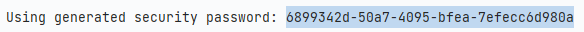
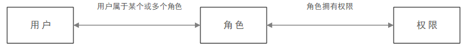
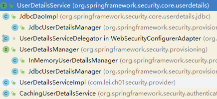
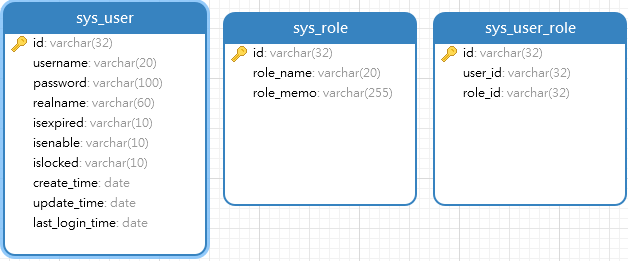

# SpringSecurity

## 简介

### 核心功能

- 认证（你是谁，用户/设备/系统）
- 验证（你能干什么，也叫权限控制/授权，允许执行的操作）

### 原理

基于Filter、Servlet、AOP 实现身份认证和权限验证

## 起步

### demo

1. 导入spring-boot-starter-security 起步依赖

   ```groovy
   implementation 'org.springframework.boot:spring-boot-starter-security'
   ```

2. 无任何配置下启动程序，console会输出随机生成的密码

   

3. 创建controller，然后浏览器访问，此时地址会被拦截，需要输入正确的用户名和密码(临时生成的)才能进入controller

   ```tex
   默认用户名：user
   随机密码：6899342d-50a7-4095-bfea-7efecc6d980a
   ```

4. 自定义用户名和密码，修改配置文件；此时console不再打印随机生成密码

   ```properties
   spring.security.user.name=lei
   spring.security.user.password=123456
   ```

5. 不使用安全认证机制（排除），启动类的注解上排除

   ```java
   @SpringBootApplication(exclude = {SecurityAutoConfiguration.class})
   ```


### 自定义认证(内存)

> 通过继承 WebSecurityConfigurerAdapter 类，并重写其中某些方法实现自定义认证功能
>
>  `@EnableWebSecurity`注解开启安全机制
>
> @EnableGlobalMethodSecurity(prePostEnabled = true)  可以开启方法级别的权限认证（通过角色），同一个用户可以有多个角色

1. 密码编码器，springsecurity实现了许多密码编码器，这里采用 `BCryptPasswordEncoder`实现类，设置内存用户时对密码进行加密

   ```java
   /**
    * 密码编码器
    */
   @Bean
   public PasswordEncoder passwordEncoder(){
       return new BCryptPasswordEncoder();
   }
   ```

2. 配置类

   ```java
   @Configuration
   @EnableWebSecurity
   @EnableGlobalMethodSecurity(prePostEnabled = true)
   public class WebAutConfig extends WebSecurityConfigurerAdapter {
   
       @Autowired
       private PasswordEncoder passwordEncoder;
   
       /**
        * 重写方法，添加内存用户
        */
       @Override
       protected void configure(AuthenticationManagerBuilder auth) throws Exception {
           // 添加两个内存用户，并指定角色；同一个用户可以有多个角色
           auth.inMemoryAuthentication().withUser("lei")
                   .password(passwordEncoder.encode("1234")).roles("normal");
           auth.inMemoryAuthentication().withUser("yu")
                   .password(passwordEncoder.encode("1234")).roles("admin","normal");
       }
   
   }
   ```

3. controller，配置方法允许哪些角色访问

   ```java
   @RestController
   @RequestMapping("hello")
   public class HelloController {
       @RequestMapping("sayCommon")
       //该方法 normal 和 admin 角色都可以访问
       @PreAuthorize("hasAnyRole('normal 和','admin')")
       public Object sayCommon(){
           return "Hello sayCommon";
       }
       @RequestMapping("sayAdmin")
       //该方法只允许 admin 角色访问
       @PreAuthorize("hasAnyRole('admin')")
       public Object sayAdmin(){
           return "Hello sayAdmin";
       }
   }
   ```

### 基于数据库用户认证

从数据库中获取用户信息（用户名称、密码、角色）

在spring secrity中对用户信息表示类为UserDetails，UserDetails是一个接口，高度抽象用户信息

**集成postgres数据库**

1. 导入依赖

   ```groovy
   implementation 'org.postgresql:postgresql'
   implementation 'org.springframework.boot:spring-boot-starter-data-jpa'
   ```

2. 配置默认数据源

   ```properties
   spring.datasource.driver-class-name=org.postgresql.Driver
   spring.datasource.url=jdbc:postgresql://myrapi.io:5432/mydb?useSSL=false&connectTimeout=10000&socketTimeout=30000&serverTimezone=GMT%2B8&zeroDateTimeBehavior=ROUND&rewriteBatchedStatements=true&characterEncoding=utf8&allowMultiQueries=true
   spring.datasource.username=postgres
   spring.datasource.password=123456
   spring.datasource.password=123456
   ## 开启根据实体类自动建表、显示sql、数据库类型
   spring.jpa.generate-ddl=true
   spring.jpa.show-sql=true
   spring.jpa.database=mysql
   ```

3. 创建实体类和dao接口

   ```java
   //实体类
   @Entity(name = "USER_INFO")
   @Data
   public class UserInfo implements Serializable {
       private static final long serialVersionUID = -329565948685722547L;
       @Id
       // 通过序列化生成主键id，会在数据库中维护一张序列化表(tb_seq)
       @GeneratedValue(generator = "tb_seq",strategy = GenerationType.TABLE)
       private Long userId;
   
       @Column(name = "username",length = 20)
       private String username;
   
       @Column(name = "password",length = 80)
       private String password;
   
       @Column(name = "role",length = 10)
       private String role;
   
   }
   
   //dao接口
   public interface UserInfoDao extends JpaRepository<UserInfo,Long> {
       UserInfo findByUsername(String username);
   }
   ```

4. 通过`@PostConstruct`生成初始化数据，使用一次

   ```java
   @Autowired
   private UserInfoDao userInfoDao;
   
   @PostConstruct		//该bean注入IOC后，自动调用该方法
   public void init(){
       List<UserInfo> userInfos=new ArrayList<>();
       UserInfo u1=new UserInfo();
       u1.setUsername("lei");
       u1.setPassword(passwordEncoder.encode("1234"));
       u1.setRole("admin");
   
       UserInfo u2=new UserInfo();
       u2.setUsername("yu");
       u2.setPassword(passwordEncoder.encode("1234"));
       u2.setRole("normal");
   
       userInfos.add(u1);
       userInfos.add(u2);
   
       userInfoDao.saveAll(userInfos);
   }
   ```

**实现UserDetailsService**

```java
//这里需要指定bean的名字，不然会因为有多个UserDetailsService类型bean不能注入
@Service("chUserDetailsService")  
public class UserDetailsServiceImpl implements UserDetailsService {
    @Autowired
    private UserInfoDao userInfoDao;

    @Override
    public UserDetails loadUserByUsername(String username) throws UsernameNotFoundException {
        if (ObjectUtil.isNotEmpty(username)){
            UserInfo byUsername = userInfoDao.findByUsername(username);
            if (byUsername!=null){
                //构建User对象，该对象为UserDetails接口的实现
                return new User(byUsername.getUsername(),byUsername.getPassword(),
                        List.of(new SimpleGrantedAuthority("ROLE_"+byUsername.getRole())));
            }
        }
        return null;
    }
}
```

**使用UserDetailsService认证**

```java
@Configuration
@EnableWebSecurity
@EnableGlobalMethodSecurity(prePostEnabled = true)
public class WebAutConfig extends WebSecurityConfigurerAdapter {

    @Autowired
    private PasswordEncoder passwordEncoder;

    @Resource
    private UserInfoDao userInfoDao;

    @Resource
    private UserDetailsService chUserDetailsService;

    /**
     * 重写方法，通过自定义的实现类进行认证
     */
    @Override
    protected void configure(AuthenticationManagerBuilder auth) throws Exception {
        auth.userDetailsService(chUserDetailsService).passwordEncoder(passwordEncoder);
    }

}
```

## 基于角色权限

### 介绍

**认证和授权**

- Authentication：认证，访问者是谁，是否是系统有效用户
- Authorization：授权，用户能访问系统中的哪些资源及能做哪些操作

**RBAC模型是什么？**

RBAC（Role-Based Access Control）即：基于角色的权限控制。通过角色关联用户，角色关联权限的方式间接赋予用户权限



用户拥有角色 --> 角色控制权限

这样在新建用户时只需要分配角色就可以实现权限控制

**通常来说rbac模型中表结构**

1. 用户表：用户认证（用户名、密码、是否启用等相关信息）
2. 角色表：定义角色信息（角色名称、角色描述）
3. 用户和角色关系表：用户和角色多对多关系
4. 权限表：角色可以拥有哪些权限

### 认证相关类

**UserDetails接口**

```java
//权限集合
Collection<? extends GrantedAuthority> getAuthorities();

//账户是否过期
boolean isAccountNonExpired();

//账户是否锁定
boolean isAccountNonLocked();

//用户的凭据（密码）是否已过期。过期的凭据会阻止身份验证
boolean isCredentialsNonExpired();

//账户是否启用
boolean isEnabled();
```

UserDetails接口默认实现类为 org.springframework.security.core.userdetails.User；也可自己自定义 UserDetails 接口实现，作为系统中的用户类

**UserDetailsService**

主要作用：获取用户信息得到一个UserDetails对象

```java
//根据用户名称获取一个 UserDetails 对象
UserDetails loadUserByUsername(String username);
```

UserDetailsService 默认提供的实现类；其中有基于内存的、基于数据库的、基于缓存的 用户信息管理



基于数据库的访问认证，在 JdbcDaoImpl 该类的目录下会提供ddl语句

**基于JDBC的实现类使用实例**

- 找到JdbcDaoImpl 该类的目录下会提供ddl语句，创建表结构
- 声明bean，并创建两个内存用户

```java
@Resource
private DataSource dataSource;
@Autowired
private PasswordEncoder passwordEncoder;
@Bean
public UserDetailsService jdbcUserDetailsService(){
    JdbcUserDetailsManager manager = new JdbcUserDetailsManager();
    manager.setDataSource(dataSource);		//这里注意设置数据源
    
    //以下创建用户的代码，当数据库已经存在同名用户会报错
    //及 以下创建用户的代码只可运行一次
    manager.createUser(User.withUsername("zs")
                       .password(passwordEncoder.encode("123")).roles("ADMIN").build());
    manager.createUser(User.withUsername("ls")
                       .password(passwordEncoder.encode("123")).roles("ADMIN","NORMAL").build());
    return manager;
}
```

- 在 继承了WebSecurityConfigurerAdapter类的子类中配置`UserDetailsService`

  ```java
  @Resource
  private UserDetailsService jdbcUserDetailsService;
  @Resource
  private PasswordEncoder passwordEncoder;
  
  //通过重写两个方法任意一个均可设置 UserDetailsService
  //1.方法一
  @Override
  protected void configure(HttpSecurity http) throws Exception {
      super.configure(http);
      http.userDetailsService(jdbcUserDetailsService);
  }
  
  //2.方法二
  @Override
  protected void configure(AuthenticationManagerBuilder auth) throws Exception {
      auth.userDetailsService(jdbcUserDetailsService).passwordEncoder(passwordEncoder);
  }
  ```

## 自定义认证

### 创建库表



```sql
CREATE TABLE "sys_role" (
  "id" varchar(32) NOT NULL,
  "role_name" varchar(20) NOT NULL,
  "role_memo" varchar(255),
  PRIMARY KEY ("id")
);

CREATE TABLE "sys_user" (
  "id" varchar(32) NOT NULL,
  "username" varchar(20) NOT NULL,
  "password" varchar(100) NOT NULL,
  "realname" varchar(60) NOT NULL,
  "isexpired" varchar(10) NOT NULL,
  "isenable" varchar(10) NOT NULL,
  "islocked" varchar(10) NOT NULL,
  "create_time" date NOT NULL,
  "update_time" date,
  "last_login_time" date,
  PRIMARY KEY ("id"),
  CONSTRAINT "username_unique" UNIQUE ("username")
);
COMMENT ON COLUMN "sys_user"."isexpired" IS '是否过期';
COMMENT ON COLUMN "sys_user"."isenable" IS '是否启用';
COMMENT ON COLUMN "sys_user"."islocked" IS '是否锁定';
COMMENT ON CONSTRAINT "username_unique" ON "sys_user" IS '用户名唯一';

CREATE TABLE "sys_user_role" (
  "id" varchar(32) NOT NULL,
  "user_id" varchar(32) NOT NULL,
  "role_id" varchar(32) NOT NULL,
  PRIMARY KEY ("id")
);
```

### 依赖与配置

1. 依赖

   ```groovy
   dependencies {
       implementation 'org.springframework.boot:spring-boot-starter-web'
       implementation 'org.springframework.boot:spring-boot-starter-security'
       implementation 'org.postgresql:postgresql'
       implementation 'com.baomidou:mybatis-plus-boot-starter:3.5.2'
       compileOnly 'org.projectlombok:lombok'
       annotationProcessor 'org.projectlombok:lombok'
       implementation 'cn.hutool:hutool-all:5.8.2'
       testImplementation 'org.springframework.boot:spring-boot-starter-test'
   }
   ```

2. application配置

   ```properties
   spring.datasource.driver-class-name=org.postgresql.Driver
   spring.datasource.url=jdbc:postgresql://myrapi.io:5432/mydb?useSSL=false&connectTimeout=10000&socketTimeout=30000&serverTimezone=GMT%2B8&zeroDateTimeBehavior=ROUND&rewriteBatchedStatements=true&characterEncoding=utf8&allowMultiQueries=true
   spring.datasource.username=postgres
   spring.datasource.password=123456
   
   mybatis-plus.mapper-locations=classpath*:/mapper/**/*.xml
   ```

3. 启动类配置

   ```java
   @SpringBootApplication
   @MapperScan(basePackages = "com.lei.ch01security.**.dao")
   public class SecurityApplication {
       public static void main(String[] args) {
           SpringApplication.run(SecurityApplication.class, args);
       }
       /**
        * 密码编码器
        */
       @Bean
       public PasswordEncoder passwordEncoder(){
           return new BCryptPasswordEncoder();
       }
   }
   ```

   

### 相关类创建

1. 示例 重点 SysUser 实体类 创建；需要实现`UserDetails`接口

   ```java
   @Data
   @TableName("sys_user")
   public class SysUser implements Serializable, UserDetails {
       private static final long serialVersionUID = 771578657753428713L;
   
       @TableId(type = IdType.INPUT)
       private String id;
   
       @TableField("username")
       private String username;
   
       @TableField("password")
       private String password;
   
       @TableField("realname")
       private String realname;
   
       @TableField("isenable")
       private String isenable;    //是否启用
   
       @TableField("islocked")
       private String islocked;    //是否锁定
   
       @TableField("isexpired")
       private String isexpired;       //是否过期
   
       @TableField("create_time")
       private Date createTime;
   
       @TableField("update_time")
       private Date updateTime;
   
       @TableField("last_login_time")
       private Date lastLoginTime;
   
       @TableField(exist = false)
       @Getter(AccessLevel.NONE)
       @Setter(AccessLevel.NONE)
       private List<GrantedAuthority> grantedAuthorityList;
   
       @Override
       public Collection<? extends GrantedAuthority> getAuthorities() {
           if (ObjectUtil.isEmpty(grantedAuthorityList) && ObjectUtil.isNotEmpty(username)) {
               grantedAuthorityList=new ArrayList<>();
               //查询关联角色列表
               SysUserRoleDao userRoleDao = SpringUtil.getApplicationContext().getBean(SysUserRoleDao.class);
               List<String> roleList = userRoleDao.selectRolesByUserId(id);
               for (String s : roleList) {
                   //角色名称以"ROLE_"打头
                   grantedAuthorityList.add(new SimpleGrantedAuthority(s));
               }
           }
           return grantedAuthorityList;
       }
   
       /**
        * 账户非过期
        */
       @Override
       public boolean isAccountNonExpired() {
           return Objects.equals(isexpired, Constants.ACCOUNT_N);
       }
   
       /**
        * 账户非锁定
        */
       @Override
       public boolean isAccountNonLocked() {
           return Objects.equals(islocked, Constants.ACCOUNT_N);
       }
   
       /**
        * 凭证
        */
       @Override
       public boolean isCredentialsNonExpired() {
           return isAccountNonExpired() && isAccountNonLocked() && isEnabled();
       }
   
       /**
        * 启用
        */
       @Override
       public boolean isEnabled() {
           return Objects.equals(isenable, Constants.ACCOUNT_Y);
       }
   }
   ```

2. 其他相关接口

   ```java
   //service接口
   public interface SysUserService extends IService<SysUser> {
   }
   
   //service实现类
   @Service
   public class SysUserServiceImpl extends ServiceImpl<SysUserDao, SysUser> implements SysUserService {
   }
   
   //dao接口
   public interface SysUserDao extends BaseMapper<SysUser> {
   }
   
   //mapper文件
   /*
       <?xml version="1.0" encoding="UTF-8" ?>
       <!DOCTYPE mapper
               PUBLIC "-//mybatis.org//DTD Mapper 3.0//EN"
               "http://mybatis.org/dtd/mybatis-3-mapper.dtd">
       <mapper namespace="com.lei.ch01security.dao.SysUserDao">
   
       </mapper>
   */
   
   //.......其余根据表结构创建类似这些类    


### 初始化数据

创建相关表结构的mapper，dao，service，serviceimpl；然后初始化数据

**初始化数据**

```java
@Resource
private SysUserService userService;
@Resource
private SysRoleService roleService ;
@Resource
private SysUserRoleService userRoleService;

@PostConstruct
public void jdbcInit(){
    //在这里可以进行初始化数据，@PostConstruct标注的方法，在该bea注入IOC时会执行
    //通过userService roleService userRoleService进行数据的插入，注意密码需要配置加密
}
```

### 配置框架

配置安全框架从数据库加载用户信息

1. 实现UserDetailsService接口，加载库表用户

   ```java
   @Service("chUserDetailsService")
   public class UserDetailsServiceImpl implements UserDetailsService {
       @Resource
       private SysUserService userService;
       @Override
       public UserDetails loadUserByUsername(String username) throws UsernameNotFoundException {
           SysUser byUsername = userService.getUserByUsername(username);
           byUsername.getAuthorities();	//执行一次该方法，原因可看上面 SysUser 实体类
           return byUsername;
       }
   }
   ```

2. 配置安全框架 (WebSecurityConfigurerAdapter 的重写类)

   ```java
   @Configuration
   @EnableWebSecurity
   @EnableGlobalMethodSecurity(prePostEnabled = true)
   public class WebAutConfig extends WebSecurityConfigurerAdapter {
   
       @Autowired
       private PasswordEncoder passwordEncoder;
   
       @Resource
       private UserDetailsService chUserDetailsService;
   
       /**
        * 重写方法，添加内存用户
        */
       @Override
       protected void configure(AuthenticationManagerBuilder auth) throws Exception {
           auth.userDetailsService(chUserDetailsService).passwordEncoder(passwordEncoder);
       }
   
       @Override
       protected void configure(HttpSecurity http) throws Exception {
           http.authorizeRequests()    //允许RequestMatcher进行权限控制
                   .antMatchers("/index").permitAll()      //该地址放行
               	// 注 ： 这个地方角色名会默认添加前缀 "ROLE_"
                   .antMatchers("/access/admin/**").hasRole("ADMIN")   //该地址只允许ADMIN角色访问
                   .antMatchers("/access/normal/**").hasAnyRole("NORMAL","ADMIN")     //该地址允许NORMAL和ADMIN角色访问
                   .anyRequest().authenticated()   //其他地址任何角色验证都可访问
                   .and()
                   .formLogin();
       }
   }
   ```

## 其他配置

### 自定义登录页

security框架内置了许多过滤器，验证用户是否登录也是通过过滤器实现

找到 `UsernamePasswordAuthenticationFilter` 该过滤器，可以看到 默认的登陆方法以及字段名

默认登陆方法为 /login ，表单值 username  password  ，采用POST方式提交数据

```java
public class UsernamePasswordAuthenticationFilter extends AbstractAuthenticationProcessingFilter {

	public static final String SPRING_SECURITY_FORM_USERNAME_KEY = "username";

	public static final String SPRING_SECURITY_FORM_PASSWORD_KEY = "password";

	private static final AntPathRequestMatcher DEFAULT_ANT_PATH_REQUEST_MATCHER = new AntPathRequestMatcher("/login",
			"POST");
    .........
```

1. 创建登录页 在 resources/static 目录下创建 登录页 login.html

   ```html
   <form method="post" action="/login">
       用户名：<input type="text" name="username">
       密码：<input type="password" name="password">
       <input type="submit" placeholder="登录">
   </form>
   ```

   

2. 配置框架；登陆成功配置、登陆失败配置、登录用户名密码的字段名，对登陆界面放行

   ```java
   @Override
   protected void configure(HttpSecurity http) throws Exception {
       http.authorizeRequests()    //允许RequestMatcher进行权限控制
           .antMatchers("/index","/login.html","/index.html").permitAll()      //该地址放行
           .antMatchers("/access/admin/**").hasRole("ADMIN")   //该地址只允许ADMIN角色访问
           .antMatchers("/access/normal/**").hasAnyRole("NORMAL","ADMIN")     //该地址允许NORMAL和ADMIN角色访问
           .anyRequest().authenticated()   //其他地址任何角色验证都可访问
           .and()
           .formLogin()    //表单登录
           .usernameParameter("username")     //配置表单登录的用户名字段
           .passwordParameter("password")     //配置表单登录的密码字段
           .loginPage("/login.html")       //登录页
           .loginProcessingUrl("/login")       //登录方法
           .failureForwardUrl("/err.html")		//登陆失败跳转的url,可以跳转静态页面 也可以跳转controller 地址进行处理
           .successForwardUrl("/index.html")	//登陆成功跳转的url，可以跳转静态页面 也可以跳转controller 地址进行处理
           .and()
           .csrf().disable();      //禁用 csrf
   }
   ```


### AJAX登陆配置

1. 创建登录页，引入jquery.js，并编写登录逻辑；`注意:jquery.js如果是放在本地的，后台需配置非登录用户也可以访问`

   ```html
   <head>
       <meta charset="UTF-8">
       <title>登录页</title>
       <script src="js/jquery-3.6.0.min.js"></script>
   </head>
   <body>
   <h1>登录页</h1>
       用户名：<input type="text" name="username">
       密码：<input id="password" type="password" name="password">
   <button id="loginBtn"> 登录 </button>
   </body>
   <script>
       $(document).ready(function(){
           $("#loginBtn").on("click",function (){
               $.ajax({
                   url:'/login',
                   method:'post',
                   data:{
                       username:$('input[name="username"]').val(),
                       password:$('input[name="password"]').val()
                   },
                   success:(res)=>{
                       if (res.code !== 0){
                           alert("登陆失败："+res.msg)
                       }else{
                           alert("登陆成功！！")
                       }
                   },
               })
           })
       });
   </script>
   ```

2. 配置框架；登陆成功配置、登陆失败配置、登录用户名密码的字段名，对登陆界面放行，以及`静态资源的放行`

   ```java
   @Override
   protected void configure(HttpSecurity http) throws Exception {
       http.authorizeRequests()    //允许RequestMatcher进行权限控制
           .antMatchers("/index","/login.html","/index.html","/**/**.js").permitAll()      //该地址放行
           .antMatchers("/access/admin/**").hasRole("ADMIN")   //该地址只允许ADMIN角色访问
           .antMatchers("/access/normal/**").hasAnyRole("NORMAL","ADMIN")     //该地址允许NORMAL和ADMIN角色访问
           .anyRequest().authenticated()   //其他地址任何角色验证都可访问
           .and()
           .formLogin()    //表单登录
           .usernameParameter("username")     //配置表单登录的用户名字段
           .passwordParameter("password")     //配置表单登录的密码字段
           .loginPage("/login.html")       //登录页
           .loginProcessingUrl("/login")       //登录方法
           .failureHandler((request, response, err) -> {        //登陆失败处理
               response.setContentType("application/json;charset=utf-8");
               PrintWriter out = response.getWriter();
               //使用jackson写入json对象
               ObjectMapper om=new ObjectMapper();
               om.writeValue(out, Map.of("code",-1,"msg", err.getMessage()));
               out.flush();
               out.close();
           })
           .successHandler((request, response, authentication) -> {    //登陆成功处理
               response.setContentType("application/json;charset=utf-8");
               PrintWriter out = response.getWriter();
               //使用jackson写入json对象
               ObjectMapper om=new ObjectMapper();
               om.writeValue(out, Map.of("code",0,"msg", "登陆成功"));
               out.flush();
               out.close();
           })
           .and()
           .csrf().disable();      //禁用 csrf
   }
   ```

无论是登录成功或者登陆失败都会有两个相关处理方法，url 和 handler，选择一个就可

**successForwardUrl(String str)**: 登陆成功后转发，可以转发到静态页面 也可以转发到controller进行处理

**successHandler(AuthenticationSuccessHandler authSuccess)**: 登陆成功后处理器，authSuccess 实现了AuthenticationSuccessHandler 接口，并实现其中唯一方法，该方法有三个参数，通过这三个参数就可返回相关信息

### 验证码的实现

1. 创建验证码控制器，并实现验证码的生成，并将生成的验证码放入session中

   ```java
   @RestController
   @RequestMapping("/verification")
   public class VerificationController {
       private static final int height=30;
       private static final int weight=150;
       private static final int codeSize=6;
   
       private static final int codeSpace=24;
   
       @RequestMapping("/code")
       public void code(HttpServletRequest request, HttpServletResponse response) throws IOException {
           //创建 BufferedImage 对象,参数为 宽、高、图像类型
           BufferedImage image=new BufferedImage(weight,height,BufferedImage.TYPE_INT_RGB);
   
           //获取画笔，对图像进行绘制
           Graphics g = image.getGraphics();
   
           //设置画笔颜色为白色
           g.setColor(Color.WHITE);
           //填充指定的矩形,参数：起始位置 x y、绘制大小 width height
           g.fillRect(0,0,weight,height);
   
   
           Random random = new Random();
           //存储验证码，后续方便放入session
           StringBuilder codeStr=new StringBuilder();
           //绘制验证码
           for (int i=0;i<codeSize;i++){
               //设置颜色
               g.setColor(new Color(
                       random.nextInt(255),random.nextInt(255),random.nextInt(255)
               ));
               //设置字体 字体构造参数：字体、风格、大小
               g.setFont(new Font("宋体",Font.BOLD,24));
               //绘制字符串 参数：字符、x、y
               String code = RandomUtil.randomString(1);
               codeStr.append(code);
               g.drawString(code,codeSpace*i,random.nextInt(height/2)+height/2);
           }
   
           //将生成的验证码字符串放入session
           request.getSession().setAttribute("codeStr",codeStr.toString());
   
           //绘制干扰线
           for (int i=0;i<4;i++){
               g.setColor(new Color(
                       random.nextInt(255),random.nextInt(255),random.nextInt(255)
               ));
               //绘制干扰线 参数：线的起点 x1,y1、线的终点 x2,y2
               g.drawLine(random.nextInt(weight/2), random.nextInt(height),
                       random.nextInt(weight), random.nextInt(height));
           }
   
           //告诉浏览器响应内容格式
           response.setContentType("image/png");
           //告诉浏览器不要进行缓存
           response.setHeader( "Pragma", "no-cache" );
           response.setHeader( "Cache-Control", "no-cache" );
           response.setDateHeader("Expires",0);
   
           ServletOutputStream out = response.getOutputStream();
           //通过 ImageIO 工具类将图片写入 response 输出流中
           ImageIO.write(image,"png",out);
           out.flush();
           out.close();
       }
   }
   ```

2. 将验证码的请求地址放行

   ```java
   http.authorizeRequests()    //允许RequestMatcher进行权限控制
                   .antMatchers("/index","/login.html","/index.html","/**/**.js","/verification/**").permitAll()      //该地址放行
       //..........
   ```

3. 前端页面和js设置

   ```java
   <body>
   <h1>登录页</h1>
       用户名：<input type="text" name="username"><br>
       密码：<input id="password" type="password" name="password"><br>
       验证码：<input id="code" type="text" name="code">
       
       <a href="javascript:void(0)" onclick="changeCode()">重新获取</a>
       <button id="loginBtn"> 登录 </button>
   </body>
       
   <script>
       $(document).ready(function(){
           $("#loginBtn").on("click",function (){
               $.ajax({
                   url:'/login',
                   method:'post',
                   data:{
                       username:$('input[name="username"]').val(),
                       password:$('input[name="password"]').val(),
                       code:$('input[name="code"]').val()
                   },
                   success:(res)=>{
                       if (res.code !== 0){
                           alert("登陆失败："+res.msg)
                       }else{
                           alert("登陆成功！！")
                       }
                   },
               })
           })
       });
       function changeCode(){
           //对img标签的src重新赋值，可以实现图片的重新加载
           $("#imgCode").attr("src","/verification/code?t="+new Date())
       }
   </script>
   ```

4. 设置过滤器用于验证码的校验，参考后面`自定义过滤器`

### 自定义过滤器

Spring Security 框架是使用过滤器实现的

例如：验证用户名密码是否正确 ：UsernamePasswordAuthenticationFilter 过滤器

实现过滤器的方式

- 直接实现 javax.servlet.Filter
- 继承spring框架提供的一些过滤器抽象类；例如：org.springframework.web.filter.OncePerRequestFilter 该过滤器确保了一次请求只执行一次该过滤器


> **注意**：设置字符编码的代码必须在 获取输出对象之前，否则无效


**验证码校验过滤器实现**

```java
@Component
public class VerificationCodeFilter extends OncePerRequestFilter {

    @Override
    protected void doFilterInternal(HttpServletRequest request,
                                    HttpServletResponse response,
                                    FilterChain filterChain) throws ServletException, IOException {
        //如果非登录请求直接放行
        if(!"/login".equals(request.getRequestURI())){
            filterChain.doFilter(request,response);
        }else{
            try {
                verification(request);
                filterChain.doFilter(request,response);
            }catch (AuthenticationException e){
                response.setContentType("application/json;charset=utf-8");
                response.setCharacterEncoding("utf-8");
                //这里定义登陆失败处理handler 需要实现 AuthenticationFailureHandler 接口，也可以通过response直接处理，
                PrintWriter out = response.getWriter();
                //使用jackson写入json对象
                ObjectMapper om=new ObjectMapper();
                om.writeValue(out, Map.of("code",-1,"msg", e.getMessage()));
                out.flush();
                out.close();
            }
        }
    }

    /**
     * 验证 验证码
     */
    private void verification(HttpServletRequest request) throws AuthenticationException {
        HttpSession session = request.getSession();
        //请求中验证码
        String codeReq=request.getParameter("code");
        //session中存的请求
        String codeSession=String.valueOf(session.getAttribute("codeStr"));

        //如果session中存在验证码值，清除session中验证码
        if (!ObjectUtil.equals("null",codeSession)){
            session.removeAttribute("codeStr");
        }

        //输入验证码和session中验证码不等
        if (!ObjectUtil.equals(codeReq,codeSession)){
            throw new AuthenticationException("验证码校验失败!!!", new RuntimeException("校验失败")) {
                private static final long serialVersionUID = 6982564443630627045L;
            };
        }
    }
}
```

**添加过滤器到过滤器链**

```java
@Resource
private VerificationCodeFilter verificationCodeFilter;
@Override
protected void configure(HttpSecurity http) throws Exception {
	http.authorizeRequests()    //允许RequestMatcher进行权限控制
                .addFilterBefore(verificationCodeFilter,UsernamePasswordAuthenticationFilter.class)     //添加过滤器
}
```


