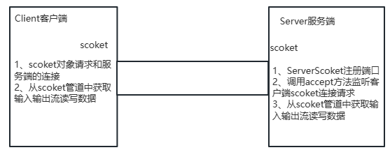
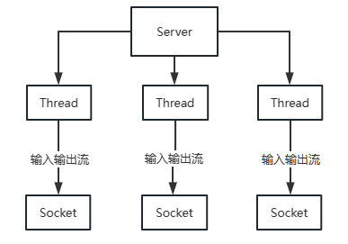
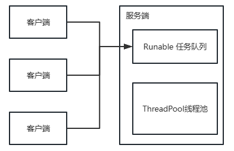
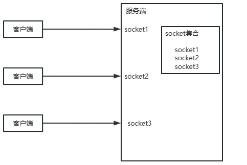
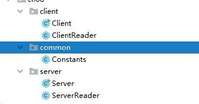
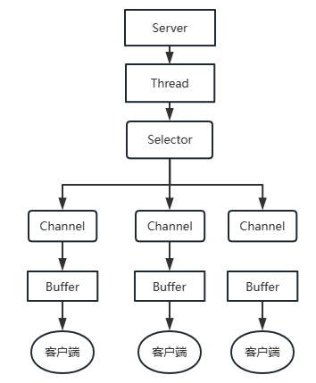
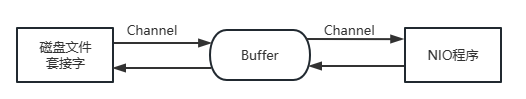
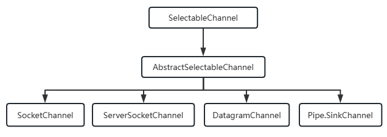

# Java IO流

## Java的IO演进

### IO模型基本说明

IO模型：就是用什么样的通道或者说是通信模式和架构进行数据的传输和接收，很大程度上决定了程序通信的性能

Java共支持3种网络编程的IO模型

- BIO：同步并阻塞（传统阻塞型），服务器实现模式为一个连接对应一个线程，即客户端有连接请求时服务端就需要启动一个线程进行处理，如果这个连接不做任何事情就会造成不必要的线程开销

- NIO：同步非阻塞，服务器实现模式为一个线程处理多个请求（连接），即客户端发送的连接请求都会注册到多路复用器上，多路复用器轮询到连接有IO请求就进行处理

- AIO（NIO.2）：异步非阻塞，服务器实现模式为一个有效请求对应一个线程，客户端的IO请求都是由OS先完成了再通知服务器应用去启动线程进行处理，一般适用于连接数较多且连接时间较长的应用

实际通信需求下，要根据不同的业务场景和性能需求决定选择不同的IO模型

### BIO、NIO、AIO使用场景分析

- BIO 方式适用于连接数目比较小且固定的架构，这种方式对服务器资源要求比较高，并发局限于应用
- NIO 方式适用于连接数据多且连接比较（轻操作）的架构，比如聊天服务器、弹幕系统、服务器间通讯等，编程较难，JDK1.4开始支持
- AIO 方式使用于连接数目多且连接比较长（重操作）的架构，比如聊天服务器，充分调用OS参与并发操作，编程较难，JDK1.7开始支持

## BIO深入剖析

### 介绍

Java BIO 就是传统的 Java io 编程，其相关类和接口都在 Java.io 包下

BIO（blocking IO）：同步阻塞，服务器实现模式为一个连接对应一个线程，即客户端有连接请求时服务端就需要启动一个线程处理，如果这个连接不做任何事情会造成不必要的线程开销，可以通过线程池机制改善

### Java BIO 工作机制



### BIO编程实例

网络编程的基本模型都是 Client/Server 模型，也就是两个进程之间进行相互通信，其中服务端提供位置信息（绑定IP地址和端口），客户端通过连接餐桌向服务端坚挺的端口地址发起连接请求，基于TCP协议下进行三次握手连接，连接成功后，双方通过网络套接字（Socket）进行通信

传统的同步阻塞模型开发中，服务端 ServerSocket 负责绑定 IP 地址，启动监听端口；客户端 Scoket 服务发起连接操作。连接成功后，双方通过输入输出流进行同步阻塞式通信

基于 BIO 模式下的通信，客户端-服务端是完全同步的，完全耦合的

**客户端**

```java
public class Client {
    public static void main(String[] args) {
        try {
            // 创建 socket 对象
            Socket socket = new Socket("127.0.0.1", 9999);
            // 从 socket 对象中获取一个字节输出流
            OutputStream os = socket.getOutputStream();
            // 将字节输出流包装成一个打印流
            PrintStream ps=new PrintStream(os);
            Scanner sc=new Scanner(System.in);
            while (true){
                System.out.print("请输入：");
                String msg = sc.nextLine();
                if (Objects.equals(msg,"0")) {
                    break;
                }
                ps.println(msg);
                ps.flush();
            }
        } catch (Exception e) {
            e.printStackTrace();
        }
    }
}
```


**服务端**

```java
public class Server {
    public static void main(String[] args) {
        System.out.println("=====服务端启动=====");
        try {
            // 定义一个 ServerSocket 进行服务端注册
            ServerSocket serverSocket = new ServerSocket(9999);
            // 监听客户端的 Socket 请求
            Socket socket = serverSocket.accept();
            // 从 socket 获得一个字节输入流
            InputStream is = socket.getInputStream();
            // 将字节输入流转换为字符输入流
            InputStreamReader isr = new InputStreamReader(is);
            // 将字符输入流包装成一个缓冲字符输入流
            BufferedReader br = new BufferedReader(isr);
            String msg;
            while ((msg = br.readLine()) != null) {
                System.out.println("服务端读取到的数据：" + msg);
            }
        } catch (Exception e) {
            e.printStackTrace();
        }

    }
}
```


**小结**

- 在以上通信中，服务端会一直等待客户端的消息，如果客户端没有消息的发送，服务端将一直进入阻塞状态
- 同时服务端是按照行获取消息的，这意味着客户端也必须按照行进行消息的发送，否则服务端将进入消息阻塞状态
- 当客户端关闭 socket ，服务端还在读取流中消息时会抛错 Java.net.SocketException: Connection reset
- 服务端 serverSocket.accept() 时会阻塞等待客户端 socket 请求

### BIO模式下接收多个客户端

客户端每发起一次请求，服务端就创建一个新的线程来处理客户端请求，这样就能实现一个客户端一个线程模型



**客户端**

客户端代码同上

**服务端**

```java
/**
 * 可接受多个客户端 Socket 请求的实例
 * 服务端每接收到一个客户端 socket 请求时后都交给一个独立的线程来处理
 */
public class Service {
    public static void main(String[] args) {
        try {
            // 注册端口
            ServerSocket serverSocket = new ServerSocket(9999);
            // 定义一个死循环不断接收不同的客户端请求
            while (true){
                Socket socket = serverSocket.accept();
                // 创建一个独立的线程处理当前接收到的 socket 请求
                new Thread(()->{
                    try {
                        // 线程从 socket 中获取字节输入流
                        InputStream is = socket.getInputStream();
                        // 缓冲字符输入流 包装 字节输入流
                        BufferedReader br=new BufferedReader(new InputStreamReader(is));
                        // 读取数据
                        String msg;
                        while ((msg=br.readLine())!=null){
                            System.out.println(Thread.currentThread().getName()+"-服务端读取数据："+msg);
                        }

                    }catch (Exception e){
                        e.printStackTrace();
                    }

                }).start();
            }
        }catch (Exception e){

        }
    }
}
```

**总结**

- 每个 socket 接收到，都会创建一个线程，线程的竞争、切换上下文影响性能
- 每个线程都会占用栈空间
- 并不是每个 socket 请求都进行 IO 操作，无意义的线程处理
- 客户端的并发访问增加时，服务端将呈现 1:1 的线程开销，访问量过大，系统将发生线程栈溢出，线程创建失败，最终导致进程宕机或者僵死，从而不能对外提供服务

### 伪异步IO编程

伪异步IO通信框架，采用线程池和任务队列实现，当客户端接入时，将客户端的 Socket 封装成一个 Task （该任务实现 Java.lang.Runnable 线程任务接口）交给后端的线程池进行处理。JDK 的线程池维护一个消息队列和 N 个活跃的线程，对消息队列中 Socket 任务进行处理，由于线程池可以设置消息队列的大小和最大线程数，因此，它的资源占用是可控的，无论多少个客户端并发访问，都不会导致资源的耗尽和宕机



**客户端**

代码同 BIO 编程实例中客户端代码一致

**服务端**

```java
/**
 * 服务器：伪异步通信架构
 *
 * @author lei
 * @date 2023/05/29
 */
public class Server {
    static final ThreadPoolExecutor threadPoolExecutor = new ThreadPoolExecutor(4, 8, 60, TimeUnit.SECONDS, new LinkedBlockingDeque<>(16));

    public static void main(String[] args) {
        try {
            // 注册端口
            ServerSocket serverSocket = new ServerSocket(9999);
            // 接受客户端 socket 请求
            while (true) {
                Socket socket = serverSocket.accept();
                // 将 socket 包装成一个任务对象交给线程池
                Runnable runnable = () -> {
                    try {
                        InputStream is = socket.getInputStream();
                        BufferedReader bf = new BufferedReader(new InputStreamReader(is));
                        String msg;
                        while ((msg = bf.readLine()) != null) {
                            System.out.println(Thread.currentThread().getName() + "-服务端获取数据：" + msg);
                        }
                    } catch (Exception e) {
                        e.printStackTrace();
                    }
                };
                threadPoolExecutor.execute(runnable);
            }
        } catch (Exception e) {
            e.printStackTrace();
        }
    }
}
```

**小结**

- 伪异步 IO 才用了线程池实现，因此可以避免每个请求创建一个独立线程造成资源耗尽的问题，但是由于底层依然是采用的同步阻塞模型，因此无法从根本上解决问题
- 如果单个消息处理的缓慢，或者服务器线程池中的全部线程都被阻塞，那么后续 socket 的IO消息都将在队列中等待。新的 socket 请求将会被拒绝，客户端会发生大量连续超时

### 基于BIO模式下的文件上传

**客户端**

```java
/**
 * 客户端：可以实现客户端上传任意类型的文件到服务端保存
 *
 * @author lei
 * @date 2023/05/29
 */
public class Client {
    public static void main(String[] args) {
        try (
                FileInputStream is = new FileInputStream("E:\\1\\1\\R-C.jpg")
        ) {
            // 请求与服务端的 socket 连接
            Socket socket = new Socket("127.0.0.1", 9999);
            // 将字节输出流包装成一个数据输出流
            DataOutputStream dos = new DataOutputStream(socket.getOutputStream());
            // 先发送上传文件的后缀
            dos.writeUTF(".jpg");
            // 将文件数据发送到服务端
            byte[] buffer = new byte[1024];
            int len;
            while ((len = is.read(buffer)) != -1) {
                dos.write(buffer, 0, len);
            }
            dos.flush();
            // 通知服务端数据发送完毕
            socket.shutdownOutput();
        } catch (Exception e) {
            e.printStackTrace();
        }
    }
}
```


**服务端**

```java
/**
 * 服务器：接收客户端任意类型文件，并保存
 *
 * @author lei
 * @date 2023/05/29
 */
public class Server {
    public static void main(String[] args) {
        try {
            ServerSocket serverSocket = new ServerSocket(9999);
            while (true) {
                Socket socket = serverSocket.accept();
                // 交给一个独立线程处理 socket 通信
                new Thread(() -> {
                    try {
                        // 得到一个数据输入流读取客户端发过来的数据
                        DataInputStream dis = new DataInputStream(socket.getInputStream());
                        // 读取客户端发过来的文件类型
                        String utf = dis.readUTF();
                        try (
                                // 定义一个文件输出流负责把客户端发送的数据写进去
                                FileOutputStream fos = new FileOutputStream("E:\\1\\2\\" + UUID.randomUUID() + utf)
                        ) {
                            // 从字节输入流中读取文件数据，并写到文件输出流中去
                            byte[] buffer = new byte[1024];
                            int len;
                            while ((len = dis.read(buffer)) != -1) {
                                fos.write(buffer, 0, len);
                            }
                            fos.flush();
                        }
                    } catch (Exception e) {
                        e.printStackTrace();
                    }

                }).start();
            }
        } catch (Exception e) {
			e.printStackTrace();
        }
    }
}
```

### BIO模式下的端口转发

需求：实现一个客户端的消息可以发送给所有的客户端去接受（群聊）



## BIO模式下的即时通信

基于 BIO 模式下的即时通信，需要解决客户端到客户端通信，也就是实现客户端与客户端的端口消息转发逻辑

### 实现功能列表

1. 客户端登录功能
2. 在线人数实时更新
3. 离线人数实时更新
4. 群聊
5. 私聊
6. @消息的实现
7. 消息用户和消息时间点记录

**代码结构**



### 服务端代码实现

**Server**

```java
public class Server {

    /**
     * 定义一个map集合存放所有在线 socket
     */
    public static final Map<Socket,String> onLineSocketMap = new HashMap<>();

    public static void main(String[] args) {
        try {
            // 注册端口
            ServerSocket serverSocket=new ServerSocket(9999);
            while (true){
                // 接收客户端 socket 请求
                Socket socket = serverSocket.accept();
                // 客户端 socket 管道单独配置一个线程处理
                new ServerReader(socket).start();
            }
        }catch (Exception e){
            e.printStackTrace();
        }
    }
}
```

**ServerReader**

```java
public class ServerReader extends Thread {
    private final Socket socket;

    public ServerReader(Socket socket) {
        this.socket = socket;
    }

    @Override
    public void run() {
        DataInputStream dis = null;
        try {
            dis = new DataInputStream(socket.getInputStream());
            // 循环等待客户端的消息
            while (true) {
                // 读取当前消息类型 登录、群发、私聊、@
                int flag = dis.readInt();
                if (flag == 1) {
                    String name = dis.readUTF();
                    System.out.println(name + "-------->" + socket.getRemoteSocketAddress());
                    Server.onLineSocketMap.put(socket, name);
                }
                writeMsg(flag, dis);
            }
        } catch (Exception e) {
            System.out.println("有人下线了-----");
            // 从在线map中移除
            Server.onLineSocketMap.remove(socket);
            try {
                // 重新更新在线人数发给金客户端
                writeMsg(1, dis);
            } catch (Exception e1) {
                e1.printStackTrace();
            }
        }
    }

    private void writeMsg(int flag, DataInputStream dis) throws IOException {
        switch (flag) {
            // 读取在线人数，更新到所有客户端
            case 1:
                Collection<String> values = Server.onLineSocketMap.values();
                String msg1 = String.join(Constants.SPLIT, values);
                sendMsgToAll(flag, msg1);
                break;
            case 2:
            case 3:
                // 读取群发或@的消息
                String msg2 = dis.readUTF();
                // 发送人姓名
                String sendName = Server.onLineSocketMap.get(socket);
                StringBuilder sb = new StringBuilder();
                LocalDateTime now = LocalDateTime.now();
                DateTimeFormatter formatter = DateTimeFormatter.ofPattern("yyyy-MM-dd HH:mm:ss");
                sb.append(sendName).append(" ").append(formatter.format(now)).append("\r\n");
                sb.append(" ").append(msg2).append("\r\n");
                if (flag == 2) {
                    sendMsgToAll(flag, sb.toString());
                } else {
                    sendMsgToOne(flag, dis.readUTF(), sb.toString());
                }
                break;
        }
    }

    private void sendMsgToOne(int flag, String destName, String msg) throws IOException {
        Set<Socket> socketSet = Server.onLineSocketMap.keySet();
        for (Socket sk : socketSet) {
            if (Server.onLineSocketMap.get(sk).trim().equals(destName.trim())) {
                DataOutputStream dos=new DataOutputStream(sk.getOutputStream());
                dos.writeInt(flag);
                dos.writeUTF(msg);
                dos.flush();
            }
        }
    }

    private void sendMsgToAll(int flag, String msg) throws IOException {
        // 拿到所有客户端 socket 集合，并发送消息
        Set<Socket> sockets = Server.onLineSocketMap.keySet();
        for (Socket sk : sockets) {
            DataOutputStream dos = new DataOutputStream(sk.getOutputStream());
            dos.writeInt(flag);
            dos.writeUTF(msg);
            dos.flush();
        }
    }
}
```

### 客户端代码实现

**Client**

```java
public class Client implements ActionListener {
    // 设计界面
    private final JFrame win = new JFrame();
    // 消息内容框架
    public JTextArea smsContent = new JTextArea(23, 50);
    // 消息发送框
    public JTextArea smsSend = new JTextArea(4, 40);
    // 在线人数区域
    // 存放人的数据
    // 展示在线人数窗口
    public JList<String> onLineUsers = new JList<>();

    // 是否私聊按钮
    JCheckBox isPrivateBtn = new JCheckBox("私聊");
    // 消息发送按钮
    JButton sendBtn = new JButton("发送");

    // 登录页面
    private JFrame loginView;

    private JTextField ipEt, nameEt, idEt;

    private Socket socket;

    public static void main(String[] args) {
        new Client().initView();
    }

    private void initView() {
        // 初始化聊天窗口界面
        win.setSize(650, 600);

        // 展示登录界面
        displayLoginView();

        // 展示聊天界面
//        displayChartView();
    }

    private void displayLoginView() {
        loginView = new JFrame("登录");
        loginView.setLayout(new GridLayout(3, 1));
        loginView.setSize(400, 230);

        JPanel ip = new JPanel();
        JLabel label1 = new JLabel("  IP:");
        ip.add(label1);
        ipEt = new JTextField(20);
        ip.add(ipEt);
        loginView.add(ip);

        JPanel name = new JPanel();
        JLabel label2 = new JLabel("  姓名:");
        name.add(label2);
        nameEt = new JTextField(20);
        name.add(nameEt);
        loginView.add(name);

        JPanel btnView = new JPanel();
        JButton login = new JButton("登录");
        JButton cancel = new JButton("取消");
        btnView.add(login);
        btnView.add(cancel);
        loginView.add(btnView);
        // 关闭窗口，退出当前程序
        loginView.setDefaultCloseOperation(JFrame.EXIT_ON_CLOSE);
        setWindowCenter(loginView,400,260,true);

        // 给登录和取消按钮添加点击事件
        login.addActionListener(this);
        cancel.addActionListener(this);
    }

    public static void setWindowCenter(JFrame jFrame, int width, int height, boolean flag) {
        // 得到当前品目宽高
        Dimension screenSize = jFrame.getToolkit().getScreenSize();

        // 拿到电脑屏幕宽高
        int height1 = screenSize.height;
        int width1 = screenSize.width;

        // 设置窗口左上角坐标
        jFrame.setLocation(width1 / 2 - width / 2, height1 / 2 - height / 2);
        jFrame.setVisible(flag);
    }

    @Override
    public void actionPerformed(ActionEvent e) {
        // 得到点击事件源
        JButton btn = (JButton) e.getSource();
        switch (btn.getText()) {
            case "登录":
                String ip = ipEt.getText();
                String name = nameEt.getText();
                String msg = "";
                // 校验参数信息
                if (ip == null || !ip.matches("\\d{1,3}\\.\\d{1,3}\\.\\d{1,3}\\.\\d{1,3}")) {
                    msg = "请输入合法的ip地址";
                }
                if (name == null || !name.matches("\\S{1,20}")) {
                    msg = "请输入合法姓名";
                }
                if (!msg.equals("")) {
                    // 参数一：弹出窗口放在那个窗口里
                    JOptionPane.showMessageDialog(loginView, msg);
                } else {
                    try {
                        // 将当前用户展示到页面
                        win.setTitle(name);
                        // 去服务端登录，连接一个socket通道
                        socket = new Socket(ip, Constants.PORT);
                        // 为客户端的 socket 分配一个线程，专门负责接收消息
                        new ClientReader(this, socket).start();

                        // 带上用户信息到服务端
                        DataOutputStream dos = new DataOutputStream(socket.getOutputStream());
                        dos.writeInt(1);
                        dos.writeUTF(name.trim());
                        dos.flush();

                        // 关闭当前窗口 弹出聊天界面
                        loginView.dispose();
                        displayChartView();
                    } catch (Exception err) {
                        err.printStackTrace();
                    }
                }
                break;
            case "取消":
                //退出系统
                System.exit(0);
                break;
            case "发送":
                //得到发送消息的内容
                String msgSend = smsSend.getText();
                if (!msgSend.trim().equals("")) {
                    //发消息给服务端
                    try {
                        //判断是否对谁发消息
                        String selectName = onLineUsers.getSelectedValue();
                        int flag = 2;// 群发 @消息
                        if (selectName != null && !selectName.equals("")) {
                            msgSend = ("@" + selectName + "," + msgSend);
                            //判断是否选中私发
                            if (isPrivateBtn.isSelected()) {
                                //私发
                                flag = 3;//私发消息
                            }
                        }
                        DataOutputStream dos = new DataOutputStream(socket.getOutputStream());
                        dos.writeInt(flag);//群发消息 发送给所有人
                        dos.writeUTF(msgSend);
                        if (flag == 3) {
                            //告诉服务器端我对谁私发
                            dos.writeUTF(selectName.trim());
                        }
                        dos.flush();
                    } catch (Exception e1) {
                        e1.printStackTrace();
                    }
                }
                smsSend.setText(null);
                break;
        }
    }

    private void displayChartView() {
        JPanel bottomPanel = new JPanel(new BorderLayout());

        // 将消息框和按钮添加到窗口底端
        win.add(bottomPanel, BorderLayout.SOUTH);
        bottomPanel.add(smsSend);
        JPanel btns = new JPanel(new FlowLayout(FlowLayout.LEFT));
        btns.add(sendBtn);
        btns.add(isPrivateBtn);
        bottomPanel.add(btns,BorderLayout.EAST);
        // 添加发送按钮点击监听事件
        sendBtn.addActionListener(this);

        // 给消息发送按钮绑定点击监听器
        // 将展示信息区添加到窗口中间
        smsContent.setBackground(new Color(0xdd, 0xdd, 0xdd));
        // 展示信息区可以滚动
        win.add(new JScrollPane(smsContent), BorderLayout.CENTER);

        // 用户列表和是否私聊放在窗口最右边
        Box rightBox = new Box(BoxLayout.Y_AXIS);
        onLineUsers.setFixedCellWidth(120);
        onLineUsers.setVisibleRowCount(13);
        rightBox.add(new JScrollPane(onLineUsers));
        win.add(rightBox, BorderLayout.EAST);

        win.setDefaultCloseOperation(JFrame.EXIT_ON_CLOSE);
        // swing 加上这句 就可以拥有关闭窗口的功能
        win.pack();

        // 设置窗口居中，显示出来
        setWindowCenter(win,650,600,true);

    }
}
```

**ClientReader**

```java
public class ClientReader extends Thread {
    private final Socket socket;
    private final Client client;

    public ClientReader(Client client, Socket socket) {
        this.socket = socket;
        this.client = client;
    }

    @Override
    public void run() {
        try {
            DataInputStream dis = new DataInputStream(socket.getInputStream());
            while (true) {
                int flag = dis.readInt();
                if (flag == 1) {
                    // 处理返回的在线人数
                    String nameDatas = dis.readUTF();
                    // 展示在线人数到页面
                    String[] names = nameDatas.split(Constants.SPLIT);
                    client.onLineUsers.setListData(names);
                } else if (flag == 2 || flag == 3) {
                    // 群发 私聊 @ 消息直接展示
                    String msg = dis.readUTF();
                    client.smsContent.append(msg);
                    // 让消息界面滚动到底端
                    client.smsContent.setCaretPosition(client.smsContent.getText().length());
                }
            }
        } catch (Exception e) {
            e.printStackTrace();
        }
    }
}
```

### 常量类

```java
public class Constants {
    /**
     * 端口
     */
    public static final int PORT = 9999;
    /**
     * 姓名分隔符
     */
    public static final String SPLIT = ";;;";
}
```

## NIO深入剖析

### 介绍

- Java NIO（New IO）也有人称为 Java non-blocking IO 是从 Java 1.4 版本开始引入的一个新的 IO API，可以替代标准的 Java IO API。NIO 与原来的 IO 有同样的作用和目的，但是使用方式完全不同，NIO 支持`面向缓冲区`的、基于`通道`的IO操作。NIO 将以更加高效的方式进行文件的读写操作。NIO 可以理解为非阻塞 IO，传统的 IO 的 read 和 write 只能阻塞执行，线程在读写 IO 期间不能干其他事情，比如调用 socket.read() 时，如果服务器一直没有数据传输过来，线程就一直阻塞，而 NIO 中可以配置 socket 为非阻塞模式
- NIO 相关类被放在 Java.nio 包以及其子包下，并且对原 Java.io 包中的很多类进行改写
- NIO 有三大核心部分：`Channel（通道）`、`Buffer（缓冲区）`、`Selector（选择器）`
- Java NIO的非阻塞模式，使一个线程从某通道发送请求或者读取数据，但是它仅能得到目前可用的数据，如果目前没有数据可用时，就什么都不会获取，而不是保持线程阻塞，所以直至数据变的可读取之前，该线程可以继续做其他的事情。非阻塞写也是如此，一个线程请求写入一些数据到某通道，但不需要等待它完全写入，这个线程同时可以去做别的事情
- 通俗理解：NIO 是可以做到用一个线程来处理多个操作的。假设有 1000 个请求过来，根据实际情况，可以分配 20 或者 80 个线程来处理。不想之前的阻塞 IO 那样，非得分配 1000 个线程 

### NIO 和 BIO 比较

- BIO 以流的方式处理数据，而 NIO 以块的方式处理数据，块 IO 的效率比流 IO 高很多
- BIO 是阻塞的，NIO 则是非阻塞的
- BIO 基于字节流和字符流进行操作，而 NIO 基于 Channel（通道）和 Buffer（缓冲区）进行操作，数据总是从通道读取到缓冲区中，或者从缓冲区写入到通道中。Selector（选择器）用于监听多个通道事件（比如：连接请求、数据到达），因此使用单个线程就可以监听多个客户端通道

| NIO                       | BIO                     |
| ------------------------- | ----------------------- |
| 面向缓冲区（Buffer）      | 面向流（Stream）        |
| 非阻塞（Non Blocking IO） | 阻塞 IO （Blocking IO） |
| 选择器（Selectors）       |                         |

### NIO三大核心原理示意图

NIO 有三大核心部分：**Channel（通道）、Buffer（缓冲区）、Selector（选择器）**

**Buffer 缓冲区**

缓冲区本质上是一块可以写入数据，然后可以从中读取数据的内存。这块内存被包装成 NIO Buffer 对象，并提供了一组方法，用来方便的访问该块内存。相比较直接对数据的操作，Buffer API 更加容易操作和管理

**Channel（通道）**

Java NIO 的通道类似流，但又有些不同：既可以从通道中读取数据，又可以往通道中写数据。但流的（input 或 output）读写通常是单向的。通道可以非阻塞读取和写入，通道可以支持读取或写入缓冲区，也支持异步地读写

**Selector（选择器）**

Selector 是一个 Java NIO 组件，可以能够检查一个或多个 NIO 通道高，并确定那些通道高已经准备好进行读取和写入。这样，一个单独的线程可以管理多个 Channel ，从而管理多个网络连接，提升效率



- 每个 Channel 都会一个 Buffer
- 一个线程对应一个 Selector ，一个 Selector 对应多个 Channel（连接）
- 程序切换到那个 Channel 是由事件决定的
- Selector 会根据不同的事件，在各个通道上切换
- Buffer 就是一个内存块，底层是一个数组
- 数据的读取写入都是通过 Buffer 完成的，BIO 中要么是输入流，或者是输出流，不能双向，但是 NIO 中的 Buffer 是可以读也可以写的
- Java NIO 系统的核心在于：通道（Chanel）、缓冲区（Buffer）。通道表示打开到 IO 设备（例如：文件、套接字）的连接。若要使用 NIO 系统，需要获取用于连接 IO 设备的通道以及用于容纳数据的缓冲区。然后操作缓冲区，对数据进行处理，简而言之，Channel 负责传输，Buffer 负责存取数据

### 缓冲区（Buffer）

一个用于特定基本数据类型的容器。由 Java.nio 包定义的，所有缓冲区都是 Buffer 抽象类的子类。Java NIO 的 Buffer 主要用于与 NIO 通道进行交互，数据是从通道读入缓冲区，从缓冲区写入通道中的



**Buffer 类及其子类**

Buffer 就像一个数组，可以保存多个相同类型的数据。根据数据类型不同，常用 Buffer 子类有：

- ByteBuffer
- CharBuffer
- ShortBuffer
- IntBuffer
- LongBuffer
- FloatBuffer
- DoubleBuffer

上述 Buffer 类，他们都采用相似的方法进行管理数据，只是各自管理的数据类型不同而已。都是通过如下方式获取一个 Buffer 对象：

```java
// 创建一个容量为 capacity 的buffer对象
public static XxxBuffer allocate(int capacity);
```

**缓冲区基本属性**

- 容量（capacity）：作为一个内存块，Buffer具有一定的固定大小，也称为“容量”，缓冲区容量不能为负，并且创建后不能更改

- 限制（limit）：表示缓冲区中可以操作的数据大小（limit后数据不能进行读写）。缓冲区的限制不能为负，且限制不能大于其容量。写入模式，限制等于 buffer 的容量。读取模式下，limit 等于写入的数据量

- 位置（position）：下一个要读取或写入的数据索引，通过 Buffer 中的 mark() 方法指定 Buffer 中一个特定的 position，之后可以通过调用 reset() 方法恢复到这个 position

- 标记（mark）与重置（reset）：标记是一个索引，通过 Buffer 中的 mark() 方法指定 Buffer 中一个特定的 position，之后可以通过调用 reset() 方法恢复到这个 position

  标记、位置、限制、容量遵守一下不变式：0 <= mark <= position <= limit <= capacity

**缓冲区常见方法**

```java
Buffer clear();  // 清空缓冲区并返还对缓冲区的引用
Buffer flip();  // 将缓冲区的界限（limit）设置为当前位置，并将当前位置（position）设置为0
int capactity();  //返回 Buffer 的 capactity 大小
boolean hasRemaining();  // 判断缓冲区中是否还有元素
int limit();  // 返回 Buffer 界限（limit）的位置
Buffer limit(int n);  // 将缓冲区界限设置为n，并返回一个具有新的 limit 的缓冲区对象
Buffer mark();  // 对缓冲区设置标记
int position();  // 返回缓冲区当前位置 position
Buffer position(int n);  // 设置缓冲区当前位置为 n，返回修改后的 Buffer 对象
int remaining();  // 返回 position 和 limit 之间的元素个数
Buffer reset();  // 将位置 position 恢复到以前设置的 mark 所在位置
Buffer rewind();  // 将位置设为 0，取消设置的 mark
```

**缓冲区的数据操作**

Buffer 所有子类都提供了两个用于数据操作的方法：get() put() 方法

```java
byte get();  // 读取单个字节
ByteBuffer get(byte[] dst);  // 批量读取多个字节到 dst 中
byte get(int index);  // 读取索引位置的字节，不会移动 position

ByteBuffer put(byte b);  // 将给定单个字节写入缓冲区的当前位置
ByteBuffer put(ByteBuffer src);  // 将 src 中的字节写入缓冲区当前位置
ByteBuffer put(int index, byte b);  // 将给定字节写入缓冲区索引位置，不会移动 position
```

> 使用 Buffer 读写数据一般遵循以下四个步骤
>
> 1. 写入数据到 Buffer
> 2. 调用 flip() 方法，转换为读取模式
> 3. 从 Buffer 中读取数据
> 4. 调用 buffer.clear() 方法或 buffer.compact() 方法清除缓冲区


**buffer实例**

```java
/**
 * buffer 常用 API
 *
 * @author lei
 * @date 2023/05/31
 */
public class BufferDemo {
    public static void main(String[] args) {
        // 分配一个字节缓冲区，容量为10
        ByteBuffer buffer = ByteBuffer.allocate(10);

        // 输出 buffer 的当前位置、限制、容量
        System.out.println(buffer.position());   // 0
        System.out.println(buffer.limit());  // 10
        System.out.println(buffer.capacity());  // 10

        // 往缓冲区中添加数据；此时 position：3  limit：10  capacity：10
        String name = "lei";
        buffer.put(name.getBytes());

        // 将缓冲区的界限（limit）设置为当前位置，并将当前位置（position）设置为 0（可读模式）
        // 此时 position：0  limit：3  capacity：10
        buffer.flip();

        // 从缓冲区读取数据，a1='l'
        // 此时 position：1  limit：3  capacity：10
        char a1 = (char) buffer.get();

        // 清除缓冲区，此时 a2='l'，说明 clear 只是重置 position、limit，不会清除数据
        // 此时 position：0  limit：10  capacity：10
        buffer.clear();
        char a2 = (char) buffer.get();

        // 判断是否还有数据，有返回true，无返回false
        boolean b = buffer.hasRemaining();

        // 返回剩余可读取元素个数
        int i = buffer.remaining();

    }
}
```

**直接与非直接缓冲区**

什么是直接内存与非直接内存

根据官方文档描述：字节缓冲区（byte buffer）可以是两种类型，一种是基于直接内存（也就是非堆内存）；另一种是非直接内存（也就是堆内存）。对于直接内存来说，JVM 将会在 IO 操作上具有更高的性能，因为它直接作用域本地系统的 IO 操作。而非直接内存，也就是堆内存中的数据，如果要做 IO 操作，会先从本地进程内存复制到直接内存，再利用本地 IO 处理

- 直接内存：本地 IO  ==>  直接内存 ==> 本地 IO
- 非直接内存：本地 IO ==> 直接内存 ==> 非直接内存 ==> 直接内存 ==> 本地 IO

很明显，在做 IO 处理时，比如网络发送大量数据时，直接内存会具有更高的效率。直接内存使用 `allocateDirect` 创建，但是它比申请普通堆内存需要耗费更高的性能。不过，这部分数据是在 JVM 之外的，因此他不会占用英勇的内存。所以，当有大量数据且数据的生命周期很长，那么就比较适合使用直接内存。一般来说，如果不是能带来明显的性能提升，还是推荐使用堆内存。字节缓冲区是直接内存还是非直接内存可以通过调用其 isDirect() 方法来确定

**使用场景**

1. 有很大的数据需要存储，它的生命周期又很长
2. 适合频繁的 IO 操作，比如网络并发场景

### 通道（Channel）

通道（Channel）：由 Java.nio.channels 包定义的。Channel 表示 IO 源与目标打开的连接。Channel 类似于传统的"流"，只不过 Channel 本身不能直接访问数据，Channel 只能与 Buffer进行交互

1. NIO 的通道类似于流，但有些区别如下

   - 通道可以同时进行读写，而流只能读或者只能写
   - 通道可以实现异步读写数据
   - 通道可以从缓冲读数据，也可以写数据到缓冲

2. BIO 中的 stream 是单向的，例如 FileInputStream 对象只能进行读取数据的操作，而 NIO 中的通道（Channel）是双向的，可以读操作，也可以写操作

3. Channel 在 NIO 中是一个接口

   ```java
   public interface Channel extend closeable{}
   ```

**常用的 Channel 实现类**

- FileChannel：用于读取、写入、映射和操作文件的通道
- DatagramChannel：通过 UDP 读写网络中的数据通道
- SocketChannel：通过 UDP 读写网络中数据
- ServerSocketChannel：可以监听新进来的 TCP 连接，对每一个新进来的连接都会创建一个 SocketChannel。【ServerSocketChannel 类似于 ServerSocket，SocketChannel 类似于 Socket】

**FileChannel 类**

获取通道的一种方式是对支持通道的对象调用 getChammel() 方法。支持通道的类如下：

- FileInputStream
- FileOutputStream
- RandomAccessFile
- DatagramSocket
- Socket
- ServetSocket

获取通道的其他方式是使用 Files 类的静态方法 newByteChannel() 获取字节通道。或者通过通道的静态方法 open() 打开并返回指定通道

**FileChannel 的常用方法**

```java
int read(ByteBuffer dst);  // 从 Channel 中读取数据到 ByteBuffer 中
long read(ByteBuffer[] dsts);  // 将 Channel 中数据“分散”到 ByteBuffer[]
int write(ByteBuffer src);  // 将 ByteBuffer 中数据写到 Channel 中
long write(ByteBuffer[] srcs);  // 将 ByteBuffer[] 中数据“聚集”到 Channel 中
long position();  // 返回此通道文件的位置
FileChannel position(long p);  // 设置此通道的文件位置
long size();  // 返回此通道文件的当前大小
FileChannel truncate(long s);  // 将此通道的文件截取为给定的大小
void force(boolean metaData);  // 强制将所有对此通道的文件更新写入到存储设备中
```

**实例：本地读写文件**

```java
/**
 * 通道本地读写文件演示
 *
 * @author lei
 * @date 2023/05/31
 */
public class ChannelDemo {
        /**
     * 从文件读取
     */
    private static void readFromFile() throws Exception {

        // 获得输入流
        FileInputStream fis = new FileInputStream("data.txt");
        // 得到输入流对应的通道
        FileChannel channel = fis.getChannel();
        // 分配缓冲区
        ByteBuffer buffer = ByteBuffer.allocate(1024);
        // 从通道中读取数据到缓冲区
        channel.read(buffer);
        // 将 limit 设置到当前位置，并将缓冲区当前位置重置
        buffer.flip();
        System.out.println(new String(buffer.array(), 0, buffer.remaining()));

    }

    /**
     * 写入文件
     */
    private static void writeToFile() throws Exception {
        // 获取字节输出流
        FileOutputStream fos = new FileOutputStream("data.txt");
        // 得到字节输出流对应的通道
        FileChannel channel = fos.getChannel();
        // 分配缓冲区
        ByteBuffer buffer = ByteBuffer.allocate(1024);
        buffer.put("hello world".getBytes());
        // 将缓冲区切换为写出模式
        buffer.flip();
        channel.write(buffer);
        channel.close();
    }
}
```

**案例：使用 Buffer 完成文件的复制**

```java
public class ChannelDemo {
     /**
     * 文件复制
     */
	private static void copy() throws Exception {
        File srcFile = new File("H:\\image\\win10_9.20.wim");
        File destFile = new File("H:\\image\\win10_9.20_new.wim");

        // 获取宿输入输出流
        FileInputStream fis = new FileInputStream(srcFile);
        FileOutputStream fos = new FileOutputStream(destFile);

        // 获取管道
        FileChannel fisChannel = fis.getChannel();
        FileChannel fosChannel = fos.getChannel();

        // 分配一个大小为 10M 的缓冲区
        ByteBuffer buffer = ByteBuffer.allocate(1024 * 1024 * 10);

        while (true) {
            // 清空缓存 position设置为0 limit 与 capacity 大小一致
            buffer.clear();
            // 读取数据
            int flag = fisChannel.read(buffer);
            if (flag == -1) {
                break;
            }
            // limit 设置到当前位置，然后将 position 设置为0（只读）
            buffer.flip();
            // 写出数据
            fosChannel.write(buffer);
        }

        // 关闭通道
        fisChannel.close();
        fosChannel.close();
    }
}
```

**案例：分散（Scatter）和聚集（Gather）**

分散读取（Scatter）：是把 Channel 通道的数据读入到多个缓冲区去；按顺序依次写满

聚集写入（Gathering）：是将多个 Biffer 中的数据“聚集”到 Channel

```java
public class ChannelDemo {
    /**
     * 分散和聚集
     */
    private static void copyA() throws Exception {
        File srcFile = new File("data.txt");
        File destFile = new File("dataA.txt");

        // 获取宿输入输出流
        FileInputStream fis = new FileInputStream(srcFile);
        FileOutputStream fos = new FileOutputStream(destFile);

        // 获取管道
        FileChannel fisChannel = fis.getChannel();
        FileChannel fosChannel = fos.getChannel();

        // 定义多个缓冲区
        ByteBuffer[] buffers = new ByteBuffer[]{ByteBuffer.allocate(3), ByteBuffer.allocate(1024)};

        // 分散读取
        fisChannel.read(buffers);
        for (ByteBuffer buffer : buffers) {
            buffer.flip();
            System.out.println(new String(buffer.array(), 0, buffer.remaining()));
        }

        // 聚集写入
        fosChannel.write(buffers);

        // 关闭通道
        fisChannel.close();
        fosChannel.close();
    }
}
```

**案例：transferFrom() 与 transferTo()**

通道之间的数据转换

- transferFrom() ：从目标通道中去复制原通道数据
- transferTo()：把原通道数据复制到目标通道

```java
public class ChannelDemo {
    public static void main(String[] args) {
        try {
            transferTest();
        } catch (Exception e) {
            e.printStackTrace();
        }

    }

    /**
     * transferFrom 与 transferTo
     */
    private static void transferTest() throws Exception {
        File srcFile = new File("data.txt");
        File destFile = new File("data2.txt");

        // 获取宿输入输出流
        FileInputStream fis = new FileInputStream(srcFile);
        FileOutputStream fos = new FileOutputStream(destFile);

        // 获取管道
        FileChannel fisChannel = fis.getChannel();
        FileChannel fosChannel = fos.getChannel();

        // 将 fisChannel 通道中数据直接复制到 fosChannel 中去
//        fisChannel.transferTo(fisChannel.position(),fisChannel.size(),fosChannel);

        // 从 fisChannel 中复制数据到 fosChannel 中
        fosChannel.transferFrom(fisChannel, fisChannel.position(), fisChannel.size());

        // 关闭通道
        fisChannel.close();
        fosChannel.close();
    }
}
```

### 选择器（Selector）

选择器（Selector）是SelectableChannel 对象的多路复用器，Selector 可以同时监控多个 SelectableChannel 的 IO 状况，也就是说，利用 Selector 可使一个单独的线程管理多个 Channel。Selector 是非阻塞 IO 的核心



- Java 的 NIO，用非阻塞的 IO 方式。用一个线程，处理多个客户端连接，就会使用到 Selector（选择器）
- Selector 能够检测多个注册的通道上是否有事件发生（注意：多个 Channel 以事件的方式可以注册到同一个 Selector），如果有事件发生，便获取事件然后针对每个事件进行相应的处理。这样就可以只用一个单线程去管理多个通道，也就是管理多个连接和请求
- 只有在 连接/通道 真正有读写事件发生时，才会进行读写，就大大地减少了系统开销，并且不必为每个连接都创建一个线程，不用去维护多个线程
- 避免了多线程之间的上线文切换导致的开销

**选择器（Selector）的应用 **

创建 Selector：通过调用 Seleceor.open() 方法创建一个 Selector

```java
Selector selector = Selector.open();
```

向选择器注册通道：SelectableChannel.register(Selector sel,int pos)

```java
// 获取通道
ServerSocketChannel channel = ServerSocketChannel.open();
// 切换非阻塞模式
channel.configureBlocking(false);
// 绑定连接
channel.bind(new InetSocketAddress(9999));
// 获取选择器
Selector selector=Selector.open();
// 将通道注册到选择器上，并指定 "监听接收事件"
channel.register(selector, SelectionKey.OP_ACCEPT);
```

当调用 SelectionKey register(Selector sel, int ops) 将通道注册到选择器时，选择器对通道的监听事件需要通过第二个参数 ops 指定。可以监听的事件类型 （SelectionKey 的四个常量）

- 读：SelectionKey.OP_READ （1）
- 写：SelectionKey.OP_WRITE（4）
- 连接：SelectionKey.OP_CONNECT（8）
- 接收：SelectionKey.OP_ACCEPT（16）

若注册不止监听一个事件，则可以使用“位或操作符连接”

```java
int ops = SelectionKey.OP_CONNECT | SelectionKey.OP_READ;
```

### NIO 网络通信原理分析

**服务端流程**

1. 获取通道：当客户端连接服务端时，服务端会通过 ServerSocketChannel 得到 SocketChannel

   ```java
   ServerSocketChannel channel = ServerSocketChannel.open();
   ```

2. 切换非阻塞模式

   ```java
   channel.configureBlocking(false);
   ```

3. 绑定连接

   ```java
   channel.bind(new InetSocketAddress(9999));
   ```

4. 获取选择器

   ```java
   Selector selector=Selector.open();
   ```

5. 将通道注册到选择器上，并指定 "监听接收事件"

   ```java
   channel.register(selector, SelectionKey.OP_ACCEPT);
   ```

6. 轮询获取选择器上已经“准备就绪”的事件

   ```java
   // 轮询获取选择器上已经“准备就绪”的事件，阻塞方法
   while (selector.select() > 0) {
       // 获取当前选择器中所有注册的 “选择键（已经就绪的监听事件）”
       Iterator<SelectionKey> keyIterator = selector.selectedKeys().iterator();
       while (keyIterator.hasNext()){
           // 获取准备就绪的事件
           SelectionKey sk = keyIterator.next();
           // 判断具体是什么事件准备就绪
           if (sk.isAcceptable()) {
               // 若“接收准备就绪”，获取客户端连接
               SocketChannel channel = ssChannel.accept();
               // 切换非阻塞模式
               channel.configureBlocking(false);
               // 将该通道注册到选择器上
               channel.register(selector,SelectionKey.OP_READ);
           }else if (sk.isReadable()){
               // 获取选择器上"读准备就绪"的通道
               SocketChannel channel = (SocketChannel)sk.channel();
               // 读取数据
               ByteBuffer buffer = ByteBuffer.allocate(1024);
               int len=0;
               while ((len=channel.read(buffer))>0){
                   buffer.flip();
                   System.out.println(new String(buffer.array(),0,len));
                   buffer.clear();
               }
           }
           // 取消选择键
           keyIterator.remove();
       }
   }
   ```

   **客户端流程**

   1. 获取通道

      ```java
      InetSocketAddress address = new InetSocketAddress("127.0.0.1", 9999);
      SocketChannel channel = SocketChannel.open(address);
      ```

   2. 切换非阻塞模式

      ```java
      channel.configureBlocking(false);
      ```

   3. 分配指定大小缓冲区

      ```java
      ByteBuffer buffer = ByteBuffer.allocate(1024);
      ```

   4. 发送数据给服务端

      ```java
      Scanner scan = new Scanner(System.in);
      while (scan.hasNext()) {
          String s = scan.nextLine();
          buffer.put((DateTimeFormatter.ofPattern("yyyy-MM-dd HH:mm:ss").format(LocalDateTime.now())
                      + ":" + s).getBytes());
          buffer.flip();
          channel.write(buffer);
          buffer.clear();
      }
      ```

   5. 关闭通道

      ```java
      channel.close();
      ```

   

### NIO 网络通信入门案例

**服务端**

```java
public static void main(String[] args) throws Exception {
    System.out.println("------服务端启动------");
    // 获取通道
    ServerSocketChannel ssChannel = ServerSocketChannel.open();
    // 绑定端口
    ssChannel.bind(new InetSocketAddress(9999));
    // 设置非阻塞模式
    ssChannel.configureBlocking(false);
    // 获取选择器
    Selector selector = Selector.open();
    // 选择器注册通道，并绑定事件
    ssChannel.register(selector, SelectionKey.OP_ACCEPT);

    // 监听事件 select()是一个阻塞方法，当有事件发生时返回事件个数（可能有多个通道发生事件）
    while (selector.select() > 0) {
        System.out.println("一轮事件处理");
        Iterator<SelectionKey> it = selector.selectedKeys().iterator();
        while (it.hasNext()) {
            // 获取事件
            SelectionKey selectionKey = it.next();
            // 对不同的事件进行处理
            if (selectionKey.isAcceptable()) {
                // 客户端通道
                SelectableChannel channel = ssChannel.accept();
                // 设置非阻塞模式
                channel.configureBlocking(false);
                // 注册到 selector
                channel.register(selector, SelectionKey.OP_READ);
            } else if (selectionKey.isReadable()) {
                SocketChannel channel = (SocketChannel) selectionKey.channel();
                // 分配缓冲区
                ByteBuffer buf = ByteBuffer.allocate(1024);

                while (channel.read(buf) > 0) {
                    // 切换为读(设置 position 和 limit)
                    buf.flip();
                    System.out.println(new String(buf.array(), 0, buf.remaining()));
                    // 清除缓冲区信息(position limit)
                    buf.clear();
                }
            }
            // 移除已经处理过了的事件
            it.remove();
        }
    }
}
```

**客户端**

```java
public static void main(String[] args) throws Exception {
    // 获取和服务端的通道
    InetSocketAddress address = new InetSocketAddress("127.0.0.1", 9999);
    SocketChannel channel = SocketChannel.open(address);
    // 设置非阻塞模式
    channel.configureBlocking(false);
    // 分配缓冲区
    ByteBuffer buffer = ByteBuffer.allocate(1024);
    Scanner scan = new Scanner(System.in);
    while (scan.hasNext()) {
        String s = scan.nextLine();
        byte[] msgBytes = String.format("%s【%s】:%s", Thread.currentThread().getName(),
                                        DateTimeFormatter.ofPattern("yyyy/MM/dd HH:mm:ss").format(LocalDateTime.now()), s)
            .getBytes();
        buffer.put(msgBytes);
        buffer.flip();
        // 将缓冲区数据写入通道
        channel.write(buffer);
        buffer.clear();
    }
}
```

## NIO 实现群聊系统

### 目标

- 编写一个 NIO 群聊系统，实现客户端与客户端的通信需求（非阻塞）
- 服务端：可以监测用户上线、离线，并实现消息转发功能
- 客户端：通过 Channel 可以无阻塞发送消息给其他所有客户端用户，同时可以接受其他客户端用户通过服务端转发来的消息

### 服务端代码

```java
public class Server {
    private final ServerSocketChannel serverSocketChannel;
    private final Selector selector;
    private final static int PORT = 9999;

    {
        try {
            // 打开通道
            serverSocketChannel = ServerSocketChannel.open();
            // 绑定端口
            serverSocketChannel.bind(new InetSocketAddress(PORT));
            // 设置非阻塞模式
            serverSocketChannel.configureBlocking(false);
            // 获取选择器
            selector = Selector.open();
            // 将服务器通道注册到选择器上，并绑定“接收事件”
            serverSocketChannel.register(selector, SelectionKey.OP_ACCEPT);
        } catch (Exception e) {
            e.printStackTrace();
            throw new RuntimeException(e.getMessage());
        }
    }

    public static void main(String[] args) {
        Server server = new Server();
        server.listen();
    }

    /**
     * 监听处理事件
     */
    private void listen() {
        try {
            // 阻塞监听，当选择器有事件时进入
            while (selector.select() > 0) {
                // 获取已准备就绪的事件的迭代器
                Iterator<SelectionKey> iterator = selector.selectedKeys().iterator();
                while (iterator.hasNext()) {
                    SelectionKey selectionKey = iterator.next();
                    // 根据不同类型处理事件
                    if (selectionKey.isAcceptable()) {
                        // 客户端接入通道
                        SocketChannel socketChannel = serverSocketChannel.accept();
                        socketChannel.configureBlocking(false);
                        // 注册到选择器 监听读数据的事件
                        socketChannel.register(selector, SelectionKey.OP_READ);
                    } else if (selectionKey.isReadable()) {
                        // 处理客户端的消息，实现转发逻辑
                        readClientData(selectionKey);
                    }
                    // 移除已经处理的事件
                    iterator.remove();
                }
            }
        } catch (Exception e) {
            e.printStackTrace();
        }
    }

    private void readClientData(SelectionKey selectionKey) {
        SocketChannel socketChannel = null;
        try {
            // 获取客户端通道
            socketChannel = (SocketChannel) selectionKey.channel();
            // 创建缓冲区
            ByteBuffer buffer = ByteBuffer.allocate(1024);
            int count = socketChannel.read(buffer);
            if (count > 0) {
                buffer.flip();
                String msg = new String(buffer.array(), 0, buffer.remaining());
                System.out.println("服务端接收到：" + msg);
                sendMsgToAllClient(msg, socketChannel);
            }

        } catch (Exception e) {
            // 这里如果出异常为，读取数据是通道离线
            try {
                System.out.println("有人离线了：" + socketChannel.getRemoteAddress());
                //当前客户端离线
                selectionKey.cancel();//取消注册
                socketChannel.close();
            } catch (IOException e1) {
                e1.printStackTrace();
            }

        }
    }

    /**
     * 将消息发送给所有人，除了自己
     */
    private void sendMsgToAllClient(String msg, SocketChannel channel) throws IOException {
        for (SelectionKey key : selector.keys()) {
            SelectableChannel curSelectChannel = key.channel();
            // 不发消息给自己
            if (curSelectChannel instanceof SocketChannel && curSelectChannel != channel) {
                SocketChannel curChannel = (SocketChannel) curSelectChannel;
                ByteBuffer buffer = ByteBuffer.wrap(msg.getBytes(StandardCharsets.UTF_8));
                curChannel.write(buffer);
            }
        }
    }
}
```

### 客户端代码

```java
public class Client {
    // 定义客户端相关属性
    private final Selector selector;
    private static final int PORT = 9999;
    private final SocketChannel socketChannel;
    // 初始化客户端信息
    {
        try {
            // 创建选择器
            selector = Selector.open();
            // 连接服务器
            socketChannel = SocketChannel.open(new InetSocketAddress("127.0.0.1",PORT));
            // 设置非阻塞模式
            socketChannel.configureBlocking(false);
            // 注册到选择器
            socketChannel.register(selector, SelectionKey.OP_READ);
        } catch (IOException e) {
            throw new RuntimeException(e);
        }
    }

    public static void main(String[] args) {
        Client client = new Client();
        // 定义一个线程，专门负责监听服务端发送过来的读消息事件
        new Thread(() -> {
            try {
                client.readInfo();
            }catch (Exception e){
                e.printStackTrace();
            }
        }).start();
        // 发消息
        Scanner sc = new Scanner(System.in);
        while (sc.hasNextLine()){
            System.out.println("------------------");
            String s = sc.nextLine();
            client.sendToServer(s);
        }
    }
    private void sendToServer(String s) {
        try {
            socketChannel.write(ByteBuffer.wrap(("波仔说：" + s).getBytes()));
        } catch (IOException e) {
            e.printStackTrace();
        }
    }
    //
    private void readInfo() throws IOException {
        while(selector.select() > 0){
            Iterator<SelectionKey> iterator =
                    selector.selectedKeys().iterator();
            while (iterator.hasNext()){
                SelectionKey key = iterator.next();
                if(key.isReadable()){
                    SocketChannel sc = (SocketChannel) key.channel();
                    ByteBuffer buffer = ByteBuffer.allocate(1024);
                    sc.read(buffer);
                    System.out.println(new String(buffer.array()).trim());
                    System.out.println("-dsd------------------------");
                }
                iterator.remove();
            }
        }
    }
}
```

## AIO 理解

### AIO 编程

- Java AIO(NIO.2)：异步非阻塞，服务器实现模式为一个有效请求一个线程，客户端的I/O请求都是 由OS先完成了再通知服务器应用去启动线程进行处理。


-  AIO 是异步非阻塞，基于 NIO，可以称之为 NIO2.0

| BIO          | NIO                 | AIO                             |
| ------------ | ------------------- | ------------------------------- |
| Socket       | SocketChannel       | AsynchronousSocketChannel       |
| sERVERsOCKET | ServerSocketChannel | AsynchronousServerSocketChannel |

与 NIO 不同，当进行读写操作时，只须直接调用 API 的 read 或 write 方法即可，这两种方法均为异步的， 对于读操作而言，当有流可读时，操作系统会将可读的流传入 read 方法的缓冲区，对于写操作而言，当 操作系统将 write 方法传递的流写入完毕时，操作系统主动通知应用程序 。 

即可以理解为，read/write 方法都是异步的，完成后会主动调用回调函数。在 JDK1.7 中，这部分内容被 称作  NIO.2，主要在 Java.nio.channel包下增加了下面四个异步通道：

-  AsynchronousSocketChannel
- AsynchronousServerSocketChannel
- AsynchronousFileChannel
- AsynchronousDatagramChannel 

## BIO、NIO、AIO总结

 BIO、NIO、AIO：

-  Java BlO：同步并阻塞，服务器实现模式为一个连接一个线程，即客户端有连接请求时服务器端就 需要启动 一个线程进行处理，如果这个连接不做任何事情会造成不必要的线程开销，当然可以通过 线程池机制改善。
-  Java NIO：同步非阻塞，服务器实现模式为一个请求一个线程，即客户端发送的连接请求都会注册 到多路复用器上，多路复用器轮询到连接有 I/O 请求时才启动一个线程进行处理。 
- Java AIO(N 10.2)：异步非阻塞，服务器实现模式为一个有效请求一个线程，客户端的 I/O 请求都是 由 OS先完成了再通知服务器应用去启动线程进行处理。 

BIO、NIO、AIO适用场景分析： 

- BlO 方式适用于连接数目比较小且固定的架构，这种方式对服务器资源要求比较高，并发局限于应 用中， JDK1.4 以前的唯一选择，但程序直观简单易理解。 

- NIO 方式适用于连接数目多且连接比较短（轻操作）的架构，比如聊天服务器，并发局限于应用 中，编程比较 复杂，JDK1 .4 开始支持。

- AlO 方式使用于连接数目多且连接比较长（重操作）的架构，比如相册服务器，充分调用 OS 参与并 发操作，编 程比较复杂，JDK7 开始支持
