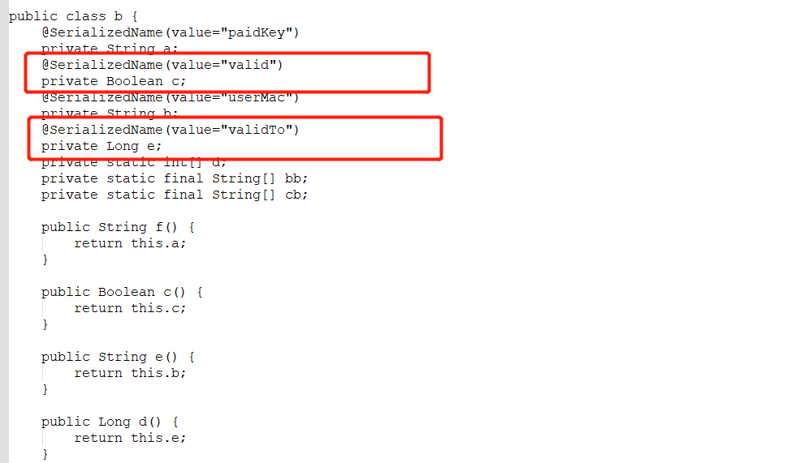

>MyBatisCodeHelperpro 是一款 IntelliJ IDEA 上生成mybatis模版文件的插件。
>这里分析下怎么无限使用的思路仅供参考。其实很多客户端软件都可以参考该思路
>分析该插件工作原理：  
>
>1. 提交激活码到服务端
>2. 服务端验证返回验证信息（是加密信息）
>3. 本地解密信息，将解析后的json解析为实体类
>4. 判断json解析的实体类的字段过期时间
>
>处理思路：修改最后实体类代码，直接跳过服务端返回的有效时间。
>修改设置(setXXX)，获取(getXXX)方法。不使用解析后的json字段设置，固定为一个无限长的时间达到破解的结果


**反编译jar包**

该插件核心jar包为MyBatisCodeHelper-Pro-obfuss.jar，这是一个混淆后的jar包，所以需要借助`CRF`工具

```bash
java -jar .\cfr-0.152.jar .\MyBatisCodeHelper-Pro\lib\MyBatisCodeHelper-Pro-obfuss.jar --renamedupmembers true --hideutf false >> a.txt
```

cfr GitHub地址

https://github.com/leibnitz27/cfr

官网地址

https://www.benf.org/other/cfr

查看反编译结果



需要修改的class为：`com.ccnode.codegenerator.H.d.b`

**生成需要的class文件**

借助 `javassist`生成修改后的class文件

1. 导入依赖

   ```xml
   <dependency>
       <groupId>org.javassist</groupId>
       <artifactId>javassist</artifactId>
       <version>3.29.2-GA</version>
   </dependency>
   ```

2. 生成class文件的代码

   ```java
   public static void main(String[] args) throws Exception {
       ClassPool aDefault = ClassPool.getDefault();
       aDefault.insertClassPath(
               "E:\\MyBatisCodeHelper-Pro\\MyBatisCodeHelper-Pro\\lib\\MyBatisCodeHelper-Pro-obfuss.jar");
       aDefault.importPackage("java.lang.Boolean");
       CtClass c2 = ClassPool.getDefault().getCtClass("com.ccnode.codegenerator.H.d.b");
   
       CtMethod aMethod = c2.getDeclaredMethod("d");
   
       StringBuilder builder1 = new StringBuilder();
       builder1.append("{")
               .append("       return new Long(4797976044000L);")
               .append("}");
       aMethod.setBody(builder1.toString());
   
       CtClass lctClass=ClassPool.getDefault().getCtClass("java.lang.Long");
       CtMethod bMethod = c2.getDeclaredMethod("a",new CtClass[]{lctClass});
       StringBuilder builder2 = new StringBuilder();
       builder2.append("{")
               .append("        this.e = new Long(4797976044000L);")
               .append("}");
       bMethod.setBody(builder2.toString());
   
       CtMethod cMethod = c2.getDeclaredMethod("c");
       StringBuilder builder3 = new StringBuilder();
       builder3.append("{")
               .append("        return Boolean.TRUE;")
               .append("}");
       cMethod.setBody(builder3.toString());
   
       CtClass bctClass=ClassPool.getDefault().getCtClass("java.lang.Boolean");
       CtMethod dMethod = c2.getDeclaredMethod("a",new CtClass[]{bctClass});
       StringBuilder builder4 = new StringBuilder();
       builder4.append("{")
               .append("        this.c = Boolean.TRUE;")
               .append("}");
       dMethod.setBody(builder4.toString());
   
       c2.writeFile();
   }
   ```

**替换jar包的class文件**

```bash
jar -uvf .\MyBatisCodeHelper-Pro-obfuss.jar .\com\ccnode\codegenerator\H\d\b.class
```

