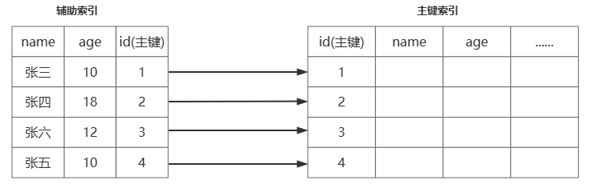

# Java面试题

## 基础

### java面向对象的特征

封装：说明的是一个类的行为和属性与其他类的关系是低耦合（模块之间）、高内聚（模块内）；可以在不影响使用的情况下改变类的内部结构，同时也保护了数据。对于外部它内部的细节是隐藏的，暴露出去的只是它的访问方法

继承：继承是父类和子类的关系；是从已有的类派生出新的类，新的类继承已有类的数据属性和行为，并能扩展能力

多态：类与类之间的关系；父类的引用指向子类的实例；多态必备的三个要素：继承、重写、父类引用指向子类实例

### java中四种引用类型

- 强引用：`Object object= new Object()`，这种方式为强引用，强引用在任何时候都不会被 jvm 垃圾回收，即使抛出 OutOfMemoryError
- 软引用：通过`SoftReference`的get方法来获取对象。软引用，在jvm内存不足的情况下发生垃圾回收时会被回收
- 弱引用：通过`WeakReference`的get方法来获取对象。弱引用，只要发生垃圾回收都会回收该对象，不管内存是否充足
- 虚引用：虚引用和没有引用是一样的，需要和队列(ReferenceQueue)联合使用。当jvm扫描到虚引用对象时，会将此对象放入关联的引入队列中，后续可以通过判断队列中是否存这个对象，来进行回收前的一些处理

### ArrayList和LinkedList区别

ArrayList 和 LinkedList 都实现了 List 接口

ArrayList 底层是数组，可以快速的通过索引进行随机访问，时间复杂度O(1)；插入删除随机元素开销很大，因为需要重排数据中所有数据

LinkedList 底层是链表，每个节点存储了两个引用，一个指向前一个元素，一个指向后一个元素，因此会比 ArrayList 更占内存；随机插入和删除效率高，不需要改变数据的大小；随机访问数据效率低，因为它会从第一个元素顺序遍历到需要访问的元素；LinkedList 更适用于：访问数据少，删除，插入数据多的场景

## 集合

## 线程

### 线程实现方式

1. 继承 Thread 类，重新 run 方法；启动线程时调用 Thread.start() 方法

   ```java
   /**
    * 实现 Thread ，重写 run 方法
    */
   private static void threadTest() {
       new Thread(){
           @Override
           public void run() {
               System.out.println(Thread.currentThread().getName());
           }
       }.start();
   }
   ```

2. 实现 Runnable 接口，重写 run 方法；将 Runnable 实现类对象传入 Thread 构造方法，然后调用 Thread.start() 启动线程

   ```java
   /**
    * 实现 Runnable 接口，并实现 run 方法
    * 创建 Thread 时传入 Runnable实现类实体
    */
   private static void runnableTest() {
       new Thread(new Runnable() {
           @Override
           public void run() {
               System.out.println(Thread.currentThread().getName());
           }
       }).start();
   }
   ```

3. 实现 Callable，重写 call 方法，配合 FutureTask ；一般用于有返回结果的非阻塞的执行方法

   ```java
   /**
    * 实现 Callable 接口，配合 FutureTask
    * 可以获取线程执行结果
    * Callable ===> FutureTask ===> Thread
    */
   private static void callableTest() throws Exception {
       Callable<String> callable = new Callable<>() {
           @Override
           public String call() {
               return Thread.currentThread().getName();
           }
       };
       FutureTask<String> futureTask = new FutureTask<>(callable);
       new Thread(futureTask).start();
       // 获取线程执行结果 ，超时时间
       System.out.println(futureTask.get(60, TimeUnit.SECONDS));
   }
   ```

线程实现方式，底层都是实现 Runnable 方式

### 线程状态

**操作系统层面讲**


- new（新建状态）：创建了一个新的线程对象
- runnable（就绪状态）：调用线程的start()方法，处于就绪状态
- run（运行状态）： 获得了CPU时间片，执行程序代码；`就绪状态是进入到运行状态的唯一入口`
- block（阻塞状态）：因为某种原因，线程放弃对CPU的使用权，停止执行，直到进入就绪状态在有可能再次被CPU调度；阻塞又分为三种：`等待阻塞`、`同步阻塞`、`其他阻塞`
- dead（死亡状态）：线程run()、main()方法执行结束，或者因为异常退出了run()方法，则该线程结束生命周期；`死亡状态线程不能再次复活`

**java 层面讲**

java 的线程状态可查看 jdk 的 `Thread.State` 枚举，其中包含了 6 种线程状态


- new（初始化）：新建一个 Thread 实例，就进入了初始化状态
- runnable（可运行）
  - ready：此时线程等待 cpu 调度，调用 start() 后进入就绪状态；当前线程 sleep() 方法结束，其他线程 join() 结束，等待用户输入完毕，某个线程拿到对象锁，线程也将进入就绪状态
  - running：cpu 调度该线程，这也是进入线程运行状态的唯一方法
- blocked：阻塞状态是线程阻塞在进入synchronized关键字修饰的方法或代码块(获取锁)时的状态
- waiting：处于这种状态的线程不会被分配CPU执行时间，它们要等待被显式地唤醒，否则会处于无限期等待的状态
- timed_waiting：处于这种状态的线程不会被分配CPU执行时间，不过无须无限期等待被其他线程显示地唤醒，在达到一定时间后它们会自动唤醒
- terminated：当线程的run()方法完成时，或者主线程的main()方法完成时，就认为它终止了；这个线程对象也许是活的，但是它已经不是一个单独执行的线程；`线程一旦终止了，就不能复生`；在一个终止的线程上调用start()方法，会抛出 java.lang.IllegalThreadStateException 异常

### java 中停止线程

使用 interrupt() 中断线程；如果线程在 等待状态时，调用  interrupt() 会抛出异常 InterruptedException

调用 interrupt() 不会立即终止线程，只是将 interrupted 标志设置为 true，需手动写逻辑终止线程

```java
public static void main(String[] args) {

    // 默认 interrupted 为 false
    System.out.println(Thread.currentThread().isInterrupted());  // false

    // 设置 interrupted 为 true
    Thread.currentThread().interrupt();

    // 这里直接跳过不执行，因为 interrupted 标志位为 true
    // isInterrupted() 方法获取当前 interrupted ，并重置 interrupted 为 false
    while (!Thread.currentThread().isInterrupted()){
        System.out.println("-------------");
    }
}
```

### sleep 和 wait 方法的区别

- sleep 方法属于 Thread 类的一个静态方法；wait 方法属于 Object 类的方法
- sleep 方法会使线程变成 `超时等待状态`（自动唤醒）；wait 方法会使线程变成`等待状态`（需要被唤醒）
- sleep 方法不会释放已经持有的锁资源；wait 在执行后会释放锁资源
- wait 只能在持有锁时才可以执行；sleep 没有这个限制

wait 方法会将持有锁的线程从 owner 扔到 WaitSet 集合中，这个操作是修改 ObjectMonitor 对象，如果没有持有 synchronized 锁的话，是没法操作 ObjectMonitor 对象的

### synchronized 实现原理

synchronized 基于对象实现


MarkWord 在 Hot Spot 中结构如下


MarkWord 标记着四种锁信息：无锁、偏向锁、轻量级锁、重量级锁

### synchronized 在 jdk 1.6 的优化

**锁消除：**在 synchronized 修饰的代码中，如果不存在操作临界资源的情况，会触发锁消除，即使写了 synchronized ，也不会触发

**锁膨胀：**如果在一个循环中，频繁的获取和释放锁资源，这样带来的消耗很大，锁膨胀就是将锁的范围扩大，避免频繁的竞争和获取锁资源带来的不必要消耗

**锁升级：**ReentrantLock 的实现，是基于乐观锁的 CAS 尝试获取锁资源，如果拿不到锁资源，才会挂起线程。synchronized 在 JDK 1.6 之前，完全就是获取不到锁，立即挂起当前线程，所以 synchronized 性能比较差，synchronized 就在 JDK 1.6 做了锁升级的优化

- 无锁、匿名偏向：当前对象没有作为锁存在
- 偏向锁：如果当前锁资源，只有一个线程在频繁的获取和释放，那么这个线程过来，只需要判断，当前指向的线程是否为当前线程
  - 如果是，直接拿走锁资源
  - 如果不是，基于 CAS 的方式，尝试将偏向锁指向当前线程。如果获取不到，触发锁升级，升级为轻量级锁（偏向锁状态出现了锁竞争的情况）
- 轻量级锁：会采用自旋锁的方式去频繁的以 CAS 的形式获取到锁资源（采用的是自适应自旋锁）
  - 如果成功获取到，拿着锁资源走
  - 如果自旋了一定次数，没有拿到锁资源，锁升级
- 重量级锁：就是最传统的 synchronized 方式，拿不到锁资源，就挂起当前线程（用户态 & 内核态）

### ReentrantLock 和 synchronized

- ReentrantLock 是个类，synchronized 是关键字，都是在 JVM 层面实现互斥锁的方式
- 如果竞争比较激烈，推荐使用 ReentrantLock 去实现，不存在锁升级概念。而 synchronized 是存在锁升级概念的，如果升级到重量级锁，是不存在锁降级的
- 实现原理不一样，ReentrantLock 基于 AQS 实现的，synchronized 基于 ObjectMonitor 实现的
- ReentrantLock 功能比 synchronized 更全面；ReentrantLock 支持公平锁或非公平锁；ReentrantLock 可以指定等待锁资源的时间

### ThreadLocal 内存泄漏问题

**ThreadLocal 实现原理**

- 每个 Thread 中都存储着一个成员变量，ThreadLocalMap
- ThreadLocal 本身不存储数据，像是一个工具类，基于 ThreadLocal 去操作 ThreadLocalMap
- ThreadLocalMap 本身就是基于 Entry[] 实现的，因为一个线程可以绑定多个 ThreadLocal，这样一来可能需要存储多个数据，所以采用 Entry[] 的形式实现
- 每一个线程都有自己独立的 ThreadLocalMap ，再基于 ThreadLocal 对象本身作为 key，对 value进行存取
- ThreadLocalMap 的 key 是一个弱引用，弱引用的特点是，即便有弱引用在 GC 时也会被垃圾回收。这里是为了在 ThreadLocal 对象失去引用后，如果 key 的引用是强引用，会导致 ThreadLocal 对象无法被回收

**内存泄漏**

- key 的内存泄漏：ThreadLocalMap key 是弱引用 ThreadLocal 对象，解决了

- value 内存泄漏：如果 ThreadLocal 引用丢失，key 因为弱引用会被 GC 回收掉，如果同时线程还没有被回收，就会导致内存泄漏，内存中的 value 无法被回收，同时也无法被获取到；只需要在使用完毕 ThreadLocal 对象后，及时的调用 remove 方法，移除 Entry 即可


### java 中锁分类

1. 可重入锁、不可重入锁

   java 提供的 synchronized、ReentrantLock、ReentrantReadWriteLock 都是可重入锁

   **重入：**当线程获取到 A 锁，在获取之后尝试再次获取 A 锁是可以直接拿到的

   **不可重入：**当线程获取到 A 锁，在获取后再次尝试获取 A 锁，无法获取到，因为 A 锁被当前线程占用着，需要等待自己释放锁再获取锁

2. 乐观锁、悲观锁

   java 提供的 synchronized、ReentranLock、ReentranReadWriteLock 都是悲观锁

   java 中 CAS 操作就是乐观锁的一种实现

   **悲观锁：**在获取不到锁资源时，会将线程挂起（进入 BLOCKED、WAITING），线程挂起会涉及到用户态和内存态的切换，而这种切换比较耗资源

   - 用户态：JVM 可以自行执行的指令，不需要借助操作系统执行
   - 内核态：JVM 不可以自行执行，需要操作系统才可以执行

   **乐观锁：**获取不到锁资源，可以再次让 CPU 调度，重新尝试获取锁资源

   Atomic 原子性类中，就是基于 CAS 乐观锁实现的

3. 公平锁、非公平锁

   java 提供的 synchronized 只能是非公平锁

   java 提供的 ReentrantLock、ReentranReadWriteLock 可以实现公平锁和非公平锁

   **公平锁：**线程 A 获取到了锁资源，线程 B 没有拿到，线程 B 去排队，线程 C 来了，锁被 A 持有，同时 B 在排队。C 排在 B 后面，直到 B 拿到锁资源或者 B 取消后，才可以尝试去竞争锁

   **非公平锁：**线程 A 获取到了锁资源，线程 B 没有拿到，线程 B 去排队，线程 C 来了，先尝试竞争一波

   - 拿到锁资源：插队成功
   - 没有拿到锁资源：依然需要排队在 B 的后面，等待 B 拿到锁资源或 B 取消后，才可以尝试竞争锁

4. 互斥锁、共享锁

   java 提供的 synchonized、ReentrantLocak 是互斥锁

   java 提供的 ReentrantReadWriteLock 有互斥锁也有共享锁

   **互斥锁：**同一时间点，只会有一个线程持有当前互斥锁

   **共享锁：**同一时间点，当前共享锁可以被多个线程同时持有

### 并发编程的三大特性

**原子性**

原子性指的是一个操作是不可分割的，不可中断的，一个线程在执行时，另外一个线程不会影响到他

可以通过 synchronized、CAS、Lock 锁、ThreadLocal 来保证并发编程的原子性

**可见性**

cpu 执行过程会存在缓存，需要保证所有线程读取到的数据是一致的

使用 synchroized 、 lock 都会在加锁和释放锁时对 cpu 缓存做一个同步到主内存的操作，如果在同步代码块中没有对数据进行修改，也能保证可见性

使用 volatile 来保证可见性

- volatile 属性被写时，JMM 会将当前线程对应的 cpu 缓存及时刷新到主内存中
- volatile 属性被读时，JMM 会将对应的 CPU 缓存中的内存设置为无效，必须从主内存中重新读取共享变量

**有序性**

在 java 中，java 文件中的内容会被编译，在执行前需要再次转为 CPU 可识别的指令，CPU 在执行这些指令时，为了提升执行效率，在不影响最终结果的前提下（满足某种要求），会对指令进行重排

可以使用 volatile 可以保证有序性，防止指令重排

### JDK 中提供的线程池

**newFixedThreadPool**

这个线程池的线程是固定的 `Executors.newFixedThreadPool(int nThreads)`

```java
// 无界队列，线程核心数量和最大数量一致；线程空闲超过 0s 后关闭 （大于核心线程数的线程）
public static ExecutorService newFixedThreadPool(int nThreads) {
    return new ThreadPoolExecutor(nThreads, nThreads,
                                  0L, TimeUnit.MILLISECONDS,
                                  new LinkedBlockingQueue<Runnable>());
}
```

构建该线程池时需要提供一个 nThreads 的属性，这个属性就是线程池中线程的个数（线程是懒加载，构建线程池时并没有创建线程，当任务提交时才会在线程池中构建线程）；任务会被添加到无界队列 LinkedBlockingQueue 中等待线程去 take() 出后执行

**newSingleThreadExecutor**

```java
// 无界队列，线程核心数量和最大数量一致且为1；线程空闲超过 0s 后关闭 （大于核心线程数的线程）
public static ExecutorService newSingleThreadExecutor() {
    // FinalizableDelegatedExecutorService 里面只是在 finalize 中去关闭了一次线程池（无意义）
    return new FinalizableDelegatedExecutorService
        (new ThreadPoolExecutor(1, 1,
                                0L, TimeUnit.MILLISECONDS,
                                new LinkedBlockingQueue<Runnable>()));
}
```

单例线程池，线程池中只有一个工作线程在运行

任务执行顺序及任务进入无界队列的顺序，可用来处理 顺序处理的业务

**newCachedThreadPool**

```java
// 线程核心数量为0，最大为 Integer.MAX_VALUE；
// 线程空闲超过 60s 后关闭 （大于核心线程数的线程）
public static ExecutorService newCachedThreadPool() {
    return new ThreadPoolExecutor(0, Integer.MAX_VALUE,
                                  60L, TimeUnit.SECONDS,
                                  new SynchronousQueue<Runnable>());
}
```

第一次提交任务到线程池时，会直接创建一个工作线程；当工作线程执行完后，60s内没有任务，会结束这个工作线程

如果后续进来任务没有线程时，会创建新的工作线程去执行

特点：当任务提交到该线程池中时，必然会有工作线程进行处理

**ScheduledExecutorService**

```java
public static ScheduledExecutorService newScheduledThreadPool(int corePoolSize) {
    return new ScheduledThreadPoolExecutor(corePoolSize);
}
```

定时任务线程池，这个线程池可以一定周期去执行一个任务，或者延迟多久执行一个任务

**newWorkStealingPool**

```java
public static ExecutorService newWorkStealingPool() {
    return new ForkJoinPool
        (Runtime.getRuntime().availableProcessors(),
         ForkJoinPool.defaultForkJoinWorkerThreadFactory,
         null, true);
}
```

该线程池和前面几种区别很大

前面的线程池底层都是基于 `ThreadPoolExecutor` 构建的；newWorkStealingPool 线程池是基于 ForkJoinPool 构建出来的

### 线程池核心参数

ThreadPoolExecutor 有 7 个核心参数

```java
public ThreadPoolExecutor(int corePoolSize,   // 核心线程数量，始终存活
                          int maximumPoolSize,  // 任务超过核心线程数量时，可创建的最大线程数量
                          long keepAliveTime,  // 超过 corePoolSize 的线程数量空闲时存活时间
                          TimeUnit unit,  // 存活时间单位
                          BlockingQueue<Runnable> workQueue,  // 任务队列，存放当前没有线程处理的任务
                          ThreadFactory threadFactory,  // 构建线程，可以设置线程的一些参数
                          RejectedExecutionHandler handler  // 拒绝策略，线程池无法处理任务时
) {
```

**拒绝策略**

- ThreadPoolExecutor.AbortPolicy：抛出错误 RejectedExecutionException
- ThreadPoolExecutor.CallerRunsPolicy：使用调用者线程执行任务，直接调用任务的 run 方法
- ThreadPoolExecutor.DiscardPolicy：丢弃任务
- ThreadPoolExecutor.DiscardOldestPolicy：丢弃最早的未处理任务

### 线程池状态

线程池核心属性是 ctl，基于 ctl 拿到线程池的状态以及工作线程个数

```java
// ctl 是一个 int 类型的数值，内部基于 AtomicInteger 嵌套了一层，保证操作的原子性
// 线程池状态：ctl 高三位表示线程池状态
// 工作线程个数：ctl 低三位表示线程的个数
private final AtomicInteger ctl = new AtomicInteger(ctlOf(RUNNING, 0));

// Integer.SIZE 获取 Integer 的 bit 个数
// 申明一个常量 COUNT_BITS = 29
private static final int COUNT_BITS = Integer.SIZE - 3;
// COUNT_MASK 为当前线程池记录的工作线程个数
private static final int COUNT_MASK = (1 << COUNT_BITS) - 1;

// 线程池状态
// 111：线程池正常，可接收任务处理
private static final int RUNNING    = -1 << COUNT_BITS;
// 000：线程池关闭状态，不会接受新任务，正在处理的任务正常执行，阻塞队列中任务也会执行
private static final int SHUTDOWN   =  0 << COUNT_BITS;
// 001：线程池停止状态，不接收新任务，当前线程池中任务和阻塞队列中任务全都不管
private static final int STOP       =  1 << COUNT_BITS;
// 010：线程池整理，从 STOP 或 SHTUDOWN 转换过来的，只是一个过渡状态，代表当前线程池立马关闭
private static final int TIDYING    =  2 << COUNT_BITS;
// 001：线程池结束，从 TIDYING 转换过来的，转换过来只需要执行一个 terminated 方法
private static final int TERMINATED =  3 << COUNT_BITS;
```


### @Contended 注解作用

使用@Contended来保证被标识的字段或者类不与其他字段出现内存争用


为了提高IO效率，CPU每次从内存读取数据并不是只读取我们需要计算的数据，而是将我们需要的数据周围的64个字节（intel处理器的缓存行是64字节）的数据一次性全部读取到缓存中。这64个字节的数据就称为一个**缓存行**

假设现在有两个线程都需要缓存行1（见图）中的数据做运算，假设CPU1需要缓存行1中的第一个字节数据做运算，CPU2需要缓存行1中的第二个字节做运算。此时CPU1和CPU2都需要将缓存行1读取到缓存中，这样就有可能出现缓存不一致现象，为了保证缓存一致性，出现了很多种的缓存一致性协议，其中intel使用了MESI协议来保证缓存一致性。

@Contended 注解作用就是让数据独占一个缓存行，可以提升运行效率

```java
/**
 * @Contended 注解的作用
 * 使用@Contended来保证被标识的字段或者类不与其他字段出现内存争用
 * 为了提高IO效率，CPU每次从内存读取数据并不是只读取我们需要计算的数据，
 * 而是将我们需要的数据周围的64个字节（intel处理器的缓存行是64字节）的数据一次性全部读取到缓存中。这64个字节的数据就称为一个缓存行。
 * 假设现在有两个线程都需要缓存行1中的数据做运算，假设CPU1需要缓存行1中的第一个字节数据做运算，CPU2需要缓存行1中的第二个字节做运算。
 * 此时CPU1和CPU2都需要将缓存行1读取到缓存中，这样就有可能出现缓存不一致现象，为了保证缓存一致性，出现了很多种的缓存一致性协议，其中intel使用了MESI协议来保证缓存一致性。
 * 简单的说，当CPU1对缓存行1中的数据做了修改时，会通知CPU2，告诉他数据我修改了，你那边作废了，需要重新从内存读取。反之，CPU2对数据做出修改，CPU1也需要重新读取。这样就会导致大量的IO操作，导致性能降低。
 * <p>
 * 为了避免这种现象，我们需要想办法将这两个数据放到不同的缓存行中，这样就可以避免频繁的读取数据，增加性能。
 * <p>
 * 注意：如果想要@Contended注解起作用，需要在启动时添加JVM参数
 *
 * @author 81497
 * @date 2023/06/10
 */
public class ContendedDemo {
    // volatile 使用内存屏障保证数据的可见性 （更新直接写主存、读取从主从读）
    @Contended
    public volatile long x;
    public volatile long y;

    public static void main(String[] args) throws InterruptedException {
        testNoContended();

    }

    /**
     * 定义了两个变量x和y，并且使用两个线程对这两个变量做赋值操作。
     * 如果不加@Contended注解，x和y有很大概率位于同一个缓存行。
     * 就会出现我们刚才所说的频繁的重新从内存读取数据。如果对x变量添加了@Contended注解，则可以保证x与y在不同的缓存行
     * 不加 @Contended 注解执行时间：1261ms 左右波动；添加 @Contended 注解执行时间 385ms 左右波动，效率提升三倍左右
     */
    private static void testNoContended() throws InterruptedException {
        ContendedDemo contendedDemo = new ContendedDemo();
        Thread t1 = new Thread(() -> {
            for (long i = 0; i < 1000000000L; i++) {
                contendedDemo.x = i;
            }
        });
        Thread t2 = new Thread(() -> {
            for (long i = 0; i < 1000000000L; i++) {
                contendedDemo.y = i;
            }
        });
        long millis = System.currentTimeMillis();
        t1.start();
        t2.start();
        t1.join();
        t2.join();
        System.out.println((System.currentTimeMillis()-millis)+"ms");
    }
}
```


### 什么是 CAS

CAS(compare and swap)：也就是比较和交换，它是一条 CPU 的并发原语

它包含了三个参数：V，A，B。其中，V表示要读写的内存位置，A表示旧的预期值，B表示新值

它在替换内存某个位置的值时，首先查看内存中的值和预期值是否一致，如果一致，执行替换操作，这个操作是一个原子性操作

Java 中基于 Unsafe 的类提供了对 CAS 操作的方法，JVM 会帮助我们将方法实现 CAS 汇编指令

**优点**

比较传统的 synchroized 可以避免线程的挂起以及唤醒，避免了用户态内核态切换的时间成本

**缺点**

自旋时间可能过长，CPU开销较大

### 哲学家就餐问题

**描述：**哲学家就餐问题是计算机科学中一经典问题，用于演示并行计算中多线程同步（Synchronization）问题

**如下图：**假设有五位哲学家围坐在一张圆形餐桌旁，做以下两件事情之一：吃饭，或者思考。吃东西的时候，他们就停止思考，思考的时候也停止吃东西。餐桌中间有一大碗意大利面，每两个哲学家之间有一只餐叉，假设哲学家必须用两只餐叉吃东西。他们只能使用自己左右手边的那两只餐叉


**代码实现**

```java
/**
 * 哲学家就餐
 * 假设有五位哲学家围坐在一张圆形餐桌旁，做以下两件事情之一：吃饭，或者思考。吃东西的时候，他们就停止思考，思考的时候也停止吃东西。
 * 餐桌中间有一大碗意大利面，每两个哲学家之间有一只餐叉，假设哲学家必须用两只餐叉吃东西。他们只能使用自己左右手边的那两只餐叉
 *
 * @author 81497
 * @date 2023/06/05
 */
public class DiningPhilosophers {

    public static void main(String[] args) {
        // 筷子
        Fork f0 = new Fork("f0");
        Fork f1 = new Fork("f1");
        Fork f2 = new Fork("f2");
        Fork f3 = new Fork("f3");

        // 哲学家
        DiningPeople d1 = new DiningPeople(f0, f1, 1);
        DiningPeople d2 = new DiningPeople(f1, f2, 2);
        DiningPeople d3 = new DiningPeople(f2, f3, 3);
        DiningPeople d4 = new DiningPeople(f3, f0, 4);

        new Thread(d1).start();
        new Thread(d2).start();
        new Thread(d3).start();
        new Thread(d4).start();
    }

    /**
     * 哲学家
     */
    public static class DiningPeople extends Thread {
        private final Fork left, right;
        private final int index;

        public DiningPeople(Fork left, Fork right, int index) {
            this.left = left;
            this.right = right;
            this.index = index;
        }

        /**
         * 规定奇数号哲学家先拿他左边的筷子，然后在去拿右边的筷子；而偶数号哲学家则相反。按此规定，将是1、2号哲学家竞争1号筷子；3、4号哲学家竞争3号筷子。
         * 即5位哲学家都先竞争奇数号筷子，获得后，再去竞争偶数号筷子，最后总会有一位哲学家能够获得两只筷子而进餐
         */
        @Override
        public void run() {
            try {
                while (true) {
                    if (index % 2 == 0) {
                        // 拿到左手筷子
                        synchronized (left) {
                            System.out.println(index + "拿到左手筷子");
                            // 拿到右手筷子
                            synchronized (right) {
                                System.out.println(index + "哲学家开始吃饭");
                                TimeUnit.MILLISECONDS.sleep(1000);
                            }
                        }
                    } else {
                        // 拿到左手筷子
                        synchronized (right) {
                            System.out.println(index + "拿到右手筷子");
                            // 拿到右手筷子
                            synchronized (left) {
                                System.out.println(index + "哲学家开始吃饭");
                                TimeUnit.MILLISECONDS.sleep(1000);
                            }
                        }
                    }
                    System.out.println(index + "哲学家吃饭结束");
                    TimeUnit.MILLISECONDS.sleep(1000);

                }
            } catch (Exception e) {
                e.printStackTrace();
            }
        }
    }

    /**
     * 叉
     */
    public static class Fork {
        private String name;

        public Fork(String name) {
            this.name = name;
        }
    }
}
```

### 多线程事务控制

- 创建子线程个数的 CountDownLatch 

- 创建主线程 CountDownLatch 
- 共享数据，里面设置回滚标志

```java
/**
 * 多个任务，同时成功或失败
 *
 * @author 81497
 * @date 2023/06/06
 */
public class TransactionIssues {

    public static void main(String[] args) {
        // 主线程监控
        CountDownLatch mainLatch = new CountDownLatch(1);
        // 子线程监控
        CountDownLatch threadLatch = new CountDownLatch(4);
        ShareData shareData = new ShareData(mainLatch, threadLatch);

        // 启动四个子线程
        new Work(shareData).start();
        new Work(shareData).start();
        new Work(shareData).start();
        new Work(shareData).start();

        try {
            // 等待子线程结束，超时未结束会返回 false
            if (!threadLatch.await(10, TimeUnit.SECONDS)) {
                // 等待超时 设置共享变量为回滚
                shareData.rollback = true;
            }
        } catch (InterruptedException e) {
            // 当前线程被中断
            shareData.rollback = true;
        } finally {
            System.out.println("主线程处理结束");
            mainLatch.countDown();
        }

    }

    /**
     * 线程之间共享数据
     */
    public static class ShareData {
        public ShareData(CountDownLatch mainLatch, CountDownLatch threadLatch) {
            this.mainLatch = mainLatch;
            this.threadLatch = threadLatch;
        }

        CountDownLatch mainLatch;
        CountDownLatch threadLatch;
        volatile boolean rollback;
    }


    public static class Work extends Thread {
        private final ShareData shareData;

        public Work(ShareData shareData) {
            this.shareData = shareData;
        }

        @Override
        public void run() {
            try {
                // 模拟业务执行时间
                TimeUnit.MILLISECONDS.sleep(1000);
                if ("Thread-0".equals(Thread.currentThread().getName())) {
                    throw new IllegalArgumentException("异常");
                }
            } catch (Exception e) {
                // 业务执行失败，设置回滚
                System.out.println("子线程业务执行异常");
                shareData.rollback = true;
            } finally {
                // 当前子线程执行结束
                System.out.println(Thread.currentThread().getName() + "业务处理结束");
                shareData.threadLatch.countDown();
            }

            try {
                // 等待主线程处理结束，这里不设置超时时间
                shareData.mainLatch.await();
            } catch (InterruptedException e) {
                // 等待超时，默认处理直接回滚数据
                rollback();
            }
            if (shareData.rollback) {
                rollback();
            }
            System.out.println(Thread.currentThread().getName() + "子线程处理结束");
        }

        private void rollback() {
            System.out.println(Thread.currentThread().getName() + "回滚");
            throw new RuntimeException(Thread.currentThread().getName() + "子线程回滚");
            // 回滚失败可记录日志表
        }

    }
}
```

### 交替输出问题

假设有两个线程 A、B，A 输出的是 123456 ，B 输出的是 ABCDEF，需要保证最终输出为：1A2B3C4D5E6F 交替输出

> 通过 LockSupport.park() 和 LockSupport.unpark() 实现；park 和 unpark 顺序无所谓，内部有一个标识（类似于 +1 -1 操作，只要标识正确就可以）

```java
/**
 * 交替输出
 *
 * @author 81497
 * @date 2023/06/06
 */
public class AlternatingOutput {
    private static Thread t1, t2;

    public static void main(String[] args) {
        char[] a = "123456".toCharArray();
        char[] b = "ABCDEF".toCharArray();

        t1 = new Thread(() -> {
            for (char c : a) {
                System.out.print(c);
                // 唤醒 t2 线程
                LockSupport.unpark(t2);
                // 停止当前线程
                LockSupport.park();

            }
        });
        t2 = new Thread(() -> {
            for (char c : b) {
                // 停止当前线程
                LockSupport.park();
                System.out.print(c);
                // 唤醒 t1 线程
                LockSupport.unpark(t1);
            }
        });
        // 启动线程
        t1.start();
        t2.start();
    }
}
```

> 利用锁实现

```java
/**
 * 交替输出
 * 假设有两个线程 A、B，A 输出的是 123456 ，B 输出的是 ABCDEF，需要保证最终输出为：1A2B3C4D5E6F 交替输出
 *
 * @author 81497
 * @date 2023/06/06
 */
public class AlternatingOutput {
    private static Thread t1, t2;
    static final char[] a = "123456".toCharArray();
    static final char[] b = "ABCDEF".toCharArray();
    // 保证执行顺序，先执行 t2 线程，再执行t1线程
    static CountDownLatch downLatch = new CountDownLatch(1);

    /**
     * 利用锁实现
     */
    private static void test2() {
        t1 = new Thread(() -> {
            // 执行后等待门栓
            try {
                downLatch.await();
            } catch (InterruptedException e) {
                throw new RuntimeException(e);
            }

            synchronized (AlternatingOutput.class) {
                for (char c : a) {
                    try {
                        // 唤醒阻塞线程
                        System.out.print(c);
                        AlternatingOutput.class.notify();
                        AlternatingOutput.class.wait();
                    } catch (InterruptedException e) {
                        Thread.currentThread().interrupt();
                        throw new RuntimeException(e);
                    }

                }
                // 最后需要释放锁，不然总有个线程在等待，程序不能结束
                AlternatingOutput.class.notify();
            }
        });
        t2 = new Thread(() -> {
            synchronized (AlternatingOutput.class) {
                // 获取锁后就可以，关闭门闩
                downLatch.countDown();
                for (char c : b) {
                    try {
                        System.out.print(c);
                        AlternatingOutput.class.notify();
                        AlternatingOutput.class.wait();
                    } catch (InterruptedException e) {
                        Thread.currentThread().interrupt();
                        throw new RuntimeException(e);

                    }
                }
                // 最后需要释放锁，不然总有个线程在等待，程序不能结束
                AlternatingOutput.class.notify();
            }
        });
        // 启动线程
        t1.start();
        t2.start();
    }
}
```


## Spring

### 对 Spring 理解

**发展历程**

Spring 在 `2004-03-24` 发布了 1.0 的版本，截止到 2023 年，Spring 已经发布了 6.x 的版本，主要使用版本为 Spring5.x 版本

**Spring 组成**

Spring 是一个轻量级的 IOC 和 AOP 容器框架。是为 Java 程序提供基础性服务的一套框架，目的是用于简化企业应用程序的开发，它使得开发者只需要关心业务需求。常见的配置方式有三种：基于 XML 的配置、基于注解的配置、基于 Java 的配置

主要由以下几个模块组成

- Spring Core：核心类库，提供 IOC 服务
- Spring Context：提供框架式的 Bean 访问方式，以及企业级功能（JNDI、定时任务等）
- Spring AOP：AOP服务
- Spring DAO：对 JDBC 的抽象，简化数据访问异常的处理
- Spring ORM：对现有的 ORM 框架的支持
- Spring Web：提供了基本的面向 Web 的综合特性，例如多文件上传
- Spring MVC：提供面向 Web 应用的 Model-View-Controller 实现

**Spring 好处**

| 序号 |       好处        | 说明                                                         |
| :--: | :---------------: | ------------------------------------------------------------ |
|  1   |       轻量        | Spring 是轻量的，基本版本大约 2MB                            |
|  2   |     控制反转      | Spring 通过控制反转实现了松散耦合                            |
|  3   | 面向切面编程(AOP) | Spring 支持面向切面的编程，并把应用业务逻辑和系统服务分开    |
|  4   |       容器        | Spring 包含并管理应用中对象的生命周期和配置                  |
|  5   |     MVC 框架      | Spring 的 WEB 框架是个精心设计的框架，是 WEB 框架的一个很好替代品 |
|  6   |     事务管理      | Spring 提供了一个持续的事务管理接口，可以扩展到上至本地事务下至全局事务（JTA） |
|  7   |     异常处理      | Spring 提供方便的 API 把具体的技术相关异常转化为一个 unchecked 异常 |
|  8   |      最重要       | 使用的人多，生态丰富                                         |

### Spring 中用到的设计模式

**单例模式**

通过 xml 配置 bean 时，默认为单例

```xml
<?xml version="1.0" encoding="UTF-8"?>
<beans xmlns="http://www.springframework.org/schema/beans"
       xmlns:xsi="http://www.w3.org/2001/XMLSchema-instance"
       xsi:schemaLocation="http://www.springframework.org/schema/beans
        https://www.springframework.org/schema/beans/spring-beans.xsd">
    <!--  默认 scope 为 singleton 单例 -->
    <bean id="helloService" class="org.lei.ch01.service.HelloService">
        <property name="name" value="小唐"/>
    </bean>
</beans>
```

**原型模式**

通过 xml 配置 bean 时，可以声明 bean 为原型模式

```xml
<?xml version="1.0" encoding="UTF-8"?>
<beans xmlns="http://www.springframework.org/schema/beans"
       xmlns:xsi="http://www.w3.org/2001/XMLSchema-instance"
       xsi:schemaLocation="http://www.springframework.org/schema/beans
        https://www.springframework.org/schema/beans/spring-beans.xsd">
    <!--  声明 bean，声明 scope 为原型模式 -->
    <bean id="helloService" class="org.lei.ch01.service.HelloService" scope="prototype">
        <property name="name" value="小唐"/>
    </bean>
</beans>
```

**模板模式**

模板模式的核心是父类定义好流程，然后将流程中需要子类实现的方法就抽象给子类实现。Spring 中的 JdbcTemplate 就是这样实现的

JDBC 的固定步骤

1. 加载驱动
2. 获取连接通道
3. 构建 sql 执行语句
4. 执行 sql 语句
5. 关闭资源

在这些步骤中，第3步和第4步是不确定的，所以留给客户实现，而实际使用 jdbcTemplate 的时候也确实只需要构建 SQL 语句就行了。这就是典型的`模板模式`

**观察者模式**

观察者模式定义的是对象之间一种`一对多的依赖关系`，当一个对象的状态发生改变时，所有依赖它的对象都得到通知并被自动更新。ApplicationListener 就使用到了观察者模式

**工厂模式**

简单工厂模式：简单工厂模式就是通过工厂根据传递进来的参数决定产生哪个对象，Spring 中我们通过 id 或 name 调用getBean 方法获取对象就是简单工厂模式

工厂方法模式：在 Spring 中我们一般是将 Bean 实例化直接交给容器去管理的，实现了使用和创建的分离，这时容器直接管理对象；还有种情况是，bean 的创建过程交给一个工厂去实现，而 Spring 容器管理这个工厂；在 Spring 中有两种工厂方法模式，一种是静态工厂方法模式，一种是动态工厂方法模式

**适配器模式**

将一个类的接口转换成客户希望的另一个接口。使得原本由于接口不兼容而不能在一起工作的那些类可以在一起工作，这就是适配器模式。在 Spring 中在 AOP 实现中的 Advice 和 interceptor 之间的转换就是通过适配器模式实现的

```java
class MethodBeforeAdviceAdapter implements AdvisorAdapter, Serializable {
    MethodBeforeAdviceAdapter() {
    }

    public boolean supportsAdvice(Advice advice) {
        return advice instanceof MethodBeforeAdvice;
    }

    public MethodInterceptor getInterceptor(Advisor advisor) {
        MethodBeforeAdvice advice = (MethodBeforeAdvice)advisor.getAdvice();
        // 通知类型匹配对应的拦截器
        return new MethodBeforeAdviceInterceptor(advice);
    }
}
```

**装饰者模式**

装饰者模式又称为包装模式（Wrapper），作用是用来动态的为一个对象增加新的功能。装饰模式是一种用于代替继承的技术，无须通过继承增加子类就能扩展对象的新功能。使用对象的关联关系替代继承关系，更加灵活，同时避免类型体系的快速膨胀

Spring 中用得到包装模式在类名上有两种表现：一种是类名中含有 Wrapper，另一种是类名含有 Decorator。基本上都是都是动态的给一个对象添加一些额外的职责

具体的使用在 SpringSession 框架中的 SessionRepositoryRequestWrapper 使用包装模式对原生的 request 的功能进行增强，可以将 session 中的数据和分布式数据库同步，这样即使当前 tomcat 崩溃，session 中的数据也不会丢失

**代理模式**

aop 就是基于代理模式

**策略模式**

策略模式对应于解决某个问题的的算法族，允许用户任选一个算法解决某个问题，同时可以方柏霓的更换或者增加新的算法。spring 中在实例化对象时会用到 策略模式，XmlBeanDefinitionReader，PropertiesBeanDefinitionReader

**责任链模式**

AOP 中的拦截器链

**委托者模式**

DelegatingFilterProxy，整合 Shiro、SpringSecurity 的时候都有用到

### @Autowired 和 @Resource

@Autowired 和 @Resource 都是做 bean 的注入时使用，@Resource 并不是 Spring 的注解，它的包是 javax.annotation.Resource，需要导入，但是 Spring 支持该注解的注入

**共同点**

两者都可以使用在`字段和setter方法`上。两者如果都写在字段上，那么久不需要再写 setter 方法

**不同点**

@Autowired 为 Spring 提供的注解，需要导入 org.springframework.beans.factory.annotation.Autowired ，只按照 byType 注入；@Autowired 注解是按照类型（byType）装配依赖对象，默认情况下它会要求依赖对象必须存在，可以设置它的 required 属性为 false。如果想按照名称（byName）注入，可以配合 @Qualififier 注解一起使用

@Resource 默认是按照名字自动注入（byName），由 J2EE 提供，需要导入包 Java.annotation.Resource。@Resource 有两个重要的属性：name 和 type，而 Spring 将 @Resource 注解的 name 属性解析为 bean 的名字，而 type 属性则解析为 bean 的类型。所以使用 name 属性，则使用 byName 的自动注入策略，而使用 type 属性则使用 byType 自动注入策略。如果既不指定 name 属性也不指定 type 属性，这时将通过反射机制使用 byName 自动注入策略

@Resource 装配顺序

1. 如果同时指定了 name 和 type，则从 Spring 上下文找到唯一匹配的 bean 进行装配，找不到则抛出异常
2. 如果指定了 name，则从上下文查找名称（id）匹配的 bean 进行装配，找不到则抛出异常
3. 如果指定 type，则从上下文找到类似匹配的唯一 bean 进行装配，找不到或是找到多个，都会抛出异常
4. 如果 name 和 type 属性都没指定，则自动按照 byName 进行装配；如果没有匹配，则回退为一个原始类型进行匹配，如果匹配了则自动装配

### Spring 中循环依赖

**循环依赖几种情况**


上图是循环依赖的三种情况，虽然方式不一样，但是循环依赖本质都是一样的，就是我完成创建要依赖的对象也依赖自己，相互依赖从而没法创建造成失败

**代码演示**

```java
public class Main {

    public static void main(String[] args) {
        A a = new A();
    }

    static class A{
        B b=new B();
    }
    static class B{
        A a=new A();
    }

}
```

**解决方法本质**

先创建 A ，但是不进行初始化操作，也就是半成品对象，然后在创建 B 的时候先把 A 暴露出来，让 B 创建完成后找到 A 通过 set 方法设置 A 的属性，完成整体的实例化

**Spring 解决循环依赖**


### Spring 几种作用域

Spring 容器中的 bean 可分为五个范围

**prototype（原型作用域）：**为每一个 bean 请求提供一个实例

**singleton（单例作用域）：**默认，每个容器中只有一个 bean 的实例，单例模式由 BeanFactory 自身来维护

**request（请求作用域）：**为每一个网络请求创建一个实例，在请求完成以后，bean 会失效，并被垃圾回收器回收

**session（会话作用域）：**与 request 范围类似，确保每个 session 中有一个 bean 的实例，在 session 过期后，bean 会随之失效并被回收

**global session（全局作用域）：**类似于标准的HTTP Session作用域，不过它仅仅在基于portlet的web应用中才有意义。Portlet规范定义了全局Session的概念，它被所有构成某个portlet web应用的各种不同的portlet所共享。在global session作用域中定义的bean被限定于全局portlet Session的生命周期范围内

Spring 事务隔离级别

事务隔离级别指的是一个事务对数据的修改与另一个并行的事务的隔离程度，当多个事务访问相同的数据，如果没有采用必要的隔离机制，就可能发生以下问题：

| 问题       | 描述                                                         |
| ---------- | ------------------------------------------------------------ |
| 脏读       | 事务A读取到了事务B更新但未提交的数据                         |
| 幻读       | 事务A查询数据，此时事务B插入了数据，事务A再按相同条件查询数据，发现和第一次查询的数据不一致（侧重于增删） |
| 不可重复读 | 事务A查询数据，此时事务B修改数据并提交，事务A再按相同条件查询数据，发现和第一次查询的数据不一致（侧重于修改） |

**Spring 支持的隔离级别**

| 隔离级别         | 描述                                                         |
| ---------------- | ------------------------------------------------------------ |
| DEFAULT          | 使用数据库本身使用的隔离级别；ORACLE（读已提交）、MySQL（可重复读） |
| READ_UNCOMMITTED | 读未提交（脏读），最低的隔离级别                             |
| READ_COMMITTED   | 读已提交，有幻读和不可重复读的风险                           |
| REPEABLE_READ    | 可重复读，解决不可重复读，但是存在幻读的风险（事务B不能对当前事务A读取的数据进行更新） |
| SERLALIZEABLE    | 序列化读，最高事务隔离级别；所有事务依次执行；效率低下       |

### Spring 中事务传播

保证事务：ACID，A（Atomicity原子性）、I（Isolation隔离性）、D（Durability持久性）==》C（Consistency一致性）

**Spring 中七种事务传播行为**

参看 `TransactionDefinition` 接口中定义的常量

| 事务行为                  | 说明                                                         |
| ------------------------- | ------------------------------------------------------------ |
| PROPAGATION_REQUIRED      | 支持当前事务；如果不存在，则创建一个新的                     |
| PROPAGATION_SUPPORTS      | 支持当前事务；如果不存在，则以非事务方式运行                 |
| PROPAGATION_MANDATORY     | 支持当前事务；如果不存在，则抛出错误                         |
| PROPAGATION_REQUIRES_NEW  | 创建新事物；如果存在当前事务，则暂停                         |
| PROPAGATION_NOT_SUPPORTED | 不支持当前事务；总是以非事务方式运行                         |
| PROPAGATION_NEVER         | 不支持当前事务；如果存在抛出错误                             |
| PROPAGATION_NESTED        | 如果当前事务存在，则在嵌套事务中执行，否则行为类似于 PROPAGATION_REQUIRED |

### Spring 事务实现方式

**编程式事务：**通过编程方式管理事务，具有很大的灵活性，但难以维护

1. 通过`PlatformTransactionManager`实现编程式事务

   ```java
   @Override
   public StudentEntity update(StudentEntity studentEntity) {
       //事务定义
   	DefaultTransactionDefinition definition = new DefaultTransactionDefinition();
       definition.setPropagationBehavior(TransactionDefinition.PROPAGATION_REQUIRED);
       //新开事务
       TransactionStatus status = transactionManager.getTransaction(definition);
       try {
           studentsDao.update(studentEntity);
           //事务定义
           DefaultTransactionDefinition definition1 = new DefaultTransactionDefinition();
           definition1.setPropagationBehavior(TransactionDefinition.PROPAGATION_REQUIRES_NEW);
           //新开事务
           TransactionStatus status1 = transactionManager.getTransaction(definition1);
           try {
               StudentEntity studentEntity1=new StudentEntity();
               BeanUtils.copyProperties(studentEntity,studentEntity1);
               studentEntity1.setId(2L);
               studentEntity1.setName("后续更新");
               studentsDao.update(studentEntity1);
               int a=10/0;
               transactionManager.commit(status1);
           }catch (Exception e){
               transactionManager.rollback(status1);
           }
           //提交事务
           transactionManager.commit(status);
       }catch (Exception e){
           //回滚事务
           transactionManager.rollback(status);
       }
   }
   ```

2. 通过`transactionTemplate`实现编程式事务

   ```java
   @Override
   public StudentEntity update(StudentEntity studentEntity) {
   	transactionTemplate.setPropagationBehavior(TransactionDefinition.PROPAGATION_REQUIRED);
       this.transactionTemplate.execute(new TransactionCallbackWithoutResult() {
           @Override
           protected void doInTransactionWithoutResult(TransactionStatus transactionStatus) {
               try {
                   studentsDao.update(studentEntity);
                   //设置事务的传播级别
                   transactionTemplate.setPropagationBehavior(TransactionDefinition.PROPAGATION_NEVER);
                   //新开事务
                   transactionTemplate.execute(new TransactionCallbackWithoutResult() {
                       @Override
                       protected void doInTransactionWithoutResult(TransactionStatus transactionStatus) {
                           try {
                               StudentEntity studentEntity1=new StudentEntity();
                               BeanUtils.copyProperties(studentEntity,studentEntity1);
                               studentEntity1.setId(2L);
                               studentEntity1.setName("后续更新");
                               studentsDao.update(studentEntity1);
                           }catch(Exception e){
                               //标记事务为回滚
                               transactionStatus.setRollbackOnly();
                           }
                       }
                   });
                   int a=10/0;
               }catch (Exception e){
                   transactionStatus.setRollbackOnly();
               }
           }
       });
   }
   ```

**声明式事务：**可以将事务管理和业务代码分离，只需要通过注解或xml配置管理事务；

1. 注解方式：@EnableTransactionManagement 和 @Transactional 

2. xml 配置方式

   ```xml
   <?xml version="1.0" encoding="UTF-8"?>
   <beans xmlns="http://www.springframework.org/schema/beans"
          xmlns:xsi="http://www.w3.org/2001/XMLSchema-instance" xmlns:aop="http://www.springframework.org/schema/aop"
          xmlns:tx="http://www.springframework.org/schema/tx"
          xsi:schemaLocation="http://www.springframework.org/schema/beans https://www.springframework.org/schema/beans/spring-beans.xsd
           http://www.springframework.org/schema/aop http://www.springframework.org/schema/aop/spring-aop.xsd
           http://www.springframework.org/schema/tx http://www.springframework.org/schema/tx/spring-tx.xsd">
   
   <!--    DataSource -->
       <bean id="dataSource" class="org.springframework.jdbc.datasource.DriverManagerDataSource">
           <property name="url" value="jdbc:mysql://139.186.140.120:3312/learn?characterEncoding=utf8"/>
           <property name="username" value="root"/>
           <property name="password" value="123456"/>
       </bean>
   <!--    SqlSessionFactory -->
       <bean id="sqlSesFactory" class="org.mybatis.spring.SqlSessionFactoryBean">
           <property name="dataSource" ref="dataSource"/>
   <!--        绑定 mybatis 配置文件，也可以完全取代不绑定 -->
           <property name="configLocation" value="classpath:mybatis-config.xml"/>
           <property name="mapperLocations" value="classpath:com/lei/dao/*.xml" />
       </bean>
   <!--    sqlSessionTemplate -->
       <bean id="sqlSession" class="org.mybatis.spring.SqlSessionTemplate">
   <!--        只能使用构造方法注入，因为该类没有 set 方法-->
           <constructor-arg index="0" ref="sqlSesFactory"/>
       </bean>
   <!--    配置声明式事务-->
       <bean id="transactionManagerger" class="org.springframework.jdbc.datasource.DataSourceTransactionManager">
           <property name="dataSource" ref="dataSource"/>
       </bean>
   <!--    通过spring的aop织入事务-->
   <!--    配置事务通知-->
       <tx:advice id="txAdvice" transaction-manager="transactionManagerger">
   <!--        给哪些方法配置事务-->
           <tx:attributes>
   <!--       propagation配置事务的传播特性，默认为：REQUIRED    -->
               <tx:method name="*" propagation="REQUIRED"/>
           </tx:attributes>
       </tx:advice>
   <!--    配置事务切入-->
       <aop:config>
           <aop:pointcut id="txPrintcut" expression="execution(* com.lei.service.*.*(..))"/>
           <aop:advisor advice-ref="txAdvice" pointcut-ref="txPrintcut"/>
       </aop:config>
   </beans>
   ```

### Spring 事务实现原理

`@Transactional `注解仅仅配置一些与事务相关的元数据，在运行时被事务设施读取消费，并根据这些元数据来配置 bean 的事务行为。主要功能大概是：一是声明哪些方法需要参与事务，二是配置相关的属性来定制事务参与方式和运行行为

Spring 事务主要得益于 Spring AOP，使用一个事务拦截器，在方法调用前后/周围进行事务性增强（advice），来驱动事务完成

`@Transactional `注解可以标注在类上，也可以标注在方法上。当在类上时，默认应用到类里的所有方法，如果此时方法上也标注了，则方法的优先级更高。`注意：方法一定是public修饰的`

### BeanPostProcessor

针对 bean 对象初始化前后需要的处理操作

对于容器中创建的每一个`bean`，在创建的过程中可以执行一些自定义的逻辑，就可以编写一个类，并让他实现`BeanPostProcessor`接口，然后将这个类注册到一个容器中。容器在创建`bean`的过程中，会优先创建实现了`BeanPostProcessor`接口的`bean`，然后，在创建其他`bean`的时候，会将创建的每一个`bean`作为参数，调用`BeanPostProcessor`的方法。而`BeanPostProcessor`接口的方法，即是由我们自己实现的

```java
public class BeanPostProcessorDemo implements BeanPostProcessor {
    @Override
    public Object postProcessBeforeInitialization(Object bean, String beanName) throws BeansException {
        System.out.println("准备创建 bean："+beanName);
        return bean;
    }

    @Override
    public Object postProcessAfterInitialization(Object bean, String beanName) throws BeansException {
        System.out.println("创建完成 bean："+beanName);
        return bean;
    }
}

/*
* 准备创建 bean：helloService
* 创建完成 bean：helloService
* 准备创建 bean：testService
* 创建完成 bean：testService
*/
```

### Spring MVC

**执行流程**

1. 用户发送请求至前端控制器 DispatcherServlet
2. DispatcherServlet 收到请求调用处理器映射器 HandlerMapping。
3. 处理器映射器根据请求url找到具体的处理器，生成处理器执行链 HandlerExecutionChain(包括处理器对象和处理器拦截器)一并返回给 DispatcherServlet。
4. DispatcherServle t根据处理器 Handler 获取处理器适配器 HandlerAdapter 执行 HandlerAdapter 处理一系列的操作，如：参数封装，数据格式转换，数据验证等操作
5. 执行处理器 Handler(Controller，也叫页面控制器)。
6. Handler 执行完成返回 ModelAndView
7. HandlerAdapter 将 Handler 执行结果 ModelAndView 返回到 DispatcherServlet
8. DispatcherServlet 将 ModelAndView 传给 ViewReslover 视图解析器
9. ViewReslover 解析后返回具体 View
10. DispatcherServlet 对 View 进行渲染视图（即将模型数据 model 填充至视图中）
11. DispatcherServlet 响应用户

**组件说明**

1. DispatcherServlet：前端控制器。用户请求到达前端控制器，它就相当于 mvc 模式中的c，dispatcherServlet 是整个流程控制的中心，由它调用其它组件处理用户的请求，dispatcherServlet 的存在降低了组件之间的耦合性,系统扩展性提高。由框架实现
2. HandlerMapping：处理器映射器。HandlerMapping 负责根据用户请求的 url 找到 Handler 即处理器，springmvc 提供了不同的映射器实现不同的映射方式，根据一定的规则去查找,例如：xml 配置方式，实现接口方式，注解方式等。由框架实现
3. Handler：处理器。Handler 是继 DispatcherServlet 前端控制器的后端控制器，在 DispatcherServlet 的控制下 Handler 对具体的用户请求进行处理。由于 Handler 涉及到具体的用户业务请求，所以一般情况需要程序员根据业务需求开发 Handler
4. HandlAdapter：处理器适配器。通过 HandlerAdapter 对处理器进行执行，这是适配器模式的应用，通过扩展适配器可以对更多类型的处理器进行执行。由框架实现
5. ModelAndView 是 springmvc 的封装对象，将 model 和 view 封装在一起
6. ViewResolver：视图解析器。ViewResolver 负责将处理结果生成 View 视图，ViewResolver 首先根据逻辑视图名解析成物理视图名即具体的页面地址，再生成 View 视图对象，最后对 View 进行渲染将处理结果通过页面展示给用户
7. View：是 springmvc 的封装对象，是一个接口, springmvc 框架提供了很多的 View 视图类型，包括：jspview，pdfview,jstlView、freemarkerView、pdfView等。一般情况下需要通过页面标签或页面模版技术将模型数据通过页面展示给用户，需要由程序员根据业务需求开发具体的页面


### Spring Boot 自动装配

1. `@SpringBootApplication`注解标识启动类

   ```java
   // 标注这是一个配置类
   @SpringBootConfiguration
   // 启用自动配置
   @EnableAutoConfiguration
   // 	
   @ComponentScan(excludeFilters = { @Filter(type = FilterType.CUSTOM, classes = TypeExcludeFilter.class),
   		@Filter(type = FilterType.CUSTOM, classes = AutoConfigurationExcludeFilter.class) })
   public @interface SpringBootApplication {
       // ..........
   }
   ```

2. `@EnableAutoConfiguration`注解启动自动装配，该注解里面导入了`AutoConfigurationImportSelector`自动配置导入选择器

   ```java
   @AutoConfigurationPackage
   // AutoConfigurationImportSelector 会加载classpath下所有的 META-INF/spring.factories 中配置的 bean（去重、排除、过滤）
   @Import(AutoConfigurationImportSelector.class)
   public @interface EnableAutoConfiguration {
       // .....
   }
   ```

3. `AutoConfigurationImportSelector`类核心部分

   ```java
   protected AutoConfigurationEntry getAutoConfigurationEntry(AnnotationMetadata annotationMetadata) {
       if (!isEnabled(annotationMetadata)) {
           return EMPTY_ENTRY;
       }
       AnnotationAttributes attributes = getAttributes(annotationMetadata);
       List<String> configurations = getCandidateConfigurations(annotationMetadata, attributes);
       configurations = removeDuplicates(configurations);
       Set<String> exclusions = getExclusions(annotationMetadata, attributes);
       checkExcludedClasses(configurations, exclusions);
       configurations.removeAll(exclusions);
       configurations = getConfigurationClassFilter().filter(configurations);
       fireAutoConfigurationImportEvents(configurations, exclusions);
       return new AutoConfigurationEntry(configurations, exclusions);
   }
   ```

### bootstrap.yml 作用

bootstrap.yml 需要 SpringCloud 支持用来程序引导时执行，应用于更加早期配置信息读取。可以理解成系统级别的一些参数配置，这些参数一般是不会变动的。一旦bootStrap.yml 被加载，则内容不会被覆盖

application.yml 可以用来定义应用级别的， 应用程序特有配置信息，可以用来配置后续各个模块中需使用的公共参数等

启动上下文时，Spring Cloud 会创建一个 Bootstrap Context，作为 Spring 应用的 Application Context 的父上下文

经常用来加载配置中心的内容，一个正常的 SpringBoot 项目启动时只会去加载对应的 application.yml 文件中相关信息，bootstrap.yml 会在 SpringBoot 正常启动前创建一个父容器，通过 bootstrap.yml 中的配置加载配置中心的内容

### 对敏感信息进行加密


可以通过SpringBoot 提供的后置处理器来实现对加密字符的解密

1. 配置文件

   ```yaml
   server:
     address: ENCRY(awdsawqs)
   ```

2. 对加密数据解密

   ```java
   public class ConfigA implements EnvironmentPostProcessor {
   
       @Override
       public void postProcessEnvironment(ConfigurableEnvironment environment, SpringApplication application) {
   
           for (PropertySource<?> propertySource : environment.getPropertySources()) {
               // 自定义的配置
               if (propertySource instanceof OriginTrackedMapPropertySource) {
                   OriginTrackedMapPropertySource source = (OriginTrackedMapPropertySource) propertySource;
                   for (String propertyName : source.getPropertyNames()) {
                       Object value = source.getProperty(propertyName);
                       if (value instanceof String) {
                           if (((String) value).matches("ENCRY\\(.*\\)")) {
                               // 需要覆盖原有配置值的map
                               Map<String, Object> map = new HashMap<>();
                               // 加密后字符串
                               String s = ((String) value).replaceAll("ENCRY\\((.*)\\)", "$1");
                               // 解密 todo
                               // 解密后的字符串放入 map
                               map.put(propertyName, s);
                               // 添加到前面，覆盖
                               environment.getPropertySources().addFirst(new OriginTrackedMapPropertySource(propertyName, map));
                           }
                       }
                   }
               }
           }
       }
   }
   ```

3. 在  META-INF/spring.factories 中配置

   ```properties
   org.springframework.boot.env.EnvironmentPostProcessor=org.lei.ch02.config.ConfigA
   ```

4. 获取配置文件信息

   ```java
   public static void main(String[] args) {
       ApplicationContext applicationContext = SpringApplication.run(Application.class);
       Environment environment = applicationContext.getBean(Environment.class);
       String s = environment.getProperty("server.address");
       System.out.println(s);   // 输出 awdsawqs，对加密字符串处理成功
   }
   ```

> 可以使用 **jasypt** 来进行加密敏感信息

### Indexed 注解

spring 5.0 提供的，它可以为 Spring 的**模式注解**添加索引，以提升应用启动性能

在应用中使用`@ComponentScan`扫描 package 时，如果 package 中包含很多的类，那么 Spring 启动的时候就会变慢

提升性能的一个方案就是提供一个 Component 的候选列表，Spring 启动时直接扫描注入这些列表就行了，而不需要一个个类去扫描，再筛选出候选 Component。

需要导入下面包

```xml
<!--   spring 5.0 提供的可以复杂应用启动时间的注解  -->
<dependency>
    <groupId>org.springframework</groupId>
    <artifactId>spring-context-indexer</artifactId>
    <version>${spring.version}</version>
</dependency>
```

在编译时就会收集所有通过 `@Indexed` 注解表示的 java 类，然后记录下 `META-INF/spring.components` 文件中，那么系统在启动时只需要读取一个该文件的内容就不用遍历所有的目录了，提升启动效率

>@Component 默认已经被 @Indexed 注解标注了

### AOP 中通知类型

| 通知类型        | 说明                                               |
| --------------- | -------------------------------------------------- |
| Before          | 前置通知，在JoinPoint方法执行之前执行              |
| After Returning | 后置通知，在JoinPoint方法正常执行之后执行          |
| After Throwing  | 异常通知，在JoinPoint方法执行抛错之后执行          |
| After（finlly） | 最终通知，在JoinPoint方法执行之后（异常/正常）执行 |
| Around          | 环绕通知，在JoinPoint方法执行之前和之后            |

**导入依赖**

```xml
<dependency>
    <groupId>org.springframework.boot</groupId>
    <artifactId>spring-boot-starter-aop</artifactId>
</dependency>
```

**java 代码**

```java
@Aspect
@Component
public class ConfigA {
    // execution 表示为 execution 表达式
    // public 表示公共方法
    // 第一个 * 表示任意返回类型
    // org.lei.ch02..service AOP所切的服务的包名；包名后面的”..“	表示当前包及子包
    // .*(..) 表示任何方法名，括号表示参数，两个点表示任何参数类型
    @Pointcut("execution(public * org.lei.ch02..service..*.*(..))")
    public void pointCut() {
    }

    @Before("pointCut()")
    public void before() {
        System.out.println("前置通知");
    }


    @AfterReturning("pointCut()")
    public void afterReturning() {
        System.out.println("后置通知");
    }

    @AfterThrowing(value = "pointCut()",throwing = "e")
    public void afterThrowing(Throwable e) {
        System.out.println("异常通知");
    }


    @After("pointCut()")
    public void after() {
        System.out.println("最终通知");
    }

    @Around("pointCut()")
    public Object around(ProceedingJoinPoint pjp) {
        Object proceed;
        try {
            System.out.println("方法执行前");
            proceed = pjp.proceed();
            System.out.println("方法执行后");
        } catch (Throwable e) {
            throw new RuntimeException(e);
        }
        // 返回方法执行结果
        return proceed;
    }
}

// 输入结果：
//   方法执行前
//   前置通知
//   后置通知
//   最终通知
//   方法执行后
```

### @ComponentScan

@ComponentScan 主要就是定义**扫描的路径**从中找出标识了**需要装配**的类自动装配到 spring 的 bean 容器中

```java
@Retention(RetentionPolicy.RUNTIME)
@Target(ElementType.TYPE)
@Documented
@Repeatable(ComponentScans.class)
public @interface ComponentScan {
    /**
     * 对应的包扫描路径 可以是单个路径，也可以是扫描的路径数组
     */
    @AliasFor("basePackages")
    String[] value() default {};
    /**
     * 和value一样是对应的包扫描路径 可以是单个路径，也可以是扫描的路径数组
     */
    @AliasFor("value")
    String[] basePackages() default {};
    /**
     * 指定具体的扫描的类
     */
    Class<?>[] basePackageClasses() default {};
    /**
     * 对应的bean名称的生成器 默认的是BeanNameGenerator
     */
    Class<? extends BeanNameGenerator> nameGenerator() default BeanNameGenerator.class;
    /**
     * 处理检测到的bean的scope范围
     */
    Class<? extends ScopeMetadataResolver> scopeResolver() default AnnotationScopeMetadataResolver.class;
    /**
     * 是否为检测到的组件生成代理
     */
    ScopedProxyMode scopedProxy() default ScopedProxyMode.DEFAULT;
    /**
     * 控制符合组件检测条件的类文件   默认是包扫描下的  **/*.class
     */
    String resourcePattern() default ClassPathScanningCandidateComponentProvider.DEFAULT_RESOURCE_PATTERN;
    /**
     * 是否对带有@Component @Repository @Service @Controller注解的类开启检测,默认是开启的
     */
    boolean useDefaultFilters() default true;
    /**
     * 指定某些定义Filter满足条件的组件 FilterType有5种类型如：
     *                                  ANNOTATION, 注解类型 默认
                                        ASSIGNABLE_TYPE,指定固定类
                                        ASPECTJ， ASPECTJ类型
                                        REGEX,正则表达式
                                        CUSTOM,自定义类型
     */
    Filter[] includeFilters() default {};
    /**
     * 排除某些过来器扫描到的类
     */
    Filter[] excludeFilters() default {};
    /**
     * 扫描到的类是都开启懒加载 ，默认是不开启的
     */
    boolean lazyInit() default false;
}
```

### Import 注解

Import 注解的三种用法

1. 静态注入，直接 `@Import(ServiceAImplA.class)` ，ServiceAImplA 是一个普通的类，会自动被注入到容器中

2. 导入实现了 `ImportSelector` 接口的实现类，并且实现了 selectImports 方法

   ```java
   public class ConfigB implements ImportSelector {
       @Override
       public String[] selectImports(AnnotationMetadata importingClassMetadata) {
   		// 返回类的全限定名称，spring 会自动创建这些类实例，并加入到 ioc 容器中
           return new String[]{
                   "org.lei.ch02.server.service.ServiceAImplB"
           };
       }
   }
   
   @SpringBootApplication
   @Import(ConfigB.class)
   public class Application {
       public static void main(String[] args) {
           ApplicationContext applicationContext = SpringApplication.run(Application.class);
           ServerA bean = applicationContext.getBean(ServerA.class);
           System.out.println(bean.say());
       }
   
   }
   ```

3. 实现 `ImportBeanDefinitionRegistrar`，并且实现了 `registerBeanDefinitions` 方法，。可以自行封装 BeanDefinition

### SpringBoot 多套环境配置

1. 创建各个环境配置文件

   ```
   application-pro.yaml
   application-test.yaml
   ```

2. 在 application.yaml 指定启动哪些配置文件

   ```yaml
   spring:
     profiles:
       active: test,pro
   ```

### SpringBoot 读取配置文件方式

SpringBoot 默认的配置文件有两种格式：`application.properties` 和 `application.yml`。查找顺序首先从 properties 文件查找

**@PropertySource**

可以加载指定配置文件（不一定被SpringBoot加载的），下面示例加载 classpath 目录下的 a.yaml 文件信息

```java
@Data  // 必须有 set 方法
@Component
@ConfigurationProperties(value = "lei")
@PropertySource(value = "classpath:/a.yaml",encoding = "UTF-8")
public class ConfigC {
    String id;
    String name;
    XTang xTang;

    @Data
    public static class XTang {
        private String a;
        private String b;
    }
}
```

**@Value**

通过 @Value 读取已经加载的配置信息

```java
@Component
public class ConfigPro{
    @Value("${lei.id}")
    String id;
    @Value("${lei.name}")
    String name;
}
```

**@Environment**

通过注入 Environment bean，然后通过 Environment bean 获取配置信息

```java
@SpringBootApplication
public class Application {
    public static void main(String[] args) {
        ApplicationContext cxt = SpringApplication.run(Application.class);
        Environment bean = cxt.getBean(Environment.class);
        bean.getProperty("lei.id");
    }
}
```

**@ConfigurationProperties**

```java
@Data  // 必须有 set 方法
@Component
@ConfigurationProperties(value = "lei")
public class ConfigC {
    String id;
    String name;
    XTang xTang;

    @Data
    public static class XTang {
        private String a;
        private String b;
    }
}
```

### SpringBoot打包jar和普通jar区别

SpringBoot 项目最终打包成的 jar 是可执行的 jar，这种 jar可以通过 `java -jar xxx.jar` 命令运行，这种 jar 不可作为普通 jar 包被其他项目依赖，主要是因为它和普通 jar 包的结构不同

普通 jar 包，解压后直接就是包名，包里面就是代码；而 SpringBoot 打包成可执行的 jar 解压后，在 \BOOT-INF\classes 目录下才是我们的代码，因此无法直接引用

如果非要作为普通 jar 包进行引用，可在打包时进行配置，将 SpringBoot 打包成两个 jar，一个可执行，一个可引用

### SpringBoot 优点

**独立运行**

SpringBoot 内嵌了各种 servlet 容器，Tomcat、Jetty 等，不需要打包成 war 包部署到容器中

**简化配置**

各种 starter 启动器都自动以来了其他组件，减少了依赖配置

**自动配置**

SpringBoot 能根据当前类路径下的类、jar 包自动配置 bean（基于类似 SPI 的机制）

**无代码生成和XML配置**

SpringBoot 配置过程中无代码生成，也无需 XML 配置文件就能完成所有的配置工作，这一切都是借助于条件注解完成的，这也是 Spring4.x 的核心功能之一

**应用监控**

SpringBoot 提供了一系列端点可以监控服务及应用，做健康检测

### SpringBoot 启动时机运行代码

**CommandLineRunner接口：实现 CommandLineRunner 接口，并重写 run 方法**

```java
@SpringBootApplication
public class Application implements CommandLineRunner {
    public static void main(String[] args) {
        SpringApplication.run(Application.class);
    }

    @Override
    public void run(String... args) throws Exception {
        // todo something
    }
}
```

**ApplicationRunner接口：实现 ApplicationRunner接口，并重写 run 方法**

```java
@SpringBootApplication
public class Application implements ApplicationRunner {
    public static void main(String[] args) {
        SpringApplication.run(Application.class);
    }

    @Override
    public void run(ApplicationArguments args) throws Exception {
        System.out.println("-----------");
    }
}
```

将实现上面接口的 bean 交给 IOC 容器管理即可生效

## JVM

## 分布式

## MySQL

### SQL 语句执行顺序

**书写顺序**：SELECT -> FROM -> JOIN -> ON -> WHERE -> GROUP BY -> HAVING -> UNION -> ORDER BY ->LIMIT

**执行顺序**：FROM -> ON -> JOIN -> WHERE -> GROUP BY -> HAVING -> SELECT -> UNION -> ORDER BY ->LIMIT


### 什么是Buffer Pool

Buffer Pool：缓冲池，简称`BP`。其作用是用来缓存表数据与索引数据，减少磁盘 IO 操作，提升效率

Buffer Pool 由缓存`数据页（Page）`和对缓存数据页进行描述的`控制块`组成，控制块中存储着对应缓存页所属的表空间、数据页的编号、以及对应缓存页在 Buffer Pool 中的地址信息

Buffer Pool 默认大小为 `128M`，以 Page 页为单位，Page 页默认大小为`16K`，而控制块大小约为数据页的 5%，大概是`800字节`


> 注：Buffer Pool 大小为 128M 指的是缓存页大小，控制块会额外的再占 5% 左右内存，所以每次会多申请 6M 空间用于存放控制块

**如何判断一个页是否在 Buffer Pool 中缓存？**

MySQL 中有一个哈希表数据结构，它使用`表空间号+数据页号`作为一个 key，然后缓冲液对应的控制块作为 value

- 当访问某个页数据时，会先从哈希表中根据`表空间号+页号`查看是否存在对应的控制块
- 如果有，则直接使用控制块中信息直接定位到 Buffer Pool 中的数据页地址；如果没有，就从 free 链表中选出一个空闲的缓冲页，然后把磁盘中对应的页加载到该缓冲页的位置

### InndoDB 如何管理 Page 页

**Page 分类管理**

Buffer Pool（BP）的底层采用链表数据结构管理 Page，在 InnoDB 访问表记录和索引时会在 Page 页中缓存，以后使用时可以减少磁盘的 IO 操作，提升效率

Page 根据状态可以分为三种类型：


- Free Page：空闲的 Page，未被使用
- Clean Page：被使用的 Page，数据没有被修改过
- Dirty Page：肮页，被使用的 Page，数据被修改过，Page 页中的数据和磁盘的数据不一致

**Page 页如何管理**

针对上面的三种 Page 页，InnoDB 通过三个链表结构来维护和管理

free list：表示空闲缓冲区，管理 Free Page

- free 链表是把所有空闲的缓冲页对应的`控制块`作为一个个节点放到一个链表中，这个链表被称为`free链表`
- 基节点：free链表中只有一个基节点，是不记录缓存页信息（单独申请空间），它里面存放了 free 链表的头节点的地址，尾节点的地址，还有 free 链表里当前有多少个节点

flush list：管理需要刷新到磁盘的 Page 页，管理 Dirty Page，内部 Page 按照修改时间排序

- InnoDB 引擎为了提高处理效率，在每次修改缓冲页后，并不是立即把修改刷新到磁盘上，而是在未来的某个时间点进行刷新操作。所以需要用到 flush list 链表存储脏页，凡是被修改过的缓冲页对应的控制块都会作为节点加入到 flush 链表
- flush 链表的结构与 free 链表相似，都存在一个`基节点`用于存放链表有关信息（记录脏页个数，当前链表头节点地址和尾节点地址）
- 后台线程每隔一段时间就将 flush 链表数据刷新到磁盘

lru list：表示正在使用的缓冲区，管理 Clean Page 和 Dirty Page，缓冲区以`midpoint`为基点，前面链表成为`young`列表区，存放经常被访问的数据，占比 63%；后面的链表成为`old`列表区，存放较少的数据，占比 37%


### 索引

索引就是排序好的，帮我们进行快速查询的数据结构；索引就是一种将数据库的记录按照特殊形式存储的数据结构，通过索引，能够显著的提高查询的效率，从而提升性能

**优点**

- 提高数据检索的效率，降低数据库的 IO 成本
- 通过索引列对数据进行排序，降低数据排序的成本，降低了 CPU 的消耗

**缺点**

- 创建索引和维护索引要耗费时间，这种时间随着数据量的增加而增加
- 索引需要占用物理空间，除了物理表占用的数据空间之外，每一个索引还要占用一定的物理空间
- 当对表数据进行增删改的时候，索引也需要动态的维护，降低了速度

**创建索引的原则**

- 为常作为查询条件的字段建立索引
- 为经常需要排序、分组和联合操作的字段建立索引
- 数据量小的表最好不要使用索引，因为由于数据较少，可能查询全部数据花费的时间比遍历索引的时间还要短，索引就可能不会产生优化效果
- 在一字段上相同值比较多不要建立索引，比如在学生表的"性别"字段上只有男，女两个不同值。相反的，在一个字段上不同值较多可是建立索引

### Page页结构

Page 是整个 InnoDB 存储的最基本构件，也是 InnoDB 磁盘管理的最小单位，与数据库相关的内容都存储在这中 Page 结构里


| 名称                | 大小   | 描述                                 |
| ------------------- | ------ | ------------------------------------ |
| File Header         | 38字节 | 文件头，描述页信息                   |
| Page Header         | 56字节 | 页头，页的状态                       |
| Infimun + Superemun | 不确定 | 最小和最大记录，这是两个虚拟的行记录 |
| User Records        | 不确定 | 用户记录，存储数据行记录             |
| Free Space          | 不确定 | 空闲空间，页中还没有被使用的空间     |
| Page Directory      | 不确定 | 页目录，存储用户记录的相对位置       |
| File Trailer        | 8字节  | 文件尾，校验页是否完整               |

**大概分为三部分**

1. **通用部分（File Header & File Trailer）：**主要指文件头和文件尾，将页的内容进行封装，通过文件头和文件尾校验的 CheckSum 方式来确保页的传输是完整的；可以通过`FIL_PAGE_PREV`和`FIL_PAGE_NEXT`这两个字段找到该页的上一页和下一页，所有页通过这两个字段可以形成一条双向链表
2. **记录部分（User Records % Free Space）：**页的主要作用是存储数据，所以“最小最大记录”和“用户记录”部分占了页结构的主要空间。另外空闲空间是个灵活部分。当有新的记录插入时，会从空间空间中进行分配用于存储数据
3. **数据目录部分（Page Directory）：**数据页中行记录是按照主键值由小到大的顺序串联成一个单链表（`页中记录是以单向链表的形式进行存储的`），且单链表的链表头为最小记录，链表尾为最大记录。并且为了更快速地定位到指定的行记录，通过 `Page Directory`实现目录功能，借助`Page Directory`使用二分法快速找到需要查找的行记录

### 聚簇索引和非聚簇索引

聚簇索引和非聚簇索引区别是：叶节点是否存放一整行记录

- **聚簇索引：**将数据存储和索引放到了一块，索引结构的叶子节点保存了行数据
- **非聚簇索引：**将数据和索引分开存储，索引结构的叶子节点指向了数据对应的位置

InnoDB 主键使用的是聚簇索引，MyISAM 不管是逐渐索引还是二级索引使用的都是非聚簇索引

**聚簇索引**

- 聚簇索引就是一种数据存储方式，InnoDB 的聚簇索引就是按照主键顺序构 B+ Tree 结构。B+ Tree 的叶子节点就是行记录，行记录和主键值紧凑地存储在一起。这意味着 InnoDB 的主键索引就是数据表本身，它按主键顺序存放了整张表的数据，占用的空间就是整个表数据量的大小。通常说的主键索引就是聚簇索引

- InnoDB 的表要求必须要有聚簇索引

  - 如果表定义了主键，则主键索引就是聚簇索引
  - 如果表没有定义主键，则第一个非空 unique 列作为聚簇索引
  - 否则 InnoDB 会重新建一个隐藏的 row-id 作为聚簇索引

- 辅助索引

  InnoDB 辅助索引，也叫做二级索引，是根据索引列构建 B+ Tree 结构。但在 B+ Tree 的叶子节点中只存了`索引列和主键信息`。二级索引占用的空间会比聚簇索引小很多，通常创建辅助索引是为了提升查询效率，一个表 InnoDB 只能创建一个聚簇索引，但是可以创建多个辅助索引

**非聚簇索引**

与 InnoDB 表存储不同，MyISM 使用的是非聚簇索引，非聚簇索引的两颗 B+ Tree （主键和辅助键）看上去没什么不同，节点的结构完全一致，只是存储的内容不同而已，主键索引 B+ Tree 的节点存储了主键，辅助索引 B+ Tree 的节点存储了辅助键

表数据存储在独立的地方，两颗 B+ Tree 的叶子节点都是用一个地址指向真正的表数据，对于表数据来说，这两个键没有任何差别。由于索引树是独立的，通过复制键检索无需访问主键索引

**聚簇索引优缺点**

优点

- 当需要取出一定范围的数据时，用聚簇索引比用非聚簇索引好
- 当通过聚簇索引查找目标时理论上比非聚簇索引要快，因为非聚簇索引定位到主键还要多进行一次目标记录寻址，即多一次 IO
- 使用覆盖索引扫描的查询可以直接适应叶节点的主键值

缺点

- 插入速度严重依赖于插入顺序
- 更新主键的代价很高，因为将会导致被更新的行移动
- 二级索引访问需要两次索引查找，第一次找到主键值，第二次根据主键值找到行数据

### 索引有哪几种类型

**普通索引**

最基本的索引类型，基于普通字段建立的索引，没有任何限制

```sql
# create index 索引名 on 表名(字段名);
create index runoob_title_index on runoob_tbl(runoob_title);

# alter table 表名 add index 索引名(字段名);
alter table runoob_tbl add index runoob_title_index(runoob_title);

# CREATE TABLE ([...],index 索引名(字段名));
CREATE TABLE IF NOT EXISTS `runoob_tbl`(
   `runoob_id` INT UNSIGNED AUTO_INCREMENT,
   `runoob_title` VARCHAR(100) NOT NULL,
   `runoob_author` VARCHAR(40) NOT NULL,
   `submission_date` DATE,
   PRIMARY KEY ( `runoob_id` ),
   index runoob_title_index(runoob_title)
)ENGINE=InnoDB DEFAULT CHARSET=utf8;
```

**唯一索引**

与普通索引类似，不同的是索引字段的值必须唯一，但允许有空值

```sql
# create unique index 索引名 on 表名(字段名);
# alter table 表名 add unique index 索引名(字段名);
# CREATE TABLE ([...],unique 索引名(字段名));
```

**主键索引**

一种特殊的唯一索引，不允许有空值。在创建或修改表时追加主键约束即可，每一个表只能有一个主键

```sql
# alter table 表名 primary key (字段名);
# CREATE TABLE ([...],add primary key (字段名));
```

**复合索引**

- 在多个列上创建的索引，这种索引叫`复合索引（组合索引）`。复合索引可以代替多个单一索引，相比多个单一索引，复合索引所需的开销更小

- 注意事项

  - 复合索引要根据 where 条件建立，注意不要过多的使用索引，过多使用会对更新操作造成很大影响
  - 如果表建立了（col1,col2）复合索引，就不需要再单独建立（col1）的索引

  ```sql
  # create index 索引名 on 表名(字段名1,字段名2);
  # alter table 表名 add index 索引名(字段名1,字段名2);
  # CREATE TABLE ([...],index 索引名(字段名1,字段名2));
  ```

**全文索引**

查询数据量较少时，可以使用 like 模糊查询，但是对于大量的文本数据检索，效率很低。如果使用全文索引速度会比 like 快很多倍

在 MySQL5.6 以前的版本，只有 MyISAM 存储引擎支持全文索引，从 MySQL5.6 后 MyISAM 和 InnoDB 引擎均支持

```sql
# create full index [索引名] on 表名(字段名1,字段名2);
# alter table 表名 add fulltext [索引名](字段名1,字段名2);
# CREATE TABLE ([...],fulltext key [索引名](字段名1,字段名2));
```

全文索引方式有自然语言检索`IN NATURAL LANGUAGE`和布尔检索`IN BOOLEAN MODE`两种

和常用的 like 模糊查询不同，全文索引有自己的语法格式，使用 match 和 against 关键字，比如：

```sql
select * from runoob_tbl where match(runoob_title) against('ab');

# * 表示通配符，只能在词的后面
select * from runoob_tbl where match(runoob_title) against('aa*' IN BOOLEAN MODE);

# 查询必须包含 panes，Navicat 且不包含 Detail 的数据
SELECT * from runoob_tbl where match(content) against('+panes +Navicat -Detail' IN BOOLEAN MODE)
```

全文索引注意事项

- 全文索引必须在字符串、文本字段上建立
- 全文索引字段值必须在最小字符和最大字符之间才会有效（InnoDB：3-84；MyISAM：4-84）

### 最佳左前缀法则

最佳左前缀法则：如果创建的是联合索引，就要遵循该法则；使用索引时，where 后面的条件需要从索引的`最左前列开始使用`，且不能跳过索引中的列使用

MySQL 创建联合索引的规则：首先会对联合索引最左边字段进行排序，在第一个字段的基础上再对第二个字段进行排序

**示例：**

索引结构为 index(col1,col2)

```sql
# 会走索引
select * tab where col1 = '' and col2 = ''

# 会走索引，mysql会优化SQL语句，变成 where col1 = '' and col2 = ''
select * tab where col2 = '' and col1 = ''

# 不会走索引
select * tab where col2 = ''
```

### 索引下推

索引下推（index condition pushdown）简称 `ICP`，在 MySQL5.6 的版本上推出，用于优化查询

```sql
select * from user where name like '张%' and age=10
```



如果没有索引下推（ICP 优化），上面SQL会把四条数据都会从辅助索引查出来，然后在主键索引中查询出数据，再进行 age =10 的过滤

如果有索引下推，上面会在辅助索引查询时会进行 age =10 给过滤，减少去主键索引中查询的数据（回表次数）

在支持 ICP 优化后，MySQL 会在取出索引的同时，判断是否可以进行 where 条件的过滤再进行索引查询，在某些场景下可以大大减少回表次数，从而提升整体性能

### InnoDB 与 MyISAM 区别

**事务和外键**

- InnoDB 支持事务和外键，具有安全性和完整性，适合大量的 insert 或 update 操作
- MyISAM 不支持事务和外键，它提供高速存储和检索，适合大量的 select 查询操作

**锁机制**

- InnoDB 支持行级锁，锁定指定记录，基于索引来加锁实现
- MyISAM 只支持表级锁，锁定整张表

**索引结构**

- InnoDB 使用聚簇索引（聚集索引），索引和记录一起存储
- MyISAM 使用非聚簇索引（非聚集索引），索引和记录分开

**并发处理能力**

- InnoDB 读写阻塞与隔离级别有关，可以采用多版本并发控制（MVCC）来支持高并发
- MyISAM 使用表锁，会导致写操作并发率低，读之间并不阻塞，读写阻塞

**存储文件**

- InnoDB 表对应两个文件，`.frm`表结构文件，`.ibd`数据文件，InnoDB 表最大支持 64TB
- MyISAM 表对应三个文件，`.frm`表结构文件，`.MYI`索引文件，`.MYD`数据文件，MyISAM 从 MySQL5.0 开始默认限制为 256TB

### explain

使用`EXPLAIN`关键字模拟优化器来执行 SQL 查询，从而知道 MySQL 是如何处理 SQL 语句的，从而分析出查询语句或者表结构的性能瓶颈


**字段描述**

- id：唯一标识，id的序号会递增，id值越大优先级越高，越先被执行

- select_type：查询的类型，主要是用于区别普通查询、联合查询、子查询等的复杂查询，主要有

  - SIMPLE `简单的select查询`，查询中`不包含子查询或者UNION`
  - PRIMARY 查询中若`包含任何复杂的`子部分，`最外层查询则被标记为PRIMARY`
  - SUBQUERY `在SELECT或WHERE列表中包含了子查询`
  - DERIVED 在FROM列表中包含的`子查询被标记为DERIVED`（衍生），MySQL会递归执行这些子查询，把`结果放在临时表`中
  - UNION 若第二个SELECT出现在UNION之后，则被标记为UNION：若UNION包含在FROM子句的子查询中，外层SELECT将被标记为：DERIVED
  - UNION RESULT 从UNION表获取结果的SELECT

- table：当前执行的表

- partitions：当前查询匹配记录的分区。对于未分区的表，返回null

- type：type所显示的是查询使用了哪种类型获取数据；主要有的类型性能从高到低排序`system > const > eq_ref > ref > range > index > all`

  | type   | 描述                                                       |
  | ------ | ---------------------------------------------------------- |
  | system | 不进行磁盘IO，查询系统表，仅仅返回一条数据                 |
  | const  | 查找主键索引，最多返回1条或0条数据                         |
  | eq_ref | 查找唯一索引，返回数据最多一条，属于精确查找               |
  | ref    | 查找非唯一索引，返回匹配条件的多条数据，属于精确查找       |
  | range  | 查找某个索引的部分索引，属于范围查找，比如：> < between in |
  | index  | 查找索引树所有，比 all 快一点，因为索引文件要比数据文件小  |
  | all    | 不适用任何索引，全表扫描                                   |

- possible_keys：显示可能应用在这张表中的索引，一个或多个

- key：实际使用的索引，如果为NULL，则没有使用索引

- key_len：表示索引中使用的字节数，可通过该列计算查询中使用的索引的长度，在`不损失精确性的情况下，长度越短越好`

- ref：显示索引的那一列被使用了，如果可能的话，最好是一个常数

- rows：根据表统计信息及索引选用情况，大致估算出找到所需的记录所需要读取的行数，也就是说，用的越少越好

- filtered：表示符合查询条件的数据百分比，最大100。用rows × filtered可获得和下一张表连接的行数。例如rows = 1000，filtered = 50%，则和下一张表连接的行数是500

- Extra：包含不适合在其他列中显式但十分重要的额外信息

  | extra类型         | 描述                                                         |
  | ----------------- | ------------------------------------------------------------ |
  | Using filesort    | MySQL 中无法利用索引完成的排序操作称为“文件排序”             |
  | Using index       | 表示直接访问索引就能获取到所需数据（覆盖索引），不需要通过索引回表 |
  | Using join buffer | 使用了连接缓存，会显示在join连接查询时，MySQL 选择的查询算法 |
  | Using temporary   | 表示MySQL需要临时表存储结果集，常见于排序和分组              |
  | impossible where  | where子句的值`总是false`，不能用来获取任何元组               |
  | Using where       | 意味着全表扫描或使用索引查询的情况下，还是有查询条件不在索引中 |

### 如何进行分页查询优化

**一般性分页**

```sql
select * from 表名 limit [offset,] rows;
```

offset 指定返回记录行的偏移量，从0开始

rows 指定返回记录行的最大数目

这种分页机制，每次都会从数据库第一条记录开始扫描，越往后查询越慢，而且查询数据过多也会拖慢总查询速度

**优化1：通过索引进行分页**

直接进行 limit 操作会全表扫描，速度很慢，limit 限制的是从结果集的 M 位置取出 N 条数据，其余舍弃

假设 id 是连续递增的，我们根据查询的页数和记录数可以算出查询的 id 范围，然后配合 limit 使用

```sql
select * from 表名 where if >= 10001 limit 100;
```

**优化2：利用子查询优化**

```sql
# 首先定位偏移位置的 id
select id from 表名 limit 10000,1;

#根据获取到的 id 向后查询
select * from 表名 where id >= (select id from 表名 limit 10000,1) limit 100;
```

### 优化慢查询SQL

**MySQL 慢查询相关参数配置**

- slow_query_log：是否开启慢查询日志，`ON(1)`表示开启，`OFF(0)`表示关闭
- slow_query_log_file：MySQL5.6 以上版本慢查询日志存储路径
- long_query_time：慢查询`阈值`（默认为10秒），当查询时间多于设定的阈值时，记录日志

**MySQL 慢查询配置和查看**

- 默认情况下 slow_query_log 的值为 OFF，表示未开启慢查询日志

  ```sql
  mysql> show variables like '%slow_query_log%'
  
  Variable_name      |Value                               |
  -------------------+------------------------------------+
  slow_query_log     |OFF                                 |
  slow_query_log_file|/var/lib/mysql/32556caebb46-slow.log|
  ```

- 可以通过设置 slow_query_log 的值来开启

  ```sql
  mysql> set global slow_query_log = 1
  ```

- 查看慢 SQL 日志

  ```bash
  root@debain: cat /var/lib/mysql/32556caebb46-slow.log
  /usr/sbin/mysqld, Version: 8.0.27 (MySQL Community Server - GPL). started with:
  Tcp port: 3306  Unix socket: /var/run/mysqld/mysqld.sock
  Time                 Id Command    Argument
  # Time: 2023-06-20T03:15:40.514819Z
  # User@Host: root[root] @  [192.168.56.1]  Id:    21
  # Query_time: 18.327564  Lock_time: 0.000213 Rows_sent: 1  Rows_examined: 501000
  use mydb;
  SET timestamp=1687230922;
  select COUNT(runoob_title)  from runoob_tbl where content like '%plo%' or content like '%palo%'
  
  ```

  | 名称          | 描述             |
  | ------------- | ---------------- |
  | Time          | 执行时间         |
  | User          | 用户信息，Id信息 |
  | Query_Time    | 查询时长         |
  | Lock_Time     | 等待锁的时长     |
  | Rows_sent     | 查询结果的行数   |
  | Rows_examined | 查询扫描的行数   |
  | SET timestamp | 时间戳           |
  | SQL           | SQL  具体信息    |

**优化慢SQL思路**

SQL 性能下降原因主要体现在以下两方面：

- 等待时间长：锁表导致查询一直处于等待状态
- 执行时间长：SQL 语句问题、索引失效、关联太多join、服务器调优以及各个参数问题

优化可以从以下方面入手：

1. 优先选择优化并发执行的 SQL（执行次数很多），因为高并发的 SQL 发生问题带来的后果更严重

2. 定位优化对象的性能瓶颈

   ```sql
   在优化SQL时，选择优化的方向有：
    1.IO（数据访问消耗了太多的时间，查看是否走索引）
    2.CPU（数据运算消耗了太多时间，数据的运算分组、排序是否有问题）
    3.网络带宽
   ```

3. 从 `explain` 执行计划入手，只有 explain 能展示出当前 SQL 的执行状态

4. 永远使用小结果集驱动大的结果集；小的数据集驱动大的数据集，减少内层表读取的次数

5. 尽可能在索引中完成排序

6. 只获取自己需要的列，select * 很可能不走索引

7. 只使用最有效的过滤条件（where后的条件）

8. 尽可能避免复杂的 join 和子查询，将复杂 SQL 拆分为多个小 SQL 单表查询，在程序中进行封装

9. 合理设计并利用索引

### InnoDB 内存相关参数

**Buffer Pool 参数优化**

缓冲池内存大小配置。一个大的日志缓冲区允许大量事务在提交前不写日志到磁盘，因此如果存在很对事务的更新、插入、删除操作通过设置这个参数会大量减少磁盘 IO 的次数

建议：在服务器上可以将缓冲池大小设置为`物理内存的 60%-80%`

```sql
# 查看缓冲池大小,单位为 B
mysql> show variables like '%innodb_buffer_pool_size%'
Variable_name          |Value    |
-----------------------+---------+
innodb_buffer_pool_size|134217728|

# 将单位转为 MB，1MB = 1024KB = 1024*1024B
select 134217728/1024/1024
```

在线调整 InnoDB 缓冲池大小，`innodb_buffer_pool_size `可以动态设置，在不重启服务器的情况下调整缓冲池大小

```sql
# 设置缓冲池大小，单位为 B
mysql> set global innodb_buffer_pool_size = 512*1024*1024;
mysql> show variables like '%innodb_buffer_pool_size%'
Variable_name          |Value    |
-----------------------+---------+
innodb_buffer_pool_size|536870912|

# 监控在线调整缓冲池的进度
> show status where variable_name = 'InnoDB_buffer_pool_resize_status'
Variable_name                   |Value                                             |
--------------------------------+--------------------------------------------------+
Innodb_buffer_pool_resize_status|Completed resizing buffer pool at 230620  3:46:45.|
```

InnoDB 缓存性能评估，当前配置的 innodb_buffer_pool_size 是否合适，可以通过分析 InnoDB 缓存池的命中率

```sql
# 命中率 = Innodb_buffer_pool_read_requests / (Innodb_buffer_pool_reads + Innodb_buffer_pool_read_requests) *100
# Innodb_buffer_pool_read_requests：表示从内存中读取页的请求数
# Innodb_buffer_pool_reads：表示 InnoDB 缓冲池无法满足的请求数，需要从磁盘读取
# 如果命中率低于 90%，可以考虑增加 innodb_buffer_pool_size 的大小

mysql> show status like 'innodb_buffer_pool_read%'
Variable_name                        |Value   |
-------------------------------------+--------+
Innodb_buffer_pool_read_ahead_rnd    |0       |
Innodb_buffer_pool_read_ahead        |1216040 |
Innodb_buffer_pool_read_ahead_evicted|0       |
Innodb_buffer_pool_read_requests     |14488597|
Innodb_buffer_pool_reads             |18937   |
```

**Page 管理相关参数**

查看 Page 页大小（默认为16K），`innodb_page_size`只能在初始化 MySQL 实例之前配置，不能再之后修改。如果没有指定值，使用默认页面大小初始实例

```sql
# 查看 Page 页大小，默认为 16K
mysql> show variables like '%innodb_page_size%'
Variable_name   |Value|
----------------+-----+
innodb_page_size|16384|

# 查看 Page 页管理状态相关参数
> show global status like '%innodb_buffer_pool_pages%'
Variable_name                   |Value |
--------------------------------+------+
Innodb_buffer_pool_pages_data   |8210  |   # 有数据的页数，该数字包括脏页面和干净页面
Innodb_buffer_pool_pages_dirty  |0     |   # 脏页，未刷新到磁盘
Innodb_buffer_pool_pages_flushed|307292|   # 刷新脏页的请求数
Innodb_buffer_pool_pages_free   |24554 |   # 空闲页
Innodb_buffer_pool_pages_misc   |4     |   # 已被hash索引的数据页数
Innodb_buffer_pool_pages_total  |32768 |   # 总共页大小
```

### JOIN 优化

**join的两种算法：BNL 和 NLJ**

```sql
select * from t1 join t2 on t1.a=t2.a
```

对于上述 SQL，两种算法执行流程如下

- NLJ：NJL（Index Nested-Loop Join）算法
  1. 先从 t1（假设 t1 为驱动表）取出一行数据 X
  2. 从数据 X 取出关联字段 a 值，去 t2 中进行查找，满足条件的行取出
  3. 重复步骤 1，2 ，直到 t1 最后一行循环结束

- BNL：算法
  1. 先把 t1 表（假设t1为驱动表）满足条件的数据全部取出放入线程的 join buffer 中
  2. 每次取 t2 表一行数据，去 join buffer 中进行查找，满足条件的行取出，直到表 t2 最后一行循环结束

通过`explain`命令的 Extra 字段可以看到是否使用了 join buffer

**优化**

- 永远用小结果集驱动大结果集（其本质就是减少外层循环的数据量）
- 为匹配条件增加索引（减少内层表的循环匹配次数）
- 增大 join buffer size 的大小（一次性缓存的数据越多，那么内层扫描表次数就越少）
- 减少不必要的字段查询（字段越少，join buffer 所循环的数据就越多）

### 索引失效的情况

1. 查询条件包含 `or`，会导致索引失效
2. `隐式类型转换`，会导致索引失效，例如 age 字段类型为 int，使用 where age='1' ，就会触发隐式类型转换
3. `like 通配符`会导致索引失效，注意：'abc%' 不会失效，会走 range 索引，'%abc' 索引会失效
4. 联合索引，查询时条件列不是联合索引第一个列，索引会失效
5. 对索引字段进行函数运算或 +、-、*、/ 会导致索引失效
6. 索引字段上使用 `!=、<>、not in`会导致索引失效
7. 索引字段使用`is null、is not null`会导致索引失效
8. 相 join 的两张表`字符编码不同`，不能命中索引，会导致笛卡尔积的循环运算（和字符集的包含关系有关？）
9. mysql 预计使用全表扫描会比使用索引快，则不适用索引

### 覆盖索引

- 覆盖索引即需要查询到的字段直接可以从索引树上获取到，无需再进行回表（查主键索引树）
- MySQL 只能使用 B+ Tree 索引作为覆盖索引（因为只有 B+ Tree 能存储索引列值）
- 在 explain 的 Extra 列，如果出现 `Using index`，则表示使用到了覆盖索引

### MySQL 中事务特性

在关系型数据库管理系统中，一个逻辑单元要成为事务，必须满足 4 个特性，即 ACID：原子性（Atomicity）、一致性（Consistency）、隔离性（Isolation）和持久性（Durability）

**原子性**

原子性指的是事务作为一个整体被执行，包含在其中的对数据库的操作要么全部执行，要么都不执行

InnoDB存储引擎提供了两种事务日志：

- redo log（重做日志）： redo log 保证事务持久性；要求数据库在写磁盘之前要把事务所有的操作都先记录下来，直到`commit`时，数据库才会根据日志上的信息，对真正的数据进行修改；为了系统崩溃之后恢复数据用的，让数据库照着日志，把没做好的事情重做一遍
- undo log（回滚日志）：undo log 则是事务原子性和隔离性实现的基础；写数据时记录操作，当事务回滚时根据 undo log 进行恢复数据

**一致性**

一致性指的是事务应该确保数据库状态从一个一致的状态变成另一个一致的状态，是依靠原子性、隔离性、持久性共同保证的

**隔离性**

隔离性指的是一个事务的执行不能被其他事务干扰，即一个事务内部的操作及使用的数据对其他并发事务是隔离的

不考虑隔离性可能引发的问题：

- 脏读：读取到别的事务修改但未提交的数据
- 不可重复读：在事务操作过程中，两次相同条件查询的数据前后不一致（注重于数据的修改，记录条数不变）
- 幻读：在事务操作过程中，两次相同条件查询的数据前后不一致（注重于数据的增删，记录条数变化）

**持久性**

持久性指的是事务一旦提交，它对数据库中数据的改变应该是永久性的，后续的操作故障不应该对其有任何影响

### 数据库锁的种类

**按照数据操作的类型分**

- 读锁（共享锁）：针对同一份数据，多个读操作可以同时进行而不会相互影响
- 写锁（排他锁）：当前写操作没有完成前，它会阻断其他写锁和读锁

**按照数据操作的粒度分**

- 表级锁：开销小，加锁快；不会出现死锁；锁粒度大，发生锁冲突概率最高，并发度最低
- 行级锁：开销大，加锁慢；会出现死锁；锁粒度最小，发生锁冲突概率最低，并发度最高
- 页面锁：开销和加锁时间界于表锁和行锁之间；会出现死锁；锁粒度界于表锁和行锁之间，并发度一般

**按照操作性能分**

- 乐观锁：一般实现方式是对记录的数据版本进行比对，在更新提交前才会进行冲突检测，如果发现冲突了则提示错误信息
- 悲观锁：在对一条数据修改的时候，为了避免同时被其他人修改，在修改前先将数据锁定，再进行修改的控制方式。`共享锁和排他锁是悲观锁的不同实现`

### 共享锁和排他锁

**行级锁分为共享锁和排它锁两种**

行级锁是 MySQL 锁粒度最小的一种锁，因为锁的粒度很小，所以发生资源争抢的概率页最小，并发性能最大，但是可能会造成死锁，每次加锁和释放锁的开销也会变大

**使用 MySQL 行级锁的两个前提**

- 使用 InnoDB 引擎
- 开启事务（隔离级别为 Repetable Read）

**InnoDB 行级锁类型**

- 共享锁（S）：当事务对数据加上共享锁后，其他用户可以并发读取数据，但任何事务不能对数据进行修改（获取数据上的排它锁），直到已释放所有的共享锁
- 排它锁（X）：如果事务 T 对数据 A 加上排它锁，则其他事务不能在对数据 A 加任何类型的锁。获得排它锁的事务既能读数据，又能修改数据

**加锁方式**

InnoDB 引擎默认更新语句，`update、delete、insert 都会自动给涉及到的数据加上排它锁`，select 语句默认不会加任何锁类型，如果要加可以使用以下方式：

- 加共享锁（S）：select * from table_name where ... `lock in share mode`;
- 加排它锁（X）：select * from table_name where ... `for update`

**锁兼容**

- 共享锁只能兼容共享锁
- 排它锁互斥共享锁和其他的排它锁

### MVCC

**概念**

MVCC（Multi Version Concurrency Control）被称为多版本并发控制，是指在数据库中为了实现高并发的数据访问，对数据进行多版本控制，并通过事务的可见性来保证事务自己应该可以看见的版本

> MVCC 最大的好处是读不加锁，读写不冲突。在读多写少的系统应用中，读写不冲突是非常重要的，极大的提升系统的并发性能，这也是为什么现阶段几乎所有关系型数据库都支持 MVCC 的原因，不过目前 MVCC 只在 Read Cimmited 和 Repeatable Read 两种隔离级别下工作

**整体执行流程**

1. 首先获取事务自己的版本号，也就是事务 ID

2. 获取 ReadView

3. 查询得到的数据，然后与 ReadView 中的事务版本号进行比较

4. 如果不符合 ReadView 规则，就需要从 Undo Log 中获取历史快照

5. 最后返回符合规则的数据。 在隔离级别为读已提交（Read Committed）时，一个事务中的每一次 SELECT 查询都会重新获取一次Read View

**行记录的隐藏字段**

事务每次开启前，都会从数据库获得一个`自增`长的事务ID，可以从事务ID判断事务的执行先后顺序。这就是事务版本号。


- DB_ROW_ID：如果没有为表显示的定义主键，并且表中也没有唯一索引，那么 InnoDB 会自动为表添加一个 row_id 的隐藏列作为主键
- DB_TRX_ID：事务中对某条记录做增删改时，就会将这个事务 ID 写入 trx_id 中
- DB_ROLL_PTR：回滚指针，指向 undo log 的指针

**Undo log 多版本链**

举例：事务 A 进入查询数据 X 后，事务 B 修改了数据 X 并提交了事务，此时 A 再次查询数据 X 获得的值和首次查询的值一致

每一条数据都有多个版本，版本之间通过 undo log 链条进行连接


**ReadView**

Read View 是 InnoDB 在实现 MVCC 时用到的一致性视图，即 consistent view，用于支持 RC（Read Commited）和 RR（Repeatable Read）隔离级别的实现

Read View 简单理解就是对数据在每个时刻的状态都拍成快照记录下来，那么之后获取到的数据还是快照上的数据

Read View 中比较重要的字段有4个

- m_ids：用来表示 MySQL 中哪些事务正在执行但是未提交
- min_trx_id：指示在生成ReadView时，当前系统中活跃的读写事务中最小的事务id，即m_ids中的最小值
- max_trx_id：表示生成ReadView时，系统中应该分配给下一个事务的id值
- creator_trx_id：创建当前read view的事务ID

通过 Read View 判断记录的某个版本是否可见的方式总结：

- `trx_id = creator_trx_id`：如果该版本的 trx_id 与 readView 中的 creator_trx_id 值相同，表明事务正在访问自己修改的记录，该版本可以被当前事务访问
- `trx_id < min_trx_id`：如果该版本的 trx_id 小于 readView 中的 min_trx_id 值，表明事务在该版本的事务生成 readView 前已经提交（事务 id 是递增的），该版本可以被当前事务访问
- `trx_id >= max_trx_id`：如果该版本的 trx_id 大于等于 readView 中 max_rtx_id 值，表明事务在该版本的事务生成 readView 后才开启，该版本不可以被当前事务访问
- `trx_id > min_trx_id && trx_id < max_trx_id`：如果该版本的 trx_id 值界于 readView 的 min_trx_id 和 max_trx_id 之间，就需要判断属性值是不是在 m_ids 列表中
  - 在：说明该版本的事务创建 readView ，事务还是活跃的，不可以被访问
  - 不在：说明该版本的事务创建 readView 时，事务已经被提交，可以访问

**何时生成 readView 快照**

- 在 `读已提交（read commited）`隔离级别下，每一次读取数据前都会生成一个 ReadView
- 在`可重复读（repeatable red）`隔离级别下，在一个事务中，只有第一次读取数据前生成一个 ReadView

**快照读（Snapshot）和当前读（Current Read）**

在 MVCC 并发控制中，读操作可以分为两类：`快照读（Snapshot Read）与当前读（Current Read）`

- 快照读

  快照读是指读取数据时不是读取最新版本的数据，而是基于历史版本读取的一个快照信息（mysql 读取 undo log 历史版本），快照读可以使普通的 SELECT 读取数据时不同对表数据进行加锁，从而解决了对数据库表加锁导致的如下问题

  - 解决了因加锁导致的修改数据时无法对数据读取问题
  - 解决了因加锁导致读取数据无法对数据修改的问题

- 当前读

  当前读是读取数据库最新的数据，当前读与快照读把不同，因为要读取最新的数据而且保证事务的隔离性，所以当前读是需要对数据进行加锁的（Update、delete、insert、select .. lock in share mode、select ... for update 为当前读）

### MySQL 死锁

**表死锁**

用户u1：访问表A（锁表）==》试图访问表 B（锁表）

用户u2：访问表B（锁表）==》试图访问表 A（锁表）


解决方案：由程序 BUG 产生的，调整程序逻辑

**行级锁死锁**

产生原因1：如果在事务中执行了一条没有索引条件的查询，引发全表扫描，把行级锁上升为全表记录锁定（等价于表级锁），多个这样的事务执行后，就很容易产生死锁和阻塞

解决方案1：SQL 语句中不要使用太复杂的关联多表的查询；使用 `explain` 对 SQL 语句进行分析，对于有全表扫描和锁定的 SQL 语句，建立相应的索引进行优化


产生原因2：两个事务都想拿到对方持有的锁，互相等待，于是产生死锁


解决方案2：在程序中尽量使用相同的顺序来访问索引记录和表

### MySQL架构


### MySQL Log 分类

**undo log**

`原子性` 底层就是通过 `undo log` 实现的。`undo log`主要记录了数据的逻辑变化，比如一条 `INSERT` 语句，对应一条`DELETE` 的 `undo log` ，对于每个 `UPDATE` 语句，对应一条相反的 `UPDATE` 的 `undo log` ，这样在发生错误时，就能回滚到事务之前的数据状态。同时， `undo log` 也是 `MVCC`(多版本并发控制)实现的关键

**redo log**

因为 InnoDB 不是每次修改数据页后都会刷新到磁盘，防止 MySQL 宕机了数据丢失，因此需要使用 redo log 来记录事务对哪些数据页做了哪些操作

`redo log` 就是记录事务对数据页做了哪些修改，这样

`redo log` 包括两部分：一个是内存中的日志缓冲( `redo log buffer` )，另一个是磁盘上的日志文件( `redo logfile`)。`mysql` 每执行一条 `DML` 语句，先将记录写入 `redo log buffer`，后续某个时间点再一次性将多个操作记录写到 `redo log file`。这种 **先写日志，再写磁盘** 的技术就是 `MySQL` 里经常说到的 `WAL(Write-Ahead Logging)` 技术

`redo log` 实际上记录数据页的变更，而这种变更记录是没必要全部保存，因此 `redo log`实现上采用了大小固定，循环写入的方式，当写到结尾时，会回到开头循环写日志

**bin log**

- binlog 用于记录数据库执行的`写入性操作`（不包括查询）信息，以二进制形式保存在磁盘中
- binlog 是 MySQL 的`逻辑日志`，并由 `Server` 层进行记录，使用任何存储引擎 MySQL 都会记录 binlog 日志
- binlog 是通过`追加的方式进行写入`的，可以通过`max_binlog_size` 参数设置每个 `binlog`文件的大小，当文件大小达到给定值之后，会生成新的文件来保存日志

binlog 刷盘时机，对于 InnoDB 存储引擎而言，只有在事务提交时才会记录 binlog，此时记录还在内存中，那么 binlog 是什么时候刷新到磁盘中呢？MySQL 通过 `sync_binlog` 参数控制 `biglog` 的刷盘时机，取值范围是 `0-N`：

- 0：不去强制要求，由系统自行判断何时写入磁盘
- 1：每次 `commit` 的时候都要将 `binlog` 写入磁盘
- N：每N个事务，才会将 `binlog` 写入磁盘

binlog 常用于`主从复制、数据恢复`

> 逻辑日志和物理日志
>
> - 逻辑日志：可以简单理解为记录的就是sql语句
> - 物理日志：MySQL 数据最终是保存在数据页中的，物理日志记录的就是数据页的变更
