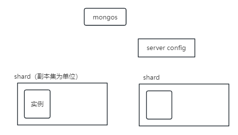

# MongoDB

## 简介

### NoSQL

NoSQL（Not Only SQL），意为"不仅仅是SQL"，是对于传统的关系型数据库的数据库管理系统的统称

NoSQL 用于超大规模数据的存储，这些类型的数据存储不需要固定的模式，无需多余的操作就可以横向扩展

#### RDBMS 与 NoSQL 对比

**RDBMS**

- 高度组织化结构化数据
- 结构化查询语言（SQL）
- 数据与关系都存储在单独的表中
- 数据操作语言，数据定义语言
- 严格的一致性
- 基础事务

**NoSQL**

- 代表着不仅仅是SQL
- 没有声明性的查询语言
- 没有预定义的模式
- 键-值对存储，列存储，文档存储，图形数据库
- 最终一致性，而非 ACID 属性
- 非结构化和不可预知的数据
- CAP定理（Consistency（一致性）、Availability（可用性）、Partition tolerance（分区容忍性））
- 高性能，高可用和可伸缩性

#### CAP定理

- **一致性(Consistency)** (所有节点在同一时间具有相同的数据)
- **可用性(Availability)** (保证每个请求不管成功或者失败都有响应)

- **分区容忍(Partition tolerance)** (系统中任意信息的丢失或失败不会影响系统的继续运作)

CAP 核心理论是：一个分布式系统不可能同时很好的满足一致性、可用性和分区容错性，最多只能同时较好的满足两个

- CA - 单点集群，满足一致性，可用性的系统，通常在可扩展性上不太强大。
- CP - 满足一致性，分区容忍必的系统，通常性能不是特别高。
- AP - 满足可用性，分区容忍性的系统，通常可能对一致性要求低一些。

#### NoSQL 优点和缺点

**优点**

- 高扩展性
- 分布式计算
- 低成本
- 架构的灵活性，半结构化数据
- 没有复杂的关系

**缺点**

- 没有标准化
- 有限的查询功能
- 最终一致是不直观的程序

### MongoDB 概念解析

MongoDB 和 SQL的概念对照

| SQL术语/概念 | MongoDB术语/概念 | 解释说明                             |
| ------------ | ---------------- | ------------------------------------ |
| database     | databases        | 数据库                               |
| table        | collection       | 数据库表/集合                        |
| row          | document         | 数据记录行/文档                      |
| column       | field            | 数据字段/域                          |
| index        | index            | 索引                                 |
| table joins  |                  | 表连接/MongoDB不支持                 |
| primary key  | primary key      | 主键，MongoDB自动将_id字段设置为主键 |

#### 数据库

一个 MongoDB 可以建立多个数据库。

MongoDB的默认数据库为"db"，该数据库存储在data目录中。

MongoDB的单个实例可以容纳多个独立的数据库，每一个都有自己的集合和权限，不同的数据库也放置在不同的文件中。

合法的数据库名：

- 不能是空字符串（"")。
- 不得含有' '（空格)、.、$、/、\和\0 (空宇符)。
- 应全部小写。
- 最多64字节。

有一些数据库名是保留的，可以直接访问这些有特殊作用的数据库。

- **admin**： 从权限的角度来看，这是"root"数据库。要是将一个用户添加到这个数据库，这个用户自动继承所有数据库的权限。一些特定的服务器端命令也只能从这个数据库运行，比如列出所有的数据库或者关闭服务器。
- **local:** 这个数据永远不会被复制，可以用来存储限于本地单台服务器的任意集合
- **config**: 当Mongo用于分片设置时，config数据库在内部使用，用于保存分片的相关信息。

#### 文档

文档是一个键值(key-value)对(即BSON)。MongoDB 的文档不需要设置相同的字段，并且相同的字段不需要相同的数据类型，这与关系型数据库有很大的区别，也是 MongoDB 非常突出的特点。

#### 集合

集合就是 MongoDB 文档组，类似于 RDBMS （关系数据库管理系统：Relational Database Management System)中的表。

集合存在于数据库中，集合没有固定的结构。

合法的集合名：

- 集合名不能是空字符串""。
- 集合名不能含有\0字符（空字符)，这个字符表示集合名的结尾。
- 集合名不能以"system."开头，这是为系统集合保留的前缀。
- 用户创建的集合名字不能含有保留字符。有些驱动程序的确支持在集合名里面包含，这是因为某些系统生成的集合中包含该字符。除非你要访问这种系统创建的集合，否则千万不要在名字里出现$。

**capped collections**

Capped collections 就是固定大小的 collection

Capped collections 是高性能自动的维护对象的插入顺序。它非常适合类似记录日志的功能和标准的 collection 不同，你必须要显式的创建一个capped collection，指定一个 collection 的大小，单位是字节。collection 的数据存储空间值提前分配的。

- 在 capped collection 中，你能添加新的对象。
- 能进行更新，然而，对象不会增加存储空间。如果增加，更新就会失败 。
- 使用 Capped Collection 不能删除一个文档，可以使用 drop() 方法删除 collection 所有的行。
- 删除之后，你必须显式的重新创建这个 collection。
- 在32bit机器中，capped collection 最大存储为 1e9( 1X109)个字节。

#### MongoDB 数据类型

| 数据类型           | 描述                                                         |
| :----------------- | :----------------------------------------------------------- |
| String             | 字符串。存储数据常用的数据类型。在 MongoDB 中，UTF-8 编码的字符串才是合法的。 |
| Integer            | 整型数值。用于存储数值。根据你所采用的服务器，可分为 32 位或 64 位。 |
| Boolean            | 布尔值。用于存储布尔值（真/假）。                            |
| Double             | 双精度浮点值。用于存储浮点值。                               |
| Min/Max keys       | 将一个值与 BSON（二进制的 JSON）元素的最低值和最高值相对比。 |
| Array              | 用于将数组或列表或多个值存储为一个键。                       |
| Timestamp          | 时间戳。记录文档修改或添加的具体时间。                       |
| Object             | 用于内嵌文档。                                               |
| Null               | 用于创建空值。                                               |
| Symbol             | 符号。该数据类型基本上等同于字符串类型，但不同的是，它一般用于采用特殊符号类型的语言。 |
| Date               | 日期时间。用 UNIX 时间格式来存储当前日期或时间。你可以指定自己的日期时间：创建 Date 对象，传入年月日信息。 |
| Object ID          | 对象 ID。用于创建文档的 ID。                                 |
| Binary Data        | 二进制数据。用于存储二进制数据。                             |
| Code               | 代码类型。用于在文档中存储 JavaScript 代码。                 |
| Regular expression | 正则表达式类型。用于存储正则表达式。                         |

#### ObjectId

ObjectId 类似唯一主键，可以很快的去生成和排序，包含 12 bytes，含义是：

- 前 4 个字节表示创建 **unix** 时间戳,格林尼治时间 **UTC** 时间，比北京时间晚了 8 个小时
- 接下来的 3 个字节是机器标识码
- 紧接的两个字节由进程 id 组成 PID
- 最后三个字节是随机数

### MongoDB 安装使用

> debain10 系统安装，当前版本 7.0.5

#### 安装

1.  [Try MongoDB Community Edition | MongoDB](https://www.mongodb.com/try/download/community-kubernetes-operator)，下载`Community Server Download`

2. 执行命令（可能需要将安装包移动到 /tmp/ 目录下，可能需要更新源 apt update）

   ```bash
   apt install mongodb-org-server_7.0.5_amd64.deb
   ```

3. 创建 mongoDB 数据库存放目录以及日志存放目录

   ```bash
   mkdir -p /root/mongodb/db
   mkdir -p /root/mongodb/log
   ```

4. 直接启动 mongoDB，默认启动只监听了本地ip，默认端口为 27017

   ```bash
   mongod --dbpath /root/mongodb/db/ --logpath /root/mongodb/log/mongodb --fork
   ## --dbpath 指定数据库目录
   ## --logpath 指定log文件
   ## --fork 守护进程的方式启动
   ```

5. 以配置文件启动

   创建配置文件 mongoDB.conf

   ```ini
   #指定数据库路径
   dbpath=/root/mongodb/db
   #指定MongoDB日志文件
   logpath=/root/mongodb/log/mongodb.log
   ## 使用追加的方式写日志
   logappend=true
   #端口号
   port=27017
   #方便外网访问
   bind_ip=0.0.0.0
   fork=true ## 以守护进程的方式运行MongoDB，创建服务器进程
   #auth=true #启用用户验证
   #bind_ip=0.0.0.0 #绑定服务IP，若绑定127.0.0.1，则只能本机访问，不指定则默认本地所有IP
   ```

   启动mongoDB

   ```bash
   mongod -f ./mongodb.conf
   ```

#### 使用 shell 连接

1. 官网下载[MongoDB Shell Download | MongoDB](https://www.mongodb.com/try/download/shell)，安装步骤和 mongoDB 类似

2. 连接 mongoDB ，默认连接数据库为 test

   ```bash
   mongosh 127.0.0.1:27017
   ```
   

#### 关闭 mongoDB

方式一：mongoDB shell 方式（指定通过本地shell连接才可以操作）

切换到 admin 数据库

```js
use admin   // 切换 admin 数据库

db.shutdownServer()  // 关闭mongoDB
```

方式二：命令关闭

```bash
## 通过 dbpath 目录关闭
mongod -shutdown --dbpath /root/mongodb/db/

## 通过配置文件关闭
mongod -shutdown -f ./mongodb.conf
```

## mongoDB 操作

mongoDB 中对于数据库、集合乃至文档，在使用时如果不存在会自动进行创建

### 数据库操作

```js
use mydb   // 切换数据库

show dbs  // 查看数据库列表
```

**创建数据库**

```js
use DATABASE_NAME
```

如果数据库不存在，则创建数据库然后切换，否则切换到指定数据库。

**删除数据库**

```js
db.dropDatabase()
```

删除当前数据库，默认为 test，你可以使用 db 命令查看当前数据库名

### 集合操作

```js
show collections  // 查看集合列表（show tables）
```

**创建集合**

```js
db.createCollection(name, options)
/*
参数说明	
name: 要创建的集合名称
options: 可选参数, 指定有关内存大小及索引的选项
		capped：可选）如果为 true，则创建固定集合（必须指定 size 参数）
		size：（可选）为固定集合指定一个最大值，即字节数
		max：（可选）指定固定集合中包含文档的最大数量
*/
```

在插入文档时，MongoDB 首先检查固定集合的 size 字段，然后检查 max 字段

**删除集合**

```js
db.collection.drop()
// 如果成功删除选定集合，则 drop() 方法返回 true，否则返回 false
```

### 文档的增删改

**插入文档**

```js
// 若插入的数据主键已经存在，则会抛 org.springframework.dao.DuplicateKeyException 异常，提示主键重复，不保存当前数据
db.COLLECTION_NAME.insert(document)

// 用于向集合插入一个新文档
db.collection.insertOne(
   <document>,
   {
      writeConcern: <document>
   }
)

// 用于向集合插入一个多个文档
db.collection.insertMany(
   [ <document 1> , <document 2>, ... ],
   {
      writeConcern: <document>,
      ordered: <boolean>
   }
)
```

参数说明

- document：要写入的文档。
- writeConcern：写入策略，默认为 1，即要求确认写操作，0 是不要求。
- ordered：指定是否按顺序写入，默认 true，按顺序写入。

**更新文档**

```js
db.collection.update(
   <query>,
   <update>,
   {
     upsert: <boolean>,
     multi: <boolean>,
     writeConcern: <document>
   }
)
```

参数说明：

- query : update的查询条件，类似sql update查询内where后面的。
- update : update的对象和一些更新的操作符（如$,$inc...）等，也可以理解为sql update查询内set后面的
- upsert : 可选，这个参数的意思是，如果不存在update的记录，是否插入objNew,true为插入，默认是false，不插入。
- multi : 可选，mongodb 默认是false,只更新找到的第一条记录，如果这个参数为true,就把按条件查出来多条记录全部更新。
- writeConcern :可选，抛出异常的级别。

**删除文档**

```js
db.collection.remove(
   <query>,
   {
     justOne: <boolean>,
     writeConcern: <document>
   }
)
```

参数说明：

- query*:（可选）删除的文档的条件。
- justOne : （可选）如果设为 true 或 1，则只删除一个文档，如果不设置该参数，或使用默认值 false，则删除所有匹配条件的文档。
- writeConcern :（可选）抛出异常的级别。

### 查询文档

#### 数据准备

示例数据：插入两条测试数据

```js
db.col.insertMany([{
        "name" : "张三",
        "tags" : [
                "java",
                "vue",
        ],
        "age" : 43,
		"address": "12sad"
},{
        "name" : "李四",
        "tags" : [
                "python",
                "react"
        ],
        "age" : 65,
		"address": "12sad"
}])
```

#### 查询基础

mongoDB 查询文档使用 find() 方法，find() 方法以非结构化的方式来显示所有文档。

**MongoDB 和 SQL Where 语句比较**

| 操作       | 格式                     | 范例                                      | SQL中的类似语句      |
| :--------- | :----------------------- | :---------------------------------------- | :------------------- |
| 等于       | `{<key>:<value>`}        | `db.col.find({"name":"张三"}).pretty()`   | `where name= '张三'` |
| 小于       | `{<key>:{$lt:<value>}}`  | `db.col.find({"age":{$lt:50}}).pretty()`  | `where age< 50`      |
| 小于或等于 | `{<key>:{$lte:<value>}}` | `db.col.find({"age":{$lte:50}}).pretty()` | `where age <= 50`    |
| 大于       | `{<key>:{$gt:<value>}}`  | `db.col.find({"age":{$gt:50}}).pretty()`  | `where age > 50`     |
| 大于或等于 | `{<key>:{$gte:<value>}}` | `db.col.find({"age":{$gte:50}}).pretty()` | `where age >= 50`    |
| 不等于     | `{<key>:{$ne:<value>}}`  | `db.col.find({"age":{$ne:50}}).pretty()`  | `where age != 50`    |

> MongoDB 的 find() 方法可以传入多个键(key)，每个键(key)以逗号隔开，相当于 SQL 的 AND 条件

```js
db.col.find({key1:value1, key2:value2}).pretty()

// 查询 address='12sad' and age < 50
db.col.find({address:'12sad',age:{$lt:50}})
```

>MongoDB OR 条件语句使用了关键字 **$or**

```js
db.col.find(
   {
      $or: [
         {key1: value1}, {key2:value2}
      ]
   }
).pretty()

// 查询 age>50 or name ='张三'
db.col.find({
	$or:[
    	{age:{$gt:50}},{name:'张三'}
    ]
})
```

> $type 操作符使用

```js
// 查询name字段为string类型数据
db.col.find({
    name:{$type:'string'}
})
```

#### limit和skip

```js
// 读取指定数量的数据
db.COLLECTION_NAME.find().limit(NUMBER)
 
// 跳过指定数量的数据
db.COLLECTION_NAME.find().skip(NUMBER)

// 组合使用（分页）
db.COLLECTION_NAME.find().limit(pageSize).skip((pageSize-1)*pageNumber)
```

#### 排序

在 MongoDB 中使用 sort() 方法对数据进行排序，sort() 方法可以通过参数指定排序的字段，并使用 1 和 -1 来指定排序的方式，`其中 1 为升序排列，而 -1 是用于降序排列`。

```js
db.COLLECTION_NAME.find().sort({KEY:1})
```

### 索引

索引通常能够极大的提高查询的效率，如果没有索引，MongoDB在读取数据时必须扫描集合中的每个文件并选取那些符合查询条件的记录，效率十分低下。

索引是特殊的数据结构，索引存储在一个易于遍历读取的数据集合中，索引是对数据库表中一列或多列的值进行排序的一种结构

```js
// 语法中 Key 值为你要创建的索引字段，1 为指定按升序创建索引，如果你想按降序来创建索引指定为 -1 即可
db.collection.createIndex(keys, options)

// 为 name 字段创建索引
db.col.createIndex({"name":1})

// 为 name 字段和 age 字段创建“复合索引”
db.col.createIndex({"name":1,"age":-1})
```

options参数说明

| Parameter          | Type          | Description                                                  |
| :----------------- | :------------ | :----------------------------------------------------------- |
| background         | Boolean       | 建索引过程会阻塞其它数据库操作，background可指定以后台方式创建索引，即增加 "background" 可选参数。 "background" 默认值为**false**。 |
| unique             | Boolean       | 建立的索引是否唯一。指定为true创建唯一索引。默认值为**false**. |
| name               | string        | 索引的名称。如果未指定，MongoDB的通过连接索引的字段名和排序顺序生成一个索引名称。 |
| dropDups           | Boolean       | **3.0+版本已废弃。**在建立唯一索引时是否删除重复记录,指定 true 创建唯一索引。默认值为 **false**. |
| sparse             | Boolean       | 对文档中不存在的字段数据不启用索引；这个参数需要特别注意，如果设置为true的话，在索引字段中不会查询出不包含对应字段的文档.。默认值为 **false**. |
| expireAfterSeconds | integer       | 指定一个以秒为单位的数值，完成 TTL设定，设定集合的生存时间。 |
| v                  | index version | 索引的版本号。默认的索引版本取决于mongod创建索引时运行的版本。 |
| weights            | document      | 索引权重值，数值在 1 到 99,999 之间，表示该索引相对于其他索引字段的得分权重。 |
| default_language   | string        | 对于文本索引，该参数决定了停用词及词干和词器的规则的列表。 默认为英语 |
| language_override  | string        | 对于文本索引，该参数指定了包含在文档中的字段名，语言覆盖默认的language，默认值为 language. |

### 聚合

示例数据·

```js
db.student.insertMany([{
    "id": "1",
    "name": "小明",
    "age": NumberInt(12),
    "sex": "男",
    "course": ["数学", "语文", "英语"]
}, {
    "id": "2",
    "name": "小章",
    "age": NumberInt(13),
    "sex": "男",
    "course": ["数学", "语文"]
}, {
    "id": "3",
    "name": "小九",
    "age": NumberInt(12),
    "sex": "女",
    "course": ["数学"]
}]);
```

>MongoDB 的聚合框架就是将文档输入处理管道，在管道内完成对文档的操作，最终将文档转换为聚合结果，MongoDB的聚合管道将MongoDB文档在一个管道处理完毕后将结果传递给下一个管道处理，管道操作是可以重复的。

MongoDB 中聚合(aggregate)主要用于处理数据(诸如统计平均值，求和等)，并返回计算后的数据结果

```js
// 可以用多个构件创建一个管道，对于一连串的文档进行处理。这些构件包括：筛选操作的match、映射操作的project、分组操作的group、排序操作的sort、限制操作的limit、和跳过操作的skip
db.COLLECTION_NAME.aggregate(AGGREGATE_OPERATION)
```

聚合中常用的操作

- $project：修改输入文档的结构。可以用来重命名、增加或删除域，也可以用于创建计算结果以及嵌套文档。
- $match：用于过滤数据，只输出符合条件的文档。$match使用MongoDB的标准查询操作。
- $limit：用来限制MongoDB聚合管道返回的文档数。
- $skip：在聚合管道中跳过指定数量的文档，并返回余下的文档。
- $unwind：将文档中的某一个数组类型字段拆分成多条，每条包含数组中的一个值。
- $group：将集合中的文档分组，可用于统计结果。
- $sort：将输入文档排序后输出。
- $geoNear：输出接近某一地理位置的有序文档。

一些聚合表达式

| 表达式    | 描述                                                         | 实例                                                         |
| :-------- | :----------------------------------------------------------- | :----------------------------------------------------------- |
| $sum      | 计算总和。                                                   | db.mycol.aggregate([{$group : {_id : "$by_user", num_tutorial : {$sum : "$likes"}}}]) |
| $avg      | 计算平均值                                                   | db.mycol.aggregate([{$group : {_id : "$by_user", num_tutorial : {$avg : "$likes"}}}]) |
| $min      | 获取集合中所有文档对应值得最小值。                           | db.mycol.aggregate([{$group : {_id : "$by_user", num_tutorial : {$min : "$likes"}}}]) |
| $max      | 获取集合中所有文档对应值得最大值。                           | db.mycol.aggregate([{$group : {_id : "$by_user", num_tutorial : {$max : "$likes"}}}]) |
| $push     | 将值加入一个数组中，不会判断是否有重复的值。                 | db.mycol.aggregate([{$group : {_id : "$by_user", url : {$push: "$url"}}}]) |
| $addToSet | 将值加入一个数组中，会判断是否有重复的值，若相同的值在数组中已经存在了，则不加入。 | db.mycol.aggregate([{$group : {_id : "$by_user", url : {$addToSet : "$url"}}}]) |
| $first    | 根据资源文档的排序获取第一个文档数据。                       | db.mycol.aggregate([{$group : {_id : "$by_user", first_url : {$first : "$url"}}}]) |
| $last     | 根据资源文档的排序获取最后一个文档数据                       | db.mycol.aggregate([{$group : {_id : "$by_user", last_url : {$last : "$url"}}}]) |

```js
// 首先过滤出 age = 12 的数据，然后统计总共的数据个数
db.student.aggregate([
	{
		$match:{
			age:NumberInt(12)
		}
	},
	{
		$count:"name"
	}
])

// 根据 sex 分组，并统计分组后各有多少人
db.student.aggregate([ 
    { $group: { _id: "$sex", "num": { $sum:1 } } }
] )

// 查询数据总条数
db.student.aggregate([ { $group: { _id: null, "num": { $sum: 1 } } }] )
```

## mongoDB 集群

### 副本集(replSet)

#### 简介

MongoDB副本集是由一个主节点和多个副本节点组成。主节点将数据的改变推送到副本节点上，在一定的延迟之后，每个MongoDB实例维护相同的数据。通过维护冗余的数据副本，能够实现数据的备份，读写分离和自动故障转移。

主节点记录在其上的所有操作oplog，从节点定期轮询主节点获取这些操作，然后对自己的数据副本执行这些操作，从而保证从节点的数据与主节点一致。

**使用场景**

- 数据冗余，用做故障恢复使用，当发生硬件故障或者其它原因造成的宕机时，可以使用副本进行恢复。
- 读写分离，读请求会分流到所有副本上，减轻主节点的读压力。

MongoDB副本集是主从复制的高级形式。主从复制仅仅实现了数据备份和读写分离，但是主节点一旦宕机，需要手动启动从节点进行故障转移；MongoDB副本集在主从复制基础上实现了故障转移的功能，也就是当主节点宕机时，某一台副本节点会自动提升为新主节点。

**副本集成员**

- 主节点：和其他数据库上的主节点一样，可以提供读写服务
- 副本节点：也基本上和其他类型数据库的从节点一样，可以实现备份和读写分离的作用
- 仲裁节点：没有数据副本，不会成为主节点，主要用来选举投票。当副本集的节点数据为偶数时，需要添加一个仲裁节点。仲裁节点因为没有数据，只参与投票，所以仲裁节点需要的资源很小，但是不建议将仲裁节点部署在副本集的其他节点上。

**副本集特征**

- N 个节点的集群
- 任何节点可作为主节点
- 所有写入操作都在主节点上
- 自动故障转移
- 自动恢复

#### 搭建

为了简便，全采用命令行启动 mongoDB

```bash
## 创建三个目录用于存放 mongoDB 数据库文件
mkdir -p rs1/db
mkdir -p rs2/db
mkdir -p rs3/db

## 通过不同端口启动三个 mongoDB 实例
#		bind_ip 允许所有地址访问
#		replSet 指定副本集名称
mongod --bind_ip "0.0.0.0" --port "30001" --dbpath "/root/mongodb/replSet/rs1" -logpath "/root/mongodb/replSet/rs1.log" --replSet "replSet" --fork
mongod --bind_ip "0.0.0.0" --port "30002" --dbpath "/root/mongodb/replSet/rs2" -logpath "/root/mongodb/replSet/rs2.log" --replSet "replSet" --fork
mongod --bind_ip "0.0.0.0" --port "30003" --dbpath "/root/mongodb/replSet/rs3" -logpath "/root/mongodb/replSet/rs3.log" --replSet "replSet" --fork
```

登录任意节点进行副本集初始化配置，初始化配置只需要执行一次

```js
// 切换到 admin 数据库
use admin
// 通过 initiate 方法初始化副本集，并添加节点
// 		arbiterOnly 是否为仲裁节点，不参与数据复制，仅选举 master 节点
rs.initiate({
	"_id":"replSet",
	"members":[
		{"_id" : 0, "host" : "127.0.0.1:30001"},
		{"_id" : 1, "host" : "127.0.0.1:30002"},
		{"_id" : 2, "host" : "127.0.0.1:30003","arbiterOnly":true}
	]
})
```

**其他操作**

```js
// 副本集状态
rs.status()

// 查看 master 节点相关信息
db.isMaster()

// 添加节点
rs.add("mongod1.net:27017")

// 添加冲裁节点
rs.addArb(“ip:port”)

// 移除节点
rs.remove("ip:port")
```

**副本集相关命令汇总**

```js
rs.initiate() 	// 使用默认配置初始化副本集
rs.initiate(cfg) 	// 使用配置文件cfg初始化副本集
rs.reconfig(cfg) 	// 修改副本集配置信息
rs.status() 	// 查看副本集状态
rs.conf() 	// 查看副本集配置
rs.add(hostportstr) 	// 添加新的节点 
rs.addArb(hostportstr) 	// 添加仲裁节点
rs.remove(hostportstr) 	// 删除节点
rs.slaveOk() 	// 允许副本节点只读，默认副本节点不允许读写
rs.isMaster() 	// 查看哪个节点为主节点
rs.printReplicationInfo() 	// 查看oplog大小以及oplog可用时间，可以判断系统繁忙程度
rs.printSlaveReplicationInfo() 	// 查看复制集成员以及延迟
rs.stepDown([stepdownSecs, catchUpSecs]) 	// 手动主从切换
rs.freeze(secs)	 // 冻结当前节点在指定的时间内（秒）不能选举为主
rs.syncFrom(hostportstr) 	// 管理员临时覆盖当前成员的默认同步目标。以[hostname]：[port]的形式指定要复制的成员的名称。
```

#### 测试

找到主节点，插入一条文档，然后在副本节点查看数据是否成功同步

### 分片(Sharding)

#### 简介

在Mongodb里面存在另一种集群，就是分片技术,可以满足MongoDB数据量大量增长的需求。

当MongoDB存储海量的数据时，一台机器可能不足以存储数据，也可能不足以提供可接受的读写吞吐量。这时，我们就可以通过在多台机器上分割数据，使得数据库系统能存储和处理更多的数据。


**为什么使用分片**

- 复制所有的写入操作到主节点
- 延迟的敏感数据会在主节点查询
- 单个副本集限制在12个节点
- 当请求量巨大时会出现内存不足。
- 本地磁盘不足
- 垂直扩展价格昂贵

**分片集群节点**

- 路由节点 (mongos)：提供集群单一入口、转发应用端请求、选择合适数据节点进行读写、合并多个数据节点的返回
- 配置节点 (Config Server)：所有存/取数据的方式、 所有shard节点的信息，分片功能的一些配置信息
- 数据节点 (Shard)：以复制集为单位、横向扩展、最大1024分片、分片之间数据不重复、所有分片在一起才可以完整工作、真正的数据存储位置，以chunk为单位存数据

**Chunk介绍**

在一个shard server内部，MongoDB还是会把数据分为chunks，每个chunk代表这个shard server内部一部分数据。

Chunk 用途如下：

- Splitting：当一个 chunk 的大小超过配置中的 chunk size 时，MongoDB 的后台进程会把这个 chunk 切分成更小的 chunk，从而避免 chunk 过大的情况

- Balancing：在MongoDB中，balancer 是一个后台进程，负责 chunk 的迁移，从而均衡各个 shard server 的负载，系统初始1个chunk，chunk size 默认值64M，生产库上选择适合业务的 chunk size 是最好的。MongoDB会自动拆分和迁移chunks

chunksize的选择：chunkSize 越小，chunk 分裂及迁移越多，数据分布越均衡；反之，chunkSize 越大，chunk 分裂及迁移会更少，但可能导致数据分布不均

**数据区分**

分片键（shard key）:MongoDB 中数据的分片是以集合为基本单位的，集合中的数据通过片键（Shard key）被分成多部分

分片键特点

- 分片键必须是一个索引
- 分片键是不可变
- 分片键大小限制512bytes
- 分片键用于路由查询

分片键选择建议

- 递增的sharding key：优点是数据文件挪动小。
- 随机的sharding key：优点是数据分布均匀，insert的写IO均匀分布在多个片上
- 混合型sharding key：大方向随机递增，小范围随机分布。

为了防止出现大量的chunk均衡迁移，可能造成的IO压力。我们需要设置合理分片使用策略（片键的选择、分片算法（range、hash））

#### 搭建

>mongos需要单独安装，[Download MongoDB Community Server | MongoDB](https://www.mongodb.com/try/download/community-kubernetes-operator)下载 mongos，然后安装



本地部署两个Shard（副本集，每个副本集中只有一个实例）、一个配置节点（config server）、一个 路由节点（mongos）

```js
/*
    Shard
        shardSet1 : 一个实例，端口 30001
        shardSet2 : 一个实例，端口 30002

    config server
        configRs : 一个实例，端口30011

    mongos 端口 30021
*/
```

1. 部署副本集 shardSet1

   ```bash
   ## --shardsvr 指定该实例是一个 shard
   mongod --bind_ip_all --port "30001" --dbpath "/root/mongodb/shard/shard1" -logpath "/root/mongodb/shard/log/shard11.log" --replSet shardSet1 --shardsvr --fork
   ```

   初始化副本集

   ```js
   // 切换数据库
   use admin
   // 使用ip地址，不然后续 mongos 添加 shard 时会报错（7.0.5版本）
   rs.initiate({
   	"_id":"shardSet1",
   	"members":[
   		{"_id" : 0, "host" : "192.168.56.101:30001"}
   	]
   })
   ```

2. 部署副本集 shardSet2

   ```bash
   mongod --bind_ip_all --port "30002" --dbpath "/root/mongodb/shard/shard2" -logpath "/root/mongodb/shard/log/shard12.log" --replSet shardSet2 --shardsvr --fork
   ```

   初始化副本集

   ```js
   use admin
   rs.initiate({
   	"_id":"shardSet2",
   	"members":[
   		{"_id" : 1, "host" : "192.168.56.101:30002"}
   	]
   })
   ```

3. 部署 Config Server

   ```bash
   mongod --bind_ip_all --port "30011" --dbpath "/root/mongodb/shard/config" -logpath "/root/mongodb/shard/log/config.log" --replSet configRs --configsvr --fork
   ```

   初始化副本集

   ```js
   use admin
   rs.initiate({
   	"_id":"configRs",
   	"members":[
   		{"_id" : 0, "host" : "192.168.56.101:30011"}
   	]
   })
   ```

4. 启动（可能需要单独下载）mongos

   ```bash
   ## 指定 config server 启动 mongos
   mongos --bind_ip_all --port "30021" -logpath "/root/mongodb/shard/log/route.log" --configdb "configRs/localhost:30011" --fork
   ```

   连接 mongos，添加 shard

   ```js
   // sh.addShard('<replSetName>/ip:port,ip:port...')
   
   // 添加 shard shardSet1
   sh.addShard('shardSet1/192.168.56.101:30001')
   
   // 添加 shard shardSet1
   sh.addShard('shardSet2/192.168.56.101:30002')
   
   // 查看分片状态
   sh.status()
   ```

#### 测试

```js
// 创建数据库
use mydb

// 创建集合
db.createCollection('testcollection')

// 对片键的字段建立索引 db.<collection>.createIndex(<keyPatterns>,<options>) 
// 下例子创建了哈希索引
db.testcollection.createIndex({title:'hashed'})

// sh.shardCollection("<database>.<collection>",{ "<key>":<value> } ) 
// 下例子表示将数据基于哈希分片
sh.shardCollection("mydb.testcollection",{"title":'hashed'})

// 插入测试数据
db.testcollection.insertMany([
	{title:1},
	{title:-1},
	{title:3},
	{title:-3},
	{title:5},
	{title:-5}
])

// 查看分片状态，返回 分片信息，分片的集合，分片的key，片键，基于什么分片（hash/范围），当前的chunks
sh.status()
```

## mongoDB java

### 搭建

启动 mongoDB 副本集

```bash
## 启动命令
mongod --bind_ip_all --port "30001" --dbpath "/root/mongodb/replSet/rs1" -logpath "/root/mongodb/replSet/rs1.log" --replSet "replSet" --fork
mongod --bind_ip_all --port "30002" --dbpath "/root/mongodb/replSet/rs2" -logpath "/root/mongodb/replSet/rs2.log" --replSet "replSet" --fork
mongod --bind_ip_all --port "30003" --dbpath "/root/mongodb/replSet/rs3" -logpath "/root/mongodb/replSet/rs3.log" --replSet "replSet" --fork
```

初始化副本集

```js
// 连接任意节点初始化副本集
// arbiterOnly 仲裁节点，不参与数据的复制，仅选举 master 节点
rs.initiate({
	"_id":"replSet",
	"members":[
		{"_id" : 0, "host" : "192.168.56.101:30001"},
		{"_id" : 1, "host" : "192.168.56.101:30002"},
		{"_id" : 2, "host" : "192.168.56.101:30003","arbiterOnly":true}
	]
})

// 切换数据库
use myDB

// 插入测试数据
db.testCollection.insertMany([
	{name:'张三',title:'测试1',age:22},
	{name:'李四',title:'测试2',age:24},
	{name:'王五',title:'测试3',age:29}
])

// 查询数据
db.testCollection.find({})
```

### java 中基本操作

```java
public class CH05MongoDBDemo {
    public static void main(String[] args) {
        ConnectionString connectionString=new ConnectionString("mongodb://192.168.56.101:30001,192.168.56.101:30002/?replicaSet=replSet");
        try (MongoClient mongoClient = MongoClients.create(connectionString)) {
            MongoDatabase database = mongoClient.getDatabase("myDB");
            MongoCollection<Document> collection = database.getCollection("testCollection");

            // 插入数据
//            insertMethod(collection);

            // 查询数据
//            findMethod(collection);

            // 更新数据
//            updateMethod(collection);

            // 删除数据
//            deleteMethod(collection);

            // 分页查询
            pageMethod(collection);

        }

    }

    private static void pageMethod(MongoCollection<Document> collection) {
        final int pageSize=2;
        final int pageIndex=2;
        FindIterable<Document> documentFindIterable = collection.find();

        // 通过 age 升序排序
        documentFindIterable.sort(Document.parse("{age:-1}"));

        documentFindIterable.limit(pageSize);
        documentFindIterable.skip(pageIndex*(pageSize-1));

        MongoCursor<Document> iterator = documentFindIterable.iterator();
        while (iterator.hasNext()){
            System.out.println(iterator.next().toJson());
        }
    }

    private static void deleteMethod(MongoCollection<Document> collection) {
        Document query = Document.parse("{name:'张三'}");
        DeleteResult deleteResult = collection.deleteOne(query);
        System.out.println(deleteResult.wasAcknowledged());
    }

    private static void updateMethod(MongoCollection<Document> collection) {
        Document query = Document.parse("{name:'张三'}");
        Bson bson = Updates.combine(
                Updates.set("age", 66)
        );

        UpdateResult updateResult = collection.updateOne(query, bson);

        System.out.println(updateResult.wasAcknowledged());
    }

    private static void findMethod(MongoCollection<Document> collection) {
        FindIterable<Document> documentFindIterable = collection.find();
        MongoCursor<Document> iterator = documentFindIterable.iterator();
        while (iterator.hasNext()){
            System.out.println(iterator.next().toJson());
        }

    }

    private static void insertMethod(MongoCollection<Document> collection) {
        List<Document> documentList=new ArrayList<>();
        documentList.add(Document.parse("{name:'张三',title:'测试1',age:22}"));
        documentList.add(Document.parse("{name:'李四',title:'测试2',age:24}"));
        documentList.add(Document.parse("{name:'王五',title:'测试3',age:29}"));
        InsertManyResult result = collection.insertMany(documentList);
        System.out.println(result.wasAcknowledged());
    }
}
```


