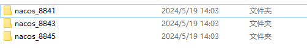
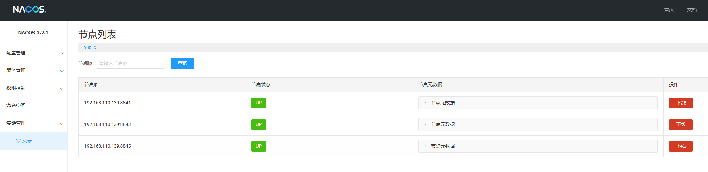

# SpringcloudAlibaba

## 简介

### 主要功能

- **服务限流降级**：默认支持 WebServlet、WebFlux、OpenFeign、RestTemplate、Spring Cloud Gateway、Dubbo 和 RocketMQ 限流降级功能的接入，可以在运行时通过控制台实时修改限流降级规则，还支持查看限流降级 Metrics 监控。
- **服务注册与发现**：适配 Spring Cloud 服务注册与发现标准，默认集成对应 Spring Cloud 版本所支持的负载均衡组件的适配。
- **分布式配置管理**：支持分布式系统中的外部化配置，配置更改时自动刷新。
- **消息驱动能力**：基于 Spring Cloud Stream 为微服务应用构建消息驱动能力。
- **分布式事务**：使用 @GlobalTransactional 注解， 高效并且对业务零侵入地解决分布式事务问题。
- **阿里云对象存储**：阿里云提供的海量、安全、低成本、高可靠的云存储服务。支持在任何应用、任何时间、任何地点存储和访问任意类型的数据。
- **分布式任务调度**：提供秒级、精准、高可靠、高可用的定时（基于 Cron 表达式）任务调度服务。同时提供分布式的任务执行模型，如网格任务。网格任务支持海量子任务均匀分配到所有 Worker（schedulerx-client）上执行。
- **阿里云短信服务**：覆盖全球的短信服务，友好、高效、智能的互联化通讯能力，帮助企业迅速搭建客户触达通道。

### 版本说明

SpringcloudAlibaba 官方文档关于版本说明[版本说明 · alibaba/spring-cloud-alibaba Wiki (github.com)](https://github.com/alibaba/spring-cloud-alibaba/wiki/版本说明)

为了同时满足存量用户和新用户不同需求，社区以 Spring Boot 3.0 和 2.4 分别为分界线，同时维护 2022.x、2021.x、2.2.x 三个分支迭代

#### 2022.x 分支

| Spring Cloud Alibaba Version | Spring Cloud Version  | Spring Boot Version |
| ---------------------------- | --------------------- | ------------------- |
| 2022.0.0.0*                  | Spring Cloud 2022.0.0 | 3.0.2               |
| 2022.0.0.0-RC2               | Spring Cloud 2022.0.0 | 3.0.2               |
| 2022.0.0.0-RC1               | Spring Cloud 2022.0.0 | 3.0.0               |

#### 2021.x 分支

| Spring Cloud Alibaba Version | Spring Cloud Version  | Spring Boot Version |
| ---------------------------- | --------------------- | ------------------- |
| 2021.0.5.0*                  | Spring Cloud 2021.0.5 | 2.6.13              |
| 2021.0.4.0                   | Spring Cloud 2021.0.4 | 2.6.11              |
| 2021.0.1.0                   | Spring Cloud 2021.0.1 | 2.6.3               |
| 2021.1                       | Spring Cloud 2020.0.1 | 2.4.2               |

#### 2.2.x 分支

| Spring Cloud Alibaba Version      | Spring Cloud Version        | Spring Boot Version |
| --------------------------------- | --------------------------- | ------------------- |
| 2.2.10-RC1*                       | Spring Cloud Hoxton.SR12    | 2.3.12.RELEASE      |
| 2.2.9.RELEASE                     | Spring Cloud Hoxton.SR12    | 2.3.12.RELEASE      |
| 2.2.8.RELEASE                     | Spring Cloud Hoxton.SR12    | 2.3.12.RELEASE      |
| 2.2.7.RELEASE                     | Spring Cloud Hoxton.SR12    | 2.3.12.RELEASE      |
| 2.2.6.RELEASE                     | Spring Cloud Hoxton.SR9     | 2.3.2.RELEASE       |
| 2.2.1.RELEASE                     | Spring Cloud Hoxton.SR3     | 2.2.5.RELEASE       |
| 2.2.0.RELEASE                     | Spring Cloud Hoxton.RELEASE | 2.2.X.RELEASE       |
| 2.1.4.RELEASE                     | Spring Cloud Greenwich.SR6  | 2.1.13.RELEASE      |
| 2.1.2.RELEASE                     | Spring Cloud Greenwich      | 2.1.X.RELEASE       |
| 2.0.4.RELEASE(停止维护，建议升级) | Spring Cloud Finchley       | 2.0.X.RELEASE       |
| 1.5.1.RELEASE(停止维护，建议升级) | Spring Cloud Edgware        | 1.5.X.RELEASE       |

### 当前使用版本

Spring Cloud Alibaba Version 版本

| Spring Cloud Alibaba Version | Spring Cloud Version  | Spring Boot Version |
| ---------------------------- | --------------------- | ------------------- |
| 2022.0.0.0*                  | Spring Cloud 2022.0.0 | 3.0.2               |

组件版本关系

| Spring Cloud Alibaba Version | Sentinel Version | Nacos Version | RocketMQ Version | Dubbo Version | Seata Version |
| ---------------------------- | ---------------- | ------------- | ---------------- | ------------- | ------------- |
| 2022.0.0.0                   | 1.8.6            | 2.2.1         | 4.9.4            | ~             | 1.7.0         |

## Nacos

### 简介

#### Nacos 的关键特性包括

- 服务发现和服务健康监测
- 动态配置服务
- 动态 DNS 服务
- 服务及其元数据管理

#### Nacos 概念

- 地域：物理的数据中心，资源创建成功后不能更换。
- 可用区：同一地域内，电力和网络互相独立的物理区域。同一可用区内，实例的网络延迟较低。
- 接入点：地域的某个服务的入口域名。
- 命名空间：用于进行租户粒度的配置隔离。不同的命名空间下，可以存在相同的 Group 或 Data ID 的配置。Namespace 的常用场景之一是不同环境的配置的区分隔离，例如开发测试环境和生产环境的资源（如配置、服务）隔离等。
- 配置：在系统开发过程中，开发者通常会将一些需要变更的参数、变量等从代码中分离出来独立管理，以独立的配置文件的形式存在。目的是让静态的系统工件或者交付物（如 WAR，JAR 包等）更好地和实际的物理运行环境进行适配。配置管理一般包含在系统部署的过程中，由系统管理员或者运维人员完成。配置变更是调整系统运行时的行为的有效手段。
- 配置管理：系统配置的编辑、存储、分发、变更管理、历史版本管理、变更审计等所有与配置相关的活动。
- 配置项：一个具体的可配置的参数与其值域，通常以 param-key=param-value 的形式存在。
- 配置集：一组相关或者不相关的配置项的集合称为配置集。在系统中，一个配置文件通常就是一个配置集，包含了系统各个方面的配置。
- 配置集 ID：Nacos 中的某个配置集的 ID。配置集 ID 是组织划分配置的维度之一。Data ID 通常用于组织划分系统的配置集。一个系统或者应用可以包含多个配置集，每个配置集都可以被一个有意义的名称标识。Data ID 通常采用类 Java 包（如 com.taobao.tc.refund.log.level）的命名规则保证全局唯一性。此命名规则非强制。
- 配置分组：Nacos 中的一组配置集，是组织配置的维度之一。通过一个有意义的字符串（如 Buy 或 Trade ）对配置集进行分组，从而区分 Data ID 相同的配置集。当您在 Nacos 上创建一个配置时，如果未填写配置分组的名称，则配置分组的名称默认采用 DEFAULT_GROUP 。
- 配置快照：Nacos 的客户端 SDK 会在本地生成配置的快照。当客户端无法连接到 Nacos Server 时，可以使用配置快照显示系统的整体容灾能力。
- 服务：通过预定义接口网络访问的提供给客户端的软件功能。
- 服务名：服务提供的标识，通过该标识可以唯一确定其指代的服务。
- 服务注册中心：存储服务实例和服务负载均衡策略的数据库。
- 服务发现：在计算机网络上，（通常使用服务名）对服务下的实例的地址和元数据进行探测，并以预先定义的接口提供给客户端进行查询。
- 元信息：Nacos数据（如配置和服务）描述信息，如服务版本、权重、容灾策略、负载均衡策略、鉴权配置、各种自定义标签 (label)，从作用范围来看，分为服务级别的元信息、集群的元信息及实例的元信息。
- 应用：用于标识服务提供方的服务的属性。
- 服务分组：不同的服务可以归类到同一分组。
- 虚拟集群：同一个服务下的所有服务实例组成一个默认集群, 集群可以被进一步按需求划分，划分的单位可以是虚拟集群。
- 实例：提供一个或多个服务的具有可访问网络地址（IP）的进程。
- 权重：实例级别的配置。权重为浮点数。权重越大，分配给该实例的流量越大。
- 健康检查：以指定方式检查服务下挂载的实例 (Instance) 的健康度，从而确认该实例 (Instance) 是否能提供服务。根据检查结果，实例 (Instance) 会被判断为健康或不健康。
- 健康保护阈值：为了防止因过多实例 (Instance) 不健康导致流量全部流向健康实例 (Instance) ，继而造成流量压力把健康实例 (Instance) 压垮并形成雪崩效应，应将健康保护阈值定义为一个 0 到 1 之间的浮点数。当域名健康实例数 (Instance) 占总服务实例数 (Instance) 的比例小于该值时，无论实例 (Instance) 是否健康，都会将这个实例 (Instance) 返回给客户端。

### 安装

Nacas 可以通过下载源码自己构建，也可以在 git 仓库下载已经构建好的包；

1. 官网下载需要版本的 Nacos 文件 `nacos-server-2.2.1.zip`

2. 解压后查看配置文件 conf/application.properties，可以发现默认上下文为 `/nacos`，默认端口为 `8848`，可以进行修改

3. 配置鉴权

   从 nacos2.2.0.1 版本开始，nacos 配置文件中去掉了默认的鉴权配置，需要用户手工添加，否则无法启动 nacos。

   ```properties
   ### If turn on auth system:
   nacos.core.auth.enabled=true
   ### The two properties is the white list for auth and used by identity the request from other server.
   nacos.core.auth.server.identity.key=admin
   nacos.core.auth.server.identity.value=admin
   ### The default token (Base64 String):
   nacos.core.auth.plugin.nacos.token.secret.key=YWRtaW4=
   ```

4. 启动，切换到 `/bin` 目录执行

   ```cmd
   # Nacos 默认启动方式为集群
   # 添加参数 -m standalone 单机启动
   startup.cmd -m standalone
   ```

5. 访问控制台 `http://127.0.0.1:8848/nacos/#/login`，默认用户名/密码为：nacos/nacos

### 数据持久化到外部 MySQL

#### 介绍

默认情况下，Nacos 使用的是内置 storage，使用内置 storage 存在两个很大的问题：

- 数据是存放在内存中的，无法持久化
- 无法搭建集群。当 Nacos 作为配置中心时，要求必须是外置的 DBMS

Nacos 对于 DBMS 的要求：

- 安装数据库，版本要求：5.6.5+
- 初始化 mysql 数据库，数据库初始化文件：mysql-schema.sql
- 修改 conf/application.properties 文件，增加支持 mysql 数据源配置（目前只支持 mysql），
- 添加 mysql 数据源的 url、用户名和密码

#### 操作步骤

1. 创建数据库 `nacos_config`

2. 在 nacos_config 数据库中执行 Nacos 安装目录下`/config/mysql-schema.sql`

3. 修改 Nacos 配置文件，`/config/application.properties`

   ```properties
   ### If use MySQL as datasource:
   ### Deprecated configuration property, it is recommended to use `spring.sql.init.platform` replaced
   spring.datasource.platform=mysql
   spring.sql.init.platform=mysql
   
   ### Count of DB:
   db.num=1
   
   ### Connect URL of DB:
   db.url.0=jdbc:mysql://192.168.110.176:23306/nacos_config?characterEncoding=utf8&connectTimeout=1000&socketTimeout=3000&autoReconnect=true&useUnicode=true&useSSL=false&serverTimezone=UTC
   db.user.0=root
   db.password.0=123456
   ```

4. 验证：修改配置后启动 Nacos，并新建用户，然后再数据库的 `users` 表中可以看到新建的用户名，以及被加密后的密码

### Nacos 集群搭建

本地搭建三个 Nacos，安装三份 Nacos



1. 将 `conf/cluster.conf.example` 重名为 `cluster.conf` 并修改，在里面写入集群的 ip:端口

   ```ini
   192.168.110.139:8841
   192.168.110.139:8843
   192.168.110.139:8845
   ```

2. 分别修改各个 Nacos 的端口号 `conf/application.properties`

3. 启动集群，在各个 Nacos 安装目录的 bin 下执行启动脚本

   ```cmd
   startup.cmd
   ```

4. 登录控制台查看集群状态

   

> 本地搭建集群时注意： cluster.conf 中不能写为 localhost 与 127.0.0.1，且这三个端口号不能连续。否则会报地址被占用异常。

## Nacos 服务注册与发现


## Nacos 配置中心

## OpenFeign 负载均衡

## Spring Cloud Gateway 微服务网关

## Sentinel 流量防卫兵

## Seata 分布式事务解决方案 

## SkyWalking 调用链跟踪 

## Spring Cloud Stream 消息系统整合 

## Dubbo Spring Cloud


