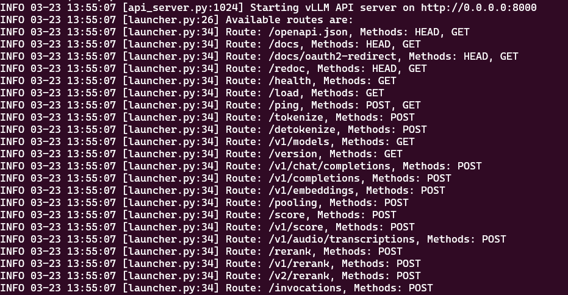
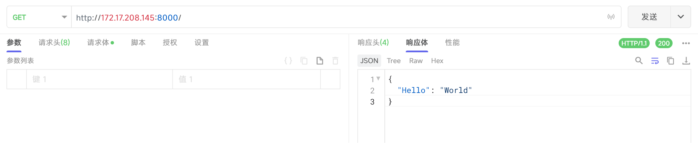
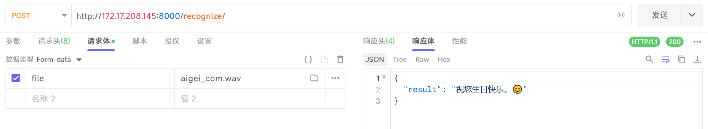

# 模型简易部署

## vllm部署模型

> vllm可以兼容部署基于 Transformer 架构的模型

### 环境准备

本地配置：Ubuntu24.04、Python12、RTX3070

1. 安装相关软件包

   ```bash
   apt install python3.12-venv
   apt install git 
   apt install nvidia-cuda-toolkit
   ```

2. 新建python虚拟环境

   ```bash
   # 新建vllm虚拟环境
   python3 -m venv vllm
   ```

3. 安装相关依赖

   ```bash
   #先激活环境
   source vllm/bin/activate
   
   # 安装modelscope （会自动安装 torch 、vllm 等）
   pip install modelscope
   
   # 退出当前激活环境
   deactivate
   ```

### 下载模型

1. 使用 modelscope 进行下载需要的模型文件

   新建下载脚本 `download_model.py`

   ```python
   # -*- coding: utf-8 -*-
   """
   作者：tanglei
   日期：2025-03-23
   版本：1.0
   
   描述：
   这是一个从modelscope下载模型的 Python 脚本
   
   使用方法：
   python download_model.py --model_id okwinds/DeepSeek-V3-GGUF-V3 --revision master --cache_dir ./models
   """
   
   from modelscope.hub.snapshot_download import snapshot_download
   import argparse
   
   if __name__ == "__main__":
       parser = argparse.ArgumentParser()
       parser.add_argument(
           "--model_id", type=str, default=None, help="模型ID"
       )
       parser.add_argument("--revision", type=str, default="master", help="分支名")
       parser.add_argument("--cache_dir", type=str, default="models", help="缓存目录")
   
   
       # 解析命令行参数
       args = parser.parse_args()
   
       if args.model_id is None:
           print("请提供模型ID")
           exit(1)
   
       print(f"开始下载模型：{args.model_id}")
       print(f"缓存目录：{args.cache_dir}")
   
   
       # 下载指定模型 到本地指定目录 revision 为分支名, 默认为master, cache_dir 为缓存目录, 默认为./cache
       model_dir = snapshot_download(
           model_id=args.model_id, revision=args.revision, cache_dir=args.cache_dir
       )
   
       print(f"模型已下载到：{model_dir}")
   ```

2. 激活 vllm 虚拟环境

   ```bash
   source vllm/bin/activate
   ```

3. 使用脚本下载需要的模型，model_id 在 modelscope官网可以找到

   ```bash
   python3 download_model.py --model_id deepseek-ai/DeepSeek-R1-Distill-Qwen-1.5B --cache_dir /data/model
   ```
   


### 运行模型


1. 新建模型启动脚本 `start_dp1_5b.sh`

   ```bash
   # export CUDA_VISIBLE_DEVICES=0 限制程序只使用编号为 0 的 GPU 设备
   # --served-model-name DeepSeek-R1-Distill-Qwen-1.5B 参数用于指定在 API 服务中对外暴露的模型名称
   # --model 指定加载的模型路径
   # --gpu-memory-utilization 0.7 限制 GPU 显存的使用率
   # --tensor-parallel-size 1 指定张量并行的大小,对于单卡运行，通常设置为 1。如果你有多个 GPU，可以设置为更大的值（如 2 或 4），以实现>张量并行
   # --max-num-seqs 32 设置最大并发序列数,32 表示服务器最多可以同时处理32个序列（如文本序列）。这个参数用于控制并发量，避免服务器过载
   # --max-model-len 8192 设置模型支持的最大序列长度,8192 表示模型可以处理的最大序列长度为 8192 个 token。如果输入的序列长度超过这个值，可能会被截断或拒绝
   # --dtype float16 指定模型使用的数据类型,float16 表示使用半精度浮点数（16 位浮点数）进行计算。这种数据类型可以减少内存占用并加速计算，但可能会牺牲一定的精度
   # --disable-log-requests 禁用请求日志,服务器不会记录客户端发送的请求内容。这可以减少日志文件的大小，但也会丢失请求的 详细信息。
   # --disable-log-stats 禁用统计日志,服务器不会记录性能统计信息（如请求处理时间、吞吐量等）。这同样可以减少日志文件 的大小，但不利于性能监控。
   # --uvicorn-log-level warning 设置 Uvicorn（一个 ASGI 服务器）的日志级别,warning 表示只记录警告及以上级别的日志信息（如错 误、严重错误等）。这可以帮助减少日志输出，专注于重要问题。
   nohup sh -c 'CUDA_VISIBLE_DEVICES=0,1 python -m vllm.entrypoints.openai.api_server \
           --api-key lei@123 \
           --served-model-name YHGPT-14B-v2.0-beta \
           --model /data/wenyu_14b_v2.0_beta_fp16 \
           --tensor-parallel-size 2 \
           --gpu-memory-utilization 0.9 \
           --host 0.0.0.0 \
           --port 8002 \
           --max-num-seqs 32 \
           --max-model-len 8192 \
           --dtype float16 \
           --disable-log-requests \
           --disable-log-stats \
           --uvicorn-log-level warning' > logs/YHGPT-14B-v2.0-beta.log 2>&1 &
   ```
   
2. 启动脚本，并查看日志

   ```bash
   # 激活 vllm 虚拟环境
   source vllm/bin/activate
   
   # 启动脚本
   ./start_dp7b.sh
   
   # 查看启动日志
   tail -1000f logs/ds1_5b.log
   ```
   
   输出如下内容启动成功
   
   

### 测试模型

1. 在线文档: GET http://localhost:8000/redoc

2. 聊天补全api: POST http://localhost/v1/chat/completions，body参数

   ```json
   {
     "messages": [
       {
         "role": "system",
         "content": "你是一个乐于助人的助手。"
       },
       {
         "role": "user",
         "content": "你好，我想了解人工智能的发展历程。"
       }
     ],
     "model": "DeepSeek-R1-Distill-Qwen-1.5B",
     "max_tokens": 1000,
     "temperature": 0.7,
     "frequency_penalty": 0,
     "presence_penalty": 0,
     "logit_bias": {},
     "logprobs": null,
     "top_logprobs": null,
     "n": 1,
     "response_format": null,
     "seed": null,
     "stop": null,
     "stream": false,
     "stream_options": null,
     "tools": null,
     "tool_choice": "none",
     "parallel_tool_calls": false,
     "user": null
   }
   ```

## modelscope

1. 从modelscope官网文档，下载最新的modelscope镜像包

2. 启动并进入容器，映射了容器8000端口和/data目录；$VOLUME_DIR是环境变量，为容器卷路径

   ```bash
   docker run --name modescope -it --rm -p 8000:8000 -v $VOLUME_DIR/modescope/data:/data 08030f417e0d bash
   ```

3. 新建 download_model.py

   ```python
   # -*- coding: utf-8 -*-
   """
   作者：tanglei
   日期：2025-03-23
   版本：1.0
   
   描述：
   这是一个从modelscope下载模型的 Python 脚本
   
   使用方法：
   python download_model.py --model_id okwinds/DeepSeek-V3-GGUF-V3 --revision master --cache_dir ./models
   """
   
   from modelscope.hub.snapshot_download import snapshot_download
   import argparse
   
   if __name__ == "__main__":
       parser = argparse.ArgumentParser()
       parser.add_argument(
           "--model_id", type=str, default=None, help="模型ID"
       )
       parser.add_argument("--revision", type=str, default="master", help="分支名")
       parser.add_argument("--cache_dir", type=str, default="models", help="缓存目录")
   
   
       # 解析命令行参数
       args = parser.parse_args()
   
       if args.model_id is None:
           print("请提供模型ID")
           exit(1)
   
       print(f"开始下载模型：{args.model_id}")
       print(f"缓存目录：{args.cache_dir}")
   
   
       # 下载指定模型 到本地指定目录 revision 为分支名, 默认为master, cache_dir 为缓存目录, 默认为./cache
       model_dir = snapshot_download(
           model_id=args.model_id, revision=args.revision, cache_dir=args.cache_dir
       )
   
       print(f"模型已下载到：{model_dir}")
   	
   ```

4. 安装fastapi

   ```bash
   pip install fastapi
   pip install "uvicorn[standard]"
   ```


### 语音识别模型

> 离线部署 SenseVoiceSmall 模型

1. 下载所需的模型文件

   ```bash
   python download_model.py --model_id iic/SenseVoiceSmall
   python download_model.py --model_id iic/speech_fsmn_vad_zh-cn-16k-common-pytorch
   ```

2. 创建模型启动程序 start_iic.py

   ```python
   from fastapi import FastAPI, UploadFile, File
   import os
   import logging
   import sys
   import traceback
   from funasr import AutoModel
   from funasr.utils.postprocess_utils import rich_transcription_postprocess
   import threading
   
   # 配置日志
   logging.basicConfig(level=logging.INFO, format='%(asctime)s - %(levelname)s - %(message)s')
   
   app = FastAPI()
   
   # 初始化模型
   model_dir = "models/iic/SenseVoiceSmall"
   model = AutoModel(
       model=model_dir,
       trust_remote_code=False,
       vad_model="models/iic/speech_fsmn_vad_zh-cn-16k-common-pytorch",
       vad_kwargs={"max_single_segment_time": 30000},
       ban_emo_unk=True,
       disable_update=True,
   )
   
   @app.post("/recognize/")
   async def recognize_audio(file: UploadFile = File(...)):
       # 保存上传的音频文件
       audio_path = f"temp_audio_{threading.current_thread().ident}.wav"
       try:
           with open(audio_path, "wb") as f:
               f.write(await file.read())  # 注意：file.read() 是异步操作，需要加 await
       except Exception as e:
           return {"error": f"Failed to save audio file: {str(e)}"}
       try:
           res = model.generate(
               input=audio_path,
               cache={},
               language="auto",  # "zn", "en", "yue", "ja", "ko", "nospeech"
               use_itn=True,
               batch_size_s=60,
               merge_vad=True,  #
               merge_length_s=15,
           )
           text = rich_transcription_postprocess(res[0]["text"])
   
           # 返回识别结果
           return {"result": text}
       except Exception as e:
           # 如果发生异常，返回错误信息
           exc_type, exc_value, exc_traceback = sys.exc_info()
           logging.error(f"exception type: {exc_type}; exception value: {exc_value}")
           # 打印堆栈信息
           traceback.print_tb(exc_traceback)
           return {"error": f"Error during recognition: {str(e)}"}
       finally:
           # 删除临时保存的音频文件
           if os.path.exists(audio_path):
               try:
                   os.remove(audio_path)
               except PermissionError:
                   return {"error": "Permission denied when deleting the temporary audio file"}
               except Exception as e:
                   return {"error": f"Error deleting temporary audio file: {str(e)}"}
   
   
   @app.get("/")
   def read_root():
       return {"Hello": "World"}
   
   if __name__ == "__main__":
       import uvicorn
       uvicorn.run(app, host="0.0.0.0", port=8000, log_level="info", timeout_keep_alive=60)
   ```

3. 启动程序

   ```bash
   python start_iic.py
   ```

4. 测试

   访问服务是否正常

   

   测试语音识别模型是否正常

   

