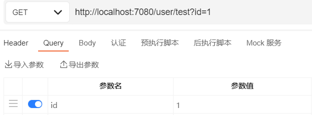
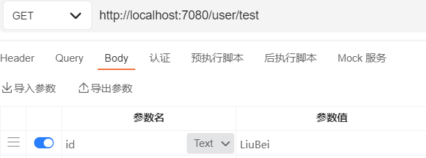

# SpringBoot

## SpringBoot入门

### 简介

SpringBoot简化了所有的spring配置文件，使开发，部署变得更简单了

特性：

- 能够快速创建基于Spring的应用程序
- 能够直接使用java main 方法启动内嵌的tomcat服务器运行jar包，不需要部署war包文件
- 提供约定的 starter POM 来简化maven配置，让maven的配置变得更简单
- 自动化配置，更具项目的maven依赖配置，Springboot自动配置spring，springmvc等
- 提供了程序的健康检查等功能
- 基本可以完全不适用XML配置文件，采用注解配置

四大核心：

- 自动配置
- 起步依赖
- Actuator（健康检测）
- 命令行界面

### Hello SpringBoot

> 快速搭建

1. 通过spring官网快速生成，并注入spring-web依赖（自动配置好web.xml），然后下载demo包，并导入ide中
2. 通过idea创建SpringBoot项目（idea集成了spring官网的自动生成）

> pom.xml

```xml
<?xml version="1.0" encoding="UTF-8"?>
<project xmlns="http://maven.apache.org/POM/4.0.0" xmlns:xsi="http://www.w3.org/2001/XMLSchema-instance"
	xsi:schemaLocation="http://maven.apache.org/POM/4.0.0 https://maven.apache.org/xsd/maven-4.0.0.xsd">
	<modelVersion>4.0.0</modelVersion>
    <!-- 父依赖，后续SpringBoot依赖可以自动继承该依赖版本 -->
	<parent>
		<groupId>org.springframework.boot</groupId>
		<artifactId>spring-boot-starter-parent</artifactId>
		<version>2.5.0</version>
		<relativePath/> <!-- lookup parent from repository -->
	</parent>
	<groupId>com.lei</groupId>
	<artifactId>demo</artifactId>
	<version>0.0.1-SNAPSHOT</version>
	<name>demo</name>
	<description>Demo project for Spring Boot</description>
	<properties>
		<java.version>11</java.version>
	</properties>
	<dependencies>
        <!-- SpringBoot 起步依赖-->
        <!-- SpringBootWeb 配置好了web.xml，并且默认使用tomcat作用web容器 -->
		<dependency>
			<groupId>org.springframework.boot</groupId>
			<artifactId>spring-boot-starter-web</artifactId>
		</dependency>
        <!-- SpringBoot 测试起步依赖-->
		<!-- SpringBoot 单元测试 -->
		<dependency>
			<groupId>org.springframework.boot</groupId>
			<artifactId>spring-boot-starter-test</artifactId>
			<scope>test</scope>
		</dependency>
	</dependencies>

	<build>
		<plugins>
            <!-- SpringBoot 打包、编译插件 -->
			<plugin>
				<groupId>org.springframework.boot</groupId>
				<artifactId>spring-boot-maven-plugin</artifactId>
			</plugin>
		</plugins>
	</build>

</project>
```

> Application类

```java
//SpringBoot项目启动入口类
@SpringBootApplication	//SpringBoot核心注解，主要用于开启SpringBoot自动配置
public class DemoApplication {
	public static void main(String[] args) {
		SpringApplication.run(DemoApplication.class, args);
	}
}
```

> 后续步骤

1. 在Appliction配置类的同级目录下创建相关的 dao包，service包，controller包等
2. 创建hello controller
3. 打包（jar）
4. java -jar xxx.jar 运行jar包
5. 浏览器访问 localhost:8080/hello

## SpringBoot源码分析

### 准备工作

1. 安装 JDK1.8+
2. 安装并配置Gradle
3. 使用新版IDEA，并安装代码插件 Statistic 和翻译插件 ECTranslation
4. github上下载Springboot源码，并解压
5. 阅读源码目录下的 README.adoc，里面说明了如何进行构建源码
6. 进入DOS执行命令进行构建：./gradlew publishToMavenLocal，可能出现网络错误；git 错误解决如下：
   1. 该SpringBoot目录必须纳入到git管理中
   2. git init
   3. git add ./*，这里会报文件名太长的错误，通过下面命令：git config core.longpaths true
   4. git commit -m "1"
   5. 然后再进行源码构建
7. 构建成功后 IDEA 导入；IDEA导入，选择源码目录下的`build.gradle`作为工程导入
8. 修改编码 UTF-8、配置自动注解

> 验证源码环境

1. 创建gradle项目，并在依赖文件中，通过源码项目导入父依赖以及所需依赖

   ```java
   dependencies {
       testImplementation 'org.junit.jupiter:junit-jupiter-api:5.7.0'
       testRuntimeOnly 'org.junit.jupiter:junit-jupiter-engine:5.7.0'
       //指定parent
       implementation(platform(project(":spring-boot-project:spring-boot-parent")))
       //添加依赖
       implementation(project(":spring-boot-project:spring-boot-starters:spring-boot-starter"))
       //api(group:"org.apache.tomcat.embed",name:"tomcat-embed-jasper")
   }
   ```

2. 创建启动类，启动测试，因为是普通java程序，运行结束后退出

   ```java
   @SpringBootApplication
   public class Application implements CommandLineRunner {
   	public static void main(String[] args) {
   		SpringApplication.run(Application.class);
   	}
   
   	@Override
   	public void run(String... args) throws Exception {
   		System.out.println("SpringBoot start");
   	}
   }
   ```

### SpringBoot启动原理

主要分为三部分

1. 第一部分进行SpringbootApplication的初始化模块，配置一些基本的环境变量、资源、构造器、监视器
2. 第二部分实现了应用具体的启动方案，包括启动流程监听模块、加载配置环境模块、及核心的创建上下文环境模块
3. 第三部分是自动化配置模块，该模块是SpringBoot自动化配置的核心

> 宏观步骤（概括为18个小步骤）

1. 创建并启动计时监控类 StopWatch
2. 初始化应用上下文和异常报告集合（ConfigurableApplicationContext和Collection\<SpringBootExceptionReporter\>）
3. 设置系统属性 configureHeadlessProperty()
4. 创建Spring运行的监听器并启动
5. 初始化默认应用参数类
6. 准备Spring环境
7. 创建beanner打印类
8. 创建应用Spring上下文（spring容器）
9. 准备异常报告器
10. 准备应用上下文（spring容器）
11. 刷新上下文（spring容器）
12. 应用上下文刷新后置处理（spring容器）
13. 停止计时监控类
14. 输出日志信息
15. 发布应用上下文启动完成事件
16. 执行所有的Runner运行期（如果实现了CommandLineRunner接口）
17. 发布应用上下文就绪事件
18. 完成返回容器对象

> 总结：
>
> 1. new一个SpringApplication对象，使用一种类似于SPI机制的技术加载ApplicationContextInitializer、ApplicationListener 接口实例
>
> 2. 调用SpringApplication.run()方法，run方法中大概有 18 个小步骤
>
> 3. 调用createApplicationContext()方法创建Spring IOC上下文对象，创建上下文对象同时会注册spring的核心组件类
>
>    ConfigurationClassPostProcessor、AutowiredAnnotationBeanPostPrecessor等
>
> 4. 调用refreshContext() 方法启动 Spring 容器（12步）和内置 Servlet 容器


### 自动装配

1. @import：spring注解，作用为注入一个指定的bean
2. SpringBoot----> start起步依赖（空的） ----> 整合依赖（整合相关包，然后暴露出去）

## 核心配置文件

一个SpringBoot项目只有一个核心配置文件，有多种存在形式，取一种就可以

1. application.properties

   ```properties
   #设置内嵌Tomcat端口号
   server.port=8080
   #设置项目默认上下文根(localhost:8080/SpringBoot/hello)
   server.servlet.context-path=/SpringBoot
   ```

2. application.yaml

   ```yaml
   server:
     port: 8081
     servlet:
       context-path: /SpringBoot
   ```

### 多环境配置文件

- application.properties

  - 创建多个配置文件，文件名格式为 application-xxx.properties

  - 在application.properties中指定需要使用的配置文件

    ```properties
    #指定需要使用的配置文件
    spring.profiles.active=xxx
    ```

    

- application.yaml

  - 创建多个配置文件，文件名格式为 application-xxx.yaml

  - 在application.yaml中指定需要使用的配置文件

    ```yaml
    spring:
      profiles:
        active: xxx
    ```

### 获取自定义配置

- 获取自定义配置的值，使用@Value(${...})

  ```properties
  school.name=tanglei
  school.address=wc
  ```

  ```java
  @Value("${school.name}")
  private String name;
  @Value("${school.address}")
  private String address;
  ```

  

- 将自定义配置映射到一个对象

  - application.properties配置文件

    ```properties
    school.name=tanglei
    school.address=wc
    ```

  - 创建一个类，包含字段name、address

    ```java
    //注册为spring组件
    @Component
    //配置类，获取application的自定义配置，prefix为自定义配置的前缀
    @ConfigurationProperties(prefix = "school")
    public class School {
        private String name;
        private String address;
    }
    ```
  
- 通过Environment对象读取；（spring ioc直接给我们创建了该对象）

  - application.properties配置文件

    ```properties
    school.name=tanglei
    school.address=wc
    ```

  - 注入Environment对象bean，通过该对象读取

    ```java
    @SpringBootApplication
    public class Application implements CommandLineRunner {
    
        @Autowired
        private Environment environment;
        
    
        public static void main(String[] args) {
            SpringApplication.run(Application.class);
        }
    
        @Override
        public void run(String... args) throws Exception {
            //读取自定义配置
            System.out.println(environment.getProperty("school.name"));
            System.out.println(environment.getProperty("school.address"));
        }
    }
    ```

    

### 常用配置

```properties
#指定需要使用的配置文件(多环境配置文件)
#多环境配置文件的命名格式：application-dev.properties
spring.profiles.active=xxx

#配置数据库
spring.datasource.type=com.alibaba.druid.pool.DruidDataSource	#指定数据源
spring.datasource.driver-class-name=com.mysql.cj.jdbc.Driver
#链接地址、 useSSL 安全套接字协议，mysql的版本是5.7之后的版本必须要加上useSSL=false
#connectTimeout 链接超时、socketTimeout读写超时、autoReconnect当数据库连接异常中断时，是否自动重新连接
#serverTimezone 设置时区
#zeroDateTimeBehavior JAVA连接MySQL数据库，在操作值为0的timestamp类型时不能正确的处理；【exception:默认值,抛出异常、convertToNull:将日期转换成NULL值、round:替换成最近的日期即0001-01-01】
#rewriteBatchedStatements 默认情况下会无视executeBatch(),设置为true，驱动才会帮你批量执行SQL
#characterEncoding 所处理字符的解码和编码的格，如果项目和数据库一致可不设
#allowMultiQueries 可以在sql语句后携带分号，实现多语句执行
spring.datasource.url=jdbc:mysql://192.168.10.129:3306/crm_manage?useSSL=false&connectTimeout=10000&socketTimeout=30000&autoReconnect=true&serverTimezone=GMT%2B8&zeroDateTimeBehavior=ROUND&rewriteBatchedStatements=true&characterEncoding=utf8&allowMultiQueries=true
spring.datasource.username=crm_manage
spring.datasource.password=JCRMp3LHkrSZ5y6c

#配置redis
spring.redis.host=192.168.10.129
spring.redis.port=6379
spring.redis.password=123456

#配置restful返回json字符串时的时间格式和时区
spring.jackson.date-format=yyyy-MM-dd HH:mm:ss
spring.jackson.time-zone=GMT+8

#mybatis
mybatis.mapper-locations=classpath:mapper/*.xml		#自定义mapper.xml文件所在位置
mybatis.type-aliases-package=com.lei.model		#定义别名

#jsp视图解析器
spring.mvc.view.prefix=/
spring.mvc.view.suffix=.jsp

#启动类配置
spring.main.banner-mode=off			#关闭logo
spring.main.sources=com.lei.Application			#指定配置类，启动类可以不传入启动类的
classspring.main.allow-bean-definition-overriding=true		#允许 bean 定义覆盖
spring.main.lazy-initialization=true	#延时初始化bean，获取时才会创建；可以在指定bean上添加注解 @Lazy(false)来不延时初始化

#自动化配置
spring.autoconfigure.exclude=配置类	#排除指定的自动化配置，也可以通过 @SpringBootApplication(exclude = {DataSourceAutoConfiguration.class}) 排除指定自动化配置

#jasypt
jasypt.encryptor.password=sdjhauidasdw    #加密解密的秘钥key
jasypt.encryptor.property.prefix=EVC(		#识别密文内容的开始
jasypt.encryptor.property.suffix=)			#识别密文内容的结束

#线程池相关
spring.task.execution.pool.core-size=5
spring.task.execution.pool.max-size=100
spring.task.execution.thread-name-prefix=th-
spring.task.execution.pool.queue-capacity=999

#ssl配置

server.port=8088   #ssh端口
server.ssl.key-store=classpath:tomcat.keystore   #证书
server.ssl.key-store-password=      #证书密码
server.ssl.trust-store-type=jks     #证书证书类型 jks/PKCS12
```

```yaml
#logback配置
logging:
  level:
    root: info
    com.lei.mapper: debug
  file:
    path: /
    name: "log.log"
  charset:
    console: UTF-8
    file: UTF-8
  pattern:
    dateformat: "MM-dd HH:mm:ss"
```

### 启动时区配置

1. 启动类配置

   ```java
   @SpringBootApplication
   public class MbsGenericApplication {
           @PostConstruct
           void started() {
               TimeZone.setDefault(TimeZone.getTimeZone("GMT+8"));
           }
           public static void main(String[] args) {
           SpringApplication.run(MbsGenericApplication.class, args);
       }
   }
   ```

2. JVM启动参数配置

   ```tex
   -Duser.timezone=GMT+8
   ```

## Springboot参数接收

注意看请求头中的 content-type 属性，他告诉后台用什么方式解析参数

### @PathVariable

restful风格

```java
@GetMapping({"/test/{id}","/test"})
public Object test(@PathVariable(value = "id",required = false) String id){
    return "id:"+id;
}
```


@PathVariable 的 required 属性默认为true，如果设置为false表示该参数可以为空，此时访问url时可以不携带参数；**注意**：mapping需要设置不带参数的路径，否则会抛404

### @PathParam

从请求地址中截取参数

```java
@GetMapping("/test")
public Object test(@PathParam(value = "id") String id, @PathParam(value = "name") String name) {
    return "id:" + id+name;
}
```


@PathParam注解没有 required属性，可以不传参数

### @RequestParam

被标注的参数的值来源于 `request.getParameter`或`request.getParameterValues`

```java
//获取参数
@GetMapping("/test")
public Object test(@RequestParam String id) {
    return "id:" + id;
}

//处理上传文件
@GetMapping("/test")
public Object test(@RequestParam("file") MultipartFile file) {
    return "id:" + map;
}
```


- 获取url后拼接参数

  

- 获取body中通过  multipart/form-data 发送的参数

  

@RequestParam 注解存在required属性，默认为true，当后台未接收到参数时(null)会抛错；

@RequestParam 可以处理 multipart/form-data 中上传的文件

### @RequestPart

@RequestPart与@RequestParam比较相似；它不能解析 url 上的参数

1. @RequestPart这个注解用在multipart/form-data表单提交请求的方法上
2. 支持的请求方法的方式MultipartFile，属于Spring的MultipartResolver类。这个请求是通过http协议传输的
3. @RequestParam也同样支持multipart/form-data请求
4. 他们最大的不同是，当请求方法的请求参数类型不再是String类型的时候
5. @RequestParam适用于name-valueString类型的请求域，@RequestPart适用于复杂的请求域（像JSON，XML）

### @RequestBody

@RequestBody 可以接受 application/json、application/xml、application/javascript、text 等

```java
//会自动解析文件，并赋值到map之中
@RequestMapping("/test")
public Object test(@RequestBody Map map) {
    return "id:" + map;
}
```

可以自动将参数解析为 Entity

### 无注解

- 可以处理 multipart/form-data 、 url 地址后参数
- 可以将参数自动解析为 Entity （无法映射为map）

## dubbo集成ssm

接口工程：存放实体bean和业务接口

服务提供者：

- 它是一个SpringBoot框架web项目，集成MyBatis、Redis
- 添加依赖：mybatis依赖、mysql驱动、dubbo依赖、zookeeper依赖、redis依赖、接口工程
- 配置SpringBoot核心配置文件
  - 配置连接数据库
  - 配置连接redis
  - 配置dubbo

服务消费者：

- 它是一个SpringBoot框架的web项目，集成JSP、dubbo
- 添加依赖dubbo依赖、zookeeper依赖、解析jsp的依赖、接口工程
- 配置SpringBoot核心配置文件
  - 配置jsp视图解析器

### 服务提供者

1. 相关依赖 pom.xml

   ```xml
   <dependencies>
       <!-- SpringBoot起步依赖 -->
       <dependency>
           <groupId>org.springframework.boot</groupId>
           <artifactId>spring-boot-starter</artifactId>
       </dependency>
       <!--SpringBoot dubbo整合起步依赖-->
       <dependency>
           <groupId>org.apache.dubbo</groupId>
           <artifactId>dubbo-spring-boot-starter</artifactId>
           <version>2.7.8</version>
           <exclusions>
               <exclusion>
                   <groupId>org.slf4j</groupId>
                   <artifactId>slf4j-log4j12</artifactId>
               </exclusion>
           </exclusions>
       </dependency>
       <!--dubbo-->
       <dependency>
           <groupId>org.apache.dubbo</groupId>
           <artifactId>dubbo</artifactId>
           <version>2.7.8</version>
       </dependency>
       <!--zookeeper客户端-->
       <dependency>
           <groupId>org.apache.curator</groupId>
           <artifactId>curator-framework</artifactId>
           <version>4.2.0</version>
       </dependency>
       <dependency>
           <groupId>org.apache.curator</groupId>
           <artifactId>curator-recipes</artifactId>
           <version>4.2.0</version>
       </dependency>
       <!--SpringBoot mybatis起步依赖-->
       <dependency>
           <groupId>org.mybatis.spring.boot</groupId>
           <artifactId>mybatis-spring-boot-starter</artifactId>
           <version>2.2.0</version>
       </dependency>
       <!--mysql驱动-->
       <dependency>
           <groupId>mysql</groupId>
           <artifactId>mysql-connector-java</artifactId>
       </dependency>
       <!--SpringBoot redis起步依赖-->
       <dependency>
           <groupId>org.springframework.boot</groupId>
           <artifactId>spring-boot-starter-data-redis</artifactId>
       </dependency>
       <!--接口工程-->
       <dependency>
           <groupId>org.example</groupId>
           <artifactId>api</artifactId>
           <version>1.0-SNAPSHOT</version>
       </dependency>
   </dependencies>
   ```

2. SpringBoot核心配置文件

   ```properties
   #mysql配置
   spring.datasource.driver-class-name=com.mysql.cj.jdbc.Driver
   spring.datasource.url=jdbc:mysql://192.168.10.129:3306/jdbc_learn?useSSL=true&useUnicode=true&characterEncoding=utf8
   spring.datasource.username=jdbc_learn
   spring.datasource.password=tWDp8b2xDFZpzF5N
   #mapper文件位置
   mybatis.mapper-locations=classpath:mapper/*.xml
   #dubbo相关配置
   dubbo.application.name=provider
   dubbo.registry.address=zookeeper://192.168.10.130
   dubbo.registry.port=2181
   dubbo.protocol.name=dubbo
   dubbo.protocol.port=20880
   dubbo.scan.base-packages=com.lei.service.impl
   #redis配置
   spring.redis.host=192.168.10.129
   spring.redis.port=6379
   ```

3. 编写接口服务方法的实现

   ```java
   //暴露服务
   @DubboService
   public class StudentServiceImpl implements StudentService {
   //注入mapper
       @Autowired
       private StudentsMapper studentsMapper;
   //注入redis操作类
       @Autowired
       private RedisTemplate<Object,Object> redisTemplate;
   
       @Override
       public int getStudentCount() {
           //redis查询，有返回，无进mysql查询结果并放入redis
           Integer total= (Integer) redisTemplate.opsForValue().get("total");
           if (total==null){
               total=studentsMapper.queryCount();
               redisTemplate.opsForValue().set("total",total,30, TimeUnit.SECONDS);
           }
           return total;
       }
   
       @Override
       public Students queryStudentById(long id) {
           return studentsMapper.selectByPrimaryKey(id);
       }
   }
   ```

### 服务消费者

1. 添加依赖 pom.xml

   ```xml
   <dependencies>
       <dependency>
           <groupId>org.springframework.boot</groupId>
           <artifactId>spring-boot-starter-web</artifactId>
       </dependency>

       <dependency>
           <groupId>org.springframework.boot</groupId>
           <artifactId>spring-boot-starter-test</artifactId>
           <scope>test</scope>
       </dependency>
       <dependency>
           <groupId>org.apache.dubbo</groupId>
           <artifactId>dubbo-spring-boot-starter</artifactId>
           <version>2.7.8</version>
           <exclusions>
               <exclusion>
                   <groupId>org.slf4j</groupId>
                   <artifactId>slf4j-log4j12</artifactId>
               </exclusion>
           </exclusions>
       </dependency>
       <dependency>
           <groupId>org.apache.dubbo</groupId>
           <artifactId>dubbo</artifactId>
           <version>2.7.8</version>
       </dependency>
       <dependency>
           <groupId>org.apache.curator</groupId>
           <artifactId>curator-framework</artifactId>
           <version>4.2.0</version>
       </dependency>
       <dependency>
           <groupId>org.apache.curator</groupId>
           <artifactId>curator-recipes</artifactId>
           <version>4.2.0</version>
       </dependency>
       <!--SpringBoot内嵌tomcat的jsp支持-->
       <dependency>
           <groupId>org.apache.tomcat.embed</groupId>
           <artifactId>tomcat-embed-jasper</artifactId>
       </dependency>
       <dependency>
           <groupId>org.example</groupId>
           <artifactId>api</artifactId>
           <version>1.0-SNAPSHOT</version>
       </dependency>
   </dependencies>
   <build>
       <resources>
           <!--因为需要整合jsp文件，所以要指定jsp文件编译位置-->
           <resource>
               <directory>src/main/webapp</directory>
               <targetPath>META-INF/resources</targetPath>
               <includes>
                   <include>*.*</include>
               </includes>
           </resource>
       </resources>
       <plugins>
           <plugin>
               <groupId>org.springframework.boot</groupId>
               <artifactId>spring-boot-maven-plugin</artifactId>
           </plugin>
       </plugins>
   </build>
   ```

2. 创建webapp目录，并指定为web资源目录

3. SpringBoot核心配置文件

   ```yaml
   spring:
     #视图解析设置
     mvc:
       view:
         prefix: /
         suffix: .jsp
   #dubbo设置
   dubbo:
     #zookeeper设置
     registry:
       address: zookeeper://192.168.10.130
       client: curator
       port: 2181
     application:
       name: consumer
     scan:
     	#扫描指定包下的远程注入注解
       base-packages: com.lei.controller
   ```

4. 创建控制层

   ```java
   @Controller
   public class UserController {
       //远程注入bean，负载均衡策略为 random
       @DubboReference(loadbalance = "random")
       private UserService userService;
       @DubboReference
       private StudentService studentService;
       @RequestMapping("/t1")
       public String t1(){
           return userService.say();
       }
       @RequestMapping("/t2")
       public String t2(int id, Model model){
           model.addAttribute("msg",studentService.queryStudentById(id));
           return "index";
       }
       @RequestMapping("/t3")
       public String t3( Model model){
           model.addAttribute("msg",studentService.getStudentCount());
           return "index";
       }
   }
   ```

## 手写starter启动器

### 创建自动配置模块

> 创建maven项目：ch01-autoconfig

目录结构如下：


1. pom文件如下

   ```xml
   <dependencies>
       <dependency>
           <groupId>org.springframework.boot</groupId>
           <artifactId>spring-boot-starter</artifactId>
       </dependency>
       <dependency>
           <groupId>org.projectlombok</groupId>
           <artifactId>lombok</artifactId>
       </dependency>
   </dependencies>
   ```

2. `MyProperties`类，用于读取properties配置文件

   ```java
   @Data
   @ConfigurationProperties("spring.user")		//配置文件前缀
   public class MyProperties {
       private String name;
       private Integer age;
       private String address;
   }
   ```

3. `MyBean`自己需要注册的bean的类

   ```java
   @Data
   public class MyBean {
       private MyProperties myProperties;
   }
   ```

4. `MyAutoConfig`自动配置类，用于装配bean

   ```java
   @Configuration
   //ConditionalOnClass，当classpath路径下存在该类时，配置生效
   @ConditionalOnClass(MyBean.class)
   @EnableConfigurationProperties(MyProperties.class)
   public class MyAutoConfig {
       @Autowired
       private MyProperties myProperties;
       
       @Bean
       //prefix：前缀
       //value：具体的配置名
       //havingValue：判断是否等于value取出的值
       //ConditionalOnProperty 满足条件才装配该类
       @ConditionalOnProperty(prefix = "spring.user", value = "enabled", havingValue = "true")
       public MyBean myBean(){
           MyBean myBean=new MyBean();
           myBean.setMyProperties(myProperties);
           return myBean;
       }
   }
   ```

5. `resources/META-INF/spring.factories`，SpringBoot会自动扫描该配置文件，并读取里面的类

   ```properties
   org.springframework.boot.autoconfigure.EnableAutoConfiguration=com.demo.MyAutoConfig
   ```

### 创建starter项目

> 仅用于依赖，里面不存在任何内容，依赖于autoconfig模块

pom文件

```xml
<dependencies>
    <dependency>
        <groupId>com.demo</groupId>
        <artifactId>ch01-autoconfig</artifactId>
        <version>0.0.1-SNAPSHOT</version>
    </dependency>
</dependencies>
```

### 创建测试项目

1. `pom`文件，依赖自己创建的starter

   ```xml
   <dependencies>
       <dependency>
           <groupId>org.springframework.boot</groupId>
           <artifactId>spring-boot-starter</artifactId>
       </dependency>
       <dependency>
           <groupId>com.lei</groupId>
           <artifactId>ch01-SpringBoot-start-demo</artifactId>
           <version>0.0.1-SNAPSHOT</version>
       </dependency>
       <dependency>
           <groupId>org.springframework.boot</groupId>
           <artifactId>spring-boot-starter-web</artifactId>
       </dependency>
   </dependencies>
   ```

2. `application.properties`

   ```properties
   #spring.user.enabled=true，自己创建的starter中的配置类才会生效
   spring.user.enabled=true
   spring.user.name=lei
   spring.user.age=24
   spring.user.address=81497400@qq.com
   ```

3. 创建控制器，并测试

   ```java
   @RestController
   public class TestController {
       @Autowired
       private MyBean myBean;		//这里的myBean是通过自己创建的starter加载进来的
       @RequestMapping("/t1")
       public Object t1(){
           return myBean;
       }
   }
   ```

4. 访问

   

### 相关注解

- `@Configuration`：标记该类为SpringBoot配置类
- `@ConditionalOnClass(MyBean.class)`：标记类或方法，当`classpath`中存在MyBean字节码文件时，配置类生效
- `@ConditionalOnProperty(prefix = "spring.user", value = "enabled", havingValue = "true")`：标记类或方法，`prefix `前缀、`value `属性、`havingValue `该值与属性值进行比较；配置是否生效
- `@EnableConfigurationProperties(MyProperties.class)`：使读取配置属性的类`MyProperties`生效
- `@ConfigurationProperties("spring.user")`：将配置属性映射到类

## websocket

### 介绍

- websocket时html5定义的一个协议，由tcp协议实现的一种网络协议
- 该协议可以主动向客户端发送信息
- http是短连接，一个请求结束，连接关闭，客户端到服务端单向；websocket是长连接，只需要一次请求初始化连接，然后所有的请求与响应都通过该TCP连接通信，双向
- 传统web推送和websocket
  - 传统web推送：通常在页面通过Ajax定时轮询，浏览器需要不断的向服务器发送请求；无效请求占用大量带宽、CPU资源
  - websocket：可以节省带宽和资源，消息推送及时、通信高效、协议标识符 `ws`
- 业务场景
  - 聊天室
  - 股票基金的实时显示
  - 企业内部管理通讯
  - 系统提醒、用户上下线提醒、实时数据更新

### java中websocket Api

- javaee 7中开始支持 websocket 协议，javaee 7定义了一套 websocket API 规范，也就是一系列接口，没有实现
- 位于 javax.websocket 包下，包含客户端 API 和服务端 API
- websocket API 的具体实现需要 web 容器
- 服务端实现：Tomcat 7.x+、Spring 4.x+

### 相关注解

1. 服务端代码

   ```java
   @ServerEndpoint("/socket")
   public class MyWebSocket {
       @OnOpen
       public void onOpen(Session session) throws Exception{
           System.out.println("客户端连接成功");
           session.getBasicRemote().sendText("websocket连接成功");
       }
       @OnMessage
       public void onMessage(String message, Session session) throws Exception{
           System.out.println("接收到消息");
           session.getBasicRemote().sendText("消息"+message);
       }
       @OnClose
       public void onClose(){
           System.out.println(this+"关闭连接");
       }
       @OnError
       public void onError(Session session,Throwable throwable){
           System.out.println("出错");
           throwable.printStackTrace();
       }
   }
   ```

   

2. 客户端代码

   ```html
   <!DOCTYPE html>
   <html lang="en">
   <head>
       <meta charset="UTF-8">
       <title>Title</title>
       <script type="text/javascript" src="js/jquery-3.6.0.js" ></script>
       <script>
           var ws
           $(function (){
               if ("WebSocket" in window){
                   var url="ws://localhost:8080/socket"
                   ws=new WebSocket(url)
                   //连通后回调函数
                   ws.OPEN=function (){
                       console.log("websocket连接")
                   }
                   //接收到服务端返回的数据时执行
                   ws.onmessage=function (msg){
                       console.log(msg.data)
                   }
                   //关闭websocket时执行
                   ws.onclose=function (){
                       console.log("关闭websocket连接")
                   }
               }
               $("#sendbtn").click(function (){
                   sendMsg($("#sendmsg").val())
               })
               $("#closebtn").click(function (){
                   ws.close()
               })
           })
           function sendMsg(msg){
               ws.send(msg)
           }
       </script>
   </head>
   <body>
       <div>
           <label for="sendmsg"></label>
           <textarea id="sendmsg" style="width: 500px;height: 50px"></textarea>
       </div>
       <div>
           <input type="button" id="sendbtn" value="发送">
           <input type="button" id="closebtn" value="离开">
       </div>
   </body>
   </html>
   ```

### SpringBoot中websocket

SpringBoot 的 web 起步依赖内嵌的 tomcat 集成了 websocket 依赖

> 在线聊天室实现

1. 添加websocker起步依赖

   ```xml
   <!--模板引擎起步依赖-->
   <dependency>
       <groupId>org.springframework.boot</groupId>
       <artifactId>spring-boot-starter-thymeleaf</artifactId>
   </dependency>
   <!--websocket起步依赖-->
   <dependency>
       <groupId>org.springframework.boot</groupId>
       <artifactId>spring-boot-starter-websocket</artifactId>
   </dependency>
   ```

2. 编写配置文件，启用websocket支持，并注入 扫描websocket注解的bean

   ```java
   @Configuration
   @EnableWebSocket
   public class MyConfig {
           /**
            * 注入一个ServerEndpointExporter,该Bean会自动注册使用@ServerEndpoint注解申明的websocket endpoint
            */
           @Bean
           public ServerEndpointExporter serverEndpointExporter() {
               return new ServerEndpointExporter ();
       }
   }
   ```

3. 编写工具类，维护所有在线人的信息

   ```java
   public class WebsocketUtil {
       //保存用户信息的map
       public static final ConcurrentHashMap<String,Session> CLIENTS=new ConcurrentHashMap<>();
       //发送消息给所有人
       public static void sendMessageAll(String msg) {
           CLIENTS.forEach(((username, session) -> sendMessage(session,username,msg)));
       }
       //获取在线人数，即map中key的数量
       public static String getOnlineInfo() {
           Set<String> set=CLIENTS.keySet();
           if (set.size()==0){
               return "当前无人在线";
           }
           return set.toString()+" 在线";
       }
       //发送消息
       public static void sendMessage(Session session, String username,String msg) {
           if (session==null){
               return;
           }
           final RemoteEndpoint.Basic basic=session.getBasicRemote();
           if (basic==null){return;}
           try{
               basic.sendText(msg);
           }catch (Exception e){
               e.printStackTrace();
           }
       }
   }
   ```

4. 编写websocket类，用于接收请求

   ```java
   @Component   //SpringBoot需要注入到ioc容器
   @ServerEndpoint("/websocket/{username}")
   public class ChartWebsocket {
       @OnOpen
       public void openSession(@PathParam("username") String username, Session session){
           String msg="用户["+username+"]进入聊天室";
           //发送登录信息给其他人
           WebsocketUtil.sendMessageAll(msg);
           String onlineInfo=WebsocketUtil.getOnlineInfo();
           //发送在线人数给自己
           WebsocketUtil.sendMessage(session,username,onlineInfo);
           //将信息放入工具类map
           WebsocketUtil.CLIENTS.put(username,session);
       }
       @OnMessage
       public void onMessage(@PathParam("username") String username,String message){
           //接收到信息后，发送给所有人
           WebsocketUtil.sendMessageAll("["+username+"]："+message);
       }
       @OnClose
       public void onClose(@PathParam("username") String username){
           System.out.println(this+"关闭连接");
           //广播某人退出聊天室
           WebsocketUtil.sendMessageAll(username+"退出聊天室");
           //移除该用户的信息
           WebsocketUtil.CLIENTS.remove(username);
       }
       @OnError
       public void onError(@PathParam("username") String username,Session session,Throwable throwable){
           System.out.println("出错"+username);
       }
   }
   ```

5. 前端页面

   ```html
   <!DOCTYPE html>
   <html lang="en" xmlns:th="http://www.thymeleaf.org">
   <head>
       <meta charset="UTF-8">
       <title>聊天室</title>
       <link th:href="@{/bootstrap-4.6.0-dist/css/bootstrap.css}" rel="stylesheet">
       <script type="text/javascript" th:src="@{/js/jquery-3.6.0.js}"></script>
       <script>
           var ws
           $(function (){
               if ("WebSocket" in window){
                   ws=new WebSocket("ws://localhost:8080/websocket/"+$("#username").val())
                   ws.OPEN=function (msg){
                       alert("进入聊天室")
                   }
                   //接收到服务端返回的数据时执行
                   ws.onmessage=function (msg){
                       $("#disPlayTextarea").text($("#disPlayTextarea").text()+msg.data+"\n")
                   }
                   //关闭websocket时执行
                   ws.onclose=function (){
                       console.log("关闭websocket连接")
                   }
               }else {
                   alert("浏览器不支持")
               }
               $("#sendBtn").click(function (){
                   sendMsg($("#sendmsg").val())
               })
               $("#closeBtn").click(function (){
                   ws.close()
               })
           })
           function sendMsg(msg){
               ws.send(msg)
           }
       </script>
   </head>
   <body>
   <div class="container">
       <div class="container">
           <div class="form-group">
               <label for="disPlayTextarea">websocket聊天室</label>
               <textarea class="form-control" disabled id="disPlayTextarea" rows="10"></textarea>
           </div>
       </div>
       <div class="container">
           <div class="form-group">
               <label for="sendmsg"></label>
               <textarea class="form-control" id="sendmsg" rows="1"></textarea>
           </div>
           <input type="button" class="btn-primary" id="sendBtn" value="发送信息">
           <input type="button" class="btn-warning" id="closeBtn" value="退出聊天室">
           <input type="hidden" id="username" th:value="${username}">
       </div>
   </div>
   </body>
   </html>
   ```
