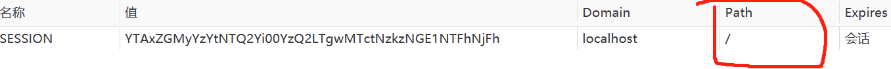

# SpringSession

## session丢失理解


`nginx每次将请求转发到不同的tomcat，对于当前tomcat来说，该次会话无疑是一次新的对话，则会创建一个session，并返回`

## 解决方案

原理：session不存入 JVM 中（存入redis），或相同的 ip 请求同一个服务器

1. 容器共享插件，可以将session存入redis中，不同容器不同的插件，缺点：依赖于容器
2. nginx负载均衡时，采用ip_hash，缺点：可能负载均衡失败（单个容器负载过大）
3. 自己写一套session会话管理工具
4. 采用框架将session存储到其他地方，实现session共享，比如：`SpringSession`

## 基本使用

1. 导入相关依赖

   ```xml
   <!-- springSession 依赖 -->
   <dependency>
       <groupId>org.springframework.session</groupId>
       <artifactId>spring-session-data-redis</artifactId>
   </dependency>
   <!-- redis 起步依赖 -->
   <dependency>
       <groupId>org.springframework.boot</groupId>
       <artifactId>spring-boot-starter-data-redis</artifactId>
   </dependency>
   ```

2. 启用springsession，配置类加上`@EnableRedisHttpSession`注解

   ```java
   @EnableRedisHttpSession(maxInactiveIntervalInSeconds= 3600*24, redisFlushMode = RedisFlushMode.ON_SAVE, redisNamespace = "aurora-web")
   
   // maxInactiveIntervalInSeconds: Session默认过期时间，单位秒，默认1800秒，使用 Redis Session 之后，原 Spring Boot 的 server.session.timeout 属性不再生效
   // redisNamespace：配置key的namespace，默认的是spring:session，如果不同的应用共用一个redis，应该为应用配置不同的namespace，这样才能区分这个Session是来自哪个应用的
   // redisFlushMode：配置刷新Redis中Session方式，默认是ON_SAVE模式，只有当Response提交后才会将Session提交到Redis,也可以配置成IMMEDIATE模式，即所有对Session的更改会立即更新到Redis
   // cleanupCron：清理过期Session的定时任务
   ```

3. 配置redis连接

   ```properties
   spring.redis.host=localhost
   spring.redis.port=6379
   #设置session过期时间为 30 分钟
   server.servlet.session.timeout=30m
   #指定 cookie 存放的根路径，用于实现同域名不同项目名 cookie 共享
   server.servlet.session.cookie.path=/
   #指定 cookie 存放域名，用于实现同域名不同子域名 cookie 共享
   server.servlet.session.cookie.domain=myweb.com
   ```

4. 查看redis中session

   ```bash
   127.0.0.1:6379> KEYS *
   1) "spring:session:expirations:1628959080000"
   2) "spring:session:sessions:e4839318-ba5a-4eca-92b5-e58bc34be195"
   3) "spring:session:sessions:expires:e4839318-ba5a-4eca-92b5-e58bc34be195"
   
   #存在三组数据
   #第一组：hash结构，spring-session存储的主要内容
   127.0.0.1:6379> HKEYS spring:session:sessions:e4839318-ba5a-4eca-92b5-e58bc34be195
   1) "sessionAttr:msg"
   2) "maxInactiveInterval"	#session最大生命周期
   3) "creationTime"			#创建时间
   4) "lastAccessedTime"		#最后访问时间
   
   #String结构，用于ttl过期时间记录
   127.0.0.1:6379> get "spring:session:sessions:expires:e4839318-ba5a-4eca-92b5-e58bc34be195"
   ""
   
   #set结构，过期时间记录
   127.0.0.1:6379> SMEMBERS spring:session:expirations:1628959080000
   1) "\xac\xed\x00\x05t\x00,expires:e4839318-ba5a-4eca-92b5-e58bc34be195"
   ```

## 使用场景(cookie存放规则修改)

> **默认**

同域名，同项目名，可以实现session共享，主要依赖于浏览器何时`携带 cookie 中的 sessionId`

> **同域名，不同项目名**

同域名，不同项目名，会因为cookie的`path`属性，而不能携带


上图 `/one` 路径下所有请求都会携带cookie，不同项目名就不会携带，cookie丢失

> 通过`配置cookie序列化规则bean`，来改变cookie存放规则，springboot也可以通过配置文件配置cookie存放位置

```java
@Bean
DefaultCookieSerializer defaultCookieSerializer(){
    DefaultCookieSerializer cookieSerializer=new DefaultCookieSerializer();
    cookieSerializer.setCookiePath("/");	//指定cookie存放的路径，不同项目名cookie共享
    cookieSerializer.setDomainName("myweb.com");		//指定cookie的domain，不同子域名可以进行cookie共享
    return cookieSerializer;
}
```

此时如下图： `/` 请求下都会携带cookie



## 知识点

> Cookie

1. 理论上Cookie是不可以跨域名的，隐私安全机制禁止网站非法获取其他网站的Cookie
2. 理论上同一个一级域名下的两个二级域名也不能交互使用Cookie
3. path属性决定允许访问Cookie的路径。比如，设置为"/"表示允许所有路径都可以使用Cookie

> 原理简要分析

当请求进来的时候，SessionRepositoryFilter 会先拦截到请求，将 request 和 response 对象转换成 SessionRepositoryRequestWrapper 和 SessionRepositoryResponseWrapper 。后续当第一次调用 request 的getSession方法时，会调用到 SessionRepositoryRequestWrapper 的`getSession`方法。这个方法是被重写过的，逻辑是先从 request 的属性中查找，如果找不到；再查找一个key值是"SESSION"的 Cookie，通过这个 Cookie 拿到 SessionId 去 Redis 中查找，如果查不到，就直接创建一个RedisSession 对象，同步到 Redis 中。
