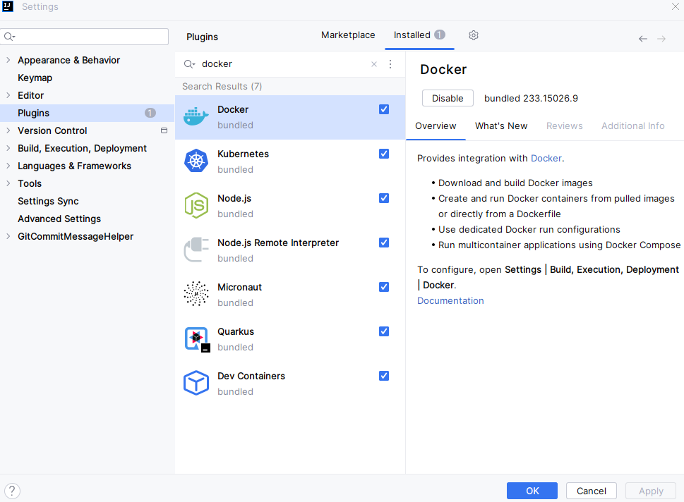

# IDEA连接Docker开发

## 安装 Docker：步骤略

## 配置 Docker 

```bash
# 修改docker服务文件
vim /usr/lib/systemd/system/docker.service

# ExecStar后面追加 -H tcp://0.0.0.0:2375
ExecStart=/usr/sbin/dockerd -H fd:// --containerd=/run/containerd/containerd.sock $DOCKER_OPTS -H tcp://0.0.0.0:2375

# 重新加载配置
systemctl daemon-reload
 
# 重启docker服务
systemctl restart docker.service
```

## Idea 安装 docker 插件



## idea 配置 docker 连接


## 将 jar 发布到 Docker

1. 项目根目录下新建 docker 文件夹

   

2. 在 docker 文件夹下新建  Dockerfile 文件

   ```dockerfile
   # 基础镜像
   FROM openjdk:11.0-jre-buster
   
   # 维护者信息
   MAINTAINER lei
   
   # 设置容器时区为当前时区
   RUN /bin/cp /usr/share/zoneinfo/Asia/Shanghai /etc/localtime \&& echo 'Asia/Shanghai' >/etc/timezone
   
   # /tmp 目录作为容器数据卷目录，SpringBoot内嵌Tomcat容器默认使用/tmp作为工作目录，任何向 /tmp 中写入的信息不会记录进容器存储层
   # 在宿主机的/var/lib/docker目录下创建一个临时文件并把它链接到容器中的/tmp目录
   VOLUME /tmp
   
   # 复制主机文件至镜像内，复制的目录需放置在 Dockerfile 文件同级目录下
   COPY ./*.jar /data/app.jar
   
   # 容器启动执行命令
   ENTRYPOINT ["java", "-Xmx128m", "-Djava.security.egd=file:/dev/./urandom", "-jar", "/data/app.jar"]
   
   # 声明容器提供服务端口
   EXPOSE 8080
   ```

3. 将打包好的 jar 包放在 Dockerfile 同级目录下

   

4. 新建启动配置，选择 Dockerfile

   

5. 配置启动程序

   

6. 启动

   
