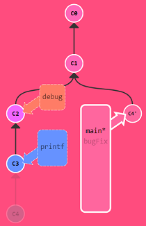

# Git

Git是一个`分布式`版本控制系统

`中央服务器`存在，仅仅是为了方便交换修改

## 基本使用

版本库：是一个目录，目录中所有文件都被Git管理起来，每个文件的删除、修改 Git都能跟踪

> 基本命令

```bash
Git init		#将目录初始化为Git仓库，会多一个.Git的隐藏目录

Git add readme.txt		#将 readme 文件添加到仓库暂存区，可以添加多次

Git commit -m "message"		#将暂存区的所有内容一次性提交到仓库
```

## 版本管理

在Git中 `HEAD` 用于表示当前版本

Git跟踪并管理的是`修改`，而非文件
		第一次修改 -> `Git add` -> 第二次修改 -> `Git commit`，只会提交第一次修改


> 命令

```bash
Git status		#查看仓库当前状态

Git diff readme.txt		#查看 readme 修改的具体内容，add之前使用
Git diff HEAD readme.txt	#查看当前版本库 readme 修改内容

Git log		#查看历史记录，--pretty=oneline 参数显示一行

Git reset --hard HEAD^		#回退到上个版本，将HEAD指向上个版本

Git reset --hard 1094a		#回退到指定版本号；版本号缩写，可以通过 Git log 查看

Git reflog		#查看操作的所有命令

Git restore --staged readme.txt		#丢弃暂存区 readme ，回退到add之前状态
Git restore readme.txt  #丢弃未提交到暂存区 readme，回退到上次 commit 状态

Git rm	readme.txt	#删除文件
Git checkout -- readme.txt		#版本库里的版本替换工作区的版本，恢复删除文件
```

## 远程仓库

Git支持多种协议，包括`https`，但`ssh`协议速度最快

> 命令

```bash
Git remote -v		#查看远程仓库信息

Git remote rm origin		#解除本地与远程仓库的关联

Git remote add origin Git@server-name:path/repo-name.Git		#关联远程仓库，远程仓库名 orign 是习惯

Git pull orign		#pull远程仓库内容

Git push -u origin master		#第一次推送master分支的所有内容

Git push origin master		#推送本地分支master最新修改
Git push origin dev			#推送本地分支dev最新修改

Git clone		#从远程仓库克隆
```

## 分支管理

分支：创建一个属于自己的分支，别人看不到，还继续在原来的分支上正常工作，而你在自己的分支上干活，想提交就提交，直到开发完毕后，再一次性合并到原来的分支上

1. 一条master主分支

   

2. 创建dev分支

   

3. dev分支提交

   

4. 合并dev分支

   

5. 删除dev分支

   

> 命令

```bash
Git checkout -b dev		#-b参数，创建并切换到dev分支，相当于下面两条命令
Git branch dev		#创建dev分支
Git checkout dev		#切换到dev分支

Git switch -c dev		#创建并切换到dev分支，命令switch更合理
Git switch dev		#切换到已存在dev分支

Git branch		#列出所有分支

Git merge dev		#合并dev分支到当前分支

Git branch -d dev		#删除dev分支
Git branch -D dev    	#强行删除，当dev分支未合并时，强行删除dev分支
```

## 相对引用

```bash
#将main分支指向哈希值为C6的提交记录
Git branch -f main c6

#将HEAD指向HEAD的上一级
#HEAD^ HEAD~ 表示上一级， HEAD~2 HEAD^^表示上两级
Git checkout HEAD~

#将bugFix分支指向HEAD的上一级
Git branch -f bugFix HEAD~

#将HEAD分支指向哈希值为C4的提交记录
Git checkout C4
```

## 撤销变更

```bash
#撤销更改主要是 reset撤销本地，revert撤销远程

#直接撤销本地修改，将HEAD指向指定分支，修改记录还在，未添加暂存区
Git reset HEAD~

#切换pushed分支
Git checkout pushed

#撤销当前HEAD指向的提交记录，远程仓库修改，需push到远程仓库
#此时Git新建一次提交记录节点，该节点状态和HEAD上级分支节点状态一致
Git revert HEAD
```

## 整理提交记录

>'我想要把这个提交放到这里, 那个提交放到刚才那个提交的后面'

**Git cherry-pick**


```bash
#Git cherry-pick <提交号>...
#将哈希值为c3，c4，c7的记录复制一份到HEAD所指向的分支上
Git cherry-pick c3 c4 c7
```

**交互式的 rebase**

当你知道你所需要的提交记录（**并且**还知道这些提交记录的哈希值）时, 用 cherry-pick 再好不过了 —— 没有比这更简单的方式了。但是如果你不清楚你想要的提交记录的哈希值呢? 可以利用交互式的 rebase —— 如果你想从一系列的提交记录中找到想要的记录, 这就是最好的方法了

交互式 rebase 指的是使用带参数 `--interactive` 的 rebase 命令, 简写为 `-i`

rebase UI界面能做3件事:

- 调整提交记录的顺序（通过鼠标拖放来完成）
- 删除你不想要的提交（通过切换 `pick` 的状态来完成，关闭就意味着你不想要这个提交记录）
- 合并提交。 遗憾的是由于某种逻辑的原因，我们的课程不支持此功能，因此我不会详细介绍这个操作。简而言之，它允许你把多个提交记录合并成一个

```bash
#取HEAD指向分支上四个提交节点打开交互式rebase
Git rebase -i HEAD~4
```

## 杂项



```bash
#交互式rebase
Git rebase -i HEAD~3

#将main分支指向哈希值为C4'的提交记录
Git branch -f main C4'
```


## 合并冲突

1. 两个分支修改了一个文件时

   

2. 手动解决冲突，然后提交

   

3. 删除分支`Git branch -d dev`

`Git status`可以查看冲突文件

`Git log`可以看到分支合并情况

`Git log --graph`查看分支合并图

`Git log --graph --pretty=oneline --abbrev-commit`可以查看分支合并情况简图

`--no-ff`参数就可以用普通模式合并，合并后的历史有分支，能看出来曾经做过合并，而`fast forward`合并就看不出来曾经做过合并

## bug分支

> 命令

```bash
Git stash		#存储当前分支工作现场（主要存储未提交）

#切换到有bug的分支，然后创建分支，假定为master
Git checkout master
Git checkout -b issue-101
#修复完成后提交，并删除issue-101分支
Git switch master
Git merge --no-ff -m "merged bug fix 101" issue-101	

#切换到工作分支
Git switch dev

Git stash list		#查看stash存储内容

Git stash apply		#恢复工作现场，不删除stash存储内容
Git stash drop		#删除stash存储内容

Git stash pop		#恢复工作现场，并删除stash存储内容

#将master分支上修复的bug，重放到当前分支
Git cherry-pick 4c805e2		#复制一个特定的提交到当前分支
```

> 小结

- 修复bug时，我们会通过创建新的bug分支进行修复，然后合并，最后删除；
- 当手头工作没有完成时，先把工作现场`Git stash`一下，然后去修复bug，修复后，再`Git stash pop`，回到工作现场；
- 在master分支上修复的bug，想要合并到当前dev分支，可以用`Git cherry-pick <commit>`命令，把bug提交的修改“复制”到当前分支，避免重复劳动

## 多人协作

> 多人协作工作模式

1. 首先，可以试图用`Git push origin <branch-name>`推送自己的修改；
2. 如果推送失败，则因为远程分支比你的本地更新，需要先用`Git pull`试图合并；
3. 如果合并有冲突，则解决冲突，并在本地提交；
4. 没有冲突或者解决掉冲突后，再用`Git push origin <branch-name>`推送就能成功！

如果`Git pull`提示`no tracking information`，则说明本地分支和远程分支的链接关系没有创建，用命令`Git branch --set-upstream-to <branch-name> origin/<branch-name>`。


> 总结

- 查看远程库信息，使用`Git remote -v`；
- 本地新建的分支如果不推送到远程，对其他人就是不可见的；
- 从本地推送分支，使用`Git push origin branch-name`，如果推送失败，先用`Git pull`抓取远程的新提交；
- 在本地创建和远程分支对应的分支，使用`Git checkout -b branch-name origin/branch-name`，本地和远程分支的名称最好一致；
- 建立本地分支和远程分支的关联，使用`Git branch --set-upstream branch-name origin/branch-name`；
- 从远程抓取分支，使用`Git pull`，如果有冲突，要先处理冲突

## git的其他命令

1. **Git 暂时忽略文件修改**

   ```bash
   # 暂时停止追踪文件改动
   git update-index --assume-unchanged <文件路径>
   
   # 重新开始追踪该文件的变化
   git update-index --no-assume-unchanged <文件路径>
   ```

2. **仓库各部分的详细大小分布**

   ```bash
   git count-objects -vH
   
   : '
   输出信息：
   count: 0           # 未打包的松散对象数量
   size: 0.00 KiB     # 松散对象占用的空间
   in-pack: 123       # 打包在 packfile 中的对象数量
   packs: 1           # packfile 的数量
   size-pack: 4.00 MiB # 打包对象占用的空间
   prune-packable: 0  # 可被移除的冗余对象数量
   garbage: 0         # 无关文件数量
   size-garbage: 0 B  # 无关文件占用的空间
   '
   ```
   
   


